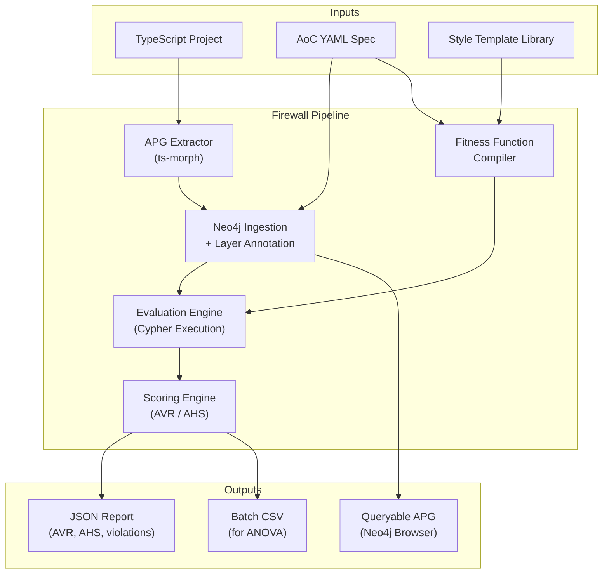

# PRD — Architectural Firewall: Spec-Driven Compliance Evaluator for LLM-Generated Code

## Segmento 1: Job to be Done

> **Permitir a investigadores, equipos de ingeniería, y creadores de benchmarks verificar determinísticamente si el código generado por LLMs cumple con especificaciones arquitectónicas formales — midiendo no solo si el código funciona, sino si está bien estructurado — cerrando el gap que ningún benchmark existente (HumanEval, SWE-bench, BaxBench) ha abordado.**
> 

El usuario no puede actualmente:

- Evaluar cuantitativamente si el código generado por un LLM respeta una arquitectura prescrita (capas, dependency inversion, repository pattern, SOLID)
- Comparar la calidad arquitectónica entre modelos LLM o entre niveles de especificación (formal vs. informal)
- Obtener un score multidimensional de salud arquitectónica — solo pass/fail de tests funcionales o comentarios subjetivos de code review
- Ejecutar evaluación arquitectónica a escala de benchmark (cientos de proyectos) en tiempo razonable — las herramientas existentes (CodeQL, Joern) toman 20-30+ segundos por proyecto y requieren compilación
- Distinguir entre violaciones extrínsecas (no siguió lo que se pidió) e intrínsecas (no fue consistente consigo mismo)

---

## Segmento 2: Misión del Producto

> **Ser el primer evaluador determinístico de compliance arquitectónica para código generado por IA — transformando fitness functions declarativas en queries ejecutables sobre un grafo purpose-built, produciendo scores cuantitativos y comparables a escala de benchmark.**
> 

### Decisiones explícitas:

- **Spec-first, graph-native**: Evaluamos contra especificaciones Architecture-as-Code (AoC YAML) compiladas a Cypher queries sobre un Architectural Property Graph (APG), no contra heurísticas genéricas o juicio de LLMs.
- **Determinístico siempre**: Dado el mismo código y la misma spec, el Firewall produce exactamente el mismo score. Cero no-determinismo. Esto lo diferencia fundamentalmente de CodeRabbit, Copilot Review, y cualquier approach LLM-as-judge.
- **Benchmark-grade performance**: < 5 segundos por proyecto (validado en spike). Permite evaluar 135+ proyectos en < 12 minutos. Las herramientas existentes toman 10-100x más.
- **Declarative fitness functions**: Los arquitectos escriben YAML, no Cypher ni TypeScript. El Firewall compila. Separación total entre *qué verificar* y *cómo verificarlo*.
- **Depth beyond imports**: Análisis a nivel de tipos (dependency inversion), patrones (repository pattern), métricas de coupling (instability index), y SOLID — no solo dependencias de import como SonarQube.

---

## Segmento 3: ICP Detallado (Ideal Customer Profile)

### Segmento A — Primario: Investigadores en AI-Assisted Software Engineering

| **Dimensión** | **Detalle** |
| --- | --- |
| Perfil | Investigadores de maestría/doctorado en software engineering, AI4SE, program analysis |
| Necesidad | Instrumento validado para medir calidad arquitectónica de código LLM-generated |
| Stack | TypeScript/NestJS backends, Neo4j, análisis estático |
| Pain | No existe benchmark que mida arquitectura. Solo functional correctness (pass@k, test resolution) |

### Segmento B — Secundario: Tech Leads evaluando coding agents

- Equipos que adoptaron Cursor/Claude Code/Copilot y necesitan medir el impacto en calidad estructural
- Quieren datos cuantitativos, no opiniones, sobre qué tan bien generan arquitectura sus herramientas
- Necesitan comparar: ¿genera mejor código Claude que GPT-4o bajo clean architecture?

### Segmento C — Terciario: Creadores de benchmarks y herramientas

- Equipos construyendo el próximo SWE-bench o BaxBench
- Quieren incorporar una dimensión arquitectónica a sus evaluaciones
- El APG + fitness function catalog como componente reutilizable

### Buyer/User Persona

**User Persona — "Cristian, Investigador de Maestría"**

- Investiga governance arquitectónica para código generado por IA
- Necesita un instrumento validado (Precision ≥ 90%, κ ≥ 0.60) para medir compliance
- Quiere correr benchmark de 135+ proyectos sin babysitting
- *Verbatim: "Los benchmarks solo miden si funciona. Nadie mide si está bien hecho."*

**User Persona — "Sofia, Tech Lead en Scaleup"**

- Su equipo genera 3x más código con coding agents
- Sospecha que la calidad arquitectónica bajó pero no tiene datos
- Quiere evaluar si dar architectural specs a los agentes realmente mejora el output
- *Verbatim: "I feel the architecture is degrading but I can't prove it. I need numbers."*

---

## Segmento 4: Propuesta de Valor Única

> **El único evaluador que compila especificaciones arquitectónicas declarativas (YAML) en queries de grafo ejecutables (Cypher) sobre una representación purpose-built (APG) — produciendo scores cuantitativos, multidimensionales, y determinísticos para código generado por LLMs, a < 5 segundos por proyecto.**
> 

### Diferenciación vs Alternativas

| **Dimensión** | **CodeQL / Joern** | **SonarQube AoC** | **CodeRabbit / AI Review** | **Architectural Firewall** |
| --- | --- | --- | --- | --- |
| Propósito | Seguridad / vulnerabilidades | Drift prevention en CI/CD | PR review con LLM | **Benchmark de calidad arquitectónica LLM-generated** |
| Análisis | Full CPG (over-engineered para arquitectura) | Import-level only (shallow) | LLM reasoning (non-deterministic) | **Type-aware + pattern + coupling + SOLID** |
| Performance | 20-30+ sec/proyecto | Seconds (pero shallow) | Variable | **< 5 sec/proyecto (spike-validated)** |
| Determinismo | ✅ | ✅ | ❌ | **✅** |
| Output | Flat results | Issue list | PR comments | **Multi-dimensional score (AVR/AHS) + queryable graph** |
| Spec format | QL queries (opaque) | YAML (shallow) | Guidelines (informal) | **3-layer AoC YAML (model + fitness + scoring)** |
| Código parcialmente roto | ❌ Requiere compilación | ✅ | ✅ | **✅ ts-morph con parsing lenient** |

### Brecha en el Mercado

La industria tiene benchmarks para functional correctness (HumanEval), real-world issue resolution (SWE-bench), y security (BaxBench). **Nadie mide arquitectura.** LoCoBench toca el tema pero con codebases sintéticas, no con código LLM-generated evaluado contra specs. El Firewall cierra ese gap.

---

## Segmento 5: Casos de Uso Top

### Caso de Uso 1: Benchmark de compliance arquitectónica multi-LLM

- **Actor**: Investigador evaluando 3 LLMs × 3 condiciones de spec
- **Trigger**: Quiere medir H3 — ¿las specs formales mejoran la compliance?
- **Paso a paso**:
    1. Define 5 task specs con functional requirements + AoC YAML de evaluación
    2. Genera 135 proyectos TypeScript (3 LLMs × 3 condiciones × 5 tasks × 3 repeticiones)
    3. Ejecuta batch runner: `firewall evaluate --batch ./generated/ --spec ./specs/clean-arch.yaml`
    4. Pipeline para cada proyecto: ts-morph → APG → Neo4j → 17 Cypher queries → AVR/AHS
    5. Output: CSV con AVR overall, AVR per-dimension, AHS, universal metrics per project
    6. Statistical analysis: ANOVA (Spec Quality × LLM → AVR)
- **Resultado**: ΔAVR(formal → informal) = effect size de la calidad de spec
- **Tiempo total**: ~12 minutos para 135 proyectos

### Caso de Uso 2: Evaluación single-project contra spec

- **Actor**: Tech Lead evaluando output de un coding agent
- **Trigger**: Claude Code generó un backend. ¿Qué tan bien siguió la arquitectura?
- **Paso a paso**:
    1. `firewall evaluate --project ./my-app --spec ./architecture.yaml`
    2. En < 5 segundos: APG construido, 17 fitness functions ejecutadas
    3. Reporte: AHS = 0.72, AVR_structural = 0.0, AVR_pattern = 0.40 (dependency inversion failures), AVR_convention = 0.0
    4. Detalle: 3 clases inyectan concretos en vez de interfaces (lista exacta con file paths)
- **Resultado**: Diagnóstico preciso y accionable

### Caso de Uso 3: Validación de instrumento (Phase 1)

- **Actor**: Investigador validando el Firewall antes de usarlo como benchmark
- **Trigger**: Necesita demostrar Precision ≥ 90%, Recall ≥ 85%, κ ≥ 0.60
- **Paso a paso**:
    1. Crea 20+ ground truth projects con seeded violations + manifests
    2. Ejecuta Firewall contra todos
    3. Compara detecciones vs. manifests (known violations)
    4. Calcula Precision, Recall, Cohen's κ
- **Resultado**: Instrumento validado, listo para Phase 2 benchmark

---

## Segmento 6: Principios de Diseño No Negociables

<aside>
🚫

**Principios inviolables del producto**

</aside>

1. **Determinismo absoluto**: Mismo código + misma spec = mismo score. Siempre. Sin excepciones. Esto no es negociable porque es un instrumento de medición científica.
2. **Specs como fuente de verdad**: El Firewall nunca inventa reglas. Solo evalúa contra lo declarado en el AoC YAML. Sin spec, solo universal health metrics (cycles, coupling, abstraction ratio).
3. **Declarativo sobre imperativo**: Arquitectos escriben YAML, no queries. La compilación a Cypher es responsabilidad del Firewall, no del usuario.
4. **Graph-queryable siempre**: Los resultados no son un flat report — el APG persiste en Neo4j para exploración interactiva, follow-up queries, y visualización.
5. **Benchmark-grade performance**: Si evaluar un proyecto toma > 10 segundos, algo está roto. El target es < 5 segundos (ya validado en spike a < 5s para 17 reglas).
6. **Depth over breadth**: Es mejor analizar TypeScript profundamente (tipos, DI, patterns, SOLID) que muchos lenguajes superficialmente (solo imports).
7. **Scored, not just pass/fail**: Todo produce un número: AVR per dimension, AHS weighted. Esto permite statistical analysis, no solo checklists.

---

## Segmento 7: User Journey

### Happy Path — Investigador (Benchmark completo)

1. **Define tasks**: Escribe 5 sets de functional requirements + AoC YAML specs
2. **Genera código**: Usa API de 3 LLMs con 3 prompt variants (formal/semi/informal) × 3 repeticiones = 135 proyectos
3. **Ejecuta batch**: `firewall evaluate --batch ./generated/ --spec ./specs/` → 12 minutos
4. **Analiza resultados**: CSV importado en R/Python. ANOVA confirma H3 con p < 0.05.
5. **Explora failures**: Abre Neo4j Browser, visualiza violation patterns en el APG. Descubre que LLMs fallan sistemáticamente en dependency inversion pero no en naming conventions.
6. **Publica**: Failure taxonomy (H2) como contribución empírica original.

### Happy Path — Tech Lead (Single evaluation)

1. **Instala**: `npm install -g @firewall/cli`
2. **Escribe spec**: 30 líneas de YAML declarando `style: clean-architecture` + mappings
3. **Evalúa**: `firewall evaluate --project ./my-app --spec ./arch.yaml`
4. **Lee reporte**: AHS = 0.78, con drill-down por dimensión. Identifica 4 concrete injections que violan DI.
5. **Itera**: Corrige y re-evalúa. AHS sube a 0.92.

---

## Segmento 8: Alcance del MVP (Método MoSCoW)

### ✅ Must-Have (v1.0 — Thesis Deliverable)

- **APG Construction Pipeline**: ts-morph → JSON → Neo4j. Extrae Files, Classes, Interfaces, Methods, Functions + edges IMPORTS, IMPLEMENTS, EXTENDS, CONSTRUCTOR_INJECTS, CALLS
- **AoC YAML Spec Parser**: Lee Layer A (model), Layer B (fitness functions), Layer C (scoring weights)
- **Style-Derived Template Library**: Clean Architecture template con 17 fitness functions pre-built
- **Fitness Function → Cypher Compiler**: Compila cada fitness function a Cypher query parametrizada
- **Layer Annotation Engine**: Asigna `layer` y `role` a cada nodo basado en spec mappings (directories, naming, decorators)
- **AVR/AHS Calculator**: Computa per-dimension AVR + weighted AHS
- **Universal Health Metrics**: Cycles, fan-out, fan-in, abstraction ratio, instability index, orphan files
- **CLI**: `firewall evaluate --project PATH --spec YAML` con JSON + human-readable output
- **Batch Runner**: Evalúa N proyectos, produce CSV agregado para análisis estadístico
- **Ground Truth Suite**: 20+ TypeScript projects con seeded violations y manifests

### 🟡 Should-Have (v1.1 — Post-Thesis)

- Layered Architecture template library (segunda architectural style)
- ISE module (Implicit Specification Extraction) — Style Classifier + ICS score
- CodeQL comparison module para H4 validation
- Violation-count-weighted AVR (complementa binary AVR)
- JSON Schema validation para AoC YAML specs
- Neo4j visualization presets para publication-quality figures

### 🔵 Could-Have (v2.0 — Product Extension)

- CI/CD integration (GitHub Action para pre-merge evaluation)
- Dashboard web (drift tracking over time)
- Hexagonal / Ports & Adapters template library
- Semantic fitness functions (LLM-as-judge con rubrics calibradas, ICC > 0.70)
- Python support (ast module → APG)
- Java support (JavaParser → APG)
- Remediation suggestions (link violations to fix patterns)

### 🔴 Won't Have (Fuera de Scope)

- Generación de código (no somos un coding agent)
- Refactoring automático (evaluamos, no corregimos)
- Runtime/dynamic analysis (solo estático)
- Data flow analysis (explícitamente fuera de scope — H4 cuantifica el gap)
- ADR-to-spec translation (future work)
- Multi-language en v1 (TypeScript-focused por ts-morph fidelity)

---

## Segmento 9: Especificación Funcional

### Módulos del Sistema

**Módulo 1: APG Extractor (ts-morph)**

- Input: directorio de proyecto TypeScript + tsconfig.json
- Process: ts-morph parse → extract nodes (File, Class, Interface, Method, Function) + edges (IMPORTS, IMPLEMENTS, EXTENDS, CONSTRUCTOR_INJECTS, CALLS)
- Output: APG JSON con nodes[] y edges[]
- Validado: barrel imports ✅, DI type resolution ✅, decorator extraction ✅, path alias resolution ✅

**Módulo 2: Neo4j Ingestion + Layer Annotation**

- Input: APG JSON + AoC YAML spec
- Process: Create graph nodes/edges → apply layer/role annotations based on spec mappings
- Output: Annotated APG in Neo4j

**Módulo 3: Fitness Function Compiler**

- Input: AoC YAML (style declaration → template library → concrete fitness functions)
- Process: For each fitness function, instantiate parameterized Cypher query template with spec parameters
- Output: Array of executable Cypher queries with metadata (dimension, severity, thresholds)

**Módulo 4: Evaluation Engine**

- Input: Compiled Cypher queries + Neo4j graph
- Process: Execute each query → collect results → compute pass/fail per function
- Output: Per-function results with violation details

**Módulo 5: Scoring Engine**

- Input: Per-function results + Layer C scoring weights
- Process: Compute AVR per dimension → compute weighted AHS → compute universal metrics
- Output: Structured report (JSON + human-readable)

**Módulo 6: Batch Runner**

- Input: Directory of projects + spec
- Process: For each project → Modules 1-5 → aggregate
- Output: CSV with per-project scores for statistical analysis

### Arquitectura Funcional

### Validated APG Schema (from Spike)

**Node Labels**: File, Class, Interface, Method, Function

**Node Properties**: name, filePath, layer, role, isExported, isAbstract, visibility, decorators[]

**Relationship Types**: IMPORTS, IMPLEMENTS, EXTENDS, CONSTRUCTOR_INJECTS, CALLS, DECLARES, CONTAINS

**17 Fitness Functions across 5 Dimensions**:

1. **Structural** (3): dependency-direction, no-circular-dependencies, database-bypass
2. **Coupling** (3): domain-stability, module-fan-out, component-instability
3. **Pattern** (3): domain-purity, dependency-inversion, repository-pattern
4. **SOLID** (4): use-case-isolation, SRP-proxy, ISP-proxy, inheritance-depth
5. **Convention** (4): naming-conventions, test-coverage-proxy, error-handling, orphan detection

---

## Segmento 10: Métricas de Éxito

### 🌟 North Star Metric

> **Instrument validity**: Precision ≥ 90%, Recall ≥ 85%, Cohen's κ ≥ 0.60 against expert-annotated ground truth (H1)
> 

### KPIs del Instrumento

| **KPI** | **Spike Baseline** | **Target** | **Source** |
| --- | --- | --- | --- |
| Detection rate (seeded violations) | 100% | ≥ 95% | Spike report |
| AHS discrimination (clean → broken) | 0.85 → 0.33 | Monotonic ordering across all variants | Spike report |
| Evaluation time per project | < 5 seconds | < 10 seconds | Spike report |
| Fitness functions compilable to Cypher | 17/17 | ≥ 15/17 | Spike 2 |
| False positive rate on clean projects | ~15% (heuristic noise) | < 10% | Spike report (0.85 AHS on clean ref) |

### KPIs del Benchmark (Phase 2)

| **KPI** | **Target** | **Hypothesis** |
| --- | --- | --- |
| ANOVA significance (Spec Quality → AVR) | p < 0.05 | H3 |
| Effect size η² (Spec Quality) | ≥ 0.06 (medium) | H3 |
| Identifiable failure pattern clusters | ≥ 3 distinct patterns | H2 |
| APG vs CodeQL detection overlap | ≥ 85% | H4 (exploratory) |
| AVR ordering: Formal < Semi < Informal | Consistent across ≥ 2 LLMs | H3 |

---

## Segmento 11: Plan de Evaluación

### Phase 1 — Instrument Validation (H1)

**Ground Truth**: 20+ TypeScript projects (seeded violation strategy)

- 4-5 correct references (zero violations)
- 15-20 violation variants across all 5 dimensions
- Each with [MANIFEST.md](http://MANIFEST.md) listing exact violations, file paths, expected detecting fitness function

**Procedure**: Run Firewall → compare detections vs. manifests

**Metrics**: Precision ≥ 0.90, Recall ≥ 0.85, Cohen's κ ≥ 0.60

### Phase 2 — LLM Benchmark (H2, H3, H4)

**Design**: 3 × 3 factorial (Spec Quality × LLM)

**Sample**: 5 tasks × 3 LLMs × 3 conditions × 3 repetitions = 135 projects

**DV**: AVR (overall + per-dimension), AHS

**Analysis**:

- H2: Cluster per-dimension AVR patterns → failure taxonomy
- H3: Two-way ANOVA, report F-statistics, η², post-hoc (Tukey HSD)
- H4: Subset comparison (20 projects) with CodeQL. Report detection agreement + cost ratio

### Escenarios de Prueba Críticos

1. **Clean project scores ≥ 0.90 AHS** — validates no false positives
2. **Known DI violation detected** — concrete injection caught by dependency-inversion query
3. **Known domain purity violation detected** — framework import in domain layer caught
4. **Circular dependency detected** — cycle in module graph found
5. **Subtle violation caught** — single hidden violation in 25-file project detected
6. **LLM-generated code evaluable** — partially broken projects (missing deps) still produce APG
7. **Batch run completes** — 135 projects evaluated without manual intervention

---

## Segmento 12: Riesgos y Mitigaciones

| **Riesgo** | **Prob.** | **Impacto** | **Mitigación** | **Status post-spike** |
| --- | --- | --- | --- | --- |
| ts-morph no resuelve tipos para DI detection | Media | Crítico | Fallback a naming heuristics (I* prefix) + decorator analysis | ✅ **RESOLVED** — ts-morph resuelve interface vs concrete correctamente |
| Fitness functions no compilables a Cypher | Media | Alto | Simplificar template library a solo funciones compilables | ✅ **RESOLVED** — 17/17 compiladas y testeadas |
| AHS no discrimina entre proyectos | Baja | Crítico | Calibrar scoring weights empíricamente | ✅ **RESOLVED** — monotonic 0.85 → 0.33 across variants |
| False positives altos en clean projects | Media | Alto | Tune heuristics (test coverage proxy, stability thresholds) | ⚠️ **OPEN** — Reference scored 0.85 not 1.0. Needs calibration. |
| LLM-generated code too broken for ts-morph | Media | Medio | Lenient parsing mode. Skip unresolvable files, report coverage % | 🔲 **UNTESTED** — needs Phase 2 validation |
| Semi-structured prompt too close to Formal or Informal | Media | Alto | Calibrate with pilot generation before full benchmark | 🔲 **UNTESTED** — needs prompt calibration |
| Sample size insufficient for ANOVA significance | Baja | Medio | 135 projects with 3 reps should be sufficient. Increase to 5 reps if needed. | 🔲 **UNTESTED** — depends on effect size |
| Expert annotators unavailable for Phase 1 | Media | Alto | Seeded violation strategy reduces expert dependency. Use manifests as ground truth by construction. | ✅ **MITIGATED** — seeded strategy validated in spike |

---

## Segmento 13: Plan de Entrega

### Fase 1 — Productionize Pipeline (Semanas 1-2)

- [ ]  Refactor spike code into clean project structure (src/extractor, src/compiler, src/evaluator, src/scorer)
- [ ]  AoC YAML schema (JSON Schema for validation)
- [ ]  Template compiler: `style: clean-architecture` → auto-load 17 fitness functions with project mappings
- [ ]  CLI: `firewall evaluate --project PATH --spec YAML` with JSON + readable output
- [ ]  Error handling for malformed / partially broken TypeScript projects
- [ ]  Batch runner: `firewall batch --dir PATH --spec YAML --output CSV`

### Fase 2 — Instrument Validation / H1 (Semanas 2-3)

- [ ]  Expand ground truth to 20+ projects (seeded violations across all 5 dimensions)
- [ ]  Calibrate false positive rate (tune heuristics for clean project → AHS ≥ 0.95)
- [ ]  Compute Precision, Recall, Cohen's κ against manifests
- [ ]  Document instrument validation results

### Fase 3 — Benchmark Execution / H2, H3 (Semanas 3-5)

- [ ]  Finalize 5 task specifications (functional requirements)
- [ ]  Lock 3 prompt templates (Formal / Semi / Informal) — calibrate Semi with pilot run
- [ ]  Generate 135 projects (3 LLMs × 3 conditions × 5 tasks × 3 reps)
- [ ]  Run full benchmark evaluation (~12 min)
- [ ]  Statistical analysis: ANOVA for H3, failure taxonomy clustering for H2
- [ ]  Per-dimension AVR analysis across LLMs and conditions

### Fase 4 — Analysis & Writing (Semanas 5-7)

- [ ]  Optional: H4 CodeQL comparison on 20 projects
- [ ]  Write thesis chapters (Background, Related Work, Approach, Implementation, Evaluation, Discussion)
- [ ]  Generate publication-quality figures from Neo4j visualization
- [ ]  Threats to validity analysis
- [ ]  Final review and submission

---

## Appendix: Research Foundation Traceability

This PRD is grounded in validated research. Every design decision traces to evidence:

| **PRD Element** | **Research Source** | **Validation** |
| --- | --- | --- |
| APG as representation | thesis-research §8 (APG formalism), §9 (why not CodeQL/Joern/SonarQube) | Spike 1: ts-morph extraction ✅ |
| 17 fitness functions | thesis-research §10 (fitness function compilation) | Spike 2: all 17 compile to Cypher ✅ |
| AoC YAML 3-layer spec | thesis-research §10.4-10.6 (Layer A/B/C) | Spike integration: template loading works ✅ |
| AVR/AHS scoring | thesis-research Experimental Design §5 | Spike: monotonic discrimination 0.85→0.33 ✅ |
| 3-condition experimental design | thesis-research Experimental Design §4, §6 | Design validated; execution pending Phase 3 |
| < 5 sec performance | thesis-research §8.5 (estimated), §9.2 (cost-depth tradeoff) | Spike: confirmed < 5 sec for 17 rules ✅ |
| Ground truth strategy | thesis-research Experimental Design §6.4 (Phase 1) | Spike 3: seeded violations detected at 100% ✅ |

[ADR — Architectural Decision Records: Firewall Technical Foundations](https://www.notion.so/ADR-Architectural-Decision-Records-Firewall-Technical-Foundations-ab1531ca2eea4cca82b3a57cde5b3d92?pvs=21)