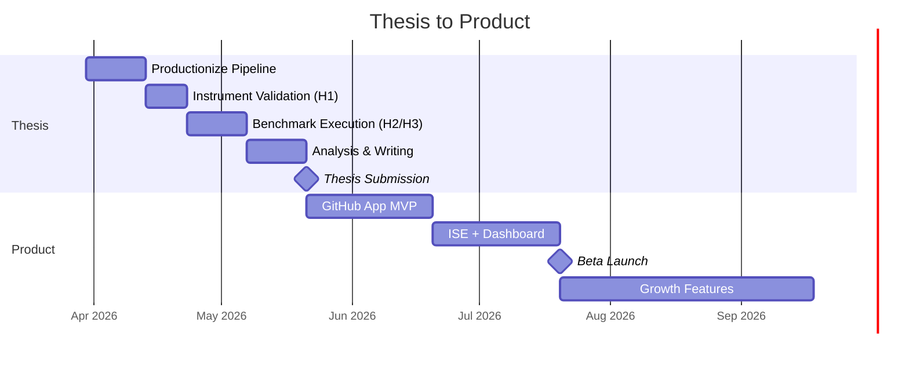

> This document captures the commercial product vision for the Architectural Firewall. It builds on the thesis research engine but reframes it as a marketable developer tool. This is a **living sketch** — not a spec. Refine after the thesis is delivered.
> 

---

## The One-Liner

**A GitHub App that evaluates every PR for architectural compliance and posts a scored report — like Codecov for architecture.**

---

## Why This Exists

Teams using coding agents (Cursor, Claude Code, Copilot) are generating code 3-5x faster. But faster generation doesn't mean better architecture. Code reviews catch functional bugs, but architectural drift is invisible until it's too late — circular dependencies, broken layer boundaries, concrete injections where interfaces should be.

No tool today gives teams **quantitative, deterministic, per-PR architectural feedback**.

The thesis proves the engine works. This document describes the wrapper that makes it a product.

---

## How It Works (User Perspective)

### First-time Setup (< 5 minutes)

1. Install the GitHub App on your repo
2. The Firewall scans your `main` branch and **auto-infers your architectural spec** (ISE — Implicit Specification Extraction)
3. A `.firewall.yaml` is generated as a PR for you to review and customize
4. Done. Every future PR gets evaluated automatically.

### Every PR After That

1. Developer opens a PR
2. Firewall runs as a CI check (< 10 seconds)
3. A comment is posted on the PR:

```
🏗️ Architectural Firewall — PR #342

AHS: 0.78 → 0.71 ⚠️ (-0.07)

❌ 2 new violations introduced in this PR:
  • dependency-inversion: src/infrastructure/UserService.ts
    injects concrete UserRepository instead of IUserRepository
  • dependency-direction: src/domain/Order.ts
    imports from infrastructure layer (src/infrastructure/mailer.ts)

✅ 15/17 fitness functions passing
📊 Structural ✅ | Coupling ✅ | Pattern ⚠️ | SOLID ✅ | Convention ✅

💡 Fix suggestion: Change constructor parameter type to IUserRepository
```

1. PR can be blocked if AHS drops below the team's configured threshold

---

## What Changes from the Thesis Engine

| **Dimension** | **Thesis (CLI)** | **Product (GitHub App)** | **Effort** |
| --- | --- | --- | --- |
| Scope | Full project evaluation | **Diff-scoped**: only changed files + dependency cone | Medium — need to compute affected subgraph |
| Graph DB | Neo4j (external dependency) | **Embedded in-memory graph** (no Neo4j install needed) | Medium — swap Neo4j driver for graphology.js or similar; rewrite Cypher queries as JS traversals or use embedded Memgraph/Kùzu |
| Spec creation | Manual YAML authoring | **ISE auto-inference**  • guided onboarding wizard | High — this is the key product feature |
| Interface | CLI + CSV | **GitHub App**  • PR comments + dashboard | Medium — GitHub App framework, webhook handling |
| Output | Full report (JSON/CSV) | **Delta report** (what changed in this PR vs. base branch) | Medium — need before/after AHS comparison |
| Hosting | Local machine | **Cloud service** (serverless or container) | Medium — standard infra work |
| Language | TypeScript only | TypeScript first, then Python, Java | High per language — new extractor module each |

---

## ISE: The Zero-Config Killer Feature

The biggest barrier to adoption for architecture tools is setup friction. Nobody wants to write 100 lines of YAML before getting value.

**Implicit Specification Extraction (ISE)** solves this:

1. **Scan** the existing codebase on `main`
2. **Detect** the architectural style (clean architecture, layered, hexagonal) via directory structure, naming conventions, decorator usage
3. **Infer** layer mappings, dependency rules, and role assignments
4. **Generate** a `.firewall.yaml` that codifies what the codebase *already does*
5. **Score** the existing codebase against its own inferred spec → this is the baseline AHS
6. **Submit** as a PR for the team to review, adjust, and merge

From then on, the Firewall catches *deviations from the team's own established patterns* — not arbitrary rules imposed from outside.

This is the ISE concept from the thesis research (Section 16), turned into a product feature.

---

## Target Customer

### Primary: Engineering teams (10-50 devs) using coding agents heavily

- Already paying for Cursor/Copilot seats
- Shipping faster but feeling architectural quality slip
- Want data, not opinions
- *"We need a linter, but for architecture"*

### Secondary: Platform / DevEx teams at larger orgs

- Responsible for enforcing architectural standards across multiple teams
- Currently doing manual architecture reviews that don't scale
- Want automated governance in the PR workflow

### Tertiary: Open-source maintainers

- Projects with architectural guidelines that contributors often violate
- Free tier drives adoption and community awareness

---

## Competitive Landscape

| **Tool** | **What it does** | **Why it's not this** |
| --- | --- | --- |
| SonarQube | Code quality (bugs, smells, security) | Import-level only. No DI detection, no pattern compliance, no architectural scoring. |
| CodeClimate | Maintainability metrics | Generic metrics (complexity, duplication). No architectural awareness. |
| CodeRabbit | AI-powered PR review | LLM-as-judge = non-deterministic. Different results on same code. Can't be a governance tool. |
| ArchUnit | Architecture tests (Java) | Java-only. Tests written in code, not declarative. No scoring, no CI integration out of the box. |
| Dependency-cruiser | Dependency rule enforcement | Import-level only. No type awareness, no DI, no SOLID, no multi-dimensional scoring. |
| **Architectural Firewall** | **Spec-driven architectural compliance with quantitative scoring** | **Type-aware, pattern-aware, multi-dimensional, deterministic, < 10 sec, auto-inferred specs** |

### The gap in one sentence:

> Existing tools check if code is *correct* and *clean*. Nobody checks if code is *architecturally sound* — with a number attached.
> 

---

## Pricing Model (Sketch)

| **Tier** | **Price** | **Includes** |
| --- | --- | --- |
| 🆓 Open Source | Free forever | Public repos, 1 spec, community support |
| ⚡ Team | ~$29/repo/month | Private repos, ISE onboarding, PR blocking rules, dashboard, 5 custom fitness functions |
| 🏢 Enterprise | Custom | Multi-repo governance, custom fitness function library, SSO, SLA, drift tracking over time |

Comp: Codecov ($10-29/user/month), Snyk ($25-98/dev/month), CodeClimate ($15-30/user/month).

---

## MVP Scope (Post-Thesis)

### Phase 1 — GitHub App MVP (4-6 weeks after thesis)

- [ ]  Wrap existing engine as a serverless function (AWS Lambda or Vercel)
- [ ]  GitHub App: webhook on `pull_request` → run evaluation → post comment
- [ ]  Diff-scoped evaluation (only changed files + imports cone)
- [ ]  Replace Neo4j with in-memory graph (graphology.js or Kùzu embedded)
- [ ]  Basic `.firewall.yaml` support (manual authoring, clean-architecture template)
- [ ]  AHS delta report (before/after comparison vs. base branch)

### Phase 2 — ISE + Dashboard (4-6 weeks)

- [ ]  ISE: auto-infer spec from existing codebase
- [ ]  Onboarding wizard: install → scan → review spec → activate
- [ ]  Web dashboard: per-repo AHS trend over time, top violations, per-PR history
- [ ]  Configurable PR blocking (fail check if AHS drops below threshold)

### Phase 3 — Growth (ongoing)

- [ ]  Custom fitness function authoring (YAML → Cypher or JS)
- [ ]  Python support
- [ ]  Slack notifications on architectural drift
- [ ]  Multi-repo governance dashboard for platform teams
- [ ]  VS Code extension (inline violation warnings)

---

## Key Technical Decisions to Revisit for Product

These ADRs from the thesis need to be **reconsidered** for the product context:

| Thesis ADR | Product Implication |
| --- | --- |
| **ADR-003**: Neo4j | → Must switch to embedded/in-memory graph. Neo4j is a non-starter for CI. Evaluate: graphology.js (pure JS), Kùzu (embedded OLAP graph), or Memgraph Lite. |
| **ADR-006**: Cypher queries | → If Neo4j goes away, fitness functions need rewriting as JS graph traversals or a Cypher-compatible embedded engine. This is the biggest migration risk. |
| **ADR-009**: CLI-first | → GitHub App becomes the primary interface. CLI remains for local dev/debugging. |
| **ADR-010**: Stateless per-project | → Product needs **incremental evaluation** (only re-analyze changed files). Full rebuild on every PR is wasteful. |
| **ADR-012**: Spec mappings | → ISE needs to auto-generate these mappings. Manual-only is a product blocker. |

---

## Open Questions

- [ ]  **Embedded graph engine**: Which one? graphology.js is pure JS but has no query language. Kùzu has Cypher support and is embeddable. Memgraph Lite is another option. Spike needed.
- [ ]  **Diff-scoped evaluation**: How do we handle transitive effects? If file A changes and file B imports A, do we re-evaluate B? How deep does the cone go?
- [ ]  **ISE accuracy**: How good is the auto-inferred spec? What's the false positive rate? Needs user testing.
- [ ]  **Multi-language priority**: TypeScript first is clear. But is Python or Java the better second language for market size?
- [ ]  **Hosting model**: Serverless (Lambda) vs. container (ECS/[Fly.io](http://Fly.io))? Graph computation may need more memory than Lambda allows.
- [ ]  **Moat**: What stops someone from cloning this with an LLM-based approach? Answer: determinism. LLM-as-judge can never be a governance tool. Our moat is reproducibility.

---

## Thesis → Product Timeline



---

## The Pitch (30 seconds)

*"Your team generates 3x more code with AI. But who's checking if that code follows your architecture? SonarQube checks for bugs. Codecov checks for tests. We check for architecture. Install our GitHub App, and every PR gets a deterministic architectural health score — DI compliance, layer boundaries, SOLID, coupling — in under 10 seconds. No LLM guessing. No manual review. Just a number that tells you if your architecture is holding up."*