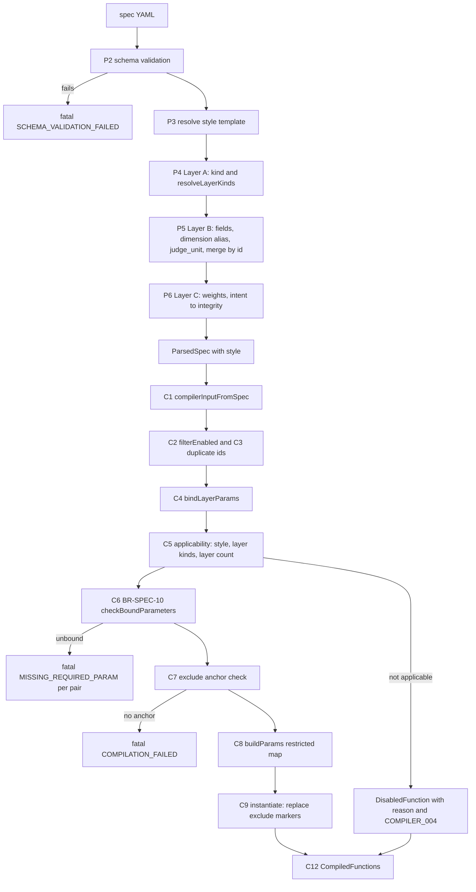

# U1 Spec and Compiler — Business Logic Model (v1.2E)

> **Unit**: U1 (C3 spec parser, C4 fitness compiler and templates, C9 `validate` action) · **Date**: 2026-10-07 · **Base**: `v1.2e` at `ee32a1f` (code identical to `20d8d3d`)
> **Binding inputs**: answered plan `aidlc-docs/construction/plans/v1.2E-u1-spec-compiler-functional-design-plan.md` (Q1–Q25); ADR-015 (`Docs/ADR — Architectural Decision Records Firewall Tech.md`, section "ADR-015"); `v1.2-evaluation-readiness-requirements.md`; `v1.2E-*.md` application design; U0 plan decisions D-U0-*.
> **Companion files**: `business-rules.md` (rules `BR-U1-nn`, each with an acceptance check), `domain-entities.md` (types, schema deltas).
> **Citations**: every `file:line` refers to `v1.2e` at `ee32a1f`.
> **Priority**: every element serves SO1–SO5 and a defensible evaluation. Nothing is added beyond the answers. Where the answers do not settle a point, it is listed in Section 9 as an open item, not decided here.

---

## 1. Scope and order of changes

U1 changes three things.

1. **Spec parsing (C3)**: typed FR-07 fields, layer `kind`, the `integrity` dimension, the `intent` aliases, `judge_unit`, `style` and the `layered` library.
2. **Compilation (C4)**: layer binding by kind, applicability by style and layer kind, BR-SPEC-10, a restricted parameter map, and exclude anchors.
3. **Templates (C4)**: tags, ordering, the bounded cycle query, RE_EXPORTS traversal, FR-12 columns, orphan typing, the exclude-marker shape rule, and the `repository-pattern` correction (ADR-015 item 1).

Merge order is **U2 → U1** (ADR-015 item 12; Q24 answer). When U1 code generation starts, `v1.2e` already has Package nodes, `RE_EXPORTS` edges and IMPORTS edge properties (`line`, `lines`, `isTypeOnly`). Every golden delta caused by a U1 query running against the U2 graph is therefore attributed to the U1 commit that changes the query (Section 8).

---

## 2. Parse flow (C3)

### 2.1 Steps

`parseSpec` (`src/spec-parser/spec-parser.ts:18-129`) keeps its signature. The new or changed steps are marked **[U1]**.

| # | Step | Today | U1 behaviour |
|---|---|---|---|
| P1 | Read the YAML | `:26-37` | unchanged |
| P2 | Schema validation (Ajv, `SPEC_SCHEMA_V1`) | `:40-45`; closed layer item (`spec-schema.ts:30`); FR-07 keys untyped (`:69` `additionalProperties: true`) | **[U1]** Schema deltas in `domain-entities.md` §4. The layer `kind` is accepted. The six FR-07 keys and `judge_unit` are typed. The `pattern` grammar is enforced by a schema `pattern` (BR-U1-06). `max_*` must be integers ≥ 0. Dimension enum gains `integrity`. `full_mode_weights` takes exactly one of `integrity` / `intent`. Every schema failure stays fatal (`SCHEMA_VALIDATION_FAILED`), independent of strict mode. |
| P3 | Resolve the template | `:48-58` | **[U1]** `style` is lower-cased and kept as `ParsedSpec.style`. `layered` now resolves (`TEMPLATE_REGISTRY` gains it). |
| P4 | Layer A | `parseLayerA` `layer-parsers.ts:20-34` | **[U1]** Reads optional `kind`, then calls `resolveLayerKinds` (§2.2). Every `LayerDefinition` leaves C3 with `kind` and `kindSource` set (BR-U1-12). Warnings `SPEC_005` are added for duplicate scalar kinds. |
| P5 | Layer B | `parseLayerB` `layer-parsers.ts:40-113` | **[U1]** Per declaration: `mapFunctionSpecificFields` (FUNCTION_FIELD_KEYS) → `normaliseDimension` (`intent` → `semantic`, `SPEC_004`) → `judge_unit` → `SPEC_001` for an FR-07 key the template does not use. Then the merge by `id` at `:89-110`. It stays `{ ...tmplFn, ...override }`, and absent keys are omitted, never set to `undefined`. A template value therefore survives unless the spec declares the key. |
| P6 | Layer C | `parseLayerC` `layer-parsers.ts:118-163` | **[U1]** `scoring.weights` (five symbolic keys) is unchanged; `semantic`, `integrity` and `intent` are set to 0. In `full_mode_weights`, `integrity` is read; if absent, the `intent` value is used as `integrity` with `SPEC_004`. `intent` is always 0 internally. `LayerCResult` gains `warnings`. |
| P7 | Zero-function check, unknown top-level keys (`SPEC_001`) | `:69-80` | unchanged. `default_exclude_paths` stays unknown and ignored, as an observation (Q20). |
| P8 | ADRs | `:82-97` | unchanged |
| P9 | Assemble `ParsedSpec` | `:100-109` | **[U1]** Adds `style`. |
| P10 | `validateBusinessRules` | `spec-validator.ts:48-155` | **[U1]** `sumWeights` (`:157-159`) drops `w.intent`, which is now always 0, so the sum is unchanged. BR-SPEC-10 is **not** placed here (`component-methods.md:754`). |

### 2.2 Layer-kind resolution (`resolveLayerKinds`, NEW `src/spec-parser/layer-kind-resolver.ts`)

Algorithm. It is pure and deterministic, and it runs per layer in YAML order (index `i`, `n` layers, `n ≥ 2` by schema `minItems: 2`, `spec-schema.ts:19`):

```
for each layer L[i]:
  if L[i].kind is declared            -> kind = declared,      kindSource = 'explicit'
  else if L[i].name ∈ LAYER_KINDS     -> kind = L[i].name,     kindSource = 'name'
  else                                -> by position:
       i == 0                         -> 'domain'
       i == n-1                       -> 'infrastructure'
       0 < i < n-1                    -> 'application'
                                          kindSource = 'position'
then: for each scalar kind k ∈ {domain, infrastructure, presentation}
       held by more than one layer    -> warning SPEC_005 naming the layers; binding uses the first in YAML order
```

`presentation` is never inferred by position. `application` may be held by several layers; that is never a warning (it becomes the list `applicationLayers`).

Worked results:

| Spec | Layers (YAML order) | Kinds (source) | Binding |
|---|---|---|---|
| `specs/clean-arch.yaml:20-45` | domain, application, infrastructure | domain (name), application (name), infrastructure (name) | `domainLayer=domain`, `applicationLayers=[application]`, `infraLayer=infrastructure` |
| `presets/nestjs.yaml:28-98` | domain, infrastructure, application, presentation | all four by name | `domainLayer=domain`, `applicationLayers=[application]`, `infraLayer=infrastructure`, `presentationLayer=presentation`, `controllerLayer=presentation` (BR-U1-46) |
| `specs/daedalus-arch.yaml:30-63` **after Q3 B** | domain, core-modules (`kind: infrastructure`), application | domain (name), infrastructure (explicit), application (name) | `domainLayer=domain`, `applicationLayers=[application]`, `infraLayer=core-modules` |
| `presets/layered.yaml` (NEW, Q6 A) | persistence, business, presentation | infrastructure (explicit), domain (explicit), presentation (explicit) | `domainLayer=business`, `applicationLayers=[]`, `infraLayer=persistence`, `presentationLayer=presentation` |
| Unit-test spec (position inference, Q3 B) | core, services, adapters | domain (position), application (position), infrastructure (position) | all three bound |
| Unit-test spec (2 layers) | inner, outer | domain (position), infrastructure (position) | `applicationLayers=[]`: application-kind functions disabled |
| Unit-test spec (4+ layers) | core, a, b, edge | domain, application, application, infrastructure (position) | `applicationLayers=[a, b]` |

### 2.3 Function-field mapping (`mapFunctionSpecificFields`, NEW `src/spec-parser/function-fields.ts`)

```
for (yamlKey, field) in FUNCTION_FIELD_KEYS (fixed order, domain-entities.md §2):
  v = raw[yamlKey]
  if v == null: omit field           // presence is `!= null`, so 0 and [] are values
  else: fields[field] = v            // the schema has already type-checked v
```

`buildParams` later uses the field. BR-SPEC-10 decides boundness (an empty list is unbound, BR-U1-07). The template merge at `layer-parsers.ts:96` keeps template values for omitted keys. Because of Q2 A, the registry carries no FR-07 values, so the YAML is the single source.

### 2.4 Dimension alias (`normaliseDimension`, NEW `src/spec-parser/dimension-alias.ts`)

`'intent'` → `'semantic'`, with warning `SPEC_004`: `Dimension "intent" of <id> is deprecated; mapped to "semantic"`. Every other value passes through, since the schema has already rejected unknown values. The weight key `intent` maps to `integrity` (P6), not to `semantic`. That split is what ADR-015 item 6 requires.

---

## 3. Compile flow (C4)

### 3.1 Steps, in order

`compileFunctions(input)` (`src/fitness-compiler/fitness-compiler.ts:32-132`) keeps its signature. The input is always built by `compilerInputFromSpec(spec)` (NEW `src/fitness-compiler/compiler-input.ts`). It is used by `CompileCommand.execute` (`src/pipeline/commands/compile-command.ts:14-19`), by the CLI `validate` action and by `FitnessCompilerStage.execute` (`fitness-compiler.ts:335-340`). Each of the three replaces its literal `CompilerInput`. `FitnessCompilerStage` is only re-exported (`src/fitness-compiler/index.ts:1`) and has a unit test (`tests/unit/fitness-compiler/fitness-compiler.test.ts:222`). It is still switched, so that no exported entry point silently drops `style` (BR-U1-11).

| # | Step | Detail | Rules |
|---|---|---|---|
| C1 | `compilerInputFromSpec` | `{ fitnessFunctions, adrRules, layerModel, scoringWeights, style }`; `style` lower-cased or `undefined`; the only builder of `CompilerInput` in `src/` | BR-U1-11, BR-U1-19 |
| C2 | `filterEnabled` | unchanged (`:15-30`); `enabled: false` keeps its spec `reason` | — |
| C3 | Duplicate ids | unchanged (`:43-52`), fatal `DUPLICATE_FUNCTION_ID` | — |
| C4 | `bindLayerParams(layerModel.layers)` | NEW `layer-binding.ts`; reads only `LayerDefinition.kind` (C4 never imports C3, `component-methods.md:807`) → `LayerKindBinding` | BR-U1-14 |
| C5 | Applicability and disablement, per enabled symbolic/hybrid function with a template | `isTemplateApplicable(template, style, binding, layerModel)` (NEW `template-applicability.ts`). The first failing check gives the reason, in this fixed order: (a) `style` is defined, the template has `applicableStyles`, and `style` is not in it → `not applicable to style <style>`; when `style` is undefined, check (a) is skipped (BR-U1-18); (b) the first `requiredLayerKinds` entry with no bound layer → `no <kind> layer`; (c) the existing layer-count rule for `no-layer-skip` (`:61-73`, fewer than 3 layers and no `file_patterns`) → today's reason text. A disabled function becomes a `DisabledFunction` with that reason, plus warning `COMPILER_004`, and it is skipped in C6–C9. | BR-U1-15, BR-U1-18 |
| C6 | **BR-SPEC-10** `checkBoundParameters` | Over the functions that survive C5: every `requiredParams` entry must be bound by `buildParams` (`!= null`; an empty list is unbound for `forbiddenImports` and `applicationLayers`). **All** unbound pairs are collected and sorted by function id, then by `requiredParams` order. Any pair → `DomainResult.fail`, with one `CompilerError` per pair: code `MISSING_REQUIRED_PARAM`, message `BR-SPEC-10 <id>: <parameter>`. Always fatal; strict mode plays no part. | BR-U1-09, BR-U1-10 |
| C7 | Exclude-anchor check | A function with non-empty `excludePaths` whose template has no `/*EXCLUDE:…*/` marker → fatal `COMPILATION_FAILED` with message `<id>: exclude_paths not supported by template <name>` | BR-U1-32, BR-U1-44 |
| C8 | `buildParams(ff, layerModel, binding)` | Exported. It reads typed fields (removing the cast at `:299-305`) and binds layers from the binding (replacing `:267-273`). It returns a map restricted to `requiredParams ∪ optionalParams`, keys in template-declared order (required first, then optional not already present). `outerLayers`/`innerLayers` (`:281-282`) are dropped. Compiler defaults stay as they are for `useCaseRoles`, `entityRoles`, `domainPattern`, `applicationPattern` and `infraPattern` (`:308-314`). `pattern` is compiled by §4. | BR-U1-08, BR-U1-33, BR-U1-37 |
| C9 | Instantiate the template | `instantiateTemplate` (`:248-255`) now replaces every exclude marker: with the predicate when `excludePaths` is non-empty, with the empty string otherwise. `excludePatterns` is appended to the parameter map last. The old `injectExcludePaths` splice (`exclude-injector.ts:30-45`) is retired; `globToRegex` is kept. | BR-U1-32 |
| C10 | Neuronal and hybrid | `compileNeuronal` sets `judgeUnit = ff.judgeUnit ?? (dimension === 'integrity' ? 'module' : 'file')`. `defaultContextAssembly`'s `intent` branch (`:324`) becomes `semantic`. FF-N01 (now `neuronal`) no longer reaches `compileSymbolic`. | BR-U1-22, BR-U1-26 |
| C11 | ADR rules | `compileADRSymbolic` and `compileADRNeuronal` emit `dimension: 'semantic'` (`:210`, `:230`), with `judgeUnit: 'file'` | BR-U1-22 |
| C12 | Result | `CompiledFunctions` is unchanged in shape. Its `disabledFunctions` now also lists style- and kind-disabled functions with reasons. | BR-U1-19 |

### 3.2 Mermaid flow (parse and compile)



**Text alternative.** The YAML is schema-validated; a failure is fatal. The style template is resolved. Layer A resolves layer kinds. Layer B maps the typed fields, aliases `intent` to `semantic`, reads `judge_unit` and merges by id. Layer C maps the `intent` weight to `integrity`. The resulting `ParsedSpec` is turned into a compiler input. Enabled functions are de-duplicated and layer kinds are bound. Each function is checked for applicability by style, layer kind and layer count; an inapplicable one is recorded as disabled with a reason. The remaining functions go through BR-SPEC-10, which fails fatally on any unbound parameter. Next comes the exclude-anchor check, which fails fatally when a function sets `exclude_paths` on a template without an anchor. The restricted parameter map is built, the exclude markers are replaced, and the compiled set (including the disabled list) is returned.

Validation per `content-validation.md`: `flowchart TD`; node ids are alphanumeric; every label is double-quoted (no raw parentheses, colons or pipes outside quotes); edge labels are quoted; no `end` keyword used as an id.

---

## 4. `pattern` interpretation (Q1, frozen grammar)

**Grammar** (frozen before the first run, ADR-015 item 2):

```
pattern     := alternative ( "|" alternative )*
alternative := 1*( "A"-"Z" / "a"-"z" / "0"-"9" / "_" / "$" / "*" / "?" )
```

The pattern is matched against the **class name** (`c.name`), never against a path. There is no trimming and no escape syntax, and an empty alternative is rejected (for example `"*Repo|"`, `"|*Repo"` or `"a||b"`). The schema enforces the grammar at P2, so `evaluate` hits it as well as `validate`.

**Compilation** (C8): split on `|`; apply the existing `globToRegex` (`glob-to-regex.ts:6-43`) to each alternative and strip its `^`/`$`; join the results as `^(?:a1|a2|…)$`. The grammar admits `*` and `?` as glob metacharacters (`*` → `[^/]*`, `**` → `.*`, `?` → `.`, `glob-to-regex.ts:17-31`). Of the regex specials in the escape set (`:32`, `.+^${}()|[]\`), the grammar admits only `$`, which is therefore escaped to `\$` and matches a literal `$` in a class name. No other escape fires on a valid value. Because class names contain no `/`, `[^/]*` behaves as `.*`.

| Source | Value | Compiled regex | Example match |
|---|---|---|---|
| `specs/clean-arch.yaml:214`, `presets/*`, self-spec `:217` (today) | `*Service` | `^(?:[^/]*Service)$` | `TaskService` ✓, `CreateTaskUseCase` ✗ |
| same files after Q21 B (BR-U1-38), `presets/layered.yaml` | `*Service\|*UseCase` | `^(?:[^/]*Service\|[^/]*UseCase)$` | `CreateTaskUseCase` ✓ |
| `specs/clean-arch.yaml:222`, `presets/*` | `*Repository\|*Repo` | `^(?:[^/]*Repository\|[^/]*Repo)$` | `InMemoryTaskRepository` ✓ (false today with `\|` escaped, plan §2 item 3) |
| self-spec `:224` | `*Repository\|*Repo\|*Store` | `^(?:[^/]*Repository\|[^/]*Repo\|[^/]*Store)$` | `FileSystemSnapshotStore` ✓ |
| `specs/clean-arch.yaml:230`, `presets/*` | `*Controller` | `^(?:[^/]*Controller)$` | `TaskController` ✓ |
| self-spec `:231` | `*Controller\|*Handler` | `^(?:[^/]*Controller\|[^/]*Handler)$` | `TaskHandler` ✓ |
| unit test only (`$` escape) | `Legacy$*` | `^(?:Legacy\$[^/]*)$` | `Legacy$Task` ✓, `LegacyTask` ✗ |
| invalid | `*Repo\|` | schema error (empty alternative) | — |
| invalid | `.*Service` | schema error (`.` not in the grammar) | — |

(In the table, `\|` is the table-escaped `|`.)

---

## 5. Templates

### 5.1 Changed query shapes (exact Cypher)

Marker syntax: `/*EXCLUDE:<alias>*/` or `/*EXCLUDE:nodes(<path>)*/` (BR-U1-32). Markers sit at the position today's splice reaches: the end of the last `WHERE` before the final `RETURN`, which is also the `WHERE` on the violating alias. The replacement starts with `AND`, which binds tighter than `OR`. The predicate in front of a marker must therefore be a top-level conjunction, with every `OR` inside parentheses or inside a subquery `{ … }` (BR-U1-44). Only `single-responsibility-proxy` breaks this today (`cypher-templates.ts:235`). Today's splice has the same defect: an excluded class that exceeds only `maxPublicMethods` is still reported.

**`dependency-direction`** (`cypher-templates.ts:29-44`). Q25, FR-12, FR-35:
```cypher
WITH $layerOrder AS layerOrder
MATCH (src:File)-[i:IMPORTS|RE_EXPORTS]->(tgt:File)
WHERE src.layer IS NOT NULL AND tgt.layer IS NOT NULL
  AND src.layer <> tgt.layer
WITH src, tgt, i,
     apoc.coll.indexOf(layerOrder, src.layer) AS srcIdx,
     apoc.coll.indexOf(layerOrder, tgt.layer) AS tgtIdx
WHERE srcIdx >= 0 AND tgtIdx >= 0 AND srcIdx < tgtIdx /*EXCLUDE:src*/
RETURN src.filePath AS source, tgt.filePath AS target, src.layer AS srcLayer, tgt.layer AS tgtLayer,
       type(i) AS relType,
       CASE type(i) WHEN 'IMPORTS' THEN 'imports' ELSE 're-exports' END AS verb,
       i.line AS line, i.lines AS lines, coalesce(i.isTypeOnly, false) AS isTypeOnly
ORDER BY source, target, relType
```
Message: `{source} ({srcLayer}) {verb} from {target} ({tgtLayer})`. IMPORTS rows render byte-identically to today's `… imports from …` (`:43`).

**`no-layer-skip`** (`:57-68`): the same edge pattern, the same extra columns and the same `ORDER BY`. The verb is `CASE type(i) WHEN 'IMPORTS' THEN 'import' ELSE 're-export' END`, and the message is `{source} ({srcLayer}) skips layers to {verb} {target} ({tgtLayer})`. The marker follows `… NOT (src.layer + '>' + tgt.layer) IN $allowedTransitions`.

**`no-domain-outward-dep`** (`:70-79`):
```cypher
MATCH (src:File)-[i:IMPORTS|RE_EXPORTS]->(tgt:File)
WHERE src.layer = $domainLayer AND tgt.layer <> $domainLayer /*EXCLUDE:src*/
RETURN src.filePath AS source, tgt.filePath AS target, tgt.layer AS violatingLayer,
       type(i) AS relType,
       CASE type(i) WHEN 'IMPORTS' THEN 'imports' ELSE 're-exports' END AS verb,
       i.line AS line, i.lines AS lines, coalesce(i.isTypeOnly, false) AS isTypeOnly
ORDER BY source, target, relType
```
Message: `Domain file {source} {verb} from {target} in {violatingLayer}`.

**`no-cyclic-deps`** (`:46-55`). Q15 answer, ADR-015 item 5, Q25, and FR-12 first-edge columns (Q18 A):
```cypher
MATCH p = (f:File)-[:IMPORTS|RE_EXPORTS*2..10]->(f)
WHERE ALL(n IN nodes(p) WHERE n.filePath >= f.filePath)
  AND size(apoc.coll.toSet(nodes(p)[1..])) = length(p) /*EXCLUDE:nodes(p)*/
WITH DISTINCT [n IN nodes(p) | n.filePath] AS cycle, relationships(p)[0].line AS firstLine
WITH cycle, min(firstLine) AS line
RETURN cycle, cycle[1] AS target, line
ORDER BY cycle
LIMIT 101
```
- **First edge (FR-12)**: `cycle[0]` is the canonical start file and `cycle[1]` is the target of the first edge, returned as `target`. When parallel `IMPORTS` and `RE_EXPORTS` edges join `cycle[0]` to `cycle[1]`, `line` is the smallest non-null `line` among them. `min` ignores nulls, so `line` is null only when no parallel edge carries a line. The second `WITH` groups by `cycle` and keeps one row per node sequence, so the row count equals the `WITH DISTINCT` count over `cycle` alone. U3 maps `target` and `line` into `Violation` (FR-12 mapping, patch row 3). Until then the columns are unmapped and change no snapshot.
- **Columns not returned**: cycle rows carry no `relType` and no `isTypeOnly`. The shared Q25 / U2 hand-off wording ("each returns `type(i)` … `coalesce(i.isTypeOnly,false)`") applies to the three single-edge templates only. A cycle through type-only IMPORTS edges or through RE_EXPORTS edges counts as a cycle (D3 in `v1.2E-components.md`: type-only imports count; ADR-015 item 8: the cycle query traverses both edge types).
- `10` is the literal `MAX_CYCLE_LENGTH` and `101` is `CYCLE_ROW_CAP + 1`. Both are interpolated from exported constants when the module loads, so neither is a Cypher parameter (Neo4j rejects a parameter in a variable-length bound; adversarial review §2 item 1).
- **Rotation**: only the rotation that starts at the lexicographically smallest `filePath` survives the `ALL(…)` predicate. It is written as a predicate on `p` so the planner pushes it into the expansion (review Q15, verified there).
- **Simple path**: `nodes(p)[1..]` holds the `length(p)` nodes after the start, the last of which is `f`. They must all be distinct.
- `WITH DISTINCT` collapses identical node sequences reached over parallel IMPORTS and RE_EXPORTS edges, and it comes before `ORDER BY`.
- The row gains `target` and `line`. `cycle` is still a list, and the message `Circular dependency: {cycle}` and `filePathColumn: 'cycle'` (`:54`) are unchanged.
- **Truncation contract with U3**: at most 101 rows. Row 101 is a sentinel. U3's evaluator drops it and sets `truncated: true` (hand-off; acceptance: 101 rows in → 100 violations, `truncated: true`). Until U3 lands, a truncated result shows 101 violations, and the golden normaliser predicate becomes `rows > CYCLE_ROW_CAP` (`tests/golden/normalise.ts:179-183`, with its test at `tests/unit/golden/normalise.test.ts:281-292`) in the same commit. Fixtures never reach the cap.
- **Re-allocation (recorded amendment)**: de-duplication moves into the query (U1). U3's `dedupeCycleRecords` (`component-methods.md:1051-1058`) stays as a no-op guard. The universal cycle metric (`scoring-engine/universal-metrics.ts:13`, U3) uses the same literal bound.

**`no-orphan-files`** (`:191-201`). FR-09 and Q19 A, with the wording of U2 Q16 A:
```cypher
MATCH (f:File)
WHERE f.layer IS NOT NULL
  AND NOT EXISTS { MATCH (f)-[:IMPORTS|RE_EXPORTS]->(:File) }
  AND NOT EXISTS { MATCH (:File)-[:IMPORTS|RE_EXPORTS]->(f) }
  AND NOT f.isBarrel /*EXCLUDE:f*/
RETURN f.filePath AS filePath, f.name AS name, f.layer AS layer
ORDER BY filePath
```

**`use-case-isolation`** (`:124-136`). FR-19 list parameter, Q16 sorted collect:
```cypher
MATCH (uc:Class)
WHERE uc.layer IN $applicationLayers
  AND ANY(role IN $useCaseRoles WHERE uc.name CONTAINS role)
WITH uc
MATCH (uc)-[:CONSTRUCTOR_INJECTS]->(dep)
WHERE dep.layer IS NOT NULL AND dep.layer <> $domainLayer AND NOT dep.layer IN $applicationLayers /*EXCLUDE:uc*/
WITH uc, apoc.coll.sort(collect(dep.name)) AS violations
RETURN uc.name AS useCase, uc.filePath AS filePath, violations
ORDER BY filePath, useCase
```

**`repository-pattern`** (`:108-122`). ADR-015 item 1 (internal template inconsistency), BR-U1-45. The first `UNION` branch (`:110-113`) returns **compliant** pairs: an infrastructure class implementing a domain repository interface. The default pass rule fails a function on any row (`symbolic-evaluator.ts:126-127`). So FF-P03 fails on every fixture whose repository is correct: correct-reference, variant-a (whose `MANIFEST.md` says "Repository pattern is followed") and variant-d. U1 owns the template text, so U1 drops the compliant branch. Only the violating branch remains:
```cypher
MATCH (c:Class)
WHERE c.layer = $infraLayer
  AND (c.name CONTAINS 'Repository' OR c.name CONTAINS 'Repo')
  AND NOT EXISTS { MATCH (c)-[:IMPLEMENTS]->(:Interface) } /*EXCLUDE:c*/
RETURN '' AS interface, c.name AS implementation, c.filePath AS filePath
ORDER BY filePath, implementation
```
- The row shape (`interface`, `implementation`, `filePath`) and the default result mapping stay as they are. `requiredParams` stays `domainLayer, infraLayer`, and `requiredLayerKinds` stays `domain, infrastructure`, as in the upstream catalogue. `$domainLayer` is no longer referenced in the text. BR-U1-33's subset test still holds, because the rule is "tokens ⊆ params", not equality.
- With `UNION` gone, no `CALL { … }` wrapper is needed. That also removes the subquery form without a variable-scope clause, which Neo4j 5.23+ deprecates.
- The seeded FF-P03 violations (variant-b and variant-c `InMemoryTaskRepository` "does not implement ITaskRepository", `fixtures/variant-b-pattern/MANIFEST.md:18`, `fixtures/variant-c-everything/MANIFEST.md:23`) are branch-2 rows. They still fire.

**`naming-conventions`** (`:263-278`). FR-19 list parameter:
```cypher
MATCH (c:Class)
WHERE c.layer IS NOT NULL
WITH c, c.layer AS layer,
     CASE
       WHEN c.layer = $domainLayer THEN $domainPattern
       WHEN c.layer IN $applicationLayers THEN $applicationPattern
       WHEN c.layer = $infraLayer THEN $infraPattern
       ELSE '.*'
     END AS expectedPattern
WHERE NOT c.name =~ expectedPattern /*EXCLUDE:c*/
RETURN c.name AS class, c.filePath AS filePath, layer, expectedPattern
ORDER BY filePath, class
```

**`single-responsibility-proxy`** (`:229-240`). The marker-shape rule (BR-U1-44) applies, with FR-35 ordering:
```cypher
MATCH (c:Class)
OPTIONAL MATCH (c)-[:CONTAINS]->(m:Method)
OPTIONAL MATCH (c)-[:CONSTRUCTOR_INJECTS]->(dep)
WITH c, count(DISTINCT m) AS methodCount, count(DISTINCT dep) AS depCount
WHERE (methodCount > $maxPublicMethods OR depCount > $maxDependencies) /*EXCLUDE:c*/
RETURN c.name AS class, c.filePath AS filePath, methodCount, depCount
ORDER BY filePath, class
```
Without excludes, the parentheses leave the result unchanged. No shipped spec sets `exclude_paths` on FF-SO01, so no snapshot changes.

`dependency-inversion` (`:98`) and `naming-services` (`:283`) change `= $applicationLayer` to `IN $applicationLayers`. Their `requiredParams` entry `applicationLayer` becomes `applicationLayers`.

### 5.2 Every template: ordering key and anchor

Unchanged bodies get only `ORDER BY` (after the final `RETURN`) and the marker. Every key is total: `filePath` plus every discriminator column (BR-U1-29).

| Template (`cypher-templates.ts` line) | `ORDER BY` | Marker position (alias) |
|---|---|---|
| dependency-direction (29) | `source, target, relType` | after `srcIdx < tgtIdx` (src) |
| no-cyclic-deps (46) | `cycle` (one row per cycle after grouping) | after the simple-path predicate (`nodes(p)`) |
| no-layer-skip (57) | `source, target, relType` | after `IN $allowedTransitions` (src) |
| no-domain-outward-dep (70) | `source, target, relType` | after `tgt.layer <> $domainLayer` (src) |
| domain-purity (83) | `source, target` | after the `ANY(forbidden …)` line (src); query body otherwise left to U3 (FR-11) |
| dependency-inversion (95) | `filePath, class` | after `WHERE totalDeps > 0` (c) |
| repository-pattern (108) | `filePath, implementation` | end of the single `WHERE`, after `NOT EXISTS { … }` (c); compliant branch dropped (BR-U1-45) |
| use-case-isolation (124) | `filePath, useCase` (list sorted by `apoc.coll.sort`) | after the `dep.layer` `WHERE` (uc) |
| controller-no-entity (138) | `filePath, controller, entity` | after the `ANY(role IN $entityRoles …)` line (ctrl) |
| domain-stability (151) | `filePath` | after `WHERE fanIn + fanOut > 0` (f) |
| module-fan-out (166) | `filePath` | after `WHERE fanOut > $threshold` (f) |
| component-instability (176) | `filePath` | after `WHERE instability > $threshold` (f) |
| no-orphan-files (191) | `filePath` | after `NOT f.isBarrel` (f) |
| max-fan-in (203) | `filePath` | after `WHERE fanIn > $threshold` (f) |
| abstraction-ratio (213) | `ratio` (single row) | **none**: no file alias, so `exclude_paths` on it is a compile error (C7) |
| single-responsibility-proxy (229) | `filePath, class` | after the **parenthesised** `(methodCount … OR depCount …)` (c); BR-U1-44 |
| interface-segregation-proxy (241) | `filePath, interface` | after `WHERE methodCount > $maxInterfaceMethods` (i) |
| inheritance-depth (251) | `filePath, class, depth` | after `WHERE depth > $maxDepth` (c) |
| naming-conventions (263) | `filePath, class` | after `NOT c.name =~ expectedPattern` (c) |
| naming-services (280) | `filePath, class` | after `NOT c.name =~ $pattern` (c) |
| naming-repos (291) | `filePath, class` | after `NOT c.name =~ $pattern` (c) |
| naming-controllers (301) | `filePath, class` | after `NOT c.name =~ $pattern` (c) |
| test-file-pairing (312) | `filePath` | after the closing `}` of `NOT EXISTS { … }` (src) |
| no-index-logic (329) | `filePath` | after `WHERE declCount > 0` (f) |

For the five live users of `exclude_paths` (self-spec FF-P02, FF-C02, FF-C03, FF-C05; NestJS FF-S03), the marker sits where today's splice lands, on the alias today's `detectNodeAlias` (`exclude-injector.ts:53-69`) picks (`c`, `f`, `f`, `f`, `src`). Their results are therefore unchanged by the move to anchors.

### 5.3 Metric templates (Q23 A)

`dependency-inversion`, `domain-stability` and `abstraction-ratio` keep returning non-violating rows. Their pass/fail is correct (`symbolic-evaluator.ts:114-123`); their violation counts are not. U3 adds the row filters under FR-14, re-running the exclude/EXPLAIN test. U1 adds only ordering and markers to them.

---

## 6. C9 `validate` flow (`src/cli/cli.ts:262-299`, U1 hunk only)

```
parseSpec(spec)                                   -> fail: print parse errors, exit 1   (unchanged :272-277)
report = validateSpecAgainstProject(spec, project) -> unchanged checks (:279)
compiled = compileFunctions(compilerInputFromSpec(spec))   // runs BR-SPEC-10 first (C6)
  fail    -> print each error "  - [MISSING_REQUIRED_PARAM] BR-SPEC-10 <id>: <parameter>"
             (or COMPILATION_FAILED for C7); exit 1
  success -> print "declared N, compiled M, disabled K" and one line per disabled function:
             "  Disabled: <id> <name>: <reason>"
exit 0 only when report.valid and compiled.success
```

The counts printed by `validate` are the ones `compile` produces for the same spec, because both go through `compilerInputFromSpec` and `compileFunctions` (BR-U1-11). `validate` needs no Neo4j, since compilation is pure.

---

## 7. Determinism (NFR-02, FR-35)

- **Parameter maps**: keys come in template-declared order (C8), and `excludePatterns` comes last. Values derive only from the spec. `pattern` compilation and `globToRegex` are pure.
- **Template text**: constants are interpolated once at module load, and marker replacement is a pure string function.
- **Row order**: every row-returning template has a total `ORDER BY`. Every `collect` is sorted with `apoc.coll.sort` (Q16, "or the list is sorted"; the review's caution against relying on `WITH … ORDER BY` feeding `collect`).
- **Test** (new, `tests/unit/fitness-compiler`): compile each shipped spec ten times; `JSON.stringify` of `symbolicQueries`, `neuronalInstructions`, `hybridPairs` and `disabledFunctions` is byte-identical across runs.
- D-U0-13's ingestion-order constraint is lifted once the FR-35 commits land.

---

## 8. Golden-snapshot change protocol and expected changes

### 8.1 Protocol (applied in Code Generation)

1. **Merge order U2 → U1** (Q24, ADR-015 item 12). U1 rebases onto `v1.2e` after U2 merges. U2 alone changes no snapshot (U2 plan §6), so U1's `GOLDEN_BASE` equals the U0 baseline snapshots (`f5fed3f`).
2. **One commit per attributable cause**, in the order K1–K16 of §8.2. The subject of each commit starts with its label (`U1-K5: …`). After each commit, run Gate G (`UPDATE_GOLDEN=1 GOLDEN_REQUIRED=1 npm run test:golden`). A commit that changes a snapshot adds, **in the same commit**, one `tests/golden/CHANGES.md` line per changed case:
   `<date> U1-Kn <case ids> — <cause> (<decision ref>): <what changed and why>`
   `<cause>` is the FR id when an FR causes the change (`FR-07`, `FR-34`). For a decision-only correction it is the ADR item: `ADR-015 item 10` for K3 and K4, `ADR-015 item 1` for K5. `<decision ref>` is the plan question or rule (`U1 Q21 B`, `U1 Q22 B`, `U1 BR-U1-45`). The same slot values are used in BR-U1-38, BR-U1-41, BR-U1-43 and BR-U1-45. The label stands in for the commit hash, which is not known when the line is written, and `git log --grep 'U1-Kn'` recovers the hash.
3. **Binding vs non-binding**: per-function pass/fail in the table below is **binding**. A run that differs stops the step for review. Row counts and AHS values are **non-binding estimates**, confirmed by the run and recorded in `CHANGES.md`.
4. Any snapshot change without a matching `CHANGES.md` line blocks the U1 PR (checked by the BR-U1-41 script).
5. Interim AHS values are never quoted as results. The FR-18 re-baseline in Build and Test is the only reported baseline.
6. Self-spec changes go to a `## Self-spec` section of `tests/golden/CHANGES.md`, case id `self`, same line format.
7. Every fix commit is dated before the first corpus run (ADR-015 item 1).

### 8.2 Expected golden changes, by commit (merge order U2 → U1)

The commit order puts K4 before K12. FF-S03 is no longer applicable to clean-architecture when the RE_EXPORTS traversal lands, so the FF-S03 RE_EXPORTS delta (variant-d 4 → 5, U2 plan §6) never materialises. AHS columns are cumulative, in the order correct-reference / variant-a / variant-b / variant-c / variant-d. The baseline is 0.787 / 0.308 / 0.517 / 0.396 / 0.362. The estimates use the scorer's rounding (AVR to three decimals, then AHS to three decimals, `score-computer.ts:49,76`) and reproduce the baseline exactly.

Two snapshot fields follow every row without being repeated in it:
- `perDimensionScores[*].functionCount` is the **total** number of results, written into every dimension row (`score-computer.ts:120`; FR-14 makes it per-dimension in U3). It changes only at K2 (17 → 24) and K4 (24 → 23), in every dimension row of every case.
- `perDimensionScores[*].avr` and `violationCount` (the number of failing functions in that dimension) follow the pass/fail column.

| Commit | Cause (FR + question) | Expected change | Pass/fail (binding) | AHS after (estimate) | Verdicts |
|---|---|---|---|---|---|
| K1 | FR-19 (Q3 B): `resolveLayerKinds`, `bindLayerParams`, `requiredLayerKinds` and kind-disablement (BR-U1-12 to 15). The scalar `$applicationLayer` is still bound, to the first application layer. Self-spec `core-modules` gets `kind: infrastructure` | none (each golden-spec layer name equals its kind) | unchanged | unchanged | none |
| K2 | FR-07 + FR-08 (Q1 grammar, Q2, Q5) | `unexecutedFunctionIds` 7 → 0; the 7 `EVAL_001` warnings disappear; +7 `functionResults` rows per case; **`functionCount` 17 → 24** in every dimension row of every case; +7 FF-CV02 violations (cr 2, a 1, b 2, c 1, d 1); +1 FF-SO01 violation (c); +1 FF-SO02 violation each on b and c (`ITaskRepository` 8 and 9 methods > 5, through U2's Interface→Method `CONTAINS`, BR-U2-47, ADR-016 f) | FF-P01, FF-SO03, FF-CV03, FF-CV04 pass ×5; FF-SO02 fails b, c and passes cr, a, d; FF-SO01 fails c only; FF-CV02 fails ×5 | .802 / .353 / .528 / .374 / .407 | cr warning → **pass** |
| K3 | ADR-015 item 10 (U1 Q21 B): FF-CV02 `*Service\|*UseCase` in the four YAMLs | −7 FF-CV02 violations | FF-CV02 passes ×5 | .811 / .362 / .537 / .382 / .416 | none |
| K4 | ADR-015 item 10 (U1 Q22 B), AD-8: style applicability (§3.1 table; BR-U1-18 including the undefined-style rule; BR-U1-43 nestjs) | The FF-S03 `functionResults` row and its violations leave every case (cr 2, a 4, b 3, c 2, d 4 violations). **`functionCount` 24 → 23** in every dimension row of every case. The structural AVR denominator goes 4 → 3. `COMPILER_004` does not appear in the snapshot, because compiler warnings are not routed (OI-6) | FF-S03 absent | .898 / .362 / .595 / .412 / .445 | none |
| K5 | ADR-015 item 1 (U1 BR-U1-45): `repository-pattern` compliant branch dropped | FF-P03 violations cr 1 → 0, a 1 → 0, d 1 → 0; b and c unchanged (1 each, the seeded `InMemoryTaskRepository`) | FF-P03 passes cr, a, d; fails b, c | .958 / .422 / .595 / .412 / .505 | variant-d hard-block → **soft-block** |
| K6 | FR-35 + NFR-07 (Q15): bounded, canonical cycle query (IMPORTS only in this commit) | FF-S02 rows a 4 → 2, c 2 → 1 | unchanged | unchanged | none |
| K7 | FR-35 (Q16): `ORDER BY` on every template, sorted `collect` | none expected (the normaliser sorts within each function group, `normalise.ts:9-11`) | unchanged | unchanged | none |
| K8 | FR-35 (Q17): exclude anchors replace the splice; marker-shape rule (BR-U1-44, SRP parentheses) | none expected (the five live `exclude_paths` users keep their alias, §5.2; no shipped spec excludes on FF-SO01) | unchanged | unchanged | none |
| K9 | FR-19 `$applicationLayers` (BR-U1-37) + NFR-02 restricted parameter maps (Q13) | none expected (a single application layer in the golden spec; a `$name` missing from a restricted map would surface as `EVAL_001`, which Gate G catches) | unchanged | unchanged | none |
| K10 | FR-12 (Q18): RETURN columns `relType`, `line`, `lines`, `isTypeOnly`, `target` on the three dependency templates (IMPORTS only); cycle `target` and `line` | none expected (the new columns are unmapped until U3) | unchanged | unchanged | none |
| K11 | FR-29 (Q14 E): `tag` required, §4.1 tags | none (template metadata only) | unchanged | unchanged | none |
| K12 | FR-34 (FD U2 Q6 / U1 Q25), ADR-015 item 8: S01, S04 and the cycle query traverse `IMPORTS\|RE_EXPORTS`; `verb` column | variant-d FF-S01 2 → 3 rows: `src/application/utils/TaskUtils.ts (application) re-exports from src/infrastructure/utils/InfraFormatters.ts (infrastructure)`; no new cycle; IMPORTS messages byte-identical | unchanged | unchanged | none |
| K13 | FR-09 `:File` typing + FR-34 (FD U2 Q16 / U1 Q19) | variant-d FF-C04 violation on `src/infrastructure/utils/InfraFormatters.ts` removed (1 → 0) | variant-d FF-C04 passes | .958 / .422 / .595 / .412 / **.538** | none (variant-d stays soft-block) |
| K14 | FR-22 (Q9, Q12): schema and the four YAMLs together | none in symbolic-only snapshots (no `SPEC_004`, since the YAMLs are migrated); full mode moves and is unsupported until U3 (Q11) | unchanged | unchanged | none |
| K15 | FR-20 `layered` (Q6, Q7) | none (new style; the golden spec is clean-architecture) | — | — | — |
| K16 | ADR-015 item 1 (ADR-016 a, U1 BR-U1-46): `controllerLayer` binding for FF-P05 and FF-CV04 | none (no fixture has a presentation layer, so `controllerLayer = infraLayer`); one `observation` line | unchanged | unchanged | none |

`universalMetrics` (U3) is unchanged in every U1 commit (`orphanFileCount` stays 1 on variant-d until U3 applies Q19 to the metric).

Net per-function picture after K16 (binding), F = fails:
- correct-reference F: FF-C03, FF-CV05.
- variant-a F: S01, S02, S04, P02, P04, C01, C03, C06, CV05.
- variant-b F: S01, P02, P03, P04, C03, C06, SO02, CV05.
- variant-c F: S01, S02, P02, P03, P04, C03, C04, C06, SO01, SO02, CV05.
- variant-d F: S01, S04, P02, P04, C01, C03, C06, CV05.

Final verdicts (estimate): pass / hard-block / soft-block / hard-block / soft-block. Against the `MANIFEST.md` expectations (pass / soft-block / soft-block / hard-block / warning), correct-reference, variant-b and variant-c match.

### 8.3 `observation` lines to add to `CHANGES.md`

- FF-P01 passes vacuously until U3's FR-11 rewrite matches Package nodes, even though variant-b and variant-c import `@nestjs/common` / `express` in the domain (`fixtures/variant-b-pattern/src/domain/entities/Task.ts:2`).
- FF-SO02 could not match at HEAD: there was no Interface→Method `CONTAINS` edge, only Class→Method (`edge-extractor.ts:76-81`). U2 adds the edge (BR-U2-47, ADR-016 f), so from K2 on the seeded fat interfaces (`fixtures/variant-b-pattern/MANIFEST.md:20`; variant-c, 9 methods) are detected; exclusion stays only as the fallback (BR-U1-39). FF-CV01 always passes (`'.*'` defaults, `fitness-compiler.ts:312-314`). FF-CV04 cannot match, because `c.decorators` is never ingested (U2 plan §5.4). Each is decided by the Build and Test sensitivity check: fixed if it can be made to fire, else excluded and declared (BR-U1-39, ADR-016 b).
- `default_exclude_paths` in the presets is ignored, with `SPEC_001`.
- Cycles longer than `MAX_CYCLE_LENGTH` (10) are not detected.
- Full-mode and neuronal-only runs are unsupported between the U1 and U3 merges (Q11).
- The correct-reference verdict flips at K2, partly through FF-P01's vacuous pass. Its final value (≈ 0.958) rests on the K3, K4 and K5 instrument corrections. variant-d moves to soft-block at K5 with ≈ 0.505, just above the 0.50 cut-off. Both are recorded as cut-off sensitivity threats.

### 8.4 Self-spec (`specs/daedalus-arch.yaml`, outside C16)

The causes to log under `## Self-spec`, one line each:
- K1, Q3 B / FR-19: `core-modules` `kind: infrastructure`. FF-P03, FF-P05, FF-CV01 and FF-CV04 bind `infraLayer` and execute (they have no `infraLayer` today).
- K2, Q4 / FR-07+FR-08: FF-C03 `threshold: 0.8`. The typed fields bind FF-P01, FF-SO01–03 and FF-CV02–04.
- K3, Q21 B: FF-CV02 `*Service|*UseCase`.
- K4, BR-U1-18: the self-spec has no `style` (`specs/daedalus-arch.yaml:14-15`), so `applicableStyles` is ignored. The seven style-restricted functions it declares (FF-S04, FF-P02, FF-P03, FF-P04, FF-P05, FF-C01, FF-CV04) all still compile. It does not declare FF-S03. Line: "no change".
- K5, BR-U1-45: FF-P03 no longer reports compliant repository implementations.
- K8: the four self-spec `exclude_paths` (FF-P02, FF-C02, FF-C03, FF-C05) keep their alias. Line: "no change expected".
- K14, FR-22 (Q12): FF-N01/FF-N02 and the weight keys.

These are self-spec deviations from preset defaults and are frozen (ADR-015 item 2; BR-U1-16).

---

## 9. Open items

### 9.1 Closed in this revision

| Id | Item | Decision | Where |
|---|---|---|---|
| OI-1 | NestJS and FF-S03 | Not applicable to `nestjs`, following the literal Q22 B answer ("`layered` only"), with the rationale ADR-015 item 10 asks for | BR-U1-43 |
| OI-2 | Applicability with no `style` | `applicableStyles` is ignored when `style` is undefined; kind and layer-count disablement still apply | BR-U1-18 |
| OI-3 | FF-P03 fails on compliant code | Fixed by U1 under ADR-015 item 1: the compliant `UNION` branch is dropped (K5) | BR-U1-45; §5.1 |
| OI-7 | Corpus specs and the Q21 B correction | U1 supplies a scripted migration with two separately attributed steps (FR-22, then ADR-015 item 10). Build and Test corpus preparation commits them before the first corpus run | BR-U1-25 |
| OI-8 (catalogue part) | `layered` function list | Full catalogue (Q6 A: "kind-disabled functions listed"): declared 26, compiled 17, disabled 9 (7 style, 2 kind). Built-in names are bare (`fs`), per U2 BR-U2-03 | BR-U1-17, BR-U1-19 |
| OI-10 | Fatality of `SPEC_005` | Warning, as upstream fixes (`component-methods.md:812`); the first layer in YAML order binds | BR-U1-13 |
| OI-4 | Style-misapplied controller rules in NestJS | Bind the presentation layer through `controllerLayer` (presentation if bound, else `infraLayer`); K16, no fixture delta (ADR-016 a) | BR-U1-46 |
| OI-5 | Cannot-fire checks FF-CV01, FF-CV04 (and any other) | Decided by the Build and Test per-function sensitivity check: fixed if the template can be made to fire, otherwise excluded from the denominator and declared (ADR-016 b) | BR-U1-39 |
| OI-6 | Compiler warnings not routed | U3 routes the warnings for style- and kind-disabled functions into reports; U1 prints counts in `validate` only (ADR-016 c) | BR-U1-11, §10 hand-offs |
| OI-8 (forbidden list part) | `presets/layered.yaml` business-layer `forbidden_imports` values | The FF-P01 list of `presets/clean-architecture.yaml` (ADR-016 d) | BR-U1-17 |
| OI-9 | Latency budget figure | Each cycle query within 30 s on ghostfolio `apps/api`, else the in-memory SCC fallback (ADR-016 e) | BR-U1-31 |
| OI-11 | U2 acceptance of the FF-SO02 hand-off | Accepted into U2 scope (U2 BR-U2-47, ADR-016 f); §8.2 K2 updated (FF-SO02 fails b, c) | BR-U1-39; §8.2 |

### 9.2 Still open (author decision)

None. ADR-016 (2026-10-08) settled OI-4, OI-5, OI-6, OI-8 (forbidden list part), OI-9 and OI-11 (§9.1).

### 9.3 Cross-unit record corrections (outside U1's files) — applied 2026-10-08

- Plan `v1.2E-u1-spec-compiler-functional-design-plan.md`: Q24's `[Answer]:` (C, U2 first) sat below Q25's answer. It now sits under Q24. The design reads it as Q24 C.
- U2 `business-rules.md` row G7 now reads "no orphan status change" (variant-c FF-C04 still fails on `GodTask.ts`, as in the baseline snapshot).
- U2 `business-rules.md` §10 row 2 now matches §5.1 above: cycle rows carry `cycle`, `target` (`cycle[1]`) and `line` (smallest first-edge `line`) only, with no `relType` or `isTypeOnly`.
- U2 `business-rules.md` §10 row "Built-in Package names … re-checked" is marked closed by U1 BR-U1-17.
- U2 golden table G1–G4 cite U1's labels (K12 for the RE_EXPORTS traversal, K13 for the orphan query, K4 for style applicability) and U1's AHS estimates; G8 records the FF-SO02 delta at K2.
- The orphan rule text is identical in U1 `business-rules.md` §10 and U2 `business-rules.md` §10 (ADR-016 g).
