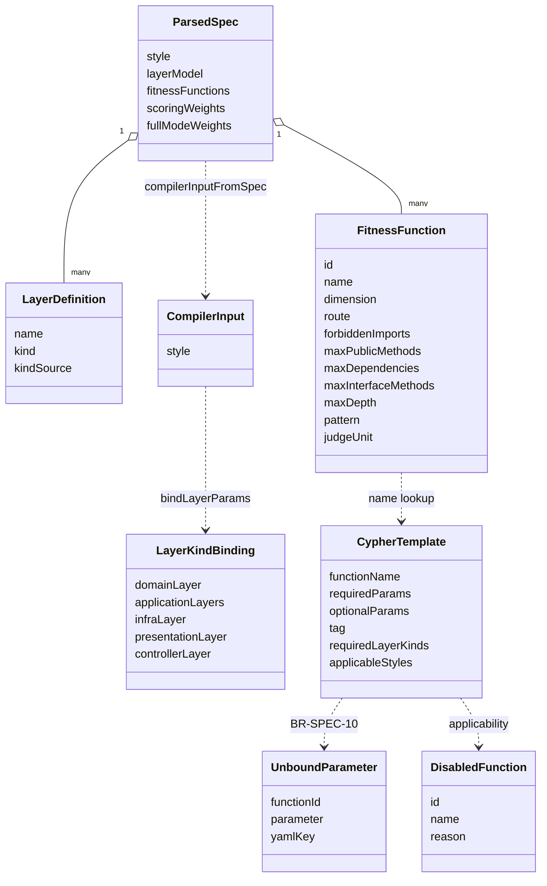

# U1 Spec and Compiler — Domain Entities (v1.2E)

> **Unit**: U1 · **Date**: 2026-10-07 · **Base**: `v1.2e` at `ee32a1f`
> **Legend**: EXISTING = present at HEAD and unchanged by U1 · U0 = shape added by U0, first filled by U1 · CHANGED / NEW = U1 edit. C10 types (`src/shared/**`) are U0-owned: U1 edits only pre-agreed patch row 1 (`enums.ts`, as amended by Q9 A) and fills fields that already exist.
> Rules referenced as `BR-U1-nn` are in `business-rules.md`.

---

## 1. Entity map



**Text alternative.** A `ParsedSpec` holds many `LayerDefinition`s (each with a resolved `kind` and `kindSource`) and many `FitnessFunction`s (each with the six typed FR-07 fields and `judgeUnit`). `compilerInputFromSpec` turns the spec into a `CompilerInput` that carries `style`. `bindLayerParams` derives a `LayerKindBinding` from the layer kinds. Each function finds its `CypherTemplate` by name. The template's `requiredParams` produce `UnboundParameter`s under BR-SPEC-10, and its `applicableStyles` and `requiredLayerKinds` produce `DisabledFunction`s.

Validation per `content-validation.md`: `classDiagram`; class names are alphanumeric; members are bare identifiers (no types, generics or symbols); relationship labels contain no colon other than the label separator; there is no `end` keyword.

---

## 2. C3 entities

### 2.1 `FitnessFunction` (U0, `src/shared/types/spec.ts:4-26`)

The fields already exist (U0). U1 fills them in the parser.

| Field | Type | YAML key | Filled by | Rule |
|---|---|---|---|---|
| `forbiddenImports` | `readonly string[]` | `forbidden_imports` | `mapFunctionSpecificFields` | BR-U1-03/04/07 |
| `maxPublicMethods` | `number` (integer ≥ 0) | `max_public_methods` | same | BR-U1-04 |
| `maxDependencies` | `number` (integer ≥ 0) | `max_dependencies` | same | BR-U1-04 |
| `maxInterfaceMethods` | `number` (integer ≥ 0) | `max_interface_methods` | same | BR-U1-04 |
| `maxDepth` | `number` (integer ≥ 0) | `max_depth` | same | BR-U1-04 |
| `pattern` | `string` (raw glob, BR-U1-06 grammar) | `pattern` | same; compiled to regex only in `buildParams` | BR-U1-06 |
| `judgeUnit` | `JudgeUnitKind` | `judge_unit` | `parseLayerB` | BR-U1-26 |
| `dimension` | `Dimension` | `dimension` | `normaliseDimension` (`intent` → `semantic`) | BR-U1-20 |

Invariant: an absent YAML key leaves the property absent (not `undefined`), so the template merge keeps the template value.

### 2.2 `FUNCTION_FIELD_KEYS` (NEW `src/spec-parser/function-fields.ts`)

```typescript
export const FUNCTION_FIELD_KEYS: Readonly<Record<string, keyof FunctionSpecificFields>> = {
  forbidden_imports: 'forbiddenImports',
  max_public_methods: 'maxPublicMethods',
  max_dependencies: 'maxDependencies',
  max_interface_methods: 'maxInterfaceMethods',
  max_depth: 'maxDepth',
  pattern: 'pattern',
};
export function mapFunctionSpecificFields(
  raw: Readonly<Record<string, unknown>>, path: string,
): { fields: FunctionSpecificFields; errors: readonly ValidationError[] };
```

The insertion order above is the iteration order. The reverse map (parameter → YAML key) gives `UnboundParameter.yamlKey` and the `SPEC_001` text (BR-U1-05). `FunctionSpecificFields` is EXISTING (`spec.ts:29-32`). The `errors` channel is defensive only: the schema has already type-checked every value.

### 2.3 `LayerDefinition` (U0, `spec.ts:56-66`)

| Field | Type | Meaning |
|---|---|---|
| `kind` | `LayerKind` (`'domain' \| 'application' \| 'infrastructure' \| 'presentation'`, `enums.ts:33`) | Resolved kind; always set after `resolveLayerKinds` |
| `kindSource` | `'explicit' \| 'name' \| 'position'` | Precedence step that produced `kind` (BR-U1-12) |

### 2.4 `ParsedSpec` (U0, `spec.ts:84-94`)

`style?: string` is now filled: the lower-cased `architecture.style`, or absent.

### 2.5 `ScoringWeights` (EXISTING type, `spec.ts:70`; values change)

`Readonly<Record<Dimension, number>>`. `intent` stays a key while it stays a `Dimension` member (Q9 A), but every value U1 produces has `intent: 0`. `scoring.weights` gives `semantic = integrity = 0`. `full_mode_weights` gives `integrity` from `integrity` or the legacy `intent` key (BR-U1-21).

Registry literals (`template-registry.ts:87-107`), CHANGED:

| Literal | structural | coupling | pattern | solid | convention | semantic | integrity | intent |
|---|---|---|---|---|---|---|---|---|
| `SYMBOLIC_WEIGHTS` | 0.35 | 0.20 | 0.30 | 0.10 | 0.05 | 0 | 0 | 0 |
| `FULL_MODE_WEIGHTS` | 0.32 | 0.18 | 0.27 | 0.10 | 0.05 | 0.04 | **0.04** (was 0) | **0** (was 0.04) |

### 2.6 Warning and error codes

| Code | Status | Where | Meaning |
|---|---|---|---|
| `SPEC_001` | EXISTING (`src/spec-parser/types.ts:65`) | `parseLayerB` | Reused for "Field \<key\> of \<id\> not used by template \<name\>" (BR-U1-05) |
| `SPEC_004` | NEW in `SpecWarningCode` (`types.ts:64-70`) | `normaliseDimension`, `parseLayerC` | `intent` alias used (BR-U1-20, BR-U1-21) |
| `SPEC_005` | NEW in `SpecWarningCode` | `resolveLayerKinds` | Duplicate scalar layer kind (BR-U1-13) |
| `SCHEMA_VALIDATION_FAILED` | EXISTING (`types.ts:30`) | `parseSpec` P2 | Now also covers FR-07 type/range, the `pattern` grammar, `judge_unit`, layer `kind` and the weight collision |
| `MISSING_REQUIRED_PARAM` | EXISTING (`src/fitness-compiler/types.ts:25`) | `checkBoundParameters` | BR-SPEC-10, message `BR-SPEC-10 <id>: <parameter>` |
| `COMPILATION_FAILED` | EXISTING (`types.ts:27`) | `compileFunctions` C7 | `exclude_paths` on a template without an anchor (BR-U1-32) |
| `COMPILER_004` | EXISTING (`types.ts:39`) | `compileFunctions` C5 | Any applicability disablement (style, kind, layer count) |

### 2.7 `BuiltInTemplate` `layered` (NEW entry in `template-registry.ts`)

```typescript
const LAYERED_TEMPLATE: BuiltInTemplate = {
  style: 'layered',
  version: '1.0.0',
  functions: LAYERED_FUNCTIONS,            // full catalogue (BR-U1-17): same 26 ids as CLEAN_ARCH_FUNCTIONS,
                                           // no FR-07 values, FF-N01 integrity/neuronal, FF-N02 semantic
  defaultWeights: SYMBOLIC_WEIGHTS,
  defaultFullModeWeights: FULL_MODE_WEIGHTS,
  defaultVerdictThresholds: DEFAULT_VERDICT_THRESHOLDS,   // 0.80 / 0.65 / 0.50 (AD-9)
  defaultConfidenceThresholds: DEFAULT_CONFIDENCE_THRESHOLDS,
};
// TEMPLATE_REGISTRY gains ['layered', LAYERED_TEMPLATE]
```

`presets/layered.yaml` (NEW, data): layers `persistence` (`kind: infrastructure`), `business` (`kind: domain`), `presentation` (`kind: presentation`). Each gets `directories` and `roles`; the schema requires `roles`, minItems 1. FR-07 values are present for **every declared function** that has an FR-07 key (full catalogue, BR-U1-17). That covers FF-P01 business-layer `forbidden_imports` (package-root names; built-ins bare, e.g. `fs`; values per OI-8), FF-SO01..03 and FF-CV03, and also FF-CV02 `*Service|*UseCase` and FF-CV04. Those two are disabled in `layered` (FF-CV02 by kind, FF-CV04 by style), and their values are inert there. There are FF-N01/FF-N02 with `semantic_criteria`, and `full_mode_weights` with `integrity: 0.04`.

---

## 3. C4 entities

### 3.1 `CompilerInput` (U0, `src/fitness-compiler/types.ts:5-11`)

`style?: string` is now set by `compilerInputFromSpec` (NEW `compiler-input.ts`):

```typescript
export function compilerInputFromSpec(spec: ParsedSpec): CompilerInput;
// { fitnessFunctions, adrRules, layerModel, scoringWeights, style: spec.style }
```

Callers: `CompileCommand.execute`, the CLI `validate` action and `FitnessCompilerStage.execute` (`fitness-compiler.ts:335-340`). None of them builds a `CompilerInput` literal any more (BR-U1-11).

### 3.2 `LayerKindBinding` (U0, `types.ts:17-22`)

| Field | Type | Bound from | Template parameter |
|---|---|---|---|
| `domainLayer` | `string?` | first layer with `kind: domain` | `$domainLayer` |
| `applicationLayers` | `readonly string[]` | every `kind: application` layer, in YAML order; `[]` = none | `$applicationLayers` |
| `infraLayer` | `string?` | first `kind: infrastructure` | `$infraLayer` |
| `presentationLayer` | `string?` | first `kind: presentation` | none today (kept for applicability and U3) |
| `controllerLayer` | `string?` | `presentationLayer ?? infraLayer` (ADR-016 a, BR-U1-46) | `$controllerLayer` (FF-P05 `controller-no-entity`, FF-CV04 `naming-controllers`) |

```typescript
export function bindLayerParams(layers: readonly LayerDefinition[]): LayerKindBinding;   // NEW layer-binding.ts, pure
```

### 3.3 `CypherTemplate` (CHANGED, `types.ts:60-71`; pre-agreed patch row 2)

```typescript
export interface CypherTemplate {
  readonly functionName: string;
  readonly template: string;                     // contains /*EXCLUDE:…*/ markers (BR-U1-32)
  readonly requiredParams: readonly string[];
  readonly optionalParams: readonly string[];
  readonly description: string;
  readonly resultMapping: ResultMapping;
  readonly tag: TemplateTag;                     // now REQUIRED (FR-29, BR-U1-27)
  readonly requiredLayerKinds: readonly LayerKind[]; // now REQUIRED (FR-19, BR-U1-15); [] = none
  readonly applicableStyles?: readonly string[]; // undefined = every style; ignored when the spec has no style (BR-U1-18)
}
```

The `tmpl()` helper (`cypher-templates.ts:10-19`) gains `tag`, `requiredLayerKinds` and an optional `applicableStyles`. New accessors in `cypher-templates.ts`:

```typescript
export function getTemplateTag(functionName: string): TemplateTag | undefined;
export function listTemplatesByTag(tag: TemplateTag): readonly string[];   // in CYPHER_TEMPLATES insertion order
export const MAX_CYCLE_LENGTH = 10;   // literal in the cycle template (BR-U1-28)
export const CYCLE_ROW_CAP = 100;     // template uses LIMIT CYCLE_ROW_CAP + 1
```

`tests/golden/normalise.ts:22` keeps its own `CYCLE_ROW_CAP = 100`. Only its predicate changes, to `>`. A test asserts it equals the compiler constant.

### 3.4 Per-template catalogue (parameters, kinds, styles, tag)

| Template | `requiredParams` (U1) | `optionalParams` | `requiredLayerKinds` | `applicableStyles` | `tag` |
|---|---|---|---|---|---|
| dependency-direction | layerOrder | — | — | all | structural |
| no-cyclic-deps | — | — | — | all | topological |
| no-layer-skip | allowedTransitions | — | — | `['layered']` | structural |
| no-domain-outward-dep | domainLayer | — | domain | `['clean-architecture','nestjs']` | structural |
| domain-purity | domainLayer, forbiddenImports | — | domain | all | pattern-proxy |
| dependency-inversion | applicationLayers, threshold | — | application | `['clean-architecture','nestjs']` | pattern-proxy |
| repository-pattern | domainLayer, infraLayer | — | domain, infrastructure | `['clean-architecture','nestjs']` | pattern-proxy |
| use-case-isolation | applicationLayers, domainLayer, useCaseRoles | useCaseRoles | application, domain | `['clean-architecture','nestjs']` | pattern-proxy |
| controller-no-entity | controllerLayer, domainLayer, entityRoles | entityRoles | infrastructure, domain | `['clean-architecture','nestjs']` | pattern-proxy |
| domain-stability | domainLayer, threshold | — | domain | `['clean-architecture','nestjs']` | topological |
| module-fan-out | threshold | — | — | all | topological |
| component-instability | threshold | — | — | all | topological |
| no-orphan-files | — | — | — | all | topological |
| max-fan-in | threshold | — | — | all | topological |
| abstraction-ratio | threshold | — | — | all | topological |
| single-responsibility-proxy | maxPublicMethods, maxDependencies | — | — | all | pattern-proxy |
| interface-segregation-proxy | maxInterfaceMethods | — | — | all | pattern-proxy |
| inheritance-depth | maxDepth | — | — | all | topological |
| naming-conventions | domainLayer, applicationLayers, infraLayer, domainPattern, applicationPattern, infraPattern | — | domain, application, infrastructure | all | pattern-proxy |
| naming-services | applicationLayers, pattern | — | application | all | pattern-proxy |
| naming-repos | pattern | — | — | all | pattern-proxy |
| naming-controllers | controllerLayer, pattern | — | infrastructure | `['clean-architecture','nestjs']` | pattern-proxy |
| test-file-pairing | — | — | — | all | pattern-proxy |
| no-index-logic | — | — | — | all | pattern-proxy |

`useCaseRoles` and `entityRoles` stay in both lists, as they are today (`cypher-templates.ts:133,135,144,146`). The compiler default binds them, so BR-SPEC-10 never fires on them. `domain-state-purity` (NEW, U3) is outside this table.

`ResultMapping` (`types.ts:46-58`) is unchanged in type. U1 changes only these `rm()` values: the three dependency templates' message templates (`{verb}`, BR-U1-35) and their `metadataColumns` (gaining `relType`, `line`, `lines`, `isTypeOnly`). The cycle row gains the columns `target` and `line` (BR-U1-28), which stay unmapped until U3. `repository-pattern` keeps its parameters, kinds and default mapping and loses its compliant branch (BR-U1-45). `lineColumn`, `linesColumn`, `targetColumn`, `isTypeOnlyColumn`, `discriminatorColumns` and `cycleColumn` are U3's (FR-12, patch row 3).

### 3.5 `UnboundParameter` and the checker (NEW `bound-param-checker.ts`)

```typescript
export interface UnboundParameter {
  readonly functionId: FunctionId;
  readonly parameter: string;   // template parameter, e.g. 'forbiddenImports'
  readonly yamlKey?: string;    // reverse FUNCTION_FIELD_KEYS, e.g. 'forbidden_imports'
}
export function findUnboundParameters(input: CompilerInput): readonly UnboundParameter[]; // probe; sorted (BR-U1-09)
export function checkBoundParameters(input: CompilerInput): DomainResult<void>;           // fatal form
```

Both call the exported `buildParams` and `isTemplateApplicable`, so the checker and the compiler cannot disagree.

```typescript
export function buildParams(
  ff: FitnessFunction, layerModel: LayerModel, binding: LayerKindBinding,
): Readonly<Record<string, unknown>>;   // CHANGED, exported; restricted, ordered (BR-U1-33)
```

### 3.6 `Applicability` (NEW `template-applicability.ts`)

```typescript
export type Applicability =
  | { readonly applicable: true }
  | { readonly applicable: false; readonly reason: string };
// reasons: 'not applicable to style <style>' | 'no <kind> layer' | the existing no-layer-skip layer-count text
export function isTemplateApplicable(
  template: CypherTemplate, style: string | undefined, binding: LayerKindBinding, layerModel: LayerModel,
): Applicability;
```

The signature adds `layerModel` to the upstream shape (`component-methods.md:960-967`). It is needed to fold the existing layer-count rule (`fitness-compiler.ts:56-73`) into the one applicability path.

### 3.7 `DisabledFunction` (EXISTING, `spec.ts:34-38`)

Unchanged shape. It now also carries style and kind disablements, with the reason strings above.

### 3.8 Exclude anchor (NEW concept, inside template text)

| Marker | Replacement when `excludePaths` is non-empty | Empty list |
|---|---|---|
| `/*EXCLUDE:<alias>*/` | `AND NONE(ep IN $excludePatterns WHERE <alias>.filePath =~ ep)` | `''` |
| `/*EXCLUDE:nodes(<path>)*/` | `AND NONE(n IN nodes(<path>) WHERE ANY(ep IN $excludePatterns WHERE n.filePath =~ ep))` | `''` |

`excludePatterns` = `excludePaths.map(globToRegex)` (`glob-to-regex.ts:6`), appended to the parameter map last.

Shape invariant (BR-U1-44): the predicate in front of a marker is a top-level conjunction, with every `OR` parenthesised or inside `{ … }`. Otherwise the leading `AND` of the replacement would bind only to the last disjunct.

---

## 4. `SPEC_SCHEMA_V1` deltas (`src/spec-parser/spec-schema.ts`)

| Location | Today | U1 |
|---|---|---|
| Layer item properties (`:23-29`, closed `:30`) | name, directories, file_patterns, roles, decorators | + `kind: { type: 'string', enum: ['domain','application','infrastructure','presentation'] }`; still closed |
| Function item `dimension` enum (`:44`) | … `semantic`, `intent` | + `integrity` (keeps `intent`) |
| Function item, FR-07 keys (`:69`, open) | untyped | `forbidden_imports: { type: 'array', items: { type: 'string', minLength: 1 } }`; `max_public_methods`, `max_dependencies`, `max_interface_methods`, `max_depth`: `{ type: 'integer', minimum: 0 }`; `pattern: { type: 'string', pattern: PATTERN_GRAMMAR }` (regex in §5); the item stays `additionalProperties: true` |
| Function item `judge_unit` | absent | `{ type: 'string', enum: ['file','class','module'] }` |
| `scoring.weights` (`:76-87`) | five symbolic keys, closed | unchanged |
| `scoring.full_mode_weights` (`:88-101`) | required includes `intent`; closed | `required: ['structural','coupling','pattern','solid','convention','semantic']`; properties + `integrity` (keeps `intent`); `oneOf: [{ required: ['integrity'] }, { required: ['intent'] }]` (exactly one; BR-U1-21); still closed |

Ajv runs with `allErrors: true` (`spec-validator.ts:11`), so one parse reports every schema violation.

---

## 5. Constants and frozen values (ADR-015 item 2)

| Name | Value | Location | Rule |
|---|---|---|---|
| `MAX_CYCLE_LENGTH` | 10 | `cypher-templates.ts` | BR-U1-28 |
| `CYCLE_ROW_CAP` | 100 (query `LIMIT 101`) | `cypher-templates.ts`; mirrored in `tests/golden/normalise.ts:22` | BR-U1-28 |
| `PATTERN_GRAMMAR` | see the block below | `spec-schema.ts` | BR-U1-06 |
| Applicability table | `business-rules.md` §3.1 | `cypher-templates.ts` (`applicableStyles`, `requiredLayerKinds`) | BR-U1-18 |
| Tag table | `business-rules.md` §4.1 | `cypher-templates.ts` (`tag`) | BR-U1-27 |
| Judge-unit defaults | semantic → `file`, integrity → `module` | `fitness-compiler.ts` `compileNeuronal` | BR-U1-26 |
| Verdict thresholds | 0.80 / 0.65 / 0.50 (unchanged) | registry, YAMLs | AD-9 |

`PATTERN_GRAMMAR` (JSON Schema `pattern`; in a TypeScript string literal the backslash is doubled):

```text
^[A-Za-z0-9_$*?]+(\|[A-Za-z0-9_$*?]+)*$
```
