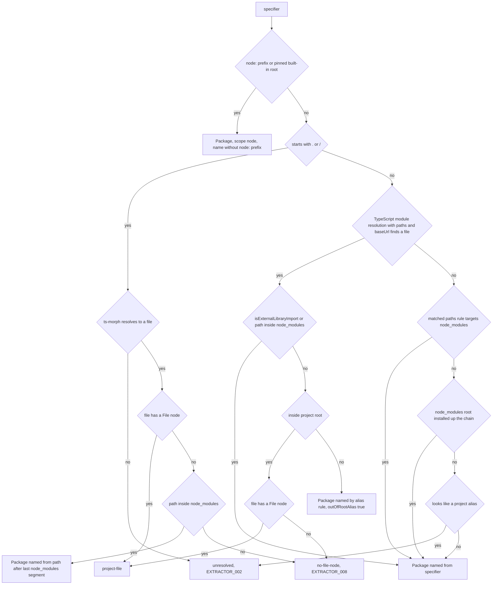
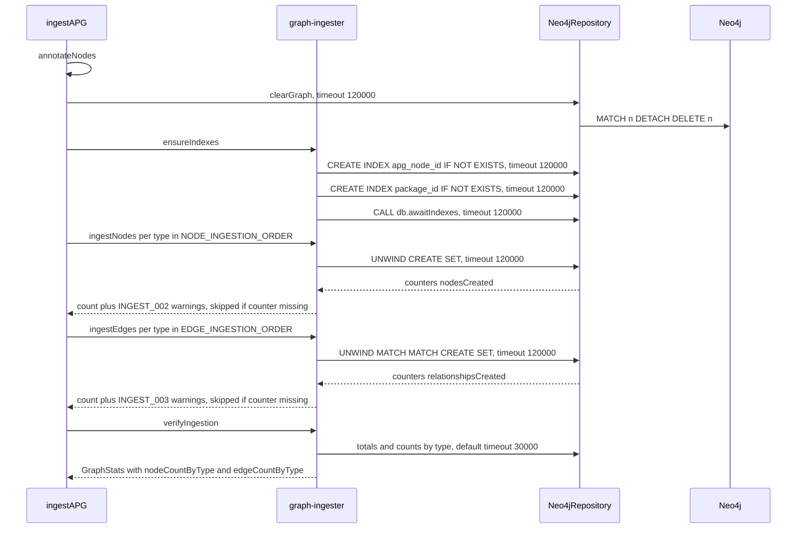

# Business Logic Model — v1.2E U2 Extractor and graph

> **Unit**: U2 (C1 APG extractor, C2 Neo4j ingestion) · **Date**: 2026-10-07 · **Base**: `v1.2e` @ `ee32a1f` (source lines as at `20d8d3d`)
> **Binding inputs**: plan answers Q1–Q17 (`aidlc-docs/construction/plans/v1.2E-u2-extractor-graph-functional-design-plan.md`), ADR-015 items 5, 7, 8, 12, 13, ADR-016 (f, g, h, i), requirements FR-09, 10, 14, 21, 34, NFR-03, 05, 07, U0 decisions D-U0-5, 6, 8, 12, 13.
> **Scope rule** (author): every step serves SO1–SO5 and a sound evaluation; nothing beyond the answers. Rule ids (`BR-U2-nn`) are defined in `business-rules.md`.
> **Corpus figures** quoted below come from the plan's scout probes (plan Section 3). The probe script is committed with its output under `Docs/DiagnosticRuns/` by U2 code generation (ADR-016 h, former OI-7); until that commit, those figures are not reproducible from the repository. Fixture facts were checked against the files.

---

## 1. Pipeline position

```text
extractAPG (apg-extractor.ts:19)
  1 Project from tsconfig (unchanged)
  2 source files after DEFAULT_EXCLUDE_PATTERNS (unchanged)
  3 extractNodes -> nodes, NodeLookup (CHANGED: interface Method nodes, BR-U2-47)
  4 extractEdges (CHANGED) -> edges, warnings, packageNodes, importResolution
  5 parseCoverage (unchanged)
  6 return DR.ok({ nodes: [...nodes, ...packageNodes], edges, parseCoverage, warnings, importResolution })
      - no warnings argument to DR.ok (Q15 A; apg-extractor.ts:81 shape kept)

ingestAPG (neo4j-ingestion.ts:18)
  1 annotateNodes            (Package nodes stay unannotated)
  2 clearGraph               (timeout 120 000 ms)
  3 ensureIndexes  NEW       (two CREATE INDEX + db.awaitIndexes, 120 000 ms each)
  4 ingestNodes    CHANGED   (reserved keys last; INGEST_002 check)
  5 ingestEdges    CHANGED   (properties written; INGEST_003 check)
  6 verifyIngestion CHANGED  (counts by type; default 30 000 ms)
  7 persistent-mode steps    (unchanged; drift fan-out filtered to :File targets)
```

---

## 2. Edge pass (`extractEdges`, `edge-extractor.ts:18-237`)

Per source file `sf` in `sourceFiles` order, skipping files without a File node (`edge-extractor.ts:39-40`, unchanged; their statements are not counted anywhere):

1. **Statements** = import declarations, `import x = require('m')` declarations, and export declarations that have a module specifier, in source position order.
2. For each statement: `resolveImportTargets` / `resolveReExportTargets` (Section 3) → occurrences in emission order (BR-U2-15) and one `StatementOutcome`.
3. Each occurrence goes to `ImportEdgeMerger.add` (Section 4); the outcome increments one counter (Section 6).
4. `countUnsupportedDynamicImports(sf)`; if > 0, add it to `unsupportedDynamic` and emit one `EXTRACTOR_009` warning for the file (BR-U2-25).
5. DECLARES, EXTENDS, IMPLEMENTS, CONSTRUCTOR_INJECTS and CALLS are unchanged (`edge-extractor.ts:53-232`, keep-first `addEdge` for these types only). CONTAINS keeps Class→Method unchanged and gains **Interface→Method** (ADR-016 f, BR-U2-47): for each extracted Interface, one edge per own method signature name to the Method node that `extractNodes` created for it (`domain-entities.md` §2.9), keep-first `addEdge`, emitted after the class edges of the file.
6. Per class, beside CONSTRUCTOR_INJECTS: `deriveFlowsToEdges` (Section 5).

Result order of `edges`: merged IMPORTS (first-occurrence order), merged RE_EXPORTS (first-occurrence order), then the other types in today's insertion order with FLOWS_TO where the deriver adds them. Only the order **within** a type matters downstream (ingestion groups by type, D-U0-13); within IMPORTS it equals today's order on every fixture (no repeated pair, no barrel).

---

## 3. Import pipeline per statement

### 3.1 Module resolution (one specifier, one source file)



Text alternative (the same decision list, applied top to bottom; first match wins):

1. **Built-in** (`node:` prefix, or first segment in the pinned list) → Package, `scope: "node"`, name = first segment without `node:` (`node:fs/promises` → `fs`). The built-in list wins over an installed npm package of the same name (`punycode`). (BR-U2-03, BR-U2-04)
2. **Relative** (`.` or `/`): resolve with ts-morph (`getModuleSpecifierSourceFile()`, the same call as `edge-extractor.ts:259`).
   - no file → `unresolved`, `EXTRACTOR_002 Unresolvable import: <specifier>` (message unchanged);
   - file with a File node → `project-file`;
   - file without a File node (excluded by `DEFAULT_EXCLUDE_PATTERNS`, skipped after a parse failure, or outside the root) → `no-file-node`, `EXTRACTOR_008` (Q3 A);
   - file inside `node_modules` reached by a relative path → Package (FR-09 "resolve into `node_modules`"), named from the path: the segment after the last `node_modules/`, or two segments when it starts with `@` (settled S-4, BR-U2-09; 0 in the probes).
3. **Alias or bare**: TypeScript module resolution with the project's compiler options (`paths`, `baseUrl`), returning `resolvedFileName` and `isExternalLibraryImport`.
   - resolved and (`isExternalLibraryImport` or the path has a `node_modules` segment) → Package named from the specifier (BR-U2-05);
   - resolved inside the root, File node → `project-file` (FR-09 "aliases resolve to files first");
   - resolved inside the root, no File node → `no-file-node`, `EXTRACTOR_008`;
   - resolved outside the root (alias into a sibling directory, e.g. ghostfolio `@ghostfolio/common` → `../../libs/common/src`, 330 statements) → Package named by the alias rule, `outOfRootAlias: true` (Q1 A, BR-U2-06);
   - not resolved, and the matched `paths` rule's substitutions point into `node_modules` → Package (ADR-015 item 7; dev-nest case);
   - not resolved, and `node_modules/<root>` exists in the importing file's directory or any ancestor up to the filesystem root (Node lookup semantics) → Package (ADR-015 item 7; truthy-demo `config`, 15 statements, an untyped package shadowed by a `config/` directory under `baseUrl`);
   - not resolved, and the specifier **looks like a project alias** (matches a `paths` pattern; or `baseUrl` is set and the first segment names an existing file or directory under `baseUrl`) → `unresolved`, `EXTRACTOR_002` (Q2 A);
   - otherwise → Package named from the specifier (FR-09; e.g. dev-nest's 166 bare imports with no `node_modules` installed).

Naming and scope always come from the specifier, never from the resolved path (Section 5.2 of the plan; protects against `@types/x` paths and ancestor `node_modules` under `fixtures/*`). The single exception is the relative-into-`node_modules` case above, where the specifier carries no package name.

### 3.2 IMPORTS statement → occurrences (per-name resolution, FR-34)

Given a statement whose `ModuleResolution` is:

| Resolution | Occurrences |
|---|---|
| `package` | one occurrence to the Package, `names` = all exported-name forms of the statement (Q8 A) |
| `unresolved` | none |
| `no-file-node` | none (the `EXTRACTOR_008` warning is already emitted) |
| `project-file` M | per-name routing below |

Per-name routing for module file M:

- **Side-effect** `import './m'` → one occurrence to M, `names: []`, `isTypeOnly: false`.
- **Namespace** `import * as ns from './m'` → one occurrence to M, `names: ['*']`.
- **`import x = require('./m')`** → treated as a static import of the whole module: one occurrence to M, `names: ['*']` (settled S-9b, BR-U2-16).
- **Default and named** specifiers: each exported name (`default`, or `A` for `{ A as B }`) is followed with `resolveNameToDeclaringFile(name, M)`:
  - follow the export's alias chain one hop at a time (TypeScript symbol `getImmediatelyAliasedSymbol()`), counting hops; a hop count above `maxBarrelDepth` → `EXTRACTOR_006` and stop; a revisited `(file, name)` → `EXTRACTOR_007` and stop;
  - the declaring file D has a File node → target D;
  - the chain cannot resolve the name, or stops on 006/007, **inside the project** → fall back to target M (Section 5.2);
  - the chain reaches an `export … from 'S'` hop → classify `S` from the file that holds that hop with the Section 3.1 list (settled S-9a, BR-U2-24): project File → continue the chain; into `node_modules` or a package → Package named from `S` (Section 5.2); out-of-root alias → Package by alias rule; a file without a File node → dropped target with `EXTRACTOR_008`; **`S` unresolved** → fall back to target M with no extra warning (the barrel's own RE_EXPORTS statement already carries `EXTRACTOR_002`).
- Names routed to the same target merge into one occurrence. Occurrences are emitted in the order of the first name routed to each target (Section 5.2).
- `isTypeOnly` per occurrence: statement is `import type`, or every specifier routed to that target is `type`-marked (Q7 A). Example: `import { A, type B } from './barrel'` gives a value edge to A's file and a type-only edge to B's file.

On every fixture the routing is trivial: no fixture file consists only of import/export declarations (checked over `fixtures/*/src`), and `variant-d-subtle/src/application/utils/TaskUtils.ts` declares `normalizeTitle` itself, so `Task.ts → TaskUtils.ts` is unchanged. No fixture contains `import()` or `require()` (checked).

### 3.3 `export … from` statement → RE_EXPORTS occurrence (Q4 A)

- One occurrence per statement, to the module it names, **not** followed through further barrels (design amendment of `component-methods.md:69,626`: "barrel File → the module named in the statement").
- The specifier goes through the same Section 3.1 list, so `export * from 'src/…'` (truthy-demo, baseUrl style) resolves as an alias, and `export … from 'pkg'` targets a Package node.
- `names` = `exportedNames` (BR-U2-22): the names written, `A` for `export { A as B } from` (the name in the target module, as Q8 A does for imports), `['*']` for `export * from` and for `export * as ns from` (settled S-3).
- `isTypeOnly`: `export type { … } from`, `export type * from`, or every specifier `type`-marked (Q5 A).
- An `export … from` never yields an IMPORTS occurrence (upstream decision, `component-methods.md:67-72`).
- Local re-exports without a module specifier (`export { A }`) are not statements of this pipeline.

Fixture effect: exactly one RE_EXPORTS edge in the whole golden set, `variant-d-subtle` `TaskUtils.ts:3 → InfraFormatters.ts`, `exportedNames: ['formatDate']`, `isTypeOnly: false`.

---

## 4. Merge algorithm (FR-10) and determinism

```text
ImportEdgeMerger.add(occ, targetNodeId):
  key = occ.edgeType + ':' + occ.sourceFileNodeId + ':' + targetNodeId
  slot = slots.get(key) ?? new slot(firstSeen = counter++)
  slot.occurrences.push({ specifier, line, seq = global emission counter, names, isTypeOnly })

ImportEdgeMerger.edges():
  for slot in slots ordered by firstSeen:
    occ  = slot.occurrences sorted by (line, seq)
    id   = generateEdgeId(edgeType, sourceId, targetId)            id-generator.ts:20-23
    props.specifier  = occ[0].specifier
    props.specifiers = unique(occ.map(o => o.specifier))            first-line order
    props.lines      = unique(occ.map(o => o.line)) sorted ascending
    props.line       = props.lines[0]                               = min(lines)
    props.isTypeOnly = occ.every(o => o.isTypeOnly)
    names            = unique(occ.flatMap(o => o.names)).sort()     code-unit order
    IMPORTS:    props.importedNames = names
    RE_EXPORTS: props.exportedNames = names
```

Determinism: edge order is a function of the source text only (file order from ts-morph, statement order in the file, name order in the statement). The plan's Section 5.2 emission rule plus first-occurrence slot order keep FF-S02 cycle strings in variant-a and variant-c stable until FR-35 (U1) adds `ORDER BY`.

Pure helpers `mergeImportProperties(a, b)` / `mergeReExportProperties(a, b)` apply the same rules to two property sets (exposed for tests; associative and commutative except for `specifier` ties, which take the lower line and then `a`).

---

## 5. FLOWS_TO derivation (FR-21 reduced by D8, Q9 A)

For each class C with a Class node (`edge-extractor.ts:71-74` lookup):

```text
candidates = []
for each instance property declaration f of C with initialiser `new T(...)`:     via 'new'
for each `this.f = new T(...)` anywhere in C (constructor, methods, accessors):  via 'new'
for each `this.f = expr` (expr not a `new`) outside the constructor of C:        via 'field-assignment'
  conditions:  `this` binds to C (nearest non-arrow function container is a member of C)
               f is an instance field declared in C (property declaration or constructor parameter property)
               static fields and `C.f = …` excluded
  value type:  static type of the right-hand side (`new` expression or expr)
               union or intersection type -> skip (no unwrapping, Q9 A)
               type arguments never inspected: new Map<string, Task>() -> Map -> not extracted -> nothing
               declaration of the type's symbol must be an extracted Class or Interface (typeNodes name@path)
               target == C -> skip (self-loop)
  candidate:   { field: f, via, line, targetId }
per targetId keep min by (line, field); emit Class C -[:FLOWS_TO {field, via, line}]-> target
```

Excluded by D8: constructor-parameter flows (they are CONSTRUCTOR_INJECTS) and constructor-body assignments from non-`new` expressions (`this.f = factory.make()`). No FLOWS_TO-specific warning is emitted.

Fixture effect (checked with `grep` over `fixtures/*/src`): `variant-a-structural/.../InMemoryTaskRepository.ts:8` `helper = new CircularHelper()` and `variant-c-everything/.../InMemoryTaskRepository.ts:7` `helper = new CircularB()` yield one edge each (infrastructure → infrastructure). Every `store = new Map<string, Task>()` yields nothing. No consumer exists in U2 (U3 owns `domain-state-purity`).

Recorded limitation (not an open item; Q9 A is explicit): nullable fields `T | null` are unions and are skipped. The review measured 20 such sites in dev-nest and 16 in dry-run-test, so FLOWS_TO is close to empty on the corpus and FR-21 is validated by fixtures; the thesis states this in the FR-21 text.

---

## 6. `importResolution` counting

| Statement outcome | Counter | Warning |
|---|---|---|
| at least one target is a project File | `resolvedInternal` | none (per-name drops still warn `EXTRACTOR_008`) |
| no File target, at least one Package target | `external` (+ `externalOutOfRootAlias` when the statement's own specifier was an out-of-root alias) | none |
| every target dropped (no File node) | `droppedNoFileNode` | `EXTRACTOR_008` per dropped target |
| resolution failed before any split | `unresolved` | `EXTRACTOR_002` |
| `import()` / `require()` call | `unsupportedDynamic`, per occurrence | one `EXTRACTOR_009` per file with the count |

Counted statements: import declarations, `import x = require()`, `export … from` (Q3 invariant), in files that have a File node. Type-only statements count like any other (D3). `import('x').T` type references are not calls and are not counted. `require.resolve(…)` is not a `require(…)` call and is not counted.

Expected fixture values (derived from the fixture files; to be confirmed by the unit test, not part of `GoldenSnapshot`): `external` = 0, 0, 1, 3, 0 for correct-reference, a, b, c, d; `unresolved` = 0; `droppedNoFileNode` = 0; `unsupportedDynamic` = 0; `resolvedInternal` = the static statement count minus `external`.

---

## 7. Ingestion sequence



Text alternative: `ingestAPG` annotates layers, clears the graph (120 s), creates the two indexes and waits for them (each a separate auto-commit call, 120 s), ingests nodes type by type and checks `nodesCreated` (warning `INGEST_002` on a mismatch), ingests edges type by type with their properties and checks `relationshipsCreated` (warning `INGEST_003` on a mismatch), then verifies with totals and per-type counts under the 30 s default. When a result has no `nodesCreated` / `relationshipsCreated` key (mocks; the real driver always returns both), the check is skipped and the batch size is counted as today (BR-U2-35). Q11 A names only `INGEST_003`; nodes use `INGEST_002` by its declared meaning (settled S-7). Every warning is appended to `ingestAPG`'s `warnings`, which `ingest-command.ts:52-55` routes into the context.

### 7.1 Exact Cypher shapes

```cypher
// ensureIndexes — three separate executeQuery calls (schema and writes cannot share a transaction)
CREATE INDEX apg_node_id IF NOT EXISTS FOR (n:APGNode) ON (n.id)
CREATE INDEX package_id  IF NOT EXISTS FOR (n:Package) ON (n.id)
CALL db.awaitIndexes()

// ingestNodes — per type T; batch item = { ...flattenProperties(n.properties), id, type, name, filePath, layer, role }
UNWIND $batch AS node
CREATE (n:APGNode:T)
SET n = node

// ingestEdges — per type T; batch item = { sourceId, targetId, props: { ...flattenProperties(e.properties), id } }
UNWIND $batch AS edge
MATCH (src:APGNode {id: edge.sourceId})
MATCH (tgt:APGNode {id: edge.targetId})
CREATE (src)-[r:T]->(tgt)
SET r = edge.props

// verifyIngestion — totals unchanged (graph-ingester.ts:124,127), plus
MATCH (n:APGNode) RETURN n.type AS type, count(*) AS cnt
MATCH ()-[r]->() RETURN type(r) AS type, count(*) AS cnt
```

Reserved keys are written **last** so they always win over a same-named entry in `properties` (Section 5.2; no current node property collides: `isBarrel`, `isAbstract`, `typeParameters`, `isAsync`, `isStatic`, `returnType`, `isExported`). The edge relationship keeps exactly `{id}` plus the flattened properties; `type` is not stored on relationships (as today). `decorators` stay unwritten.

The per-type maps contain every `NODE_TYPES` / `EDGE_TYPES` key in enum order, zeros included, values `Number(cnt)`.

### 7.2 Repository behaviour (`neo4j-repository.ts`)

```text
constructor(config: password required)
  cfg = { ...DEFAULT_INGESTION_CONFIG, ...config }
  secrets = filterSecrets([password, uri, explicit host:port of uri])      BR-U2-39
  port    = explicit port of uri ?? 7687                                   address pattern, S-1
  driver = undefined                                                       lazy (Q13 A)

executeQuery(cypher, params, options)
  try
    driver ??= neo4j.driver(uri, auth.basic(user, password))              synchronous, before any await:
                                                                           concurrent first calls share one driver
    session = driver.session()
    timeout = options?.timeoutMs ?? cfg.queryTimeoutMs                     always passed (D-U0-5)
    result = await session.run(cypher, params, { timeout })
    map records and counters (unchanged, :27-39)
  catch e
    return fail([{ code: e.code ?? 'UNEXPECTED_ERROR', message: scrub(message(e)) }])
  finally
    session?.close() wrapped in try/catch                                  S-2, BR-U2-40:
      run succeeded -> keep ok(data), add warning REPO_SESSION_CLOSE_FAILED with scrub(message)
      run failed    -> keep the run error, drop the close error

scrub(text) = scrubSecrets(redactAddresses(text, port), secrets)          IPv4, [IPv6] or ::1 with the URI port -> [REDACTED]

clearGraph   -> executeQuery('MATCH (n) DETACH DELETE n', undefined, { timeoutMs: WRITE_QUERY_TIMEOUT_MS })
healthCheck  -> executeQuery('RETURN 1 AS ok')                            default 30 000 ms
close        -> driver?.close()                                           no-op when no query ran
```

Consequence handed to S1/U3: `new Neo4jRepository(...)` at `pipeline-factory.ts:66` no longer throws on a malformed URI; the scrubbed failure surfaces at the first query (Q13 A).

Timeout failures keep the Neo4j code (`Neo.ClientError.Transaction.TransactionTimedOutClientConfiguration`, recorded in the U0 code summary) through `DomainResult.fromError` semantics; FR-36 (later unit) rejects runs that contain such a failure, which is why the corpus-run freeze (plan Section 2) and the ADR-015 item 5 latency gate exist.

### 7.3 Drift fan-out (persistent mode only)

`drift-detector.ts:105-110` and `:168-169` count only IMPORTS edges whose `targetId` is a File node, so Package edges do not inflate coupling drift (D-4). Not observable in the golden suite (stateless mode).

---

## 8. Determinism and snapshot neutrality (U2 merges first, ADR-015 item 12)

U2 alone must leave all five snapshots byte-identical. The model guarantees it through these properties, each tied to a rule and a Gate G run after every U2 commit:

| Property | Why the fixtures are unaffected |
|---|---|
| New Package nodes and IMPORTS → Package edges | every template that reads IMPORTS types the target `:File` except the orphan queries (`cypher-templates.ts:195-196`, `universal-metrics.ts:25-28`); the only fixture files with package imports (`Task.ts` in b and c, `TaskHandler.ts` in c) also have project-file connections, so no orphan status changes (checked) |
| RE_EXPORTS edge in variant-d | no template or metric reads RE_EXPORTS until U1 |
| FLOWS_TO edges in a and c | no consumer until U3 |
| Interface Method nodes and `Interface -[:CONTAINS]-> Method` edges (BR-U2-47) | FF-SO02, the only reader, is unexecuted (`EVAL_001`, unbound `maxInterfaceMethods`) until U1 K2; FF-SO01 matches `(c:Class)` only; no universal metric reads Method nodes. The FF-SO02 delta lands in U1 K2 (`business-rules.md` G8) |
| Edge properties written | no template reads edge properties at HEAD (grep for `callCount`, `isTypeOnly`, `importedNames`, `parameterName`, `decoratorBased` in `src/fitness-compiler`, `src/evaluation-engine`, `src/scoring-engine`: no reader) |
| IMPORTS edge order | first-occurrence order equals today's keep-first order (no repeated pairs, no barrels in fixtures) |
| Extractor warnings | not routed (Q15 A) |
| INGEST_002/003 | only on a count mismatch; none expected |
| Default timeout | fixture queries run far below 30 s |
| Scrubbing | the seven `EVAL_001` texts contain no secret that passes the filter and no `address:port` form (BR-U2-39, BR-U2-42) |
| `importResolution`, `graphStats` | not part of `GoldenSnapshot` (D-U0-12) |
| Bundled U0 patch (two `ImportResolutionStats` fields, schema, literals) | types, schema and test literals only; `importResolution` is not in `GoldenSnapshot`; Gate G runs after the patch (BR-U2-45) |

Latency (NFR-03, U2 part): extract plus ingest stays under 5 s per fixture (BR-U2-46), measured by the gated Neo4j test and recorded in the FR-18 result file in Build and Test.
