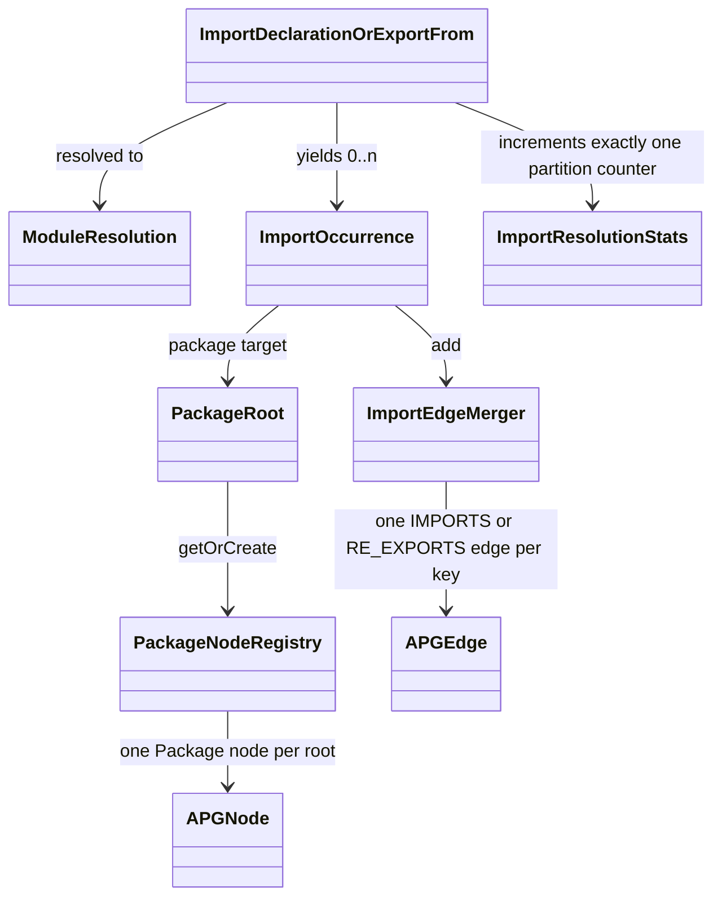

# Domain Entities — v1.2E U2 Extractor and graph

> **Unit**: U2 (C1 APG extractor, C2 Neo4j ingestion) · **Date**: 2026-10-07 · **Base**: `v1.2e` @ `ee32a1f` (source lines identical to `20d8d3d`, the plan's base)
> **Binding inputs**: `aidlc-docs/construction/plans/v1.2E-u2-extractor-graph-functional-design-plan.md` (answers Q1–Q17), ADR-015, ADR-016 (f, g), `v1.2-evaluation-readiness-requirements.md`, `v1.2E-component-methods.md` (C1, C2), U0 plan decisions D-U0-5/6/8/12/13.
> **Companions**: `business-logic-model.md` (algorithms), `business-rules.md` (BR-U2-nn with acceptance checks, fixtures, golden table).
> **Convention**: "C10" means `src/shared/**`, read-only for U2. Every C10 change below is part of the **one bundled U0 patch** applied before U2 code generation (plan Section 1.3). Internal C1/C2 types are U2-owned.

---

## 1. Entity overview

| Entity | Kind | Owner file | Status | Serves |
|---|---|---|---|---|
| `SpecifierClass` | value | `import-resolver.ts` | NEW (internal) | FR-09 |
| `ModuleResolution` | value | `import-resolver.ts` | NEW (internal) | FR-09, ADR-015 item 7 |
| `StatementOutcome` | value | `import-resolver.ts` | NEW (internal) | FR-14, Q3 |
| `ImportOccurrence` | value | `import-resolver.ts` | NEW (design `component-methods.md:592-601`, comment amended by Q7) | FR-10, FR-34 |
| `ImportResolutionContext` | value | `import-resolver.ts` | NEW (design, extended here) | FR-09, FR-34 |
| `PackageRoot` | value | `package-node-factory.ts` | NEW | FR-09, D-5 |
| `PackageNodeRegistry` | aggregate | `package-node-factory.ts` | NEW | FR-09 |
| `ImportEdgeMerger` state (`MergeSlot`) | aggregate | `import-edge-merger.ts` | NEW | FR-10, Q7, Q8 |
| Interface Method node + `Interface -[:CONTAINS]-> Method` | node and edge kind | `node-extractor.ts`, `edge-extractor.ts` | NEW use of existing `Method` node type and `CONTAINS` edge type (no C10 change) | ADR-016 f; BR-U2-47 (FF-SO02) |
| `ImportEdgeProperties` | contract | `src/shared/types/apg.ts:23-30` | EXISTING (C10) | FR-10 |
| `ReExportEdgeProperties` | contract | `src/shared/types/apg.ts:33-39` | CHANGED by bundled C10 patch (`isTypeOnly`) | FR-34, Q5 |
| `FlowsToEdgeProperties` | contract | `src/shared/types/apg.ts:42-46` | EXISTING (C10) | FR-21 |
| `PackageNodeProperties` | contract | `src/shared/types/apg.ts:49-51` | EXISTING (C10) | FR-09 |
| `ImportResolutionStats` | contract | `src/shared/types/apg.ts:54-59` | CHANGED by bundled C10 patch (two counters, one comment; report schema follows in the same patch) | FR-14, FR-34, Q1–Q3 |
| `GraphStats` by type | contract | `src/shared/types/evaluation.ts:20-26` | EXISTING (C10); filled by U2 | FR-14, Q11 |
| `IngestionConfig` | config | `src/neo4j-ingestion/types.ts:19-31` | CHANGED (no password default, `queryTimeoutMs`) | D-U0-5, D-U0-8, Q12 |
| `RepositorySecrets` | value | `neo4j-repository.ts` | NEW (internal) | D-U0-6, Q13, Q14 |
| `ExtractorWarning` codes | catalogue | `edge-extractor.ts`, `import-resolver.ts` | CHANGED | FR-09, FR-34, Q3 |
| `IngestionWarningCode` uses | catalogue | `src/neo4j-ingestion/types.ts:65-68` | EXISTING codes, first emitted | Q11 |

### 1.1 Relationships (Mermaid)



Text alternative: each import or `export … from` statement is resolved to a `ModuleResolution`. It yields zero or more `ImportOccurrence`s and increments exactly one partition counter of `ImportResolutionStats`. An occurrence whose target is a package carries a `PackageRoot`, which the `PackageNodeRegistry` turns into exactly one Package `APGNode` per root. Every occurrence is added to the `ImportEdgeMerger`, which emits one `APGEdge` (IMPORTS or RE_EXPORTS) per `(edgeType, sourceId, targetId)` key.

---

## 2. C1 entities

### 2.1 `SpecifierClass`

```typescript
export type SpecifierClass = 'relative' | 'alias-or-bare' | 'node-builtin';
```

| Value | Condition (checked in this order) |
|---|---|
| `node-builtin` | the specifier starts with `node:`, or its first path segment is in the pinned built-in list (BR-U2-03) |
| `relative` | the specifier starts with `.` or `/` (same test as today, `edge-extractor.ts:253`) |
| `alias-or-bare` | anything else |

### 2.2 `ModuleResolution` (internal)

The result of resolving one module specifier from one source file, before per-name resolution.

```typescript
type ModuleResolution =
  | { kind: 'project-file'; sourceFile: SourceFile; fileNodeId: string }          // in root, has a File node
  | { kind: 'no-file-node'; reason: 'excluded-or-skipped' | 'outside-root' }      // Q3 A
  | { kind: 'package'; root: PackageRoot; outOfRootAlias: boolean }               // FR-09, Q1 A, ADR-015 item 7
  | { kind: 'unresolved' };                                                       // EXTRACTOR_002 (relative or project-intended alias)
```

Invariant: `outOfRootAlias` is `true` only when the specifier matched a `paths` or `baseUrl` rule and resolved to a file outside the project root and outside any `node_modules` directory (Q1 A).

### 2.3 `StatementOutcome` (internal)

The single partition counter a statement increments (Q3 invariant).

```typescript
type StatementOutcome = 'resolvedInternal' | 'external' | 'droppedNoFileNode' | 'unresolved';
```

Precedence when per-name resolution splits a statement across several targets: `resolvedInternal` (any target is a project File) > `external` (any target is a Package) > `droppedNoFileNode`. `unresolved` is a statement-level outcome only: it arises before any per-name split (BR-U2-14).

### 2.4 `ImportOccurrence`

The approved shape (`component-methods.md:592-601`), unchanged except the `isTypeOnly` comment (design amendment, Q7 A):

```typescript
export interface ImportOccurrence {
  readonly edgeType: 'IMPORTS' | 'RE_EXPORTS';
  readonly sourceFileNodeId: string;
  readonly target: { readonly kind: 'file'; readonly fileNodeId: string }
                 | { readonly kind: 'package'; readonly root: PackageRoot };
  readonly specifier: string;            // as written in the statement
  readonly line: number;                 // getStartLineNumber() of the statement (BR-U2-16)
  readonly names: readonly string[];     // exported names routed to this target (Q8 A); [] for side-effect
  readonly isTypeOnly: boolean;          // AMENDED (Q7 A): decided per target from the specifiers routed to it
}
```

Instance rules:

| Field | Rule |
|---|---|
| `names` | exported-name form (Q8 A): `default` for a default import, `*` for a namespace import, `A` for `{ A as B }`, `*` for `import x = require()` (S-9b); RE_EXPORTS: the names written, `A` for `export { A as B } from`, `['*']` for `export * from` and `export * as ns from` (BR-U2-22, S-3) |
| `isTypeOnly` | `true` when the statement is `import type` / `export type`, or when every specifier routed to this target carries `type`; side-effect imports `false` (Section 5.2) |
| `line` | 1-based; one statement yields the same `line` on all its occurrences |
| `target` | never points at a node that is not in the final `APGResult.nodes` |

### 2.5 `ImportResolutionContext`

The approved fields (`component-methods.md:603-608`) plus what alias resolution needs. All internal to C1.

```typescript
export interface ImportResolutionContext {
  readonly lookup: NodeLookup;                         // EXISTING types.ts:26-37
  readonly projectRoot: string;                        // absolute, no trailing slash
  readonly maxBarrelDepth: number;                     // EXISTING ExtractorOptions.maxBarrelDepth (default 10)
  readonly addWarning: (filePath: string, code: string, message: string) => void;
  // added by this design (needed for Q1, Q2, ADR-015 item 7):
  readonly compilerOptions: CompilerOptions;           // sourceFiles[0].getProject().getCompilerOptions()
  readonly aliasRules: readonly AliasRule[];           // parsed once from compilerOptions.paths / baseUrl
  readonly packages: PackageNodeRegistry;
  readonly isInstalledPackage: (fromDir: string, root: string) => boolean;   // node_modules/<root> up the chain
}

interface AliasRule {
  readonly kind: 'paths' | 'baseUrl';
  readonly key: string;                       // the paths key as written ('@app/*', '~/*'), or the baseUrl dir
  readonly targetsIntoNodeModules: boolean;   // any substitution contains a 'node_modules/' segment (ADR-015 item 7)
}
```

`extractEdges` keeps its signature (`edge-extractor.ts:18-23`); the context is built inside it from `sourceFiles[0].getProject()`.

### 2.6 `PackageRoot` and `PackageNodeRegistry`

```typescript
export interface PackageRoot {
  readonly name: string;                              // '@scope/name', 'name', built-in 'fs', alias name '~'
  readonly scope: PackageNodeProperties['scope'];     // 'npm' | 'node' | `@${string}`
}
export class PackageNodeRegistry {
  getOrCreate(root: PackageRoot): APGNode;            // keyed by generateNodeId('Package', '', root.name)
  nodes(): readonly APGNode[];                        // sorted by name (code-unit order)
}
```

| Rule | Detail |
|---|---|
| Identity | `id = generateNodeId('Package', '', name)` (`id-generator.ts:10-13`, input lowercased). Two names that differ only in case share one node; the first name seen wins. |
| Node shape | `{ id, type: 'Package', name, filePath: '', decorators: [], properties: { scope } }` (FR-09) |
| Scope never changes | `getOrCreate` on an existing id returns the existing node unchanged (Section 5.2; `punycode` test, BR-U2-04) |
| Layer | Package nodes get no layer and are not counted in `mapped`/`unmapped` (already true: `layer-annotator.ts:56-101` matches parents by `filePath`, and no File has `filePath ''`) |
| Order in `APGResult.nodes` | extracted nodes first (unchanged order), then `registry.nodes()` |

### 2.7 Merger state (`MergeSlot`)

```typescript
interface MergeSlot {                      // one per key `${edgeType}:${sourceId}:${targetId}`
  readonly edgeType: 'IMPORTS' | 'RE_EXPORTS';
  readonly sourceId: string;
  readonly targetId: string;
  readonly firstSeen: number;              // insertion counter → emission order
  occurrences: { specifier: string; line: number; seq: number; names: string[]; isTypeOnly: boolean }[];
}
```

`edges()` returns slots in `firstSeen` order; properties are computed from `occurrences` by BR-U2-17..21. The IMPORTS and RE_EXPORTS keys never collide (the key contains the edge type).

### 2.8 FLOWS_TO candidate (internal)

```typescript
interface FlowsToCandidate { field: string; via: 'new' | 'field-assignment'; line: number; targetId: string }
```

Per `(classNodeId, targetId)` the kept candidate is the minimum by `(line, field)` (Q9 fixed part).

---

### 2.9 Interface Method node and `CONTAINS` edge (ADR-016 f, BR-U2-47)

No new type: the existing `Method` node type and `CONTAINS` edge type are reused, so C10 is unchanged.

| Field | Value for an interface member |
|---|---|
| node `type` | `Method` |
| node `name` | `<InterfaceName>.<methodName>` (same qualified form as class methods, `node-extractor.ts:158-160`) |
| node `filePath` | the interface's file |
| node `properties` | `isAsync: false`, `isStatic: false`, `isAbstract: true`, `returnType` = the first signature's return type text |
| node id | `generateNodeId('Method', filePath, name)` (`id-generator.ts:10-13`); an id that already exists (class and interface of one name merged in one file) keeps the existing node |
| lookup | `NodeLookup.methodNodes` key `<name lower-case>@<filePath>`, as for class methods |
| edge | `Interface -[:CONTAINS]-> Method`, `properties: {}`, keep-first `addEdge` like Class→Method |
| included | own method signatures (`InterfaceDeclaration.getMethods()`); overloads collapse to one node and one edge |
| excluded | members inherited through `extends`; property signatures with a function type; call, construct and index signatures |

Reader: U1 `interface-segregation-proxy` (FF-SO02, `cypher-templates.ts:243`) counts `(i:Interface)-[:CONTAINS]->(m:Method)`. `single-responsibility-proxy` matches `(c:Class)` only, and CALLS targets only class `MethodDeclaration`s, so neither changes.

## 3. C10 contracts (bundled U0 patch where marked)

### 3.1 `ImportEdgeProperties` (unchanged)

| Property | Type | Rule |
|---|---|---|
| `specifier` | string | specifier of the occurrence with the smallest `line` (ties: first emitted) |
| `specifiers` | string[] | de-duplicated, in first-line order |
| `line` | number | `min(lines)` |
| `lines` | number[] | sorted ascending, de-duplicated |
| `isTypeOnly` | boolean | AND over occurrences |
| `importedNames` | string[] | sorted (code-unit order), de-duplicated union of `names` |

### 3.2 `ReExportEdgeProperties` (bundled patch adds `isTypeOnly`, Q5 A)

```typescript
export interface ReExportEdgeProperties {
  readonly specifier: string;
  readonly specifiers: readonly string[];
  readonly line: number;
  readonly lines: readonly number[];
  readonly exportedNames: readonly string[]; // ['*'] for `export * from`
  readonly isTypeOnly: boolean;              // NEW (Q5 A): true only when every contributing statement is type-only
}
```

Same merge rules as 3.1, with `exportedNames` in place of `importedNames`.

### 3.3 `FlowsToEdgeProperties` (unchanged)

`{ field, via: 'new' | 'field-assignment', line }`. Instance rules: `field` is an instance field declared in the source class itself; `line` is the line of the store (BR-U2-27); one edge per (class, target).

### 3.4 `PackageNodeProperties` (unchanged)

`{ scope: 'npm' | 'node' | '@scope' }`. Built-ins `node`; scoped package-shaped names `@scope`; everything else `npm` (including non-package-shaped alias names, Section 5.2).

### 3.5 `ImportResolutionStats` (bundled patch)

```typescript
export interface ImportResolutionStats {
  readonly resolvedInternal: number;        // UNCHANGED comment: "import statements resolved to project files"
  readonly external: number;                // UNCHANGED comment: "statements mapped to Package nodes"
  readonly externalOutOfRootAlias: number;  // NEW (Q1 A): subset of `external`; not part of the partition sum
  readonly unresolved: number;              // COMMENT CHANGED (Q2 A): "project-intended statements (relative or alias) that resolve to no file"
  readonly droppedNoFileNode: number;       // NEW (Q3 A): statements whose every target is a file without a File node
  readonly unsupportedDynamic: number;      // import() and require() occurrences, not modelled
}
```

Invariants (BR-U2-14):

- `resolvedInternal + external + unresolved + droppedNoFileNode` = number of static import, `import x = require()` and `export … from` statements in source files that have a File node.
- `0 ≤ externalOutOfRootAlias ≤ external`.
- `unsupportedDynamic` counts occurrences, not statements, and is outside the partition.

The `resolvedInternal` and `external` comments stay as they are at `apg.ts:55-56`; the split-statement precedence (File > Package > dropped) is a U2 rule (BR-U2-14), not a C10 comment, so the bundled patch changes only the `unresolved` comment.

Every literal the bundled patch must update (each builds the full four-field object today, so the two new required fields break type checking: ts-jest checks every unit test, and Gate T's `tsconfig.u0-tests.json` includes `schemas.test.ts`):

| Literal | Owner | Change |
|---|---|---|
| `src/apg-extractor/apg-extractor.ts:79` | C1 (U2) | add `externalOutOfRootAlias: 0, droppedNoFileNode: 0` (replaced by real counts later in U2) |
| `src/neo4j-ingestion/fs-snapshot-store.ts:41` | C2 (U2) | same zeros (residual 5.5 stays) |
| `tests/unit/shared/context/firewall-context.test.ts:10` | U0 test | same zeros |
| `tests/unit/schemas/schemas.test.ts:189` | U0 test (Gate T) | same zeros |
| `tests/unit/neo4j-ingestion/delta-computer.test.ts:5` | U2 test | same zeros (in the patch so it compiles alone) |
| `tests/unit/report/graph-data-builder.test.ts:37` | U3 test | same zeros |
| `tests/unit/report/report-generator.test.ts:68` | U3 test | same zeros |
| `tests/unit/report/dashboard-data-builder.test.ts:86` | U3 test | same zeros |

`schemas/report.schema.json:264-274` (`importResolutionStats`, `additionalProperties: false`, four required fields) changes **in the same patch**: both new fields are added to `properties` (as `#/definitions/count`) and to `required`. Without this, `schemas.test.ts:265` ("validates a full-shape sample report") fails as soon as the sample carries the new keys. U3 later fills the values in the report and freezes the schema (D-U0-2); it does not add the fields again. `ReExportEdgeProperties.isTypeOnly` has no literal in `src` or `tests` (checked by `grep`), so it needs no follow-up.

### 3.6 `GraphStats` by type (filled, Q11 A)

`nodeCountByType` has every `NODE_TYPES` key and `edgeCountByType` every `EDGE_TYPES` key (`enums.ts:3-15`), in enum order, including zeros, values converted with `Number()`. Not part of `GoldenSnapshot` (D-U0-12).

---

## 4. C2 entities

### 4.1 `IngestionConfig` and its default (D-U0-8, Q12)

```typescript
export interface IngestionConfig {
  readonly neo4jUri: string;
  readonly neo4jUser: string;
  readonly neo4jPassword: string;
  readonly apgStorePath: string;
  readonly queryTimeoutMs: number;          // NEW (Q12 A): default for queries that pass no timeoutMs
}

export const DEFAULT_INGESTION_CONFIG: Omit<IngestionConfig, 'neo4jPassword'> = {
  neo4jUri: 'bolt://localhost:7687',
  neo4jUser: 'neo4j',
  apgStorePath: './APG_Store',
  queryTimeoutMs: 30_000,
};

export const WRITE_QUERY_TIMEOUT_MS = 120_000;   // clear, ingest and index calls (Q12 A)

// Neo4jRepository constructor parameter: the password is required, everything else optional.
type Neo4jRepositoryConfig = Partial<Omit<IngestionConfig, 'neo4jPassword'>> & Pick<IngestionConfig, 'neo4jPassword'>;
```

All four current callers already pass `neo4jPassword` (`pipeline-factory.ts:66`, `tests/golden/golden.test.ts:84`, `tests/golden/neo4j-infra.test.ts:28`, `tests/unit/neo4j-ingestion/neo4j-repository.test.ts:35`).

### 4.2 `RepositorySecrets` (internal, Q13 A + Q14 A)

Computed once in the constructor:

```typescript
candidates = [password, uri, hostPortOf(uri)]          // hostPortOf only when the URI has an explicit port
secrets    = candidates.filter(s => s.length >= 8 && s !== user && !SCHEME_TOKENS.has(s.toLowerCase()))
SCHEME_TOKENS = { 'bolt', 'bolt+s', 'bolt+ssc', 'neo4j', 'neo4j+s', 'neo4j+ssc', 'http', 'https' }   // the schemes scrub.ts:37 recognises
port       = explicit port of uri, else 7687
ADDRESS_RE = IPv4 `\b\d{1,3}(\.\d{1,3}){3}:<port>\b` | bracketed IPv6 `\[[0-9A-Fa-f:.]+\]:<port>\b` | bare `::1:<port>\b`   // S-1

scrub(message) = scrubSecrets(message.replace(ADDRESS_RE, '[REDACTED]'), secrets)
```

Credentialed URI shapes are still redacted by pattern (`scrub.ts:37`) whatever the filter drops. The address pattern (S-1, BR-U2-39) covers the resolved address the driver prints (`connect ECONNREFUSED 127.0.0.1:7687`), which the `localhost:7687` secret cannot match; none of the seven `EVAL_001` texts contains an address, so BR-U2-42 is unaffected.

### 4.3 Warning codes

| Code | Status | Emitted when | Reaches snapshot? |
|---|---|---|---|
| `EXTRACTOR_001` | **retired, reserved** (FR-09) | never | no |
| `EXTRACTOR_002` | kept, widened (Q2 A) | relative specifier, or project-intended alias, resolves to no file | no (extractor warnings not routed, Q15 A) |
| `EXTRACTOR_003/004/005` | unchanged | `edge-extractor.ts:92,143,181` | no |
| `EXTRACTOR_006/007` | kept | barrel per-name chain exceeds `maxBarrelDepth` / loops | no |
| `EXTRACTOR_008` | **NEW** (Q3 A) | a target resolves to a file without a File node | no |
| `EXTRACTOR_009` | **NEW** (number settled as S-6) | a file contains `import()`/`require()` calls; one warning per file with the count | no |
| `INGEST_002` | first emitted (Q11 A as interpreted in S-7; meaning from `unit-4-neo4j-persistence/functional-design/business-logic-model.md:170`) | a node batch's `nodesCreated` ≠ batch size; skipped when the key is missing | **yes**, through `ingest-command.ts:52-55`; must not fire on fixtures |
| `INGEST_003` | first emitted (Q11 A; meaning `:171`) | an edge batch's `relationshipsCreated` ≠ batch size; skipped when the key is missing | **yes**; must not fire on fixtures |
| `REPO_SESSION_CLOSE_FAILED` | **NEW** repository warning (S-2) | `session.close()` fails after a successful `run`; message scrubbed | only if it ever fires; never on fixtures |

---

## 5. Property contract for downstream units (who reads which property)

| Graph element | Property | Written by U2 | Read by | Note |
|---|---|---|---|---|
| `:Package` node | `name` | yes | U3 FR-11 `domain-purity` (exact name or `@scope/*` glob, D-5); U1 `presets/layered.yaml` business `forbidden_imports` | Built-ins are named **without** `node:` (`node:fs/promises` → `fs`), the U2 decision U1 Q6 waits for |
| `:Package` node | `scope` | yes | U3 FR-11 (glob on scope) | `npm` / `node` / `@scope` |
| `:Package` node | `filePath`, `layer`, `role` | `''`, null, null | none | Never annotated |
| `:File` node | `isBarrel` | unchanged | U1 orphan template (`NOT f.isBarrel`, `cypher-templates.ts:197`); U3 universal orphan metric (Section 5.2 barrel exclusion) | The universal metric has no layer filter (ADR-016 g); the template keeps `f.layer IS NOT NULL` |
| `[:IMPORTS]` | `line` | yes (Float in Neo4j, driver default) | U1 structural templates return `i.line` (U1 Q18); U3 FR-12 maps it to `Violation.line` | Compare as a number (hand-off) |
| `[:IMPORTS]` | `lines` | yes | U1 returns `i.lines`; U3 FR-12 | |
| `[:IMPORTS]` | `isTypeOnly` | yes | U1 returns `coalesce(i.isTypeOnly, false) AS isTypeOnly` (ADR-015 item 8) | |
| `[:IMPORTS]` | `specifier`, `specifiers`, `importedNames` | yes | no reader in lane 2 | Written for FR-10 completeness |
| `[:RE_EXPORTS]` | `line`, `lines`, `isTypeOnly`, `specifier(s)`, `exportedNames` | yes | U1 dependency templates and cycle query via `-[i:IMPORTS\|RE_EXPORTS]->`, returning `type(i) AS relType` and `coalesce(i.isTypeOnly, false) AS isTypeOnly` (U1 Q25 A, BR-U1-35); U1 orphan template; U3 orphan metric (predicate in `business-rules.md` Section 10); U3 FR-11 Package match | Coupling metrics never read RE_EXPORTS (ADR-015 item 8) |
| `[:FLOWS_TO]` | `field`, `via`, `line` | yes | U3 `domain-state-purity` (FR-21), together with `CONSTRUCTOR_INJECTS` | |
| `[:CONSTRUCTOR_INJECTS]` | `parameterName`, `decoratorBased` | yes (newly written) | no reader today | Snapshot-neutral (no template reads them, verified by grep) |
| `[:CALLS]` | `callCount` | yes (newly written) | no reader today | Snapshot-neutral |
| `[:CONTAINS]` Interface→Method | none (`{}`) | yes (**new edge**, BR-U2-47) | U1 FF-SO02 `interface-segregation-proxy` (count per interface) | Snapshot-neutral in U2: FF-SO02 is unexecuted until U1 K2 (G8) |
| any node | `decorators` | **not written** (Section 5.5 rule) | `naming-controllers` reads `c.decorators` (`cypher-templates.ts:305`) and cannot match | Residual, needs its own FR |
| `GraphStats` | `nodeCountByType`, `edgeCountByType` | yes | U3 report (FR-14) | |
| `APGResult.importResolution` | all six fields | yes | U3 report (FR-14, FR-34 count); schema fields added by the bundled U0 patch | |
| `APGResult.warnings` | extractor warnings | yes | U3 routes them into `report.warnings` (FR-13, Q15 A) | |
