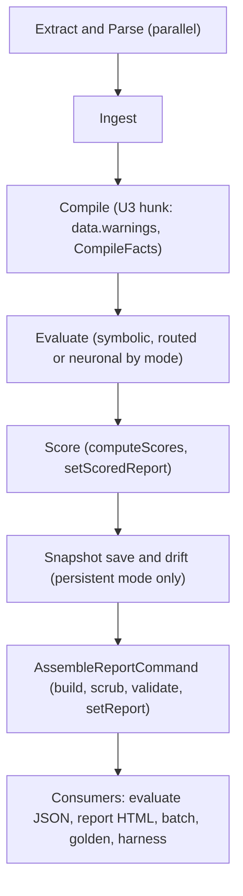
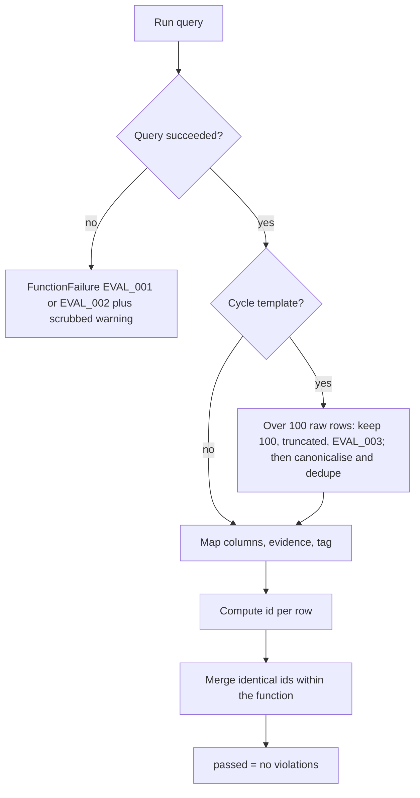
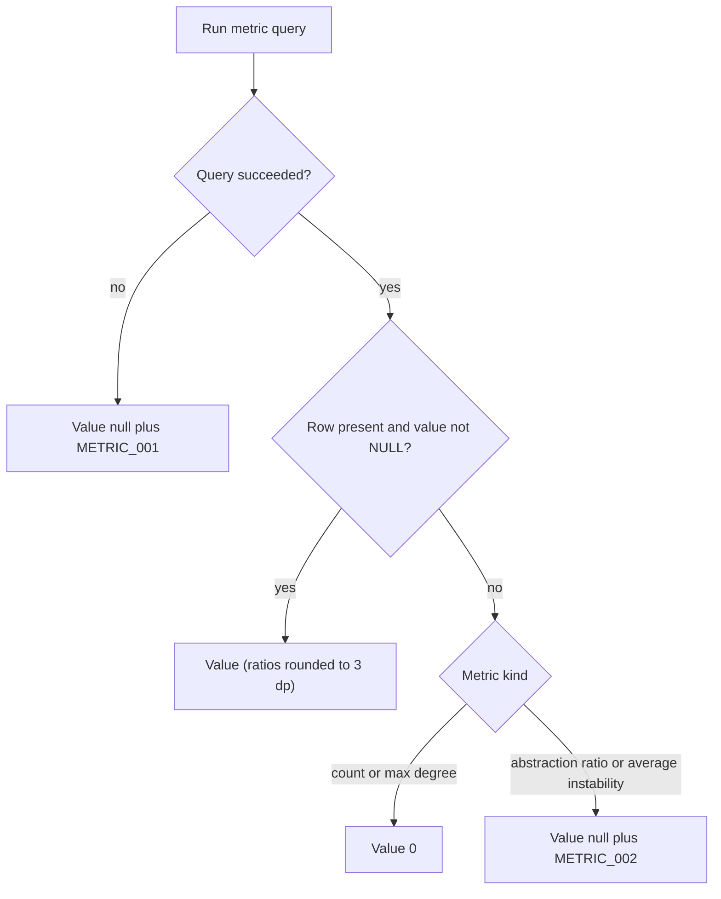
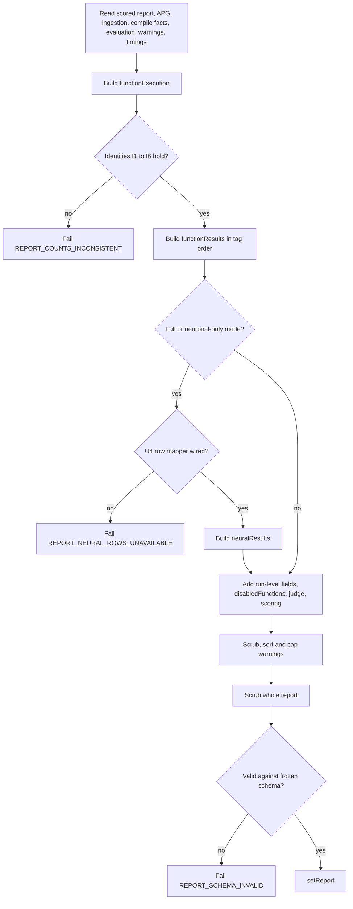

# U3 Evaluation, Scoring and Report — Business Logic Model (v1.2E)

> **Unit**: U3. Components: C4 (`domain-purity`, `domain-state-purity`, three metric filters), C5 (symbolic routing only), C6, C8, S1 `AssembleReportCommand`, C9, C13. **Date**: 2026-10-08.
> **Base**: `v1.2e` after U2 then U1 merge (ADR-015 item 12), bundled C10 patch applied (plan §1.3). Unit branch at Code Generation: `v1.2e-u3-evaluation-scoring-report`.
> **Binding inputs**: U3 plan Q1–Q11 (A throughout); E-1 resolved by ADR-017 item 5; ADR-015/016/017; requirements (amended 2026-10-08); U1/U2 designs and code-generation plans; lane-2 clarifications; U0 code summary; `tests/golden/CHANGES.md`.
> **Repair (2026-10-08)**: §3 (sentinel before de-duplication; failed symbolic half; APG), §6 (drop precedence, row weights, worked check relabelled), §7 (`noJudgeUnits`, `disabledFunctions`, `neuralResults`), §10 and §11 updated; log in `business-rules.md` §14.
> **Rules**: `business-rules.md` (`BR-U3-nn`). **Entities**: `domain-entities.md`. Diagrams use Mermaid `flowchart` with quoted labels only; each has a text alternative.

---

## 1. Scope and order

U3 turns executed queries into identified, located, tagged violations; scores them with renormalised weights in every mode; computes the spec-independent metrics without hiding failures; and assembles one validated, scrubbed, byte-stable report that every consumer reads. The order of work is the R1–R14 commit order of §9.

Out of scope: every other template body (U1), the extractor and ingestion (U2), the neural path (U4), scripts and harness (U5a/U5b).

---

## 2. Pipeline position

Text alternative: the pipeline runs extract and parse in parallel, then ingest, compile, evaluate, score, the optional snapshot and drift commands, and finally the new assemble-report command. Every consumer (JSON output, HTML report, batch, golden suite, U5b harness) reads the report that the assemble-report command writes (BR-U3-50).

---

## 3. Evaluator flow per query (C6)

Input: `CypherQuery` (with `name` = template name, `source`, `functionId`, `dimension`). Output: one `SymbolicFunctionResult` or one `FunctionFailure`.

1. **Execute** with the repository default timeout (BR-U3-03).
2. **On failure**: classify the code (`EVAL_002` if it contains `TransactionTimedOut`, else `EVAL_001`, BR-U3-02); scrub the message; push a `FunctionFailure` and a warning with the same code; produce no result; continue (BR-U3-01).
3. **Cycle handling** (`no-cyclic-deps` only): first, on the **raw** rows, if `records.length > 100` keep the first 100, set `truncated: true`, push `EVAL_003` (BR-U3-08); then run the defensive canonicaliser and de-duplicator on the kept rows (BR-U3-09). The order guarantees that de-duplication can never hide the sentinel.
4. **Map rows** (BR-U3-04): `filePath`, `target`, `line` (as a finite number or absent), `lines`, `isTypeOnly`, `discriminator`, `evidence` (`formatEvidence`), `tag` (`getTemplateTag`), `message`, `type` (BR-U3-14).
5. **Compute the id** of each row (BR-U3-05).
6. **Merge identical ids** within the function: identity from the first row in `ORDER BY`, evidence per-column maximum (BR-U3-07).
7. **Pass rule**: `passed = violations.length === 0` (BR-U3-10).
8. Emit the result with `executionTimeMs`.

Text alternative: a query either fails, which yields a function failure with code EVAL_001 or EVAL_002 and a scrubbed warning, or succeeds. Successful cycle results are first truncated at 100 raw rows with an EVAL_003 warning, then canonicalised and de-duplicated. Every successful result is mapped, given ids, merged by id and passes exactly when it has no violations.

Symbolic routing (C5): symbolic-only mode runs `symbolicQueries` only; hybrid pairs run in neither half and are `skippedByMode`; `filterByMode` keeps `totalCompiled` (BR-U3-15). Full mode keeps the router's symbolic-first rule; a violating symbolic half sets `neuralSkipped: 'symbolic-fail'`, and a symbolic half that failed to run (`EVAL_001`/`EVAL_002`) records the failure and does not run the neural half (BR-U3-53). U4 owns `router.ts` and implements both hunks in U4-K5 (U4 RTR-01); U3 sends the failed-half change as a patch. Independently of the router, the scorer and builder ignore every result of a function listed in `failed`. When `CYCLE_STRATEGY = 'scc'`, FF-S02 is answered from `SymbolicEvalInput.apg` (BR-U3-45).

---

## 4. Templates (C4)

- `domain-purity` (BR-U3-20/21): `File -[IMPORTS|RE_EXPORTS]-> Package`, domain layer, forbidden list; discriminator `relType`; tag `pattern-proxy`.
- `domain-state-purity` (BR-U3-22/23): domain `Class -[FLOWS_TO|CONSTRUCTOR_INJECTS]->` infrastructure Class or Interface; `field = coalesce(e.field, e.parameterName)`; tag `structural`; declared as FF-P06 (BR-U3-24).
- Metric filters (BR-U3-11/12): `dependency-inversion`, `domain-stability`, `abstraction-ratio` return violating rows only; `abstraction-ratio` keys on `'<project>'`.
- Mapping table T-MAP freezes discriminators, evidence and ordering-only columns for all 25 templates (`business-rules.md` §3).

---

## 5. Universal metrics

1. Run the six queries of BR-U3-40 in parallel, each with the repository default timeout. With `CYCLE_STRATEGY = 'scc'`, the cycle count comes from `scc-cycles.ts` over `ScoringInput.apg` (filled from `context.getApgResult()`) instead (BR-U3-45).
2. For each metric: failure → `null` + `METRIC_001` (BR-U3-41); success with an empty or NULL row → the defined value (0 for counts and max degrees; `null` + `METRIC_002` for the two ratios, BR-U3-42); otherwise the value (ratios rounded to three decimals).
3. Return `{metrics, warnings}`; the scoring stage pushes the warnings to the context.

Text alternative: a failed metric query gives null and a METRIC_001 warning. A successful query with a value gives that value. A successful query with no row or a NULL value gives 0 for the counts and maximum degrees, and null with a METRIC_002 warning for the abstraction ratio and the average instability.

**SCC path** (prepared, off by default; BR-U3-45): Tarjan over File→File `IMPORTS|RE_EXPORTS`; one violation per SCC of size ≥ 2 keyed on its smallest member with discriminator `["scc"]`; the representative cycle is the BFS-shortest cycle through the smallest member with lexicographic neighbour order, stored in evidence; the metric is the number of files in such SCCs. The template path honours FF-S02's `excludePaths`; the metric path honours none.

---

## 6. Scoring flow (C8)

1. **Counts by dimension** (BR-U3-31): executed functions per dimension from symbolic and neural results (hybrid once); declared per dimension from `fitnessFunctions`; disabled per dimension from `compiled.disabledFunctions`.
2. **AVR** per executed dimension (BR-U3-32): `violatedWeight` (1 per failed symbolic function, confidence weight per neural `fail`, 0 for `pass`/`warning`), `avr = round3(violatedWeight / functionCount)`.
3. **Renormalise** per AHS variant over its candidate dimensions (BR-U3-33/35): symbolic weights for `ahsDeterministic`; full-mode weights for `ahsCombined`; full-mode weights on `semantic`+`integrity` for `ahsNeuronal`.
4. **Dropped dimensions** among in-mode candidates with the reason precedence `none_declared` → `disabled_by_spec` → `no-judge-units` (from `ScoringInput.noJudgeUnits`) → `execution_failure` (BR-U3-34); no row for them in `perDimensionScores` (BR-U3-39). Results of functions in `failed` are ignored (BR-U3-53).
5. **AHS** = `round3(1 − Σ effectiveWeight × avr)` per variant present in the mode. Rows carry the weights of the verdict-source variant (BR-U3-39).
6. **Verdict** from the mode's source with the shipped thresholds (BR-U3-36).
7. **Errors**: no executed weight → `SCORING_NO_EXECUTED_WEIGHT`; missing full-mode weights → `CONFIG_MISSING_FULL_MODE_WEIGHTS` (BR-U3-37).
8. Write `ScoredReport` (with `scoring` block and `universalMetrics`) via `setScoredReport`.

| Mode | In-mode dimensions | AHS fields | Verdict source |
|---|---|---|---|
| symbolic-only | 5 symbolic | `ahsDeterministic` | `ahsDeterministic` |
| full | 7 | `ahsDeterministic`, `ahsCombined`, `ahsNeuronal` | `ahsCombined` |
| neuronal-only | `semantic`, `integrity` | `ahsNeuronal` | `ahsNeuronal` |

Worked check (golden, post-U1 correct-reference, the `GOLDEN_BASE_U3` value): failing set {FF-C03, FF-CV05}; weights .35/.20/.30/.10/.05; AVR structural 0 (0/3), coupling .167 (1/6), pattern 0 (0/5), solid 0 (0/3), convention .167 (1/6) → `1 − (0 + .20 × .167 + 0 + 0 + .05 × .167) = 1 − (.0334 + .00835) = .958`. The U0 HEAD reproduction (`GOLDEN_BASE` f5fed3f: structural .25, coupling .167, pattern .25, solid 0, convention .333 → `1 − (.0875 + .0334 + .075 + 0 + .01665) = .787`) is the pre-lane-2 value and is not a U3 baseline. FR-15 example: `solid` not executed → effective weights .3888…/.2222…/.3333…/.0555….

---

## 7. Report assembly (S1 + C8 builder)

Reads, in order (BR-U3-50): scored report → APG facts (`parseCoverage`, `importResolution`) → ingestion facts (`graphStats`, `layerAnnotation`) → compiled functions and `CompileFacts` → evaluation results and failures → context warnings → stage timings.

1. **`functionExecution`** (BR-U3-51/52/53): declared, adrDerived, compiled, disabled, dropped, skippedByMode, noJudgeUnits (from `JUDGE_NO_UNITS` warnings' `context.functionId`), executed, failed; assert I1–I6 or fail with `REPORT_COUNTS_INCONSISTENT`.
2. **`functionResults`** (BR-U3-54): one row per executed function, tag-grouped order, `truncated`; results of failed functions excluded.
3. **Run-level fields** (BR-U3-55), `disabledFunctions` (BR-U3-64), `judge` (BR-U3-63), `droppedDimensions`, `scoring`; in full and neuronal-only modes `neuralResults` from U4's `toNeuralResultRows` (BR-U3-65), or `REPORT_NEURAL_ROWS_UNAVAILABLE` when the mapper is not wired.
4. **Warnings** (BR-U3-57): scrub → sort by (stage rank, code, message) → cap 50 per (stage, code) with `REPORT_001`.
5. **`scrubDeep`** on the whole report (BR-U3-58).
6. **`validateReport`** against the embedded frozen schema; fail closed with `REPORT_SCHEMA_INVALID` (BR-U3-59/60).
7. `setReport`.

Text alternative: the assembler reads every stage's output, builds the function-execution counts and fails if the six identities do not hold. It then builds tag-ordered function results; in full and neuronal-only modes it builds the neural result rows with U4's mapper, or fails if the mapper is not wired. It adds the run-level fields (including the disabled functions), scrubs, sorts and caps the warnings, scrubs the whole report, and validates it against the frozen schema, failing if invalid. Only a valid report is written.

---

## 8. Batch, configuration and HTML (C9, C13)

- **Configuration** (BR-U3-80): every `NEO4J_PASSWORD` read goes through `requireEnv`; missing → `CONFIG_MISSING_ENV` before any connection. The lazy driver (U2) means a bad URI surfaces at ingest; the CLI reports that failure scrubbed.
- **Batch** (BR-U3-81/82/83): mode guard first (exit 2 for full or neuronal-only); `buildConfig` builds no provider; each project runs the normal pipeline; each row copies `violations`, `perDimensionScores`, `functionExecution`, `droppedDimensions` from the assembled report; error rows carry a scrubbed message.
- **HTML** (BR-U3-84): judge text from `report.judge`, failures and dropped dimensions listed, Semantic and Integrity AVRs, cards grouped by tag, no second warning merge.

---

## 9. Golden-snapshot changes (prediction relative to the post-lane-2 snapshots)

**Base (`GOLDEN_BASE_U3`)**: the snapshots predicted by U1 `business-logic-model.md` §8.2 after K16 (U2 → U1 merged): AHS correct-reference .958 pass, variant-a .422 hard-block, variant-b .595 soft-block, variant-c .412 hard-block, variant-d .538 soft-block; `functionCount` 23 in every dimension row (results total); 23 `functionResults` rows; `unexecutedFunctionIds []`; warnings = the 26 `SPEC_002` per case (no `EVAL_001`, no `COMPILER_004`); `universalMetrics` as the U0 baseline (cycle a 4, c 2; orphans c 1, d 1). Failing sets (binding, U1): cr {C03, CV05}; a {S01, S02, S04, P02, P04, C01, C03, C06, CV05}; b {S01, P02, P03, P04, C03, C06, SO02, CV05}; c {S01, S02, P02, P03, P04, C03, C04, C06, SO01, SO02, CV05}; d {S01, S04, P02, P04, C01, C03, C06, CV05}.

Method: AVR rounded to three decimals, then AHS rounded to three decimals; symbolic-only, `specs/clean-arch.yaml`. Pass/fail and listed row values are binding; "est." values and AHS are estimates (BR-U3-92). Owning commit = label `U3-Rn` (hash recovered with `git log --grep '^U3-Rn'`); the `CHANGES.md` cause string is the "Cause" cell verbatim.

| Commit | Cause | Expected snapshot change | Pass/fail (binding) | AHS after cr / a / b / c / d | Verdicts |
|---|---|---|---|---|---|
| U3-R1 | Bundled C10 patch (types, optional fields, `intent` kept until R7) | none | unchanged | .958 / .422 / .595 / .412 / .538 | none |
| U3-R2 | FR-12 (FD U3 Q2 A; D-U0-12 pick) | Violation pick gains `line` and `target`. Rows gaining both: FF-S01 (a 2, b 2, c 1, d 3; d's RE_EXPORTS row `TaskUtils.ts` → `InfraFormatters.ts` gets `line 3`), FF-S04 (a 1, d 1), FF-S02 cycle rows (a 2, c 1; `target = cycle[1]`, smallest first-edge line). Other rows unchanged; messages unchanged | unchanged | unchanged | none |
| U3-R3 | FR-35 (FD U3 BR-U3-08/09) | none (no case reaches 101 rows) | unchanged | unchanged | none |
| U3-R4 | FR-14 / BR-U1-40 (FD U3 BR-U3-10/11/12) | FF-P02: cr 2→0, b 2→1 (est.), a/c/d 1 unchanged. FF-C01: cr 2→0, b 1→0, c 1→0, a 2→1 (est.), d 2→1 (est.). FF-C06: cr 1→0; a–d keep 1 row with `filePath '<project>'` (was the ratio text), message unchanged | unchanged (FF-P02, FF-C01, FF-C06 keep their pass/fail in every case) | unchanged | none |
| U3-R5 | FR-11 (FD U3 E-1; ADR-017 item 5; F14) | FF-P01 fails b with 1 row (`src/domain/entities/Task.ts`, target `@nestjs/common`, line 2) and c with 2 rows (lines 2, 3: `@nestjs/common`, `express`). Pattern AVR b, c .6 → .8 | FF-P01 fails b, c; passes cr, a, d | .958 / .422 / .535 / .352 / .538 | none (b soft-block, c hard-block) |
| U3-R6 | FR-21 (FD U3 Q8 A); attributed cross-unit U1 test updates | New FF-P06 `functionResults` row in every case, 0 violations (FLOWS_TO edges in a and c are infrastructure → infrastructure; no domain constructor injects an infrastructure type). `functionCount` 23 → 24 in every dimension row (still the results total until R7). Pattern denominator 5 → 6 | FF-P06 passes ×5 | .958 / .442 / .575 / .392 / .558 | none |
| U3-R7 | FR-15 + FR-32 (FD U3 Q3 A); `intent` removed | `functionCount` becomes per dimension in every case: structural 3, coupling 6, pattern 6, solid 3, convention 6 (sum 24 = executed). `effectiveWeight` = `weight` (all five dimensions execute; not in the pick). `droppedDimensions []` | unchanged | unchanged | none |
| U3-R8 | FR-09 `:File` typing + FR-34 (FD U2 Q16 / U1 Q19) | variant-d `universalMetrics.orphanFileCount` 1 → 0 (U2 G4; the RE_EXPORTS edge now counts). variant-c stays 1 (`GodTask.ts` has no edge). `cyclicDependencyCount` unchanged (fixture cycles have length 2) | unchanged | unchanged | none |
| U3-R9 | FR-13 / FR-14 (FD U3 Q1, Q4, Q7); ADR-016 c | Each case gains one `COMPILER_004` warning naming FF-S03 (style-disabled). Extractor warnings: none expected on the fixtures (U2: `unresolved`, `unsupportedDynamic` = 0); any that appears stops the step for review. `functionResults` order becomes tag-grouped: structural (FF-P06, FF-S01, FF-S04), topological (FF-C01–FF-C06, FF-S02, FF-SO03), pattern-proxy (FF-CV01–FF-CV06, FF-P01–FF-P05, FF-SO01, FF-SO02); values unchanged. Golden runner collapsed (BR-U3-62); `unexecutedFunctionIds []` | unchanged | unchanged | none |
| U3-R10 | FR-14 (FD U3 Q4 A): schema freeze, `validateReport` | none | unchanged | unchanged | none |
| U3-R11 | NFR-05 (FD U3 BR-U3-58) | none (the golden `NEO4J_PASSWORD` passes the BR-U2-39 guard; no secret in any picked field) | unchanged | unchanged | none |
| U3-R12 | D-U0-8 + FR-16 (FD U3 Q9 A) | none (golden does not use batch) | unchanged | unchanged | none |
| U3-R13 | C13 HTML (FD U3 BR-U3-84) | none | unchanged | unchanged | none |
| U3-R14 | FR-35 (FD U3 BR-U3-61): byte-stability test; SCC fallback present, off (Q11) | none | unchanged | unchanged | none |

Non-R commit before R2: the change-log checker grammar for `U3-Rn` (BR-U3-91), no snapshot change.

**Final estimates**: pass .958, hard-block ≈.442, soft-block ≈.575, hard-block ≈.392, soft-block ≈.558. Against `MANIFEST.md` (pass / soft-block / soft-block / hard-block / warning), correct-reference, variant-b and variant-c match, as after U1. Interim values are never quoted as results; the FR-18 re-baseline in Build and Test is the only reported baseline.

**Outside C16**: self-spec and corpus specs gain FF-P06 in their own scripted commits (BR-U3-24); the corpus re-baseline waits for R8 and U1 K6 (BR-U3-93).

---

## 10. Path to results

Each experiment output below depends on the listed rules; if any listed rule is missing, that output cannot be produced or defended.

| Objective / experiment | Output produced downstream (U5b unless stated) | Rules that enable it |
|---|---|---|
| **SO4** golden dataset, 80–120 seeded instances (ADR-017 item 4), P/R/F1 + FP/FN analysis | `baselineMatchKey` matches without false new violations; location rule on `line`/`target`; per-tag P/R/F1 (`prf_by_tag`, FR-25 "per tag", ADR-017 item 6); MO-P01 and MO-DF01 detections; run rejection on failure or truncation | BR-U3-04, 05, 06, 07, 08, 11, 12, 20, 22, 23, 54, 59, 64 (not-applicable via `disabledFunctions`), 66 (U5a can key every template) |
| **SO3** AHS and report (structural/topological rules + Semantic/Integrity judge) | `ahsDeterministic`/`ahsCombined`/`ahsNeuronal`; three-decimal re-scoring and ablation from `scoring`, `effectiveWeight`, `violatedWeight` (FR-26); Integrity counted when passing; tag-grouped results | BR-U3-30–39, 54, 60, 65 (judge probes and aggregation sensitivity read `neuralResults[*].unitResults`) |
| **SO2** APG coverage, latency, data-flow edges | SO2 table from `importResolution` (six fields), `graphStats` by type incl. `FLOWS_TO`, `parseCoverage`, `layerAnnotation`; latency table from `timings` and the two cycle rows; FF-P06 executes the data-flow check | BR-U3-22–24, 40, 44, 45, 55 |
| **SO1** style libraries (clean-architecture, nestjs, layered) | `denominators.csv` per style from declared/compiled/disabled/dropped/skipped/executed; `COMPILER_004` reasons; `droppedDimensions` reasons; FR-20 "100 % executed" against compiled | BR-U3-34, 51, 52, 56, 64 |
| **SO5 / E1** (3 Claude models × 3 spec levels × 2 tasks × 3 runs = 54 projects, ADR-017 item 3) | Schema-valid full-mode reports joined to generation cells via `judge`; replay byte-stability; AHS values beside verdicts | BR-U3-34 (`no-judge-units`), 35, 36, 57, 59, 61, 63, 65 |
| **E7** OSS corpus (5 core + 3–5 added, ADR-017 item 1) | Corpus re-baseline only after `getNum` propagation; metric failures visible (`null` + `METRIC_001`, reject) and empty results defined (`METRIC_002`, keep); FF-P06 declared before the first run; loud missing-password failure | BR-U3-24, 41, 42, 80, 93 |
| All runs (FR-36 harness) | One embedded frozen schema, fail-closed validation, credential-free reports, warnings and batch rows | BR-U3-50, 58, 59, 70 |

Preconditions: U4 merged and its row mapper wired (BR-U3-65) before any full or neuronal-only run; R7 must land before any SO3 or SO5 figure (full and neuronal-only stay unsupported until then, BR-U1-24); R8 must land before any E7 figure; R10 (freeze) must land after R4 (U5b entry condition).

---

## 11. Open items

| # | Item | Owner | Blocking? |
|---|---|---|---|
| 1 | Log the functional-design answers and completion in `aidlc-docs/audit.md`; update `aidlc-state.md`; present the 2-option completion message | stage owner (orchestrator) | no |
| 2 | Record plan §6.3 amendments in the lane-2 clarifications file (component-methods C6/C8, `:885` tag, U1 §3.1/§4.1, BR-U1-17/18/19/27 text), plus the U1 code-generation plan line 508 wording (`INTENT_VIOLATION` is kept, BR-U3-30) | lane-2 record owner | no |
| 3 | U2's plan keeps the full scrub inside `neo4j-repository.ts`; if not exported at U2 merge, the bundled patch moves it to `src/shared/errors/scrub.ts` (BR-U3-58) | U2 code generation / bundled patch reviewer | no |
| 4 | The complete bundled C10 patch is `domain-entities.md` §8 (17 rows; the plan §1.3 table lists a subset). Fields this design adds beyond §1.3: `FunctionExecution.disabled`, `FunctionExecution.noJudgeUnits`, required `FunctionResultRow.truncated`, `scoring.fullModeWeights`, `scoring.verdictSource`, `disabledFunctions`, `neuralResults` (U4 shape), `DroppedReason` `no-judge-units`, `ScoredReport` Omit entries. U3-owned (not in the patch): `ScoringInput.fullModeWeights`/`fitnessFunctions`/`compiled`/`noJudgeUnits`/`apg`, `SymbolicEvalInput.apg`. The `intent` removal is in R7, not in the patch, so R1 stays compile-clean. U4 applies the identical patch if U4-K1 comes first | bundled patch reviewer, U4 | no |
| 5 | Re-check the server-side Neo4j 5 timeout status string (`Neo.ClientError.Transaction.TransactionTimedOut`) at Code Generation (BR-U3-02) | U3 code generation | no |
| 6 | R4 row counts marked "est." (b FF-P02, a/d FF-C01) are confirmed at Gate G | U3 code generation | no |
| 7 | U4's C9 hunk `cli.ts:394-406` overlaps the BR-U3-80 password site; apply U4's patch after R12 | U3/U4 | no |
| 8 | Latency rows and the `CYCLE_STRATEGY` decision | Build and Test | no |
| 9 | U4: `JUDGE_NO_UNITS` warnings carry `context.functionId`; U4-K5 takes the router patch "no neural half after a failed symbolic half" (BR-U3-53); U4 DE §4.8 `NeuralResultRow` written and equal to `domain-entities.md` §3.6 before U3-R10 (else the schema follows U4 and the difference is logged) | U4 | no (U3 builder fails closed until wired) |
| 10 | U5a: add `targetName`, `implementation`, `useCase`, `scc` to `LocationRule.discriminator`; cross-unit test of BR-U3-66 by the second unit to merge | U5a | no for U3; blocking for the U5a freeze gate |
| 11 | U5b: read `disabledFunctions`, `neuralResults[*].unitResults`/`selection`; I2 with `noJudgeUnits`; 25 templates (4/8/13) in BR-U5b-52 | U5b | no for U3 |
| 12 | Lane-3 record owner: align U4 BLM §2.1 item 4 with BR-U3-53 / U4 RTR-01 | lane-3 record owner | no |

No genuine conflict or uncovered requirement-text change remains: E-1 is closed by ADR-017 item 5; the 2026-10-08 repair (`business-rules.md` §14) adopts U4's own OI-U4-8 proposal and changes no requirement text; and the FR-11 aliasing, FR-11 third clause, FR-13 stub, FR-21 line clause and FR-35 durations are recorded as interpretations (`business-rules.md` §1.1).
