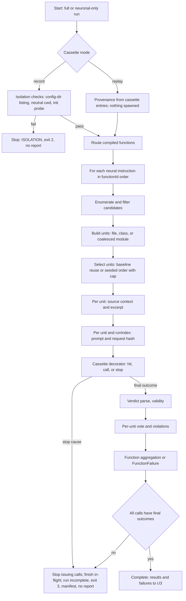
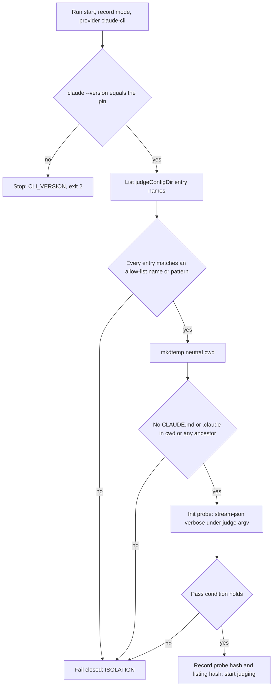
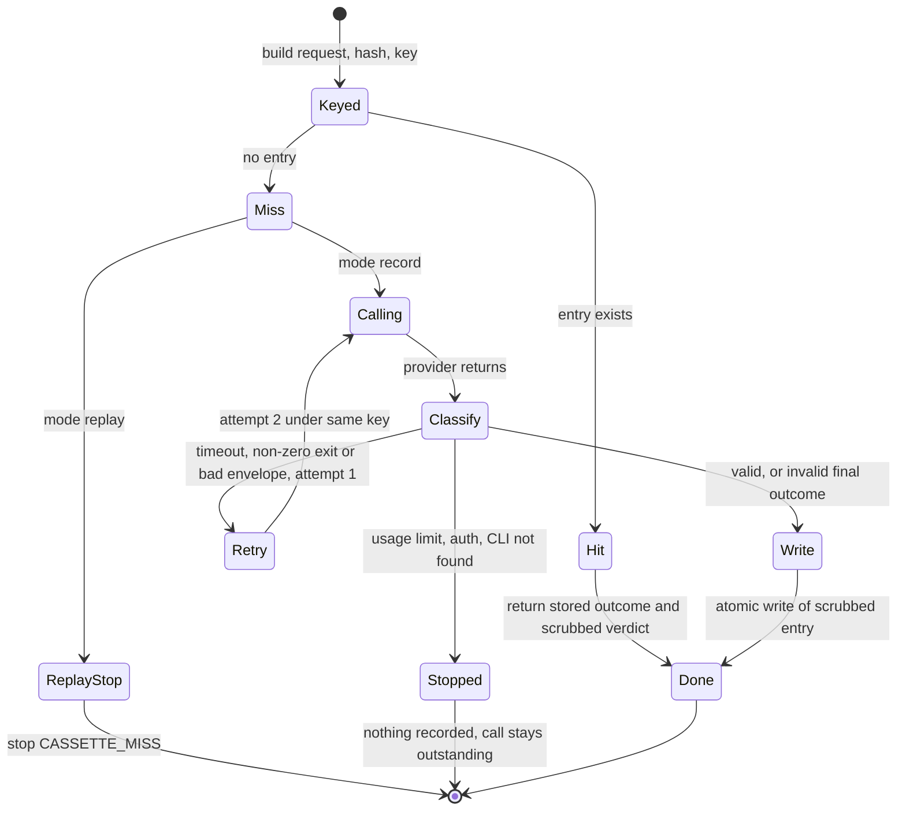

# Business Logic Model — v1.2E U4 Neural path

> **Unit**: U4 (C7, C14, C5, C9 provider hunks) · **Date**: 2026-10-08 · **Base**: `v1.2e` @ `8c3d6df` (source lines as at `ee32a1f`)
> **Binding inputs**: plan answers Q1–Q19, ADR-015/016/017, the amended requirements, U1/U2 designs and code plans, U0 contracts. Rules cited as `BR-U4-*` are in `business-rules.md`; shapes in `domain-entities.md`. Values marked **[PROBE]** are fixed by the Part 2 probe before code generation (OI-U4-1). All were fixed on 2026-10-08 and written into `business-rules.md` and `domain-entities.md` at U4 Step 30 (OI-U4-1 closed).
> **Repair 2026-10-08**: §2.1 step 4 aligned with BR-U3-15/53; §4 root rules for globs without a literal directory segment (ADR-017 item 4) and `#<layer>` ids; §5 persisted selection (OI-U4-8); §6 CLI version check (BR-U4-ISO-09); §8 note and §11 sensitivity check at unit level.

---

## 1. Position in the pipeline

The neural path runs only in `full` and `neuronal-only` mode. Symbolic-only runs (the golden suite, `golden-runner.ts:56`, `llmConfig: undefined`) never build a provider and never enter C7; their only U4-visible output is `judge = { provider: 'none', model: 'none', runsPerUnit: 0 }` (BR-U4-CAS-10).

| Step | Owner | Input | Output |
|---|---|---|---|
| Parse CLI options | C9 `llm-options.ts` (U4), wired in `cli.ts` by U3's patch application | argv, `GEMINI_API_KEY` only | `LLMProviderConfig`, `NeuronalRunOptions` |
| Build provider | C7 `createLLMProvider` | config | `CassetteLLMProvider(inner)`; `inner` = `ClaudeCliProvider` / `GeminiProvider` / `MockLLMProvider` |
| Provenance and isolation | C7 `judgeProvenanceOf`, C14 probe | provider, mode | `JudgeProvenance`; isolation pass or stop |
| Route | C5 `routeAndEvaluate` | compiled functions, mode | symbolic results, neural instructions, `failures` |
| Judge | C7 `evaluateNeuronal` | instructions, graph, `projectRoot`, options | `NeuronalEvalOutput` + `RunCompleteness` |
| Score, report | U3 | `EvaluationResults`, `toNeuralResultRows(output)` (C7, DE §4.8) | report with `neuralResults[]` (only when the run is complete; OI-U4-8) |

---

## 2. Run flow (one project, one run)



Text alternative: a full or neuronal-only run first branches on the cassette mode. In record mode the isolation checks run (config-dir listing, neutral working directory, init probe); a failure stops the run with exit code 2 and no report. In replay mode provenance is read from the cassette entries and no process is spawned. The router then hands each neural instruction, in function-id order, to the critic, which enumerates and filters candidates, builds file, class or coalesced-module units, selects units (baseline reuse on a variant, otherwise seeded order with the cap), assembles each unit's source context and excerpt, and builds one prompt and request hash per unit and run index. The cassette decorator either answers from a cassette, calls the provider, or meets a stop cause. A stop cause halts new calls, lets in-flight calls finish, and leaves the run incomplete (exit 3, manifest, no report). Otherwise each final outcome is parsed and classified, units are voted, violations formed, and the function aggregated or turned into a failure. Only when every call has a final outcome is the run complete and passed to U3.

### 2.1 Steps in order

1. **Options** (BR-U4-OPS-01, BR-U4-ISO-01): defaults of `domain-entities.md` §5.5; provider default `claude-cli`; Gemini requires `--llm-model` and `GEMINI_API_KEY`; no other key is read.
2. **Provider construction**: every real provider is wrapped once per run in `CassetteLLMProvider(inner, mode, dir, omitPrompt)` (BR-U4-CAS-05). Mock is wrapped too in unit tests that exercise cassettes.
3. **Provenance** (BR-U4-CAS-10): record mode: `claude --version` checked against `PINNED_CLI_VERSION` (BR-U4-ISO-09; drift → stop `CLI_VERSION`, exit 2), isolation checks (§6), `describe()`; replay mode: read from the entries used, after the run.
4. **Routing** (BR-U4-RTR-01..03, aligned with BR-U3-15 and BR-U3-53): symbolic-only runs `symbolicQueries` only; neuronal-only runs `neuronalInstructions` only; in both, hybrid pairs run in neither half and U3 counts them as `skippedByMode`, and `totalCompiled` is not overridden. Full mode runs both; the neural half of a hybrid pair is skipped when its symbolic half reports violations (`neuralSkipped: 'symbolic-fail'`, U3 Q1). Symbolic `failures` are forwarded. U4 is the single owner of `router.ts` (RTR-01).
5. **Per instruction** (function-id order): candidates (§3), units (§4 for modules), selection (§5), context (BR-U4-CTX-*), calls (§7), aggregation (BR-U4-AGG-*), violations (BR-U4-VIO-*).
6. **Completeness** (BR-U4-AGG-03): if any selected (unit, runIndex) has no final outcome, the run is incomplete; `NeuronalEvalOutput` is returned with `completeness.status = 'incomplete'` and the pipeline writes no report.

---

## 3. Candidate enumeration and filter (BR-U4-SEL-01)

For `judgeUnit = 'file'` or `'module'` the candidates start from the File nodes of the APG; for `'class'`, from Class nodes contained in candidate files.

```
for each File node f, sorted by filePath:
  if f.layer is null                          → exclusions.unlayered++, uncovered += f; continue
  if matches(instruction.excludePaths, f)     → exclusions['exclude-paths']++; continue      (globToRegex, BR-U1-32)
  if f.isBarrel                               → exclusions.barrel++; continue                (U2)
  if path has a segment __tests__ | __mocks__ | test | tests | e2e
                                              → exclusions['test-path']++; continue
  if basename ends with .e2e-spec.ts          → exclusions['e2e-spec']++; continue
  if path matches **/generated/** or **/prisma/client/**
                                              → exclusions['generated-path']++; continue
  if first 10 lines contain "@generated" or "DO NOT EDIT"
                                              → exclusions['generated-marker']++; continue
  candidates += f
```

The first-10-lines check reads the file under `projectRoot` (path-checked, BR-U4-CTX-02). Exclusion counts are reported per function (`candidateExclusions`).

---

## 4. Module coalescing (Q7 A, BR-U4-SEL-03)

### 4.1 Mapped roots (BR-U4-SEL-03; ADR-017 item 4)

A segment is **literal** when it contains none of `*`, `?`, `[`, `{`. The last segment of a glob is a **directory segment** only when the glob ends in `/**` or `/`; otherwise it is a file-name pattern. Each glob of a layer has one of three shapes:

| Shape | Example | Roots |
|---|---|---|
| P: literal directory prefix | `src/domain/**` | the prefix directory (`src/domain`) |
| S: wildcard, then a literal directory segment | `**/domain/**`, `src/**/domain/**` | every concrete project directory whose path matches the glob up to and including the first literal directory segment after a wildcard (each `.../domain` directory) |
| F: no literal directory segment | `**/*.entity.ts`, `**/*` | each matching file's own parent directory, for that file only (a **file root**: it never collects files of other directories and nothing coalesces above it) |

**Root of a file** of layer L: among the P and S roots of L's globs that are ancestors of the file, the longest path; if there is none (the file is matched by an F glob only), its own parent directory as a file root. A file matched by several globs of L therefore takes the longest P/S ancestor root, and its own directory only when no P/S root contains it. Layer assignment itself (which layer a file belongs to) is U1/U2's annotation (`File.layer`), not decided here.

**Module ids**: the settled directory. When modules of two or more layers settle in the same directory (possible with F roots in NestJS feature folders), every module settled there gets the id `<dir>#<layer>`; ids remain unique and deterministic.

### 4.2 Coalescing

```
for each layer L, for each root R of L (sorted):
  files(R) = candidate files of layer L whose root is R
  pending: map dir → list of files, initialised with each file under its own directory
  for dir in all directories under R that hold pending files, deepest first (ties: lexicographic):
     if dir == R: break
     if |pending[dir]| < 2:
        pending[parent(dir)] += pending[dir]; delete pending[dir]      // pass up
     // else: dir keeps its files as one module (absorbs nothing further from above)
  for each dir with pending files (including R):
     emit module unit { id: dir, filePaths: sorted(pending[dir]), singleFile: |pending[dir]| == 1 }
```

Coalescing never crosses a layer (each root is processed with its own layer's files only) and never passes above `R`; for a file root `R` is the file's directory, so the loop emits the files directly in `R` as one module. Every candidate file belongs to exactly one module. A one-file module is judged with its incoming and outgoing context and counted in `singleFileModules`.

Worked cases (fixtures, `specs/clean-arch.yaml:21-39`, globs `src/<layer>/**`, roots `src/<layer>`):

| Fixture | Layer | Leaf directories (files) | Modules |
|---|---|---|---|
| variant-a | application | `application/use-cases` (1) | `src/application` (1 file, one-file module: `CreateTaskUseCase.ts` passes up to the root) |
| variant-a | infrastructure | `infrastructure/repositories` (≥ 2), `infrastructure/config` (1) | `src/infrastructure/repositories`; `src/infrastructure` (one-file: `config/InfraConfig.ts`) |
| variant-d | each | seven directories of 1 file | files pass up to their layer root; a root with ≥ 2 settled files is one multi-file module, a root with 1 is a one-file module |

NestJS-style tree under the ADR-017 item 4 remap (domain globs `**/domain/**` and `**/*.entity.ts`; unit test fixture of BR-U4-SEL-03, not a corpus project):

| Files of the domain layer | Root | Domain module |
|---|---|---|
| `src/users/user.entity.ts` | `src/users` (F, file root) | `src/users` (one-file) |
| `src/orders/order.entity.ts`, `src/orders/order-line.entity.ts` | `src/orders` (F) | `src/orders` (two files) |
| `src/billing/domain/invoice.ts`, `src/billing/domain/money.ts` | `src/billing/domain` (S) | `src/billing/domain` |
| `src/billing/domain/rules/tax.entity.ts` (matched by both globs) | `src/billing/domain` (S, longest P/S ancestor) | coalesces into `src/billing/domain` (three files) |

`users.service.ts`, `users.controller.ts` and `orders.service.ts` sit in the same feature folders but belong to other layers (or are unlayered and uncovered); they never enter a domain module. If an application glob such as `**/*.service.ts` also roots at `src/users`, the two modules there become `src/users#domain` and `src/users#application`.

The exact per-fixture module lists are produced by the unit fixture test of BR-U4-SEL-03 and committed as expected output; the table above is the design-time reading of the measured counts (plan §3).

---

## 5. Selection (Q6 A, BR-U4-SEL-04..07)

```
rank(u) = sha256_hex(seed + "\u0000" + u.id)
if baseline selection B exists for this function:                       // variant run
   selected = { u in variant units : u.id in B.selectedUnitIds }
   added    = { u in variant units : u.id not in B.candidateUnitIds }    // judged in addition, origin 'addedByVariant'
   removed  = B.selectedUnitIds \ ids(variant units)                     // reported only
   units    = sorted_by_id(selected ∪ added)
   capped   = |variant units| - |units|
elif seededList non-empty (development only):
   units = seededList ∩ ids first (in seededList order), then seeded order below, until cap
else:
   queues = for each layer (lexicographic), its units sorted by rank
   picked = []
   while |picked| < cap and any queue non-empty:
       for each layer queue in order: if non-empty and |picked| < cap: picked += pop(queue)
   units  = sorted_by_id(picked); capped = |all units| - |units|
```

The judged set is iterated in `unitId` order. `selection` (`source` = `'own'` or `'baseline'`, candidate ids and selected ids) is written into every result and persisted as `neuralResults[].selection` (OI-U4-8; the report, or the sidecar fallback), so a baseline run supplies its variants through `--judge-baseline-report`, which reads that row shape from either file. A baseline file without a row for a function the variant judges is a configuration error (`LLM_BASELINE_SELECTION_MISSING`).

---

## 6. Judge isolation (Q1 A, BR-U4-ISO-*), record mode only



Text alternative: at the start of a record-mode run with the Claude CLI provider (after the version check of BR-U4-ISO-09), the entry names of the judge config directory are listed and matched against the frozen allow-list of exact names and state-path patterns; any entry matched by none fails closed. A fresh neutral working directory is created and it and all its ancestors are checked for a `CLAUDE.md` file or `.claude` directory; any hit fails closed. A stream-json init probe then runs under the judge argv; if its pass condition does not hold, the run fails closed. Otherwise the probe and listing hashes are recorded and judging starts.

Gemini and Mock runs skip §6 (no child process). Replay runs skip §6 entirely (Q16 A).

---

## 7. Cassette decorator state machine (Q3 A, Q15 A; BR-U4-CAS-*)



Text alternative: the decorator builds the request, hashes it and forms the key. If an entry exists it returns the stored outcome and scrubbed verdict. On a miss in replay mode it stops with `CASSETTE_MISS`. On a miss in record mode it calls the provider and classifies the result: a timeout, non-zero exit or bad envelope on the first attempt triggers one retry under the same key; a usage-limit, auth or CLI-not-found result stops the run without recording, leaving the call outstanding; any valid result or invalid final outcome (including the failed second attempt) is scrubbed and written atomically, then returned.

### 7.1 Record-time processing of a final outcome

1. Keep the unscrubbed stdout in memory only.
2. Parse the envelope (CLI) and check the actual model (BR-U4-VRD-07) → `MODEL_MISMATCH` or continue.
3. Parse the verdict from the structured field, else from `result` text (BR-U4-VRD-02) → `PARSE_FAILURE` / `MISSING_CONFIDENCE` or a `CriticVerdict`.
4. `entry.response = scrubDeep(stdout)`, `entry.parsedVerdict = scrubDeep(verdict)`; write.
5. Return the **stored** (scrubbed) verdict to the critic, so record and replay feed identical data into aggregation (BR-U4-CAS-07).

### 7.2 Concurrency and the stop flow (Q15 A)

- One pool of `maxConcurrency = 3` per run over all (function, unit, runIndex) calls, issued in (functionId, unitId, runIndex) order. Results are stored by key and assembled in unit and run order, never in completion order.
- A stop cause (`USAGE_LIMIT`, `AUTH`, `CLI_NOT_FOUND`, `CASSETTE_MISS`) sets a run-wide flag: no new call is issued; in-flight calls complete and their final outcomes are written; then the critic returns `incomplete` with the outstanding list. The pipeline writes the `RunManifest`, writes no report, and exits 3.
- **Resume**: rerunning the same command in `record` mode turns every completed call into a hit and issues only the outstanding ones. Because the key holds no ordinal, resumption and retries never shift other keys (BR-U4-CAS-02).

---

## 8. Aggregation (Q4 A, Q5 A; BR-U4-AGG-*)

```
per run r of unit u:   valid ⇔ outcome.kind == 'valid'; vote(r) = verdict.pass ? 'pass' : 'fail'
per unit u:
   V = valid runs
   if |V| < 2: u invalid (INSUFFICIENT_VALID_RUNS, warning)
   elif fails(V) > |V|/2: verdict fail;  conf = mean(conf of fail runs)
   elif passes(V) > |V|/2: verdict pass; conf = mean(conf of pass runs)
   else: verdict warning (1-1 on 2 valid); conf = mean(conf of V)
   stddev = population stddev of conf over V; unstable ⇔ stddev > 0.15
per function f:
   S = selected units; U = valid units
   if |U| < |S|/2  (strictly fewer than half): FunctionFailure INSUFFICIENT_VALID_RUNS, no result
   elif |S| == 0: no result; warning JUDGE_NO_UNITS (OI-U4-4)
   F = failing units of U; P = passing units of U
   if |F| > |U|/2: verdict fail;  carriers = F
   elif |F| > 0 or any warning in U: verdict warning; carriers = U
   else: verdict pass; carriers = P
   confidence = mean over carriers of unit conf;  stddev = population stddev of those
   flaggedUnstable = |{c in carriers : unstable}| > |carriers|/2
```

`|U| < |S|/2` is evaluated on integers as `2·|U| < |S|`. The weight of a `fail` (U3 `getConfidenceWeight`) therefore depends only on the failing units; adding passing units changes it only by changing whether the majority holds (BR-U4-AGG-04 test).

Consequence for single seeded faults: on a project with n valid units, one failing unit gives a function `fail` only when n = 1; otherwise `warning`. Detection of a single seed (sensitivity check BR-U4-SEN-01, judge probes BR-U5b-23) is therefore read at **unit** level from `unitResults` (failing unit covering the seeded file), never from the function verdict.

---

## 9. Violations (Q8 A; BR-U4-VIO-*)

```
for each valid failing unit u:
   R = valid runs of u with pass == false
   for each run in R: paths(run) = set of normalised, member-validated filePaths of its violations
   for each filePath p with |{run in R : p in paths(run)}| > |valid runs of u| / 2:
       message = message of the run citing p with the highest confidence (tie: lowest runIndex)
       emit Violation { id: computeViolationId({ functionId, filePath: p, discriminator: [u.id] }),
                        type: typeOf(instruction), dimension: instruction.dimension,
                        severity: instruction.severity, route: 'neuronal', filePath: p, message }
```

Function `violations` = concatenation over failing units in `unitId` order, then `filePath` order. They are listed whatever the function verdict (a `warning` function still lists the violations of its failing units).

---

## 10. Corpus rubric step (Q13 A; BR-U4-RUB-03)

```
scripts/corpus-rubric-u4.ts <corpus/specs/*.yaml>
  for each spec: for FF-N01 and FF-N02 entries:
     set name and semantic_criteria to the frozen values (read from the same source module as the presets)
  write back with the existing YAML formatter; print per-project edits for Docs/corpus.md
  assert afterwards: no corpus spec (dev-nest included) contains srp-semantic, layering-intent,
                     or the old SRP rubric text under integrity
```

Run in Build and Test corpus preparation after U1's copy, FR-22 and CV02 commits, as its own commit `FR-22 (U4 rubric)`, before the first corpus run.

---

## 11. Sensitivity check flow (BR-U4-SEN-01)

```
for function f in {FF-N02 with seed S, FF-N01 with seed I}:
   base   = copy of correct-reference (dev split), uncapped
   seeded = base + seed (never an MO-X02/MO-X03 construction)
   run full mode on both, cassettes replayable, same evaluator spec
   u      = unit of f on seeded covering the seeded file(s)
   fired  = u.verdict == 'fail' and u has a violation on a seeded file
            and no unit of f on base covering those files (or u's pre-existing files) has verdict 'fail'
   record fired, unit ids, verdicts, violation paths, function verdict (information), rubric hash
   if not fired: revise rubric (dev set only, logged) and repeat, or exclude f (ADR-016 b)
```

## 12. Content validation

Mermaid blocks use `flowchart TD`/`LR` and `stateDiagram-v2` with quoted labels, no parentheses inside unquoted labels and no reserved words as node ids; each has a text alternative directly below it. Pseudocode blocks are plain fenced text.
