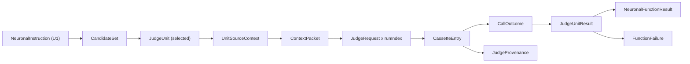

# Domain Entities — v1.2E U4 Neural path

> **Unit**: U4 (C7 LLM critic, C14 Claude CLI provider, C5 router, C9 provider-selection hunks) · **Date**: 2026-10-08 · **Base**: `v1.2e` @ `8c3d6df` (source lines as at `ee32a1f` unless stated)
> **Binding inputs**: plan answers Q1–Q19 (`aidlc-docs/construction/plans/v1.2E-u4-neural-path-functional-design-plan.md`, answered under standing approval, escalations resolved by ADR-017), ADR-015, ADR-016 b, ADR-017 item 9, requirements FR-12, 13, 22, 23, 31, 32, 33, NFR-08 (amended 2026-10-08), U1 BR-U1-22..26 and BR-U1-32, U2 `isBarrel` and `DEFAULT_EXCLUDE_PATTERNS`, U0 contracts (`src/shared/**` at `8c3d6df`).
> **Companion files**: rules in `business-rules.md` (ids `BR-U4-*`), algorithms in `business-logic-model.md`.
> **Markers**: **NEW** = new type; **CHANGED** = existing type with a change; **C10 patch** = goes into the one bundled, reviewed C10 patch shared with U3 (plan §1.3); **[PROBE]** = a value fixed by the Part 2 probe before code generation (open item OI-U4-1 in `business-rules.md` §17); **all resolved at U4 Step 30 (2026-10-08)**: each former mark now names the probe value and its fixture in `tests/fixtures/claude-cli/`. Types are shapes, not code; code generation may rename private helpers but not exported names.
> **Repair 2026-10-08**: every field this unit adds to a C10 type is optional in the C10 patch; C7 is the only producer of those types and always sets the fields (asserted by tests), so U3 and other readers are unaffected until they opt in. New: `NeuralResultRow` (§4.8, OI-U4-8), `JudgeProvenance.seededList`, `DroppedReason` member, stop cause `CLI_VERSION`, `selection.source`, `#<layer>` module ids, `assembleUnitSource` export confirmed.

---

## 1. Entity map

| Entity | Kind | File | Status | Rules |
|---|---|---|---|---|
| `JudgeUnit` | value object | `src/llm-critic/judge-unit-selector.ts` | NEW (shape from `component-methods.md:1124-1130`, fields added) | SEL |
| `CandidateSet` | value object | same | NEW | SEL |
| `ExclusionReason` | enum | `src/shared/types/evaluation.ts` | NEW, C10 patch | SEL-01 |
| `UnitSelectionRule` | value object | `judge-unit-selector.ts` | CHANGED vs design (`seed` is a string) | SEL-04..06 |
| `BaselineSelection` | value object | `src/shared/types/evaluation.ts` | NEW, C10 patch | SEL-07 |
| `NeuralResultRow` | report row | `src/shared/types/evaluation.ts` (type), mapper `toNeuralResultRows` in `src/llm-critic/neural-result-rows.ts` | NEW, C10 patch (type); report field `neuralResults[]` (OI-U4-8 decided by BR-U3-65) | SEL-05..07, AGG-04, OI-U4-8 |
| `DroppedReason` | enum | `src/shared/types/evaluation.ts:186` | CHANGED, C10 patch (`'no-judge-units'`) | AGG-09 |
| `UnitSourceContext` | value object | `src/llm-critic/source-context.ts` | NEW (design shape plus `excerptTruncated`, `filesOmitted`) | CTX |
| `GraphExcerpt` | value object | `source-context.ts` | NEW | CTX-04 |
| `ContextPacket` | value object | `src/llm-critic/types.ts:49-55` | CHANGED | CTX-06 |
| `JudgeRequest` | value object | `src/llm-critic/cassette-provider.ts` | NEW | CAS-01 |
| `LLMCallContext` | value object | `src/shared/interfaces/llm-provider.ts` | NEW, C10 patch | CAS-02 |
| `CassetteEntry` | record | `src/llm-critic/types.ts:40-47` | CHANGED (supersedes `component-methods.md:1196-1213`) | CAS |
| `CallOutcome` / `InvalidCause` / `StopCause` | enums | `src/shared/types/evaluation.ts` (`InvalidCause`), `types.ts` (rest) | NEW (`InvalidCause` in C10 patch) | CAS-04, AGG-02 |
| `CriticVerdict` / `CriticViolation` | value objects | `src/llm-critic/types.ts:27-38` | EXISTING shape, stricter parse | VRD |
| `VERDICT_JSON_SCHEMA` | constant | `src/llm-critic/verdict-schema.ts` (inside C7 files) | NEW | VRD-01 |
| `ClaudeCliEnvelope` | value object | `src/llm-critic/claude-cli-provider.ts` | CHANGED vs design (model-usage field) | ISO, VRD-02, VRD-07 |
| `ClaudeCliArgv` | value object | same | NEW | ISO-02 |
| `IsolationProbeResult` | record | same | NEW | ISO-05..07 |
| `NeuronalRunOptions` | value object | `src/llm-critic/types.ts` | CHANGED (defaults frozen) | §5.2 table |
| `LLMCliOptions` | value object | `src/cli/llm-options.ts` | NEW | OPS, ISO |
| `RunCompleteness` / `RunManifest` | record | `src/llm-critic/types.ts` | NEW | AGG-03, OPS-03 |
| `JudgeUnitResult` | record | `src/shared/types/evaluation.ts:108-116` | CHANGED, C10 patch | AGG |
| `NeuronalFunctionResult` | record | `evaluation.ts:118-134` | CHANGED, C10 patch | AGG, VIO |
| `EvaluationResults` | record | `evaluation.ts:136-139` | CHANGED, C10 patch (`failures`) | AGG-06 |
| `FunctionFailure` | record | `evaluation.ts:160-165` | EXISTING | AGG-06 |
| `JudgeProvenance` | record | `evaluation.ts:217-220` | CHANGED, C10 patch | ISO-06, ISO-09, CAS-10, SEL-06 |
| Rubric entries FF-N01, FF-N02 | spec data | five YAMLs, every FF-N01/FF-N02 entry of `src/spec-parser/template-registry.ts` (`CLEAN_ARCH_FUNCTIONS`, `LAYERED_FUNCTIONS`) | CHANGED | RUB |

Relationships (text): a **neuronal instruction** (from U1) selects a **candidate set** of **judge units**; each selected unit gets one **unit source context**, which with the instruction yields one **context packet** and one **judge request** per run index; each request maps to one **cassette entry** through its key; the entries' **call outcomes** give **runs**, the runs give a **judge unit result**, and the unit results give one **neuronal function result** or one **function failure**. The run as a whole has one **run completeness** value and one **judge provenance**.



Text alternative: instruction → candidate set → selected judge unit → unit source context → context packet → one judge request per run index → cassette entry → call outcome → judge unit result → either a neuronal function result or a function failure; cassette entries also feed the run's judge provenance.

---

## 2. Units and selection

### 2.1 `JudgeUnit` (NEW)

```typescript
export interface JudgeUnit {
  readonly id: string;                    // file: root-relative POSIX path; class: `${className}@${filePath}`;
                                          // module: root-relative POSIX directory where the files settled (BR-U4-SEL-03),
                                          //   `${dir}#${layer}` when modules of several layers settle in one directory
  readonly kind: JudgeUnitKind;           // 'file' | 'class' | 'module' (C10 enums.ts:48)
  readonly layer: string;                 // never undefined: unlayered files are not candidates (BR-U4-SEL-01)
  readonly filePaths: readonly string[];  // sorted, root-relative POSIX; 1 for file/class, ≥ 1 for module
  readonly sizeTokens: number;            // ceil(total chars / 4); informational (minSizeTokens = 0)
  readonly singleFile: boolean;           // module units only: true for a one-file module (BR-U4-SEL-03)
}
```

Invariants: `filePaths` are inside `projectRoot`; for `kind = 'module'` every candidate file of the function belongs to exactly one unit; ids are unique within a candidate set.

### 2.2 `ExclusionReason` (NEW, C10 patch) and `CandidateSet` (NEW)

```typescript
export type ExclusionReason =
  | 'unlayered' | 'exclude-paths' | 'barrel' | 'test-path' | 'e2e-spec' | 'generated-path' | 'generated-marker';

export interface CandidateSet {
  readonly kind: JudgeUnitKind;
  readonly units: readonly JudgeUnit[];                                    // sorted by id
  readonly exclusions: Readonly<Record<ExclusionReason, number>>;          // every key present, 0 when none
  readonly uncoveredFiles: readonly string[];                              // the 'unlayered' files, sorted
}
```

The `DEFAULT_EXCLUDE_PATTERNS` (`node_modules`, `dist`, `build`, `*.d.ts`, `*.spec.ts`, `*.test.ts`) never reach the APG, so they have no reason code. Reasons are tested in the order listed; a file is counted under the first reason that applies.

### 2.3 `UnitSelectionRule` (CHANGED vs `component-methods.md:1132-1138`)

```typescript
export interface UnitSelectionRule {
  readonly cap: number;                          // unitCap, default 20
  readonly seed: string;                         // selectionSeed, default "daedalus-v1.2E-judge" (was number in the design)
  readonly minSizeTokens: number;                // 0, declared (FR-33 "size")
  readonly seededList: readonly string[];        // default []; development use only (BR-U4-SEL-06)
  readonly baseline?: BaselineSelection;         // present on a variant run (BR-U4-SEL-07)
}
```

`layers` is removed from the rule: every layered candidate is eligible and layer coverage is achieved by the round-robin (BR-U4-SEL-04).

### 2.4 `BaselineSelection` (NEW, C10 patch; persisted in the baseline report by U3)

```typescript
export interface BaselineSelection {
  readonly functionId: FunctionId;
  readonly candidateUnitIds: readonly string[];  // all candidate ids of the baseline tree, sorted
  readonly selectedUnitIds: readonly string[];   // the baseline selection, sorted
  readonly treeSha?: string;                     // baseline tree id when known (U5a/U5b), for audit only
  readonly source?: 'own' | 'baseline';          // how the run holding this value selected (BR-U4-SEL-07); always set by C7
}
```

A variant result records `addedByVariant` (variant unit ids absent from `candidateUnitIds`) and `removedByVariant` (selected ids absent from the variant's candidate set) per function (§4.2).

---

## 3. Context and request

### 3.1 `UnitSourceContext` (NEW; design shape `component-methods.md:1170-1178` plus fields)

```typescript
export interface UnitSourceContext {
  readonly unitId: string;
  readonly source: string;                // fenced file blocks (BR-U4-CTX-05), within the source budget
  readonly signatures?: string;           // module units: exported signatures of every member file
  readonly incoming: readonly string[];   // module units: root-relative files outside the module importing into it, sorted
  readonly outgoing: readonly string[];   // module units: files or package names outside the module it imports, sorted
  readonly subgraphExcerpt: string;       // canonical JSON of GraphExcerpt (§3.2), within its budget
  readonly truncated: boolean;            // any file body cut or omitted
  readonly filesOmitted: readonly string[]; // module units: member files whose body did not fit, sorted
  readonly excerptTruncated: boolean;     // maxNodes or budget cut the excerpt
}
```

**Export (confirmed for U5b, BR-U5b-35, BR-U5b-55; `component-methods.md:1184`)**: `source-context.ts` exports

```typescript
export async function assembleUnitSource(
  unit: JudgeUnit, projectRoot: string, graph: GraphRepository, budget: TokenBudget, maxNodes?: number,
): Promise<DomainResult<UnitSourceContext>>;
```

with exactly the §3.1 output, `maxNodes` defaulting to 40 (BR-U4-CTX-04). It is pure apart from reading files under `projectRoot` and the graph; U5b's labeller calls it in-process for P4 items. Its signature is part of U4's frozen exports.

### 3.2 `GraphExcerpt` (NEW)

```typescript
export interface GraphExcerpt {
  readonly nodes: readonly { readonly path: string; readonly kind: 'File' | 'Class' | 'Interface' | 'Package'; readonly name?: string; readonly layer: string | null }[];
  readonly edges: readonly { readonly type: 'IMPORTS' | 'RE_EXPORTS' | 'CONSTRUCTOR_INJECTS' | 'FLOWS_TO' | 'EXTENDS' | 'IMPLEMENTS'; readonly from: string; readonly to: string }[];
}
```

Node key = `path` for File/Package, `${name}@${path}` for Class/Interface; `from`/`to` use node keys. Nodes and edges are sorted lexicographically by their canonical JSON. No absolute path, no timestamp, no APG-internal id.

### 3.3 `ContextPacket` (CHANGED, `types.ts:49-55`)

```typescript
export interface ContextPacket {
  readonly rule: string;
  readonly rubric: { readonly pass: string; readonly fail: string; readonly evidenceRequired: string };
  readonly layerModel: string;            // NEW: from the evaluation spec only (BR-U4-CTX-07)
  readonly unitId: string;                // NEW
  readonly unitKind: JudgeUnitKind;       // NEW
  readonly unitLayer: string;             // NEW
  readonly unitFiles: readonly string[];  // NEW
  readonly source: string;                // replaces codeSnippet
  readonly signatures?: string;           // NEW
  readonly incoming: readonly string[];   // NEW
  readonly outgoing: readonly string[];   // NEW
  readonly apgSubgraph: string;           // now always present (may be '{"edges":[],"nodes":[]}')
  readonly adrProse?: string;
}
```

### 3.4 `TokenBudget` (EXISTING type `types.ts:57-62`, CHANGED values and one field)

```typescript
export interface TokenBudget {
  readonly ruleRubric: number;   // 300 (unchanged; frozen rubric text must fit, asserted by test)
  readonly codeSnippet: number;  // file/class units: 8000 (was 2000)
  readonly moduleSource: number; // NEW: module units: 24000
  readonly apgSubgraph: number;  // 1000 (was 500)
  readonly adrProse: number;     // 1000 (was 500)
}
export const CHARS_PER_TOKEN = 4; // as context-assembler.ts:64-68
```

### 3.5 `JudgeRequest` (NEW) — what the cassette key hashes

```typescript
export interface JudgeRequest {
  readonly prompt: string;              // user message, deterministic (BR-U4-CTX-08)
  readonly systemPrompt: string;        // frozen judge persona (BR-U4-VRD-08)
  readonly schema: string;              // canonical JSON of VERDICT_JSON_SCHEMA
  readonly provider: 'claude-cli' | 'gemini' | 'mock';
  readonly model: string;               // requested id
  readonly effort: LLMEffort | null;    // null when the provider has no effort
  readonly maxTokens: number;
  readonly argvFlags: readonly string[]; // sorted flag names and non-content values; [] for non-CLI providers
}
```

`requestHash = sha256(canonicalJSON(JudgeRequest))`, where `canonicalJSON` sorts object keys recursively, keeps array order, uses `JSON.stringify` number and string encoding, and emits no whitespace. Implemented locally with `node:crypto` (no new dependency).

### 3.6 `LLMCallContext` (NEW, C10 patch to `src/shared/interfaces/llm-provider.ts`)

```typescript
export interface LLMCallContext {
  readonly runIndex: number;            // 0..runsPerEvaluation-1 (judge) or 0/1 (labeller)
  readonly repetition: number;          // --judge-repetition, default 0
  readonly functionId: string;          // metadata only (labeller: `label:<kind>:<itemId>`)
  readonly unitId?: string;             // metadata only
  readonly systemPrompt?: string;       // persona; providers without a system channel prepend it
  readonly responseSchema?: string;     // verdict schema; CLI → --json-schema, Gemini → responseSchema
}

// CHANGED port (U0 llm-provider.ts:23-27): one optional parameter added. Existing two-parameter
// implementations still satisfy the interface; Null/Mock ignore it.
export interface LLMProvider {
  readonly name: string;
  evaluate(prompt: string, options: LLMOptions, call?: LLMCallContext): Promise<DomainResult<LLMResponse>>;
  describe(): ProviderDescription;
}
```

Reason: the U0 port has no `runIndex` (`llm-provider.ts:25`), so the critic, which holds the decorator as an `LLMProvider`, could not pass the run index that Q3 A keys on. The design's per-construction `context` (`component-methods.md:1226`) is removed (Q3 A). Recorded as open item OI-U4-3 (design amendment, no requirement text change).

---

## 4. Cassettes, outcomes and results

### 4.1 `CassetteEntry` (CHANGED; supersedes `component-methods.md:1196-1213`)

```typescript
export interface CassetteEntry {
  readonly schemaVersion: 2;
  readonly key: string;                       // `${requestHash}-r${repetition}-${runIndex}`
  readonly requestHash: string;               // sha256 hex, taken before scrubbing
  readonly repetition: number;
  readonly runIndex: number;
  // metadata, not key parts
  readonly functionId: string;
  readonly unitId?: string;
  readonly projectId?: string;
  readonly provider: string;
  readonly model: string;                     // requested
  readonly resolvedModel?: string;            // from the envelope under BR-U4-VRD-07
  readonly effort: LLMEffort | null;
  readonly cliVersion?: string;
  readonly isolationProbeSha256?: string;     // IsolationProbeResult hash for the run that recorded it
  readonly configListingSha256?: string;
  readonly usedOptions: Partial<LLMOptions>;
  readonly ignoredOptions: readonly (keyof LLMOptions)[];
  readonly attempts: 1 | 2;
  readonly outcome: CallOutcome;
  // content
  readonly prompt?: string;                   // omitted for corpus (E7) cassettes (BR-U4-CAS-09)
  readonly sourcePointer?: { readonly projectId: string; readonly commitSha: string; readonly unitPaths: readonly string[] };
  readonly response: string;                  // scrubbed raw output of the final attempt (CLI: the JSON envelope)
  readonly parsedVerdict: CriticVerdict | null; // computed unscrubbed at record time, then scrubbed; never re-parsed
  readonly usage: { readonly inputTokens: number; readonly outputTokens: number };
  readonly durationMs: number;
  readonly recordedAt: string;                // ISO 8601; not part of any result
}
```

File layout: `<cassetteDir>/<key[0..1]>/<key>.json`, written atomically (temp file plus rename), pretty-printed with sorted keys.

### 4.2 Outcomes (NEW)

```typescript
export type InvalidCause =                      // C10 patch (counted in unitsInvalidByCause)
  | 'PARSE_FAILURE' | 'MISSING_CONFIDENCE' | 'MODEL_MISMATCH'
  | 'TIMEOUT' | 'BAD_ENVELOPE' | 'CLI_EXIT';    // the last three only after the retry

export type CallOutcome =
  | { readonly kind: 'valid' }
  | { readonly kind: 'invalid'; readonly cause: InvalidCause };

export type StopCause =                         // never recorded in a cassette
  | 'USAGE_LIMIT' | 'AUTH' | 'CLI_NOT_FOUND' | 'CASSETTE_MISS' | 'ISOLATION' | 'CLI_VERSION'; // CLI_VERSION: BR-U4-ISO-09
```

Unit-level invalidity (`INSUFFICIENT_VALID_RUNS`) is counted in `unitsInvalidByCause` under the dominant cause of its invalid runs (ties: order of the `InvalidCause` list), and the warning names all causes.

### 4.3 `JudgeUnitResult` (CHANGED, C10 patch; `evaluation.ts:108-116`)

All fields marked NEW are **optional in the C10 patch** (`?`), so existing literals and U3 code compile unchanged. C7 (`llm-critic.ts`) is the only producer of `JudgeUnitResult` and always sets every NEW field; a C7 unit test asserts that each emitted unit result has all of them defined (`origin` only on variant runs). The shape below lists them as C7 emits them.

```typescript
export interface JudgeUnitResult {
  readonly unitId: string;
  readonly unitKind: JudgeUnitKind;
  readonly layer: string;                          // NEW
  readonly filePaths: readonly string[];           // NEW
  readonly status: 'valid' | 'invalid';            // NEW
  readonly verdict: 'pass' | 'fail' | 'warning';   // 'warning' for invalid units, never counted
  readonly confidence: Confidence;                 // BR-U4-AGG-01; 0 for invalid units
  readonly confidenceStdDev: number;               // population stddev over valid runs
  readonly flaggedUnstable: boolean;               // NEW
  readonly validRunCount: number;                  // NEW
  readonly invalidRunCauses: readonly InvalidCause[]; // NEW, in run order
  readonly truncated: boolean;                     // NEW
  readonly origin?: 'addedByVariant';              // NEW, variant runs only
  readonly runs: readonly NeuronalRun[];           // valid runs, in runIndex order
  readonly violations: readonly Violation[];
}
```

### 4.4 `NeuronalFunctionResult` (CHANGED, C10 patch; `evaluation.ts:118-134`)

Fields kept: `functionId`, `dimension` (always the instruction's, also when passing), `verdict`, `confidence`, `confidenceStdDev`, `reasoning`, `evidence`, `violations`, `deterministic: false`, `flaggedUnstable`, `unitResults` (sorted by `unitId`), `unitsSelected`, `unitsCapped`. `icc` stays `0`, documented (reliability is computed by U5b from cassettes). Function-level `runs` is `[]` (runs live per unit). Added, all optional in the C10 patch (U3 snapshots and existing literals unaffected); C7 is the only producer and always sets every field below except `removedByVariant` (variant runs only) and `singleFileModules` (module units only), asserted by a C7 test:

```typescript
  readonly unitsInvalidByCause?: Readonly<Record<InvalidCause | 'INSUFFICIENT_VALID_RUNS', number>>;
  readonly singleFileModules?: number;                                   // module units only
  readonly candidateExclusions?: Readonly<Record<ExclusionReason, number>>;
  readonly candidateCount?: number;
  readonly uncoveredFileCount?: number;
  readonly truncatedUnits?: number;
  readonly excerptTruncatedUnits?: number;
  readonly removedByVariant?: readonly string[];
  readonly selection?: BaselineSelection;                                // written on every run; a baseline run supplies it to its variants
  readonly aggregationRule?: 'majority-of-valid-units-v1';               // FR-33 "stated rule"; optional in C10, always set by C7
```

### 4.5 `EvaluationResults` (CHANGED, C10 patch)

`failures: readonly FunctionFailure[]` exactly as `component-methods.md:992-997`. Neural failure codes: `INSUFFICIENT_VALID_RUNS` (BR-U4-AGG-05) and `CRITIC_001` (context assembly or graph read failure for a function). Stop causes never become `FunctionFailure`s; they make the run incomplete (§4.7).

### 4.6 `JudgeProvenance` (CHANGED, C10 patch; `evaluation.ts:217-220`)

```typescript
export interface JudgeProvenance extends ProviderDescription {   // provider, model, effort?, cliVersion?
  readonly cassetteMode?: VCRMode;
  readonly runsPerUnit: number;
  readonly resolvedModel?: string;           // NEW
  readonly repetition?: number;              // NEW
  readonly isolationProbeSha256?: string;    // NEW (claude-cli)
  readonly configListingSha256?: string;     // NEW (claude-cli)
  readonly provenanceMixed?: boolean;        // NEW: replay found differing values across entries (BR-U4-CAS-10)
  readonly seededList?: readonly string[];   // NEW: sorted; [] in every reported run (BR-U4-SEL-06); absent from the symbolic-only stub
}
```

`judgeProvenanceOf(undefined, …)` returns exactly `{ provider: 'none', model: 'none', runsPerUnit: 0 }`, the shape of U3's stub, with no other key.

### 4.6a `DroppedReason` (CHANGED, C10 patch; `evaluation.ts:186`)

```typescript
export type DroppedReason = 'disabled_by_spec' | 'execution_failure' | 'none_declared' | 'no-judge-units';
```

`'no-judge-units'`: a model-judged dimension whose functions all had zero selected units (BR-U4-AGG-09). U3 extends its precedence (BR-U3-34) with it; the hyphenated spelling follows the U4 warning family and is fixed here so both units use one literal.

### 4.7 `RunCompleteness` and `RunManifest` (NEW)

```typescript
export type RunCompleteness =
  | { readonly status: 'complete' }
  | { readonly status: 'incomplete'; readonly stop: StopCause; readonly outstanding: number };

export interface RunManifest {                 // written only for an incomplete run
  readonly projectRoot: string;                // as given on the command line, scrubbed
  readonly stop: StopCause;
  readonly message: string;                    // scrubbed
  readonly completedCalls: number;
  readonly outstanding: readonly { readonly functionId: string; readonly unitId: string; readonly runIndex: number; readonly key: string }[];
}
```

Path: `<cassetteDir>/_incomplete/<sha256(projectRoot ‖ specSha)[0..16]>.json`; deleted when the same run later completes.

### 4.8 `NeuralResultRow` (NEW, C10 patch type; report field `neuralResults[]`, OI-U4-8 decided)

The persisted per-function neural record that `--judge-baseline-report` (BR-U4-SEL-07), U5b judge-probe detection (BR-U5b-23) and the FR-26 aggregation variants (BR-U5b-60) read. Proposed for U3 as a top-level `neuralResults[]` in `report.schema.json` (required when the mode is full or neuronal-only, absent in symbolic-only); fallback: the same rows in the sidecar `<report>.neural.json` = `{ "neuralResults": [...], "judge": JudgeProvenance }`. **Decided (BR-U3-65, U4 D-U4-8)**: the report field, filled by U3's builder from `toNeuralResultRows`; no sidecar is written. U3's frozen row keeps `singleFileModules` and `origin` optional.

```typescript
export interface NeuralUnitRow {
  readonly unitId: string; readonly unitKind: JudgeUnitKind; readonly layer: string;
  readonly filePaths: readonly string[];
  readonly status: 'valid' | 'invalid'; readonly verdict: 'pass' | 'fail' | 'warning';
  readonly confidence: number; readonly confidenceStdDev: number; readonly flaggedUnstable: boolean;
  readonly validRunCount: number; readonly origin?: 'addedByVariant';
}
export interface NeuralResultRow {
  readonly functionId: FunctionId; readonly dimension: Dimension;
  readonly aggregationRule: 'majority-of-valid-units-v1';
  readonly selection: { readonly source: 'own' | 'baseline'; readonly candidateUnitIds: readonly string[]; readonly selectedUnitIds: readonly string[] };
  readonly unitsSelected: number; readonly unitsCapped: number; readonly candidateCount: number;
  readonly uncoveredFileCount: number; readonly singleFileModules?: number;
  readonly candidateExclusions: Readonly<Record<ExclusionReason, number>>;
  readonly unitsInvalidByCause: Readonly<Record<InvalidCause | 'INSUFFICIENT_VALID_RUNS', number>>;
  readonly truncatedUnits: number; readonly excerptTruncatedUnits: number;
  readonly removedByVariant: readonly string[];
  readonly unitResults: readonly NeuralUnitRow[];       // sorted by unitId
}
// src/llm-critic/neural-result-rows.ts (exported for U3's report builder and the sidecar writer)
export function toNeuralResultRows(results: readonly NeuronalFunctionResult[]): readonly NeuralResultRow[]; // sorted by functionId
```

Rows hold no reasoning, evidence, prompt or absolute path (reasoning stays in cassettes, BR-U4-CAS-09). Functions that produced a `FunctionFailure` or no units have no row. Every field is required in the row (the mapper fills defaults `0`/`[]` only where C7 legitimately has none, e.g. `removedByVariant: []` on a baseline run), so the schema can be closed (`additionalProperties: false`).

---

## 5. Provider and isolation entities

### 5.1 `ClaudeCliEnvelope` (CHANGED vs `component-methods.md:1283-1288`)

```typescript
export interface ClaudeCliEnvelope {
  readonly result: string;                      // text answer (fallback parse source)
  readonly structured_output?: unknown;         // probe value: field `structured_output` carries --json-schema output (envelope-schema-tools-off.json)
  readonly model?: string;
  readonly modelUsage?: Readonly<Record<string, { readonly outputTokens: number; readonly inputTokens?: number }>>; // probe value: spelled `modelUsage`, camelCase per-model keys; no top-level `model` in the json envelope (probe-values.json)
  readonly usage?: { readonly input_tokens?: number; readonly output_tokens?: number };
  readonly is_error?: boolean;
  readonly subtype?: string;                    // probe value: NOT used by the classifier (auth errors report `success`); classify on is_error + result text (auth-error.json)
}
```

### 5.2 `ClaudeCliArgv` (NEW) and child environment

```typescript
export const JUDGE_ENV_ALLOW = ['PATH','HOME','USER','LOGNAME','TMPDIR','LANG','LC_ALL','__CF_USER_TEXT_ENCODING','CLAUDE_CONFIG_DIR','DISABLE_AUTOUPDATER'] as const; // DISABLE_AUTOUPDATER=1 set by the provider (ISO-09, ADR-018)
export interface ClaudeCliArgv { readonly binary: string; readonly args: readonly string[]; readonly argvFlags: readonly string[] }
```

### 5.3 `ClaudeCliConfig` (CHANGED, C10 `llm-config.ts`)

Adds `judgeConfigDir: string` (default `~/.firewall/judge-claude-config`, expanded at CLI parse time, never inside a repo) and `toolsFlag: boolean` (true unless the probe shows `--tools ""` disables structured output; probe value: **true**, `envelope-schema-tools-off.json`, `init-tools-on.json`). **As built (U4 Step 19 deviation)**: the U0-owned `ClaudeCliConfig` is not extended; `ClaudeCliProvider` takes its own `ClaudeCliProviderConfig` (`judgeConfigDir`, `toolsFlag`, `mode`, `projectRoot`, optional binary, model, effort, timeout). `neutralCwd` is created per run by the provider, not configured.

### 5.4 `IsolationProbeResult` (NEW)

```typescript
export interface IsolationProbeResult {
  readonly cliVersion: string;
  readonly tools: readonly string[];            // from the stream-json init event
  readonly mcpServers: readonly string[];
  readonly model: string;
  readonly apiKeySource: string;
  readonly configListing: readonly string[];    // sorted relative entry names of judgeConfigDir (names only, never content)
  readonly pass: boolean;                       // BR-U4-ISO-06
}
```

`isolationProbeSha256 = sha256(canonicalJSON(result without pass))`.

### 5.5 `NeuronalRunOptions` (CHANGED; defaults frozen, `business-rules.md` §11)

```typescript
export interface NeuronalRunOptions {
  readonly runsPerEvaluation: number;          // 3
  readonly maxConcurrency: number;             // 3 (now read)
  readonly unstableThreshold: number;          // 0.15
  readonly llm: LLMOptions;                    // { model: 'claude-opus-5-5', effort: 'high', maxTokens: 8192 }
  readonly unitCap: number;                    // 20
  readonly selectionSeed: string;              // "daedalus-v1.2E-judge"
  readonly minSizeTokens: number;              // 0
  readonly seededList: readonly string[];      // []
  readonly maxNodes: number;                   // 40
  readonly tokenBudget: TokenBudget;           // §3.4
  readonly timeoutMs: number;                  // 180000
  readonly repetition: number;                 // 0
  readonly cassette: { readonly mode: VCRMode; readonly dir: string; readonly omitPrompt: boolean };
  readonly baseline?: readonly BaselineSelection[];
  readonly evaluatorSpecLayers: readonly LayerDefinition[]; // layer model source (BR-U4-CTX-07)
}
export const JUDGE_MAX_TOKENS = 8192;
```

### 5.6 `LLMCliOptions` (NEW, `src/cli/llm-options.ts`)

| Option | Default | Notes |
|---|---|---|
| `--llm-provider <claude-cli\|gemini\|mock>` | `claude-cli` in full/neuronal-only mode | `component-methods.md:1494` |
| `--llm-model <id>` | `claude-opus-5-5` (claude-cli); **none** for gemini (fails closed) | |
| `--llm-effort <level>` | `high` | |
| `--cassette-mode <record\|replay>` | `record` | `'bypass'` rejected |
| `--cassette-dir <dir>` | `./.firewall/cassettes` (gitignored) | experiments pass `experiments/<id>/cassettes` |
| `--judge-repetition <n>` | `0` | amendment (Q3) |
| `--judge-config-dir <dir>` | `~/.firewall/judge-claude-config` | amendment (Q1) |
| `--judge-baseline-report <path>` | none | amendment (Q6, OI-U4-5): reads `neuralResults[].selection` per function from the baseline's report or sidecar (one parser, OI-U4-8); a missing row → `LLM_BASELINE_SELECTION_MISSING` |
| `--cassette-omit-prompt` | off | amendment (Q14): E7 runs |

`parseLLMOptions(argv, env)` returns `DomainResult<LLMProviderConfig & { run: Partial<NeuronalRunOptions> }>`; the only environment variable it reads is `GEMINI_API_KEY`, and only when the provider is `gemini`. No `ANTHROPIC_API_KEY` or `OPENAI_API_KEY` read anywhere in C7, C9 `cli.ts` or `llm-options.ts`.

---

## 6. Verdict schema (frozen text, hashed into every key)

```json
{
  "type": "object",
  "additionalProperties": false,
  "required": ["pass", "confidence", "reasoning", "evidence", "violations"],
  "properties": {
    "pass": { "type": "boolean" },
    "confidence": { "type": "number", "minimum": 0, "maximum": 1 },
    "reasoning": { "type": "string", "maxLength": 2000 },
    "evidence": { "type": "array", "maxItems": 10, "items": { "type": "string", "maxLength": 500 } },
    "violations": {
      "type": "array", "maxItems": 20,
      "items": {
        "type": "object", "additionalProperties": false, "required": ["filePath", "message"],
        "properties": { "filePath": { "type": "string" }, "message": { "type": "string", "maxLength": 500 } }
      }
    }
  }
}
```

The `CriticVerdict` TypeScript shape (`types.ts:27-38`) is unchanged; parsing no longer defaults `confidence` (0.5, `verdict-parser.ts:18`) or `filePath` (`'unknown'`, `:25`).

---

## 7. Rubric entities (spec data; text frozen in `business-rules.md` §8)

| Id | Name (new) | Dimension | Route | Judge unit default | Old name |
|---|---|---|---|---|---|
| FF-N01 | `architectural-integrity` | `integrity` | `neuronal` | `module` (BR-U1-26) | `srp-semantic` |
| FF-N02 | `intent-alignment` | `semantic` | `neuronal` | `file` (BR-U1-26) | `layering-intent` |

Dimension and route are set by U1 (BR-U1-22, K14); U4 changes only `name` and `semantic_criteria`. Declared in `presets/clean-architecture.yaml`, `presets/nestjs.yaml`, `presets/layered.yaml` (U1 K15), `specs/clean-arch.yaml`, `specs/daedalus-arch.yaml`, and every FF-N01/FF-N02 entry of `src/spec-parser/template-registry.ts` (`CLEAN_ARCH_FUNCTIONS`, used by the clean-architecture and NestJS templates, and `LAYERED_FUNCTIONS` from U1 K15); tests enumerate the registry rather than a line range.
