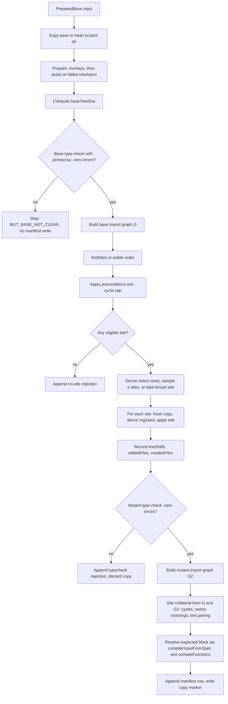
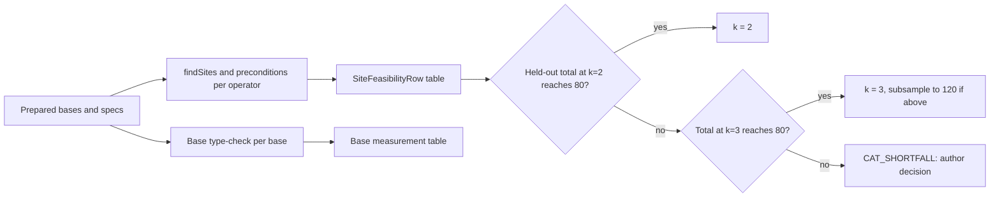
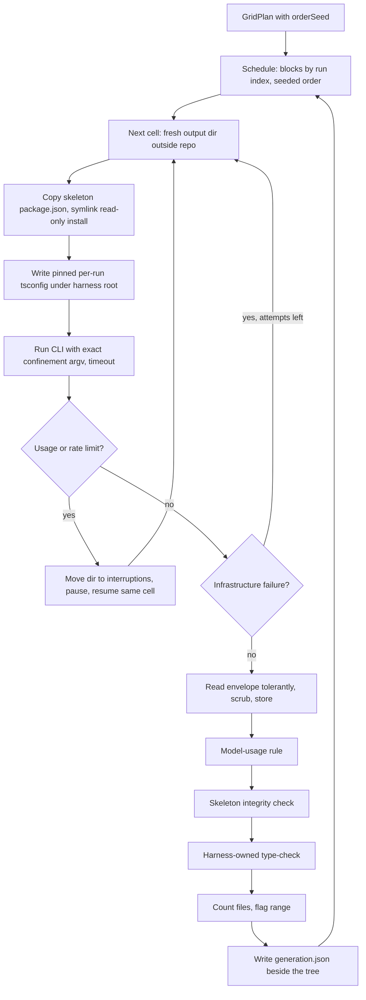
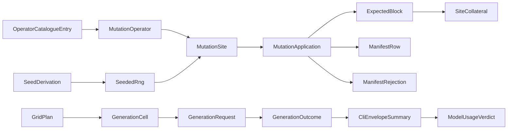

# U5a Mutation, Manifest and Generator — Business Logic Model (v1.2E)

> **Unit**: U5a (C15.1, C15.2, C15.5) · **Date**: 2026-10-08 · **Base**: `v1.2e` @ `8c3d6df`
> **Binding inputs**: answered plan `aidlc-docs/construction/plans/v1.2E-u5a-mutation-manifest-generator-functional-design-plan.md` (Q1–Q19; E1–E5 resolved by ADR-017); ADR-015, ADR-016, ADR-017; requirements `v1.2-evaluation-readiness-requirements.md` (amended 2026-10-08); U1 and U2 functional designs and code-generation plans; U4 and U5b answered plans; U0 code summary; `tests/golden/CHANGES.md`.
> Rules are `business-rules.md` (BR-U5a-nn); types are `domain-entities.md`.
> **Revision R2 (2026-10-08)**: §1 compile call; §2.1–§2.2 collateral computed after the gate from base and mutant import graphs; §2.3 forced sites and corrected rows (MO-S01, MO-S01n, MO-DF01, MO-DF01n, MO-X03, closing note); new §2.4 (worked keys and base metrics on correct-reference) and §2.5 (metric predicates); §4 gate (a) on positives; §5 prompt hashes; §10 OI-U5a-12..15. Causes: `business-rules.md` §12.

---

## 1. Scope and boundaries

U5a delivers three tools outside `src/`:

1. **Mutation engine** (`scripts/mutate.ts`, `scripts/lib/mutation/**`): applies one catalogue operator to one fresh copy of a prepared base and records one manifest row or one rejection.
2. **Manifest** (`scripts/lib/manifest.ts`, `schemas/manifest.schema.json`): the frozen schema, validation and the single-writer append.
3. **Generator** (`scripts/generate-projects.ts`, `scripts/lib/generators/**`, `scripts/generator/**`): runs the Claude Code headless CLI under confinement over a model × task × spec-level × run grid and records one `GenerationOutcome` per run.

U5a reads, never writes, `src/**`. Runtime imports from `src/` are C10 (`ProcessRunner`, `NodeProcessRunner`, `buildChildEnv`, `scrubDeep`, `DomainResult`, `Dimension`), C3 `parseSpec`, and C5 `compilerInputFromSpec` + `compileFunctions`, called only as `compileFunctions(compilerInputFromSpec(spec))` (U1 code plan Step 5), to resolve expected function ids, disabled reasons and metric thresholds without a database (open item OI-U5a-2). Nothing in `src/` imports `scripts/` (BR-U5a-53).

## 2. Mutation pipeline

### 2.1 Flow

**Text alternative.** A prepared base is copied to a fresh scratch directory. Overlays are applied, then stub packages are written only for specifiers that fail module resolution. The tree hash of sources, overlays and stubs is computed. The base is type-checked with its pinned tsc; any error stops the run with `MUT_BASE_NOT_CLEAN` and nothing is written. The base import graph is built. Sites are enumerated in a stable order and filtered by preconditions, including the cycle-cap rule. If no site remains, one `no-site` rejection is appended. Otherwise a selection seed is derived and up to `sitesPerOperator` sites are sampled without replacement, or the single forced site is taken in a fixture or development run. For each site, a fresh copy is made, the application seed is derived and the edit is applied; line shifts and edited and created files are recorded. The mutant is type-checked; on any error a `typecheck` rejection is appended and the copy discarded. On success the mutant import graph is built, site collateral (new cycles, metric threshold crossings, created files without a test) is computed from the base and mutant graphs, the expected block is resolved from the spec, the row is appended by the single writer, and a copy marker is written.

### 2.2 Step detail

| Step | Logic | Rules |
|---|---|---|
| Copy | `fs.cp` of the prepared base (sources, overlays, lock file, install or symlinked install) into `<scratch>/<projectId>/<operatorId>/k-<k>/`. The source tree is never written. The baseline copy used by U5b is the same prepared base without the edit, with the same stubs. | 03, 04, 10 |
| Prepare | Overlays come from `PreparedBase.overlays` (U5b `corpus/overlays/`). For each specifier the operator will import (MO-P01) and for each existing import in variant-b/c style bases, `ts.resolveModuleName` from the importing file under the base tsconfig; on failure, and only when no directory of that package exists on any ancestor `node_modules`, write the stub. | 10 |
| `baseTreeSha` | Scratch git index over source files (tsconfig `include`), overlay targets and stub files; `git write-tree`. | 33 |
| Base type-check | `node <tscPath> --noEmit --incremental false -p <tsconfig>` via `ProcessRunner`; parse `error TSnnnn` lines into `{ code, file, line, message }`. | 07, 08 |
| `findSites` | ts-morph project over the copy with the base tsconfig; layer membership from the spec's layer directories (C3 `parseSpec`); site kinds per operator (§3). Sort per BR-U5a-11. | 11, §3 |
| Base import graph | `buildImportGraph` (ts-morph): File nodes with layer and `isBarrel`, File→File `IMPORTS` and `RE_EXPORTS` edges; parity with `extractAPG` tested, never called at run time. | 56 |
| Preconditions | Style rule from C5 compile output; base import graph for edge-exists; cycle cap (planned `newEdges` simulated on `G`); member counts for threshold operators; operator restrictions; judge-probe placement against the per-function `judgeSelection` (the label-free exception of BR-U5a-06). | 12, 13, 24, 27 |
| Site collateral (after the gate) | Build `G'` from the mutant copy; check `edges(G') − edges(G)` equals the operator's planned `newEdges`; (i) enumerate the simple cycles of `G'` of length ≤ 10 not in `G` (DFS from each new edge's target back to its source, bound 10), canonicalise and key as U3 (§2.4); (ii) per declared metric template, `violating(G') \ violating(G)` with the compiled threshold (§2.5); (iii) created layered file without a test sibling; (iv) project-level metric only when a class or interface is added or removed (never on the catalogue). | 13, 14, 56 |
| Seeds and sample | `selectSeed = derive(masterSeed, projectId, operatorId, 'select')`; partial Fisher–Yates with mulberry32; `rngSeed_k = derive(…, k)`. A forced site (`siteOverride`) replaces the sample with that one site, `k = 0`, `siteSelection: 'forced'`. | 15, 16, 17, 55 |
| Apply | Operator edit through ts-morph on the copy; `save()`; text diff gives `lineShifts`. | 18, §3 |
| Mutant gate | Same command as the base check; zero errors required. | 09 |
| Expected | `compileFunctions(compilerInputFromSpec(parseSpec(specPath)))` → map `expectedTemplates` and collateral templates to function ids; disabled ids with reason; absent templates; keys (with `lineRule`) from the location rules; operator collateral keyed by its location rules. | 14, 19, 20, 21, 22 |
| Append | Under the manifest lock: validate, temp write, rename. | 31, 35 |

### 2.3 Operator edits on correct-reference (dev split, FR-24 acceptance)

Every site in this table is **forced** (`siteOverride`, BR-U5a-55): the fixture tests and the FR-24 acceptance do not depend on what the frozen master seed would draw. Keys are written as `template (filePath, target, discriminator; lineRule)`; paths are relative to the project root, as the APG stores them. "Metric" lists `metric-crossing` site collateral computed by BR-U5a-14 (ii) from the base metrics of §2.4.

| Entry | Forced site on correct-reference | Edit | Expected keys | Collateral (operator / site) |
|---|---|---|---|---|
| MO-S01 | `src/domain/entities/Task.ts` → `src/infrastructure/repositories/InMemoryTaskRepository.ts` | value import plus an exported reference | `dependency-direction` and `no-domain-outward-dep` (`Task.ts`, `InMemoryTaskRepository.ts`, `['IMPORTS']`; site-line) | site: **two** FF-S02 cycle keys (§2.4); metric: none |
| MO-S01n | `InMemoryTaskRepository.ts` → `src/domain/repositories/ICategoryRepository.ts` | import and use the interface type | none | none (`ICategoryRepository.ts` gains one non-domain importer: FF-C01 instability 0 ≤ 0.3; its FF-C03 instability falls from 1.0 to 0.5, a removed key, not a new one) |
| MO-P01 | `Task.ts` imports `express` (stubbed with a default export, BR-U5a-10) | `import express from 'express'` plus a reference | `domain-purity` (`Task.ts`, `express`, `['IMPORTS']`; site-line) | none (Package edges are not File edges) |
| MO-P01n | `InMemoryTaskRepository.ts` imports `express` | same | none | none |
| MO-C04 | new `src/application/use-cases/OrphanHelper.ts` | file with one exported const, no imports | `no-orphan-files` (new file, `''`, `[]`; none) | site: `test-file-pairing` on the new file |
| MO-C04n | same file imported by `CreateTaskUseCase.ts` | file plus one import | none | site: `test-file-pairing` on the new file; metric: none (`CreateTaskUseCase.ts` fan-out 2 → 3 ≤ 10 and already FF-C03; the new file has instability 0) |
| MO-SO01 | class `Task` (2 methods) | add 9 methods | `single-responsibility-proxy` (`Task.ts`, `''`, `['Task']`; site-line) | none |
| MO-SO01n | class `Task` | add 8 methods (total 10) | none | none |
| MO-CV02 | class `CreateTaskUseCase` | rename from the frozen list | `naming-services` (`CreateTaskUseCase.ts`, `''`, `[<new name>]`; site-line) | operator: `naming-conventions` (`CreateTaskUseCase.ts`, `''`, `[<new name>]`) |
| MO-CV02n | class `CreateTaskUseCase` | rename to a conforming name | none | operator: `naming-conventions` (`CreateTaskUseCase.ts`, `''`, `[<new name>]`) |
| MO-DF01 | class `Task` | `private readonly repo = new InMemoryTaskRepository()` | `domain-state-purity` (`Task.ts`, T-MAP target, `['Task', 'InMemoryTaskRepository', 'FLOWS_TO', 'repo']`; site-line); edge `FLOWS_TO Task → InMemoryTaskRepository` (+1) | operator: `dependency-direction`, `no-domain-outward-dep` (`Task.ts`, `InMemoryTaskRepository.ts`, `['IMPORTS']`); site: the same two FF-S02 cycle keys as MO-S01; metric: none |
| MO-DF01n | class `InMemoryTaskRepository` | field holding `new Category(<literals>)` (all constructor parameters primitive; `Task` is not eligible because of its `Date` parameter) | none; edge FLOWS_TO +1 | none (`Category.ts` gains a non-domain importer: FF-C01 instability 0; FF-C03 instability 0) |
| MO-X01 | `Task.ts` | async method with `await import('../../infrastructure/repositories/InMemoryTaskRepository')` | intended S01, S04 (outside coverage) | none (no static edge) |
| MO-X01n | `InMemoryTaskRepository.ts` | `import()` of `ICategoryRepository` | none | none |
| MO-X02 | `Task.isValid` guard → `TaskController.createTask` | BR-U5a-28 | none (`judgeProbe: semantic`) | none |
| MO-X02n | `TaskController` | local extraction | none | none |
| MO-SO02 | `ITaskRepository` (5) | add 1 signature; implementer `InMemoryTaskRepository` gains 1 method | `interface-segregation-proxy` (`ITaskRepository.ts`, `''`, `['ITaskRepository']`; site-line) | none |
| MO-SO02n | `ICategoryRepository` (4) | add 1 signature (no implementer) | none | none |
| MO-X03 | `Task.isValid` invariant | BR-U5a-29: new `src/domain/rules/taskRules.ts` exporting the rule over primitives, imported and called by `CreateTaskUseCase.ts`, rule also inline in `CreateTaskUseCase.execute` | none (`judgeProbe: integrity`) | site: `test-file-pairing` on the created module; metric: none (new module: one non-domain importer, no import → FF-C01 0, FF-C03 0, not an orphan; `CreateTaskUseCase.ts` already FF-C03) |
| MO-X03n | `Task` | private method extraction | none | none |
| MO-S03 | layered spec: `TaskController.ts` (presentation) → `InMemoryTaskRepository.ts` (persistence) | value import plus reference | `no-layer-skip` (`TaskController.ts`, `InMemoryTaskRepository.ts`, `['IMPORTS']`; site-line) | none (no cycle: persistence does not reach presentation; `InMemoryTaskRepository.ts` leaves FF-C03) |
| MO-S03n | layered spec: `TaskController.ts` → a business-layer symbol it does not yet import (`Task`) | import and use | none | none |

Sites and keys in this table are the design expectation; BR-U5a-20's hand-written key table checks them in unit tests, and the BR-U5a-36 (a) dev-split gate checks them against U3 reports on every row, positive and twin. On MO-S03n, FF-P05 `controller-no-entity` does **not** fire: it matches only entity names containing an `entityRoles` term (defaults `Entity`, `Aggregate`, `ValueObject`, `fitness-compiler.ts:309`), and `Task` contains none. If the gate finds any undeclared key, a twin is redefined only under BR-U5a-36 (a), and a positive gets the missing collateral rule, logged in the catalogue changelog.

### 2.4 Worked values on correct-reference (base graph `G`, used by the tests)

**Base metrics** (File→File `IMPORTS`; layers from `specs/clean-arch.yaml`):

| File | fanIn | fanOut | Instability (FF-C03, > 0.8 violates) | FF-C01 (domain only; non-domain in / out) |
|---|---|---|---|---|
| `src/domain/entities/Task.ts` | 6 | 0 | 0 | 5 / 0 → 0 |
| `src/domain/entities/Category.ts` | 1 | 0 | 0 | excluded (no non-domain neighbour) |
| `src/domain/repositories/ITaskRepository.ts` | 3 | 1 | 0.25 | 3 / 0 → 0 |
| `src/domain/repositories/ICategoryRepository.ts` | 0 | 1 | **1.0** | excluded |
| `src/application/use-cases/CreateTaskUseCase.ts` | 0 | 2 | **1.0** | — |
| `src/application/use-cases/CompleteTaskUseCase.ts` | 0 | 2 | **1.0** | — |
| `src/application/use-cases/ICreateTaskUseCase.ts` | 1 | 1 | 0.5 | — |
| `src/application/use-cases/ICompleteTaskUseCase.ts` | 1 | 1 | 0.5 | — |
| `src/infrastructure/controllers/TaskController.ts` | 0 | 2 | **1.0** | — |
| `src/infrastructure/repositories/InMemoryTaskRepository.ts` | 0 | 2 | **1.0** | — |

So `violating(G)` is: FF-C03 = the five bold files (correct-reference already fails FF-C03); FF-C01 = ∅; FF-C02 = ∅ (max fan-out 2); FF-C04 = ∅; FF-C05 = ∅ (max fan-in 6). No simple cycle exists in `G`.

**MO-S01 / MO-DF01 cycle keys** (new edge `Task.ts → InMemoryTaskRepository.ts`; `InMemoryTaskRepository.ts` imports `Task.ts` and `ITaskRepository.ts`, which imports `Task.ts`). `src/domain/entities/Task.ts` is the smallest path on both cycles (`entities` < `repositories` < `src/infrastructure/…`):

| # | `cycle` (closed) | `filePath` = `String(cycle)` | `target` = `cycle[1]` | `discriminator` | lineRule |
|---|---|---|---|---|---|
| 1 | `["src/domain/entities/Task.ts","src/infrastructure/repositories/InMemoryTaskRepository.ts","src/domain/entities/Task.ts"]` | `src/domain/entities/Task.ts,src/infrastructure/repositories/InMemoryTaskRepository.ts,src/domain/entities/Task.ts` | `src/infrastructure/repositories/InMemoryTaskRepository.ts` | `[JSON.stringify(cycle)]` | first-edge-line (line of the new import in `Task.ts`) |
| 2 | `["src/domain/entities/Task.ts","src/infrastructure/repositories/InMemoryTaskRepository.ts","src/domain/repositories/ITaskRepository.ts","src/domain/entities/Task.ts"]` | `src/domain/entities/Task.ts,src/infrastructure/repositories/InMemoryTaskRepository.ts,src/domain/repositories/ITaskRepository.ts,src/domain/entities/Task.ts` | `src/infrastructure/repositories/InMemoryTaskRepository.ts` | `[JSON.stringify(cycle)]` | first-edge-line |

Under the SCC fallback (BR-U1-31) the same edit gives one key `(FF-S02, 'src/domain/entities/Task.ts', '', ['scc'])`. U5b's hand-computed fixture (BR-U5b-27, case 1) uses these two keys.

### 2.5 Metric predicates (BR-U5a-14 ii; mirror of the compiled templates after U1)

| Template | File considered | Value | Violates when | Edges read |
|---|---|---|---|---|
| `domain-stability` (FF-C01) | `layer = domainLayer`, with `inNon + outNon > 0` | `outNon / (inNon + outNon)`, counting distinct non-domain File neighbours | value > threshold (0.3) | `IMPORTS` |
| `module-fan-out` (FF-C02) | any File with an outgoing edge | distinct File targets | value > threshold (10) | `IMPORTS` |
| `component-instability` (FF-C03) | `layer ≠ null`, `fanIn + fanOut > 0` | `fanOut / (fanIn + fanOut)`, distinct Files | value > threshold (0.8, registry default) | `IMPORTS` |
| `no-orphan-files` (FF-C04) | `layer ≠ null`, not a barrel | — | no `IMPORTS`/`RE_EXPORTS` edge to or from a File (BR-U1-34) | `IMPORTS`, `RE_EXPORTS` |
| `max-fan-in` (FF-C05) | any File with an incoming edge | distinct File sources | value > threshold (15) | `IMPORTS` |

The predicates are those of `cypher-templates.ts:150-210` with the U1 changes (BR-U1-34 orphan edge types, BR-U1-36 IMPORTS-only metrics). A unit test pins each predicate on a synthetic graph; after U3 merges, gate BR-U5a-36 (a) checks the predicates against the real reports. If a later U1/U3 change alters a template predicate, this table and its test change in the same reviewed patch.

## 3. Site-feasibility pass (before the catalogue freeze)

1. Inputs: every prepared base (five fixtures; five core corpus projects after the ADR-017 item 4 remap; E7 projects once frozen) with its spec.
2. For every golden-instance operator (BR-U5a-01: symbolic positives), and in a separate section for twins and judge probes: `findSites` + preconditions, no RNG, no detector, no edit.
3. Output `Docs/DiagnosticRuns/u5a-site-feasibility.{json,md}`: one `SiteFeasibilityRow` per (base, operator) with candidate count, rejected count per precondition reason, eligible count, and the totals at k = 2 and k = 3 for the held-out split.
4. The `sitesPerOperator` rule (BR-U5a-37) is applied to the held-out totals and k is written into the catalogue with a date.
5. Base type-check measurement (`Docs/DiagnosticRuns/u5a-base-typecheck.{json,md}`) runs in the same script: per base, tsc version, error count, excluded or not.

**Text alternative.** The prepared bases and their specs feed two independent computations: site enumeration with preconditions per operator, giving the feasibility table, and a type-check of each base, giving the base measurement table. From the feasibility table, if the held-out total at two sites per operator reaches 80, k is 2. Otherwise, if the total at three sites reaches 80, k is 3, with a seeded subsample to 120 when it exceeds 120. Otherwise the shortfall is returned to the author.

## 4. Catalogue freeze sequence

1. U3 merged (FR-11 `domain-purity` over Package nodes, `domain-state-purity`, FR-12 keys, `edgeCountByType`).
2. Run the FR-24 acceptance (22 entries on correct-reference with the forced sites of §2.3; MO-S03 pair on the layered fixture spec).
3. Dev-split declaration gate (BR-U5a-36 a) through U3 on all 22 rows: no undeclared new key on any row; every in-coverage positive shows an expected key. Redefine and log any twin whose firing is not a violation by its source's definition; fix the collateral rule (not the row) for a positive with an undeclared key.
4. Base measurement and feasibility table (§3); apply BR-U5a-37.
5. Write `Docs/operator-catalogue.md` (entries, rename list, `masterSeed`, k, SP section with its own hash, changelog); compute `catalogueVersion`.
6. Commit and date before the FR-18 re-baseline or the first corpus/E1 run; register hashes in U5b's `corpus/prereg.json`.
7. Held-out seeding starts only after step 6.

## 5. Generation pipeline

### 5.1 Flow

**Text alternative.** The grid plan and its order seed produce a schedule in blocks by run index, each block in a seeded order. For each cell a fresh output directory outside the repository is created; the skeleton `package.json` is copied and `node_modules` is symlinked to the read-only shared install; the per-run tsconfig is written under the harness root. The CLI runs with the exact confinement arguments and a timeout. A usage or rate limit moves the directory to `interruptions/`, pauses the grid and resumes the same cell without consuming an attempt. Other infrastructure failures are retried while attempts remain. Otherwise the envelope is read tolerantly, scrubbed and stored; the model-usage rule decides model validity; the skeleton integrity is checked; the harness runs the type-check of record; files are counted and the range flagged; and `generation.json` is written beside the tree before the next cell.

### 5.2 Status decision (applied in order)

| Order | Condition | Status | `failureReason` |
|---|---|---|---|
| 1 | Infrastructure failure after 2 retries | `failed-agent` | `infrastructure` |
| 2 | Runner timeout with files written | `failed-agent` | `timeout` |
| 3 | stdout not JSON | `failed-agent` | `envelope-unreadable` |
| 4 | `skeletonIntact` false | `failed-agent` | `skeleton-tampered` |
| 5 | Model-usage rule fails | `failed-agent` | `model-mismatch` |
| 6 | `is_error` true | `failed-agent` | `agent-error` |
| 7 | Type-check errors > 0 | `failed-typecheck` | `typecheck` |
| 8 | otherwise | `ok` | — |

`fileCountInRange` is recorded for every status and never changes it. Steps 4–7 are evaluated for every run that produced an envelope, so the record holds all of `skeletonIntact`, model verdict and type-check errors even when an earlier row decides the status.

### 5.3 Before E1 (Build and Test)

1. Install the skeleton once; record the install hash.
2. Live confinement probes (BR-U5a-43); on failure switch to the no-Bash argv and record it.
3. Sonnet and Opus model-usage probes (BR-U5a-47).
4. Pilot: one cell per level under `pilot/`; freeze the prompt **template** hashes and the pinned per-run tsconfig in `Docs/generator-protocol.md` (instantiated prompt hashes are recorded per run, BR-U5a-52).
5. FR-28 acceptance: one cell (three runs) plus one forced failure.

## 6. Domain-model relationships

**Text alternative.** A catalogue entry defines an operator. An operator finds sites; a seed derivation produces a seeded RNG that selects among them. Applying an operator at a site gives a mutation application, which carries an expected block with its collateral and becomes either a manifest row or a rejection. On the generator side, a grid plan expands into cells; each cell gives a generation request, which yields a generation outcome containing an envelope summary and a model-usage verdict.

## 7. Error handling

| Situation | Behaviour |
|---|---|
| Base not clean | Stop before sites; no write; base listed as excluded in the measurement file (BR-U5a-07) |
| No eligible site | One `no-site` rejection (BR-U5a-16) |
| Edit throws | One `apply-error` rejection, scrubbed message, copy discarded (BR-U5a-34) |
| Mutant does not type-check | One `typecheck` rejection, copy discarded, no re-draw (BR-U5a-09, 17) |
| Manifest invalid on load | Fail with the ajv errors; nothing appended (BR-U5a-35) |
| Lock held | `MAN_LOCKED`; the second writer exits (BR-U5a-35) |
| Generator usage limit | Pause and resume, no attempt consumed (BR-U5a-50) |
| Confinement probe fails | Switch to the no-Bash argv before any generation (BR-U5a-43) |

## 8. Hand-offs

As `business-rules.md` §7.

## 9. Golden-snapshot change table

**Reference state**: the post-lane-2 snapshots predicted in U1 `business-logic-model.md` §8.2 after commit U1-K16 (U2 merged first and changes no snapshot; BR-U2-45). Per-function picture after K16 (binding): correct-reference fails FF-C03, FF-CV05; variant-a S01, S02, S04, P02, P04, C01, C03, C06, CV05; variant-b S01, P02, P03, P04, C03, C06, SO02, CV05; variant-c S01, S02, P02, P03, P04, C03, C04, C06, SO01, SO02, CV05; variant-d S01, S04, P02, P04, C01, C03, C06, CV05. AHS estimates .958 / .422 / .595 / .412 / .538; verdicts pass / hard-block / soft-block / hard-block / soft-block.

U5a's commits change none of it. Commit labels stand in for hashes (`git log --grep 'U5a-Mn'` recovers them), as in BR-U1-41.

| Commit (label) | Cause (FR / ADR / Q) | Files touched | Golden change | `CHANGES.md` line |
|---|---|---|---|---|
| U5a-M1 | FR-24, Q9: manifest schema frozen; manifest assertions in `schemas.test.ts` | `schemas/manifest.schema.json`, `tests/unit/schemas/schemas.test.ts` | none (schema not read by C16) | none |
| U5a-M2 | FR-24, Q10: RNG, seed derivation, registry, manifest writer | `scripts/lib/mutation/**`, `scripts/lib/manifest.ts`, `tsconfig.scripts.json`, jest scripts project | none | none |
| U5a-M3 | FR-24, Q1, Q2: base preparation, stubs, type-check gate, tree hash | `scripts/lib/mutation/**` | none (copies only; fixtures untouched, BR-U5a-04) | none |
| U5a-M4 | FR-24, Q5–Q8: operators, twins, collateral, expected resolution | `scripts/lib/mutation/operators/**`, `tests/fixtures/u5a/**` | none (`tests/fixtures/u5a/**` is not a golden case) | none |
| U5a-M5 | FR-24 acceptance, Q11: `scripts/mutate.ts`, freeze-gate script | `scripts/mutate.ts`, `scripts/lib/mutation/freeze-gates.ts` | none | none |
| U5a-M6 | FR-28, Q13–Q15: generator config, argv, env, skeleton | `scripts/lib/generators/**`, `scripts/generator/skeleton/**` (own lock file) | none (repo `package-lock.json` unchanged) | none |
| U5a-M7 | FR-28, Q16–Q19: grid, schedule, envelope reader, outcomes, prompts | `scripts/generate-projects.ts`, `scripts/generator/prompts/**` | none | none |
| Build and Test (later, not U5a code) | FR-24 amendment, Q11: catalogue, diagnostics, generator protocol | `Docs/operator-catalogue.md`, `Docs/DiagnosticRuns/u5a-*`, `Docs/generator-protocol.md` | none | none |
| U5b corpus commit (not U5a) | ADR-017 item 4: corpus domain remap | `corpus/specs/**`, `Docs/corpus.md` | none (corpus is not a C16 input); changes corpus figures only | none |

Self-spec (`specs/daedalus-arch.yaml`, outside C16): its layers cover `src/**` only, so files under `scripts/` are unmapped and no self-spec function result changes; no `## Self-spec` line.

## 10. Open items

| Id | Item | Proposed handling |
|---|---|---|
| OI-U5a-1 | **Artefact path.** The plan's Part 2 heading names `aidlc-docs/construction/v1.2E-u5a-mutation-generator/functional-design/`; these artefacts were written to `v1.2E-u5a-mutation-manifest-generator/` as the run's task named it (matching the plan file's name). | Keep this path; correct the plan heading in the clarifications file |
| OI-U5a-2 | **C5 import.** Plan §1.3 lists only C10 and C3 as imports; expected resolution (Q5) needs the applicability result, so U5a imports C5 `compileFunctions` (pure, no database). No `src/` change; dependency direction unchanged. | Record as a design refinement in the clarifications file |
| OI-U5a-3 | **Seeded list vs manifests.** Plan Q8 says `editedFiles`/`createdFiles` "feed U4's seededList"; U4P Q6 (binding) says the seeded list is never populated from a manifest in E1/E7/SO4 runs and U5a places judge probes inside baseline-selected units. BR-U5a-27 follows U4P Q6. | Record in the clarifications file; no requirement text changes, not escalated |
| OI-U5a-4 | **Stale probe naming in U4P and U5bP.** Both say "MO-X02 Integrity probe"; after the plan revision MO-X02 is the Semantic probe and MO-X03 the Integrity probe. | Cross-unit record correction in U4/U5b designs |
| OI-U5a-5 | **`CorpusEntry` tsc shape.** U5aP asked for `tscPath`/`tscVersion`; U5bP Q16 defines `tsc: 'project' \| 'repo-pinned'`. U5a consumes a `PreparedBase` with resolved `tscPath` and measured `tscVersion`, produced by U5b preparation. | Hand-off (business-rules §7); U5b design states the resolution |
| OI-U5a-6 | **Seed-formula refinements.** BR-U5a-15 fixes the byte encoding (`'\|'`-joined UTF-8) and adds the labels `'select'` and `'subsample'` for the sample and the BR-U5a-37 cut, which the plan left implicit. | Record in the clarifications file before the freeze |
| OI-U5a-7 | **MO-X02 removal.** "Entity method removed" (Q6) is realised with its guard call statements removed too, so callers type-check (BR-U5a-28); a site where a call is not a removable guard is rejected. | Record as a design refinement |
| OI-U5a-8 | **Twin gate semantics.** "Zero new keys" is read as zero **undeclared** new keys (declared site collateral excluded), consistent with U5bP Q3 (iv). | Record in the clarifications file |
| OI-U5a-9 | **`tsconfig.scripts.json`.** U1 creates `scripts/migrate-corpus-spec*.ts`; Code Generation checks whether U1 already type-checks `scripts/` and extends that configuration if so. | Code Generation step 1 |
| OI-U5a-10 | **Shortfall after k = 3.** ADR-017 item 2 brings E1 into scope, so generated bases (`baseKind: generated`) are a possible top-up, but the plan routes any shortfall to the author. | Stays an author decision under BR-U5a-37 (`CAT_SHORTFALL`) |
| OI-U5a-11 | **Requirement row R:141.** SECURITY-11 still reads "N/A"; ADR-017 item 8 enforces it on the generator. | Documentation update to the requirements compliance row (covered by ADR-017 item 8) |
| OI-U5a-12 | **Cross-unit corrections from R2** (cycle key form and count, keyed operator collateral, `lineRule`, per-function `judgeSelection`, `siteSelection`, `promptTemplateSha256`). The U5b design (BR-U5b-08 OI-9, BR-U5b-27, BR-U5b-76, domain-entities §1 and §8) and the clarifications files must restate them; this repair was limited to the three U5a files. | Orchestrator applies the `business-rules.md` §7 R2 row to U5b and records it in the U5a and lane-2 clarifications files before U5b Code Generation |
| OI-U5a-13 | **Predicate drift.** §2.5 mirrors template predicates after U1; U1 or U3 may still change a template between this design and U3's merge. | Gate BR-U5a-36 (a) on real reports is the check; the predicate test changes with any template change |
| OI-U5a-14 | **Lint coverage of `scripts/`.** `npm run lint` covers `src tests` only. | Code Generation lints new `scripts/` files explicitly (code-generation plan Gate L) and does not change the lint script |
| OI-U5a-15 | **`PreparedBase` field names.** The R2 finding proposed `preparedDir` and `fetchTreeSha`; U5b's current BR-U5b-76 already adopted U5a's names (`dir`, hash in `FetchRecord.treeHash`). Names kept to avoid a second rename. | Author may override; a rename would touch both designs |
