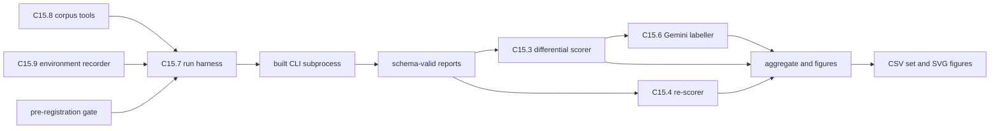
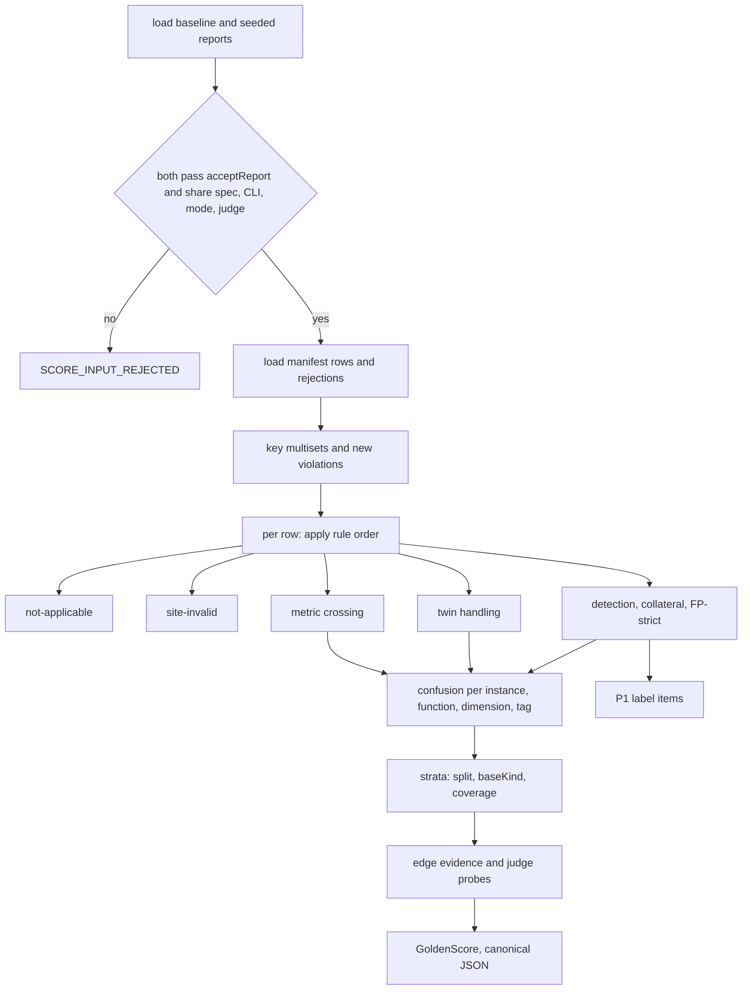
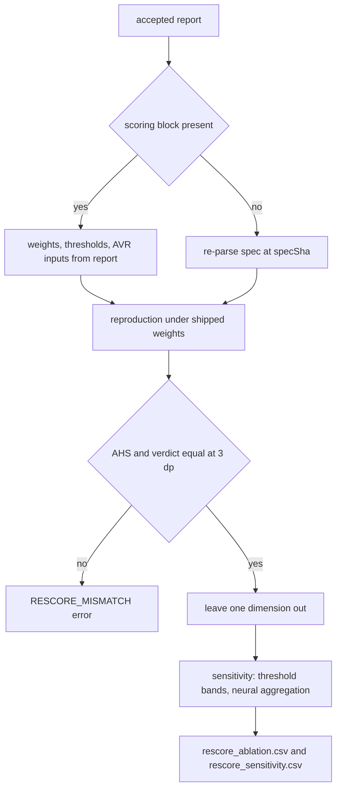
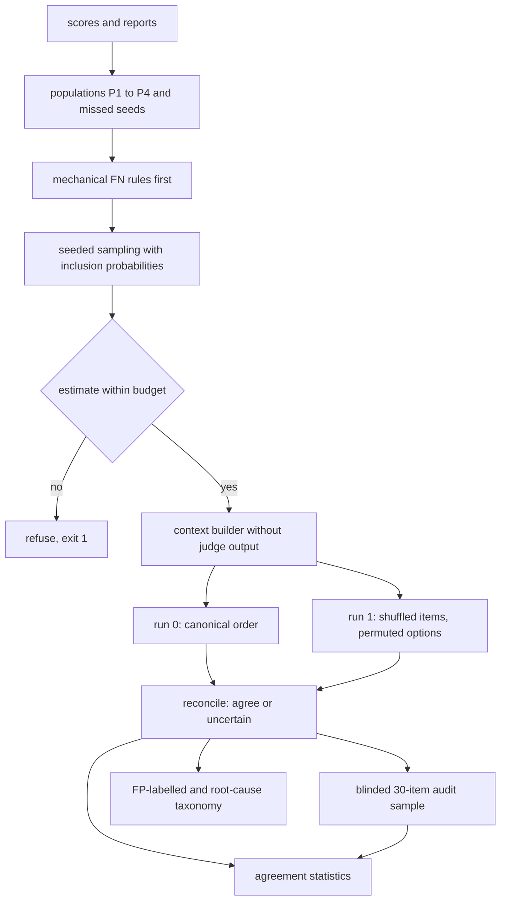
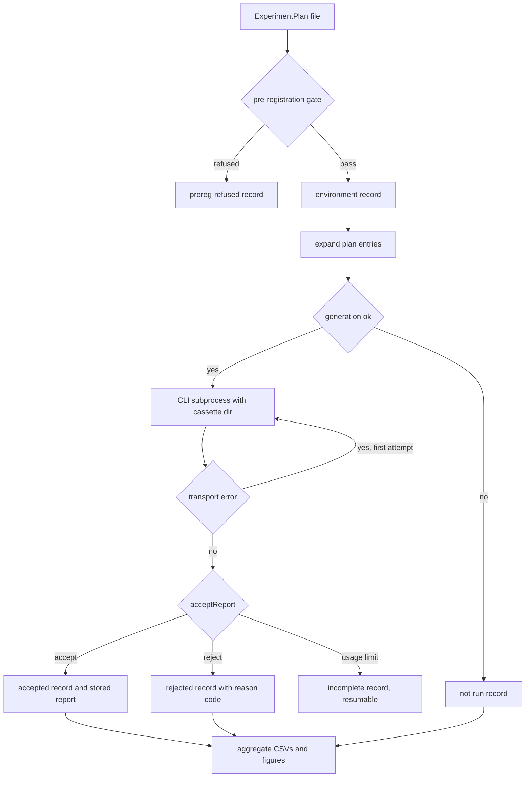

# Business Logic Model — v1.2E U5b Scoring and harness

> **Unit**: U5b — C15.3 matching rule and differential scorer, C15.4 re-scorer, C15.6 Gemini labeller, C15.7 run harness and aggregation, C15.8 corpus tools, C15.9 environment recorder · **Date**: 2026-10-08 · **Base**: `v1.2e` @ `8c3d6df` · **Unit branch (Code Generation)**: `v1.2e-u5b-scoring-harness`
> **Binding inputs**: the answered plan (`aidlc-docs/construction/plans/v1.2E-u5b-scoring-harness-functional-design-plan.md`, "U5bP", Q1–Q22); escalations E1–E3 resolved by ADR-017 (items 1, 6, 7); ADR-015 items 1–5, 9, 10, 12; ADR-016 b, e; ADR-017 items 1–4; requirements FR-25, 26, 27, 36, FR-03, NFR-05, 06, 08 (amended 2026-10-08); U1 and U2 functional designs and code plans (lane-2 contracts); the lane-3 sibling plans for their U5b hand-offs (U3P, U4P, U5aP).
> **Companion files**: `business-rules.md` (BR-U5b-01..78, acceptance checks), `domain-entities.md` (shapes and CSV dictionaries).
> **Scope reminder** (R §5 as amended by ADR-017 items 2, 3): U5b builds and tests the tools. The thesis numbers come from running them after Build and Test. No live Gemini call happens at U5b exit (BR-U5b-44).
> **Revision (2026-10-08, verification repair)**: §3 step 1 (provenance from `RunRecord`), step 6 and new step 10 (SP-* probes, BR-U5b-78); §4 per AHS field and `verdictSource`; §6 sensitivity output; §7 four-commit corpus-spec chain (BR-U5b-77, R-12) and `PreparedBase` from U5a's contract with U4's selection (BR-U5b-76); §8.2 C8b; §9 ADR-016 b row; §10 open items renumbered, OI-9..OI-11 added.

---

## 1. Entry, exit and unit boundaries

- **Entry**: U3 and U5a merged into `v1.2e` (frozen `schemas/report.schema.json` and `schemas/manifest.schema.json`, `renormaliseWeights` exported, `formatEvidence`/`parseEvidence`, codes `EVAL_002`/`EVAL_003`/`METRIC_001`/`METRIC_002`, `scoring` block, `truncated`, stable metric keys and row filters or the BR-U5b-16 exclusion). C15.6 additionally needs U4 merged (U5bP Q19 amendment; it is coded last).
- **Exit**: the seven U5bP §1.4 criteria, each bound to a rule: hand-computed score byte-identical (BR-U5b-27), 3 dp re-scoring (BR-U5b-58), harness CSVs + one SVG + two injected rejections (BR-U5b-48, 72), labeller replay (BR-U5b-36), pre-registration refusal (BR-U5b-50), ratio-only change gives no new key (BR-U5b-16), full suite and C16 green with no snapshot change (BR-U5b-74).
- **Boundary**: everything lives in `scripts/`, `corpus/`, `Docs/` and `tests/`; the CLI is reached only as a subprocess (BR-U5b-55).

## 2. Component flow (overview)

Text alternative: the corpus tools, the environment recorder and the pre-registration gate feed the run harness. The harness runs the built CLI as a subprocess and keeps only schema-valid reports. Reports go to the differential scorer and the re-scorer. The scorer's unexplained new violations go to the labeller. The scorer, re-scorer and labeller outputs go to aggregation, which writes the CSV set and the figures.

## 3. Differential scoring pipeline (C15.3, `score-golden.ts`)

Text alternative: the scorer loads a baseline and a seeded report. If either fails acceptance, or they differ in spec, CLI commit, mode or judge, the pair is rejected. Otherwise it loads the manifest, computes the multiset of keys and the new violations, and applies the rule order to each row: not-applicable, then site-invalid, then metric crossing, then twin handling, then detection with collateral and FP-strict. Results are counted per instance, function, dimension and tag, stratified by split, base kind and coverage, joined with edge evidence and judge probes, and written as canonical JSON. FP-strict violations become P1 labeller items.

Steps:

1. **Accept** both reports (BR-U5b-45) and compare provenance (BR-U5b-25): `RunRecord.specSha` and `RunRecord.cliCommit`, report `evaluationMode` and `judge`.
2. **Keys**: `baselineMatchKey` for every violation (BR-U5b-02); multiset difference seeded − baseline gives the new violations; matched occurrences increment `preExistingIgnored` (BR-U5b-03). In SCC mode, cycle violations match by member-set overlap (BR-U5b-18). Neural violations match by `(functionId, filePath, [unitId])` and never count as FP-strict when they are judge collateral (BR-U5b-19).
3. **Line remap**: baseline lines are shifted through the row's `lineShifts` (`afterLine`, `delta`) before line confirmation (BR-U5b-04).
4. **Rule order** per row (BR-U5b-12):
   1. manifest `rejections[]` are counted for the coverage table, never instances;
   2. not-applicable functions are dropped (membership in `functionResults[].functionId`, never the `executed` count); an all-inapplicable seed is `not-applicable` (BR-U5b-13);
   3. non-metric seed whose expected key is in the baseline is `site-invalid` (BR-U5b-14);
   4. metric seeds use the evidence threshold crossing (BR-U5b-15); metric-key exclusions apply (BR-U5b-16);
   5. twins: declared collateral neutral, anything else a twin FP (BR-U5b-17);
   6. positives: detection by key with line confirmation (BR-U5b-04), declared collateral neutral (BR-U5b-08), everything else FP-strict (BR-U5b-09).
5. **Count**: count-once at instance, dimension, tag and overall level; per-function TP/FN per applicable expected function (BR-U5b-05, 06, 07).
6. **Strata**: `split` (`dev`, `held-out`) × `baseKind` × `coverage`, never pooling dev with held-out; `probe` rows never enter a stratum (BR-U5b-20, 21).
7. **Evidence**: FLOWS_TO edge deltas against declared counts (BR-U5b-22); judge probes, overall and conditional on selection (BR-U5b-23); executed counts and the U3 identities I1, I2 (BR-U5b-24).
8. **Modes**: FP-strict now; FP-labelled once the reconciled labels exist (BR-U5b-10); "incl. twins" and specificity (BR-U5b-17).
9. **Serialise** canonically (BR-U5b-26).
10. **Sensitivity probes** (`split: 'probe'`, SP-*): scored separately per probe, pass = a new violation of the target function at a key in `expected.keys[]`, line confirmation recorded; exclusions only after a failed probe with a recorded fix attempt; written to `function_sensitivity.csv` (BR-U5b-78).

## 4. Re-scoring pipeline (C15.4, `rescore.ts`)

Text alternative: the re-scorer reads weights (`weights`, and `fullModeWeights` in full and neuronal-only modes), thresholds, `verdictSource` and per-dimension AVR inputs from the report, or re-parses the spec at the recorded hash when the report lacks them. It first reproduces every stored AHS field (`ahsDeterministic`, `ahsCombined`, `ahsNeuronal`, as present for the mode) and the verdict from the field named by `verdictSource` under the shipped weights; a mismatch at three decimals is an error. It then runs leave-one-dimension-out and the sensitivity-only scenarios and writes two CSVs.

Scope limit: confidence thresholds of neuronal results are not re-scorable offline (BR-U5b-60). Ablated dimensions are marked `ablated`, never added to U3's `DroppedDimension` reasons (BR-U5b-59). Reproduction uses the scorer's own rounding through `renormaliseWeights`, `computeAHS`, `determineVerdict` (BR-U5b-58).

## 5. Labelling pipeline (C15.6, `llm-label.ts`)

Text alternative: the labeller builds populations P1 to P4 and the missed-seed population from the scores and reports, after first applying the mechanical FN root-cause rules. It samples with a seeded RNG and stores inclusion probabilities, and refuses when the call estimate exceeds the registered budget. Contexts are built without any judge output. Run 0 uses canonical order; run 1 shuffles items and permutes the options. The two runs are reconciled into a label or `uncertain`. Reconciled labels feed the agreement statistics, the blinded 30-item audit sample and the FP-labelled precision and root-cause taxonomy.

Steps and rules: populations and caps (BR-U5b-33); mechanical FN rules (BR-U5b-38); budget (BR-U5b-34); context exclusion (BR-U5b-35, 39); runs and permutation (BR-U5b-31, 32); cassette provider with U4's canonical-request key (BR-U5b-36); reconciliation (BR-U5b-37); root causes (BR-U5b-28..30); model-family separation (BR-U5b-40); audit allocation and blinding (BR-U5b-41, 42); agreement (BR-U5b-43). All labelling at U5b exit is Mock or replay (BR-U5b-44).

## 6. Harness pipeline (C15.7, `run-experiment.ts`, `aggregate.ts`)

Text alternative: a plan file first passes the pre-registration gate; a refusal is recorded. The harness writes an environment record and expands the plan. A cell whose generation failed is recorded as not-run. Otherwise the CLI runs as a subprocess with the experiment's cassette directory. A transport error is retried once. The report then goes through acceptance: rejected with a reason code, incomplete when a usage limit stopped judge calls, or accepted and stored. Aggregation reads every record, including rejected and not-run ones.

Rules: gate and registered artefacts (BR-U5b-50, 51, 52); provenance and E1 cells (BR-U5b-53, 54); acceptance and reason codes (BR-U5b-45); records and statuses (BR-U5b-46); retry (BR-U5b-47); latency gate with the Tarjan fallback (BR-U5b-49); subprocess boundary and output locations (BR-U5b-55, 56); statistics (BR-U5b-61..65); figures (BR-U5b-72). The per-function sensitivity check (ADR-016 b; U5a SP-* probes, BR-U5a-30) and the latency gate (ADR-016 e) run through this harness in Build and Test as plans of kind `sensitivity` and `latency-gate`; sensitivity plans carry `fixAttempts` and produce `function_sensitivity.csv` (BR-U5b-78). E1 cells are joined to U5a's `GenerationOutcome` under its own field names (`requestedModelId`); `GEN-*` codes come from `failureReason` only, file range and permission denials are flags (BR-U5b-64).

## 7. Corpus and environment pipelines (C15.8, C15.9)

Corpus: `Docs/corpus-criteria.md` → `select-corpus` (seeded, 3–5 added projects, ADR-017 item 1) → committed `corpus/corpus.json` with overlays, install policy and pinned tsc → registered → `fetch-corpus` (clone, SHA verify, `git apply --check`, install without lifecycle scripts, tree hash) → `PreparedBase` per base for U5a seeding, in U5a's own type (U5a domain-entities §2.1), with `capped` and `judgeSelection` copied from U4's baseline selection persisted in the base's baseline full-mode report (BR-U5b-66..68, 76). Corpus specs live in `corpus/specs/` and go through four separate commits, in order: (1) committed unchanged; (2) the FR-22 migration (U1 `scripts/migrate-corpus-spec-cli.ts --step fr22`); (3) the FF-CV02 correction (`--step cv02`, BR-U1-25, ADR-015 item 10); (4) the ADR-017 item 4 domain-layer remap (owned by U5b). All four precede the FR-18 re-baseline and any corpus run. U5b Code Generation makes all four commits, taking over the three that BR-U1-25 assigned to Build and Test (R-12; U1 keeps the script). The registered hashes are those after the remap, and U5a re-runs its site-feasibility table on the remapped specs (BR-U5b-77).

Environment: `record-env` reads versions from `package-lock.json`, `docker-compose.yml` and the running services by subprocess, scrubs the output and writes one record per plan run (BR-U5b-69, 70).

No diagram: both pipelines are linear sequences, fully stated in the two sentences above.

## 8. Golden-snapshot impact

### 8.1 Reference point

The reference is the post-lane-2 state predicted by U1 `business-logic-model.md` §8.2 after K16 (merge order U2 → U1): AHS correct-reference / variant-a / variant-b / variant-c / variant-d = **.958 / .422 / .595 / .412 / .538**, verdicts pass / hard-block / soft-block / hard-block / soft-block, and the binding per-function picture (correct-reference fails FF-C03 and FF-CV05; the variant lists as tabled there). U3 then changes these snapshots in its own attributed commits (FR-11 Package match, FR-14 per-dimension `functionCount`, metric row filters, routed warnings, `truncated`, `scoring` block). **U5b's actual base is the post-U3 state**; U5b records the five snapshot hashes there (BR-U5b-74).

### 8.2 Expected changes by U5b commit

| U5b commit (planned) | Cause | Golden change | Owning commit |
|---|---|---|---|
| C1 setup: extend U5a's `tsconfig.scripts.json` and scripts jest project, npm scripts, `vega`/`vega-lite` devDependencies, lock file | NFR-06, Q17 | none (no `src/` or snapshot file) | U5b C1 |
| C2 `canonical-json`, `report-io`, `stats` libraries and tests | FR-25, Q2, Q10 | none | U5b C2 |
| C3 hand-computed fixture and `EXPECTED.md` (committed before the scorer) | FR-25 acceptance, Q1 | none (fixtures under `tests/fixtures/u5b/`, not C16) | U5b C3 |
| C4 differential scorer and `Docs/matching-rule.md` draft | FR-25, Q2, Q3, Q21 | none | U5b C4 |
| C5 re-scorer | FR-26, Q11 | none | U5b C5 |
| C6 harness, acceptance, pre-registration gate, frozen-instrument export | FR-36, Q12–Q15 | none | U5b C6 |
| C7 aggregation and figures | FR-36, Q17, Q21, Q22 | none | U5b C7 |
| C8 corpus tools, `corpus/corpus.json`, overlays, `PreparedBase`, `Docs/corpus-criteria.md` | FR-36, Q16, ADR-017 item 1 | none | U5b C8 |
| C8b corpus specs: unchanged commit, FR-22 migration, FF-CV02 correction, ADR-017 item 4 domain remap (four commits; the first three taken over from the BR-U1-25 Build-and-Test owner, R-12) | ADR-015 items 4, 10; ADR-017 item 4; BR-U1-25 | none (corpus specs are not C16 inputs); changes corpus figures only | U5b C8b |
| C9 environment recorder | FR-03, Q18 | none | U5b C9 |
| C10 labeller (after U4 merges), prompts, Mock cassettes | FR-27, Q5–Q9, Q19, Q20 | none | U5b C10 |
| — truncation flag, `scoring` block, `EVAL_002`/`EVAL_003`, stable metric keys and row filters, routed extractor warnings | FR-13, FR-14, FR-35, U5b requests | snapshot changes, if any | **U3** commits (FR-35 attribution), never U5b |
| — `edgeCountByType` filled | FR-14 | not in `GoldenSnapshot` (D-U0-12) | U2 (already in the U2 plan) |

Result: **no snapshot changes in U5b and no `tests/golden/CHANGES.md` line**. No U5b commit carries a `U<n>-K` label (BR-U5b-75). The hand-computed fixture's baseline report is produced at the U5b base. The predicted correct-reference failures (FF-C03, FF-CV05) are therefore its pre-existing violations, counted in `preExistingIgnored`. `EXPECTED.md` is computed from the actual report, not from the estimate.

### 8.3 Development-set observations U5b makes visible (not changes)

- The five fixtures are not mutations of correct-reference (U5bP Fact 6), so their `MANIFEST.md` rows are not scored differentially. They serve as development reports for the re-scorer reproduction (5 × symbolic-only) and the harness CSV acceptance.
- The cut-off sensitivity of correct-reference (≈ .958 after K5) and variant-d (≈ .538) is reported by `rescore_sensitivity.csv` as sensitivity only (BR-U5b-60). It is never used to tune.

## 9. Path to results

Rules → outputs → objective. U5b produces no thesis number itself. Each row says which pre-registered rules make the output producible and defensible once the experiments run.

| Objective / experiment | Output file(s) | Rules that produce it | What the rules secure |
|---|---|---|---|
| **SO4** P/R/F1 on 80–120 held-out seeded instances | `prf_overall.csv`, `prf_by_function.csv`, `prf_by_dimension.csv`, `prf_by_tag.csv`, `prf_by_project.csv`, `instances.csv` | BR-U5b-01..17, 20, 21, 24..27, 61, 63, 77 (remap reaches the seeding floor) | baseline subtraction, count-once, per-function FN, manifest-bound collateral, not-applicable and site-invalid kept out of recall, held-out never pooled, interval method fixed by cluster count |
| **SO4** honest precision | `prf_*` FP-strict / FP-labelled / incl.-twins columns, `twins.csv` | BR-U5b-09, 10, 17, 33, 37 | every unexplained new violation labelled; twin specificity separate |
| **SO4** qualitative FP/FN analysis | `fp_fn_taxonomy.csv`, `instances.csv` FN causes | BR-U5b-28..30, 38, 41, 42 | closed root-cause list before data; mechanical FN causes; author only in the blinded audit |
| **SO3** AHS and the report | `ahs_by_project.csv` (`ahs_deterministic`, `ahs_combined`, `ahs_neuronal`, `verdict_source`), `rescore_ablation.csv`, `rescore_sensitivity.csv` | BR-U5b-57..60 | 3 dp reproduction of every AHS field; ablation; sensitivity never tuning |
| **ADR-016 b / ADR-015 item 10** per-function exclusions (SO1, SO3, SO4 denominators) | `function_sensitivity.csv` | BR-U5b-20, 78; BR-U5a-30 | one pass/fail per frozen SP-* probe; exclusion only after a failed probe and a recorded fix attempt; probes never pooled into P/R |
| **SO3** structural and topological rules | `prf_by_tag.csv` (with the FF-P06 data-flow sub-row) | BR-U5b-07 | per tag (ADR-017 item 6) |
| **SO3** neural Semantic / Integrity | `agreement.csv` (judge vs panel, panel vs audit, run vs run, judge repetition), `judge_probe.csv` | BR-U5b-23, 35, 36, 39, 40, 43 | labeller blind to the judge, different model family, weighted P4 sample, label-free MO-X02/X03 probes with selection-conditional rows |
| **SO2** coverage, latency, data-flow edges | `coverage.csv`, `latency.csv`, `edge_evidence.csv` | BR-U5b-22, 49, 66, 67 | frozen install policy before held-out runs; 30 s gate with the Tarjan fallback; FLOWS_TO delta per MO-DF01 seed and twin |
| **SO1** style libraries | `denominators.csv`, per-style rows of `prf_*` | BR-U5b-13, 24, 68 | declared / ADR-derived / compiled / disabled / dropped / skipped / executed / failed denominators checked against U3 I1, I2; a layered project preferred among the added corpus projects |
| **SO5 / E1** (54 cells) | `so5_grid.csv`, `so5_patterns.csv`, `so5_tests.csv` | BR-U5b-46, 53, 54, 64, 65 | lossless cell → report join under U5a field names, `not-run` rows, one GEN code per U5a `failureReason` and flags for file range and denials, AHS values per source, permutation tests with task blocking and Holm |
| **E7** corpus (5 core + 3–5) | per-project rows in all files | BR-U5b-66..68, 76, 77 | SHA + overlays + install reproducible; criteria dated before runs |
| All | `runs.csv`, `audit_allocation.csv`, `label_budget.csv`, environment records | BR-U5b-45..56, 69, 70 | every run accounted for (accepted, rejected, not-run, incomplete); registered hashes per run; no secret in any artefact |

## 10. Open items

| # | Item | Owner | Blocking? |
|---|---|---|---|
| OI-1 | Record the R-1..R-16 reconciliations (`business-rules.md` §12) and the `domain-entities.md` §12 amendments in `v1.2E-u5b-scoring-harness-functional-design-clarifications.md`; log in `aidlc-docs/audit.md`. Add a note against U1 BR-U1-25 that its three corpus-spec commits are made by U5b C8b (R-12). | orchestrator | no (bookkeeping) |
| OI-2 | U3 metric-key readiness (project-level keys, row filters). If either is missing at U3 merge, FF-C06, FF-P02 and FF-C01 are excluded from differential FP accounting and declared (BR-U5b-16). | U3 | no (fallback defined) |
| OI-3 | U4 actual-model rule and pinned Gemini id are inputs to BR-U5b-31 and 45. C15.6 waits for the U4 merge. | U4 | C15.6 only |
| OI-4 | U3 routing of extractor warnings (BR-U2-26) decides whether `EXTRACTOR_002` / `EXTRACTOR_009` corroborate the mechanical FN rules. Attribution does not depend on it: rule (3) uses a `ts.resolveModuleName` check from the site file (BR-U5b-38, R-15), and U3's cap of 50 warnings per (stage, code) (BR-U3-57) can only lower corroboration, recorded per seed. | U3 | no |
| OI-5 | Exact Neo4j 5 timeout status codes behind `EVAL_002` are re-checked by U3 at Code Generation; BR-U5b-45 reads only the U3 code. | U3 | no |
| OI-6 | `Docs/matching-rule.md`, `Docs/analysis-plan.md`, `Docs/corpus-criteria.md` and the labeller prompts are drafted at Code Generation. They are registered (BR-U5b-50) before the FR-18 re-baseline or the first corpus run, and `analysis-plan.md` additionally before the first E1 run. | U5b Code Generation | gate for any run |
| OI-7 | The labelling budget value (calls) is set in `corpus/prereg.json` at registration, from the `--estimate` dry run over the registered plans. | author at registration | gate for live labelling |
| OI-8 | `instances.csv` (U5b) vs `golden_instances.csv` (named in U5a's path-to-results): U5b's name stands; the golden-set filter is BR-U5a-01 (`split = held-out`, no `negative`, no `judgeProbe`, symbolic operator), applied as the headline stratum. | U5a record correction | no |
| OI-9 | **Cycle-row key form** (cross-unit). U3 keeps Cypher cycle rows with `filePath = String(cycle)` (U3 domain-entities §1.1); U5a's cycle site-collateral key uses `filePath` = smallest file and `target` = its successor (BR-U5a-14 (i)). If the two differ, every declared cycle collateral (e.g. the MO-S01 FF-S02 entry of the hand-computed case) becomes FP-strict. U3 and U5a confirm one form (U5a computes its key with U3's `computeViolationId` inputs, or U3 adopts U5a's form) before the hand-computed fixture is committed. | U3 + U5a | yes, for BR-U5b-27 and every cycle-collateral row |
| OI-10 | **Keyless operator collateral** (cross-unit). U5a's `SiteCollateral.key` is optional for operator collateral (U5a domain-entities §2.3), while BR-U5a-14 says both parts carry keys. BR-U5b-08 refuses keyless entries other than `project-metric` (`SCORE_COLLATERAL_UNKEYED`). U5a keys every operator collateral entry (e.g. MO-DF01 `dependency-direction` at the site file and target), or the affected rows cannot be scored. | U5a | yes, for rows with operator collateral |
| OI-11 | **Selection unit → file mapping**. `PreparedBase.judgeSelection` holds file paths; U4's `BaselineSelection.selectedUnitIds` holds unit ids. U4 publishes, or U5a states, the unit id → file path mapping that BR-U5b-76 copies. | U4 + U5a | for judge-probe bases only |
