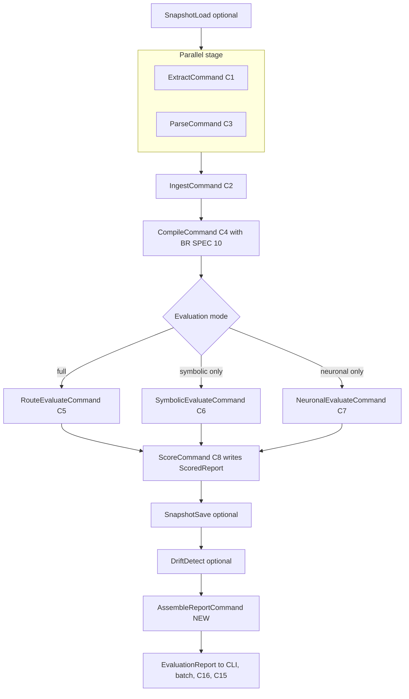
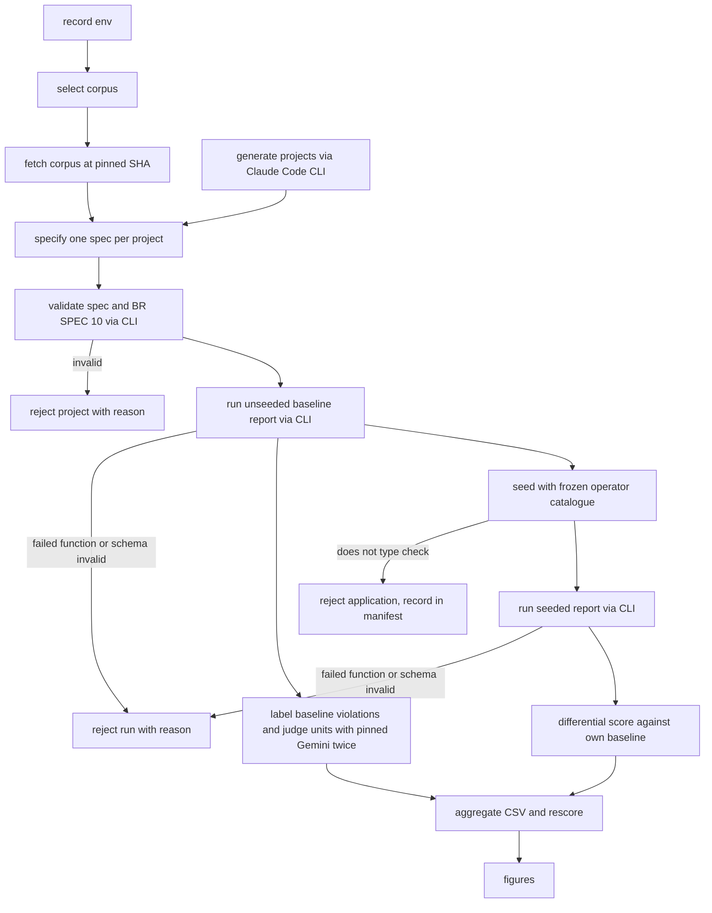

# v1.2E Application Design — Evaluation-Readiness Cycle (consolidated)

> **Stage**: INCEPTION → Application Design (minimal depth) · **Date**: 2026-10-06 · **Baseline**: `7cd15b4`
> **Consolidates**: `v1.2E-components.md`, `v1.2E-component-methods.md`, `v1.2E-services.md`, `v1.2E-component-dependency.md` (all in this directory).
> **Inputs**: `requirements/v1.2-evaluation-readiness-requirements.md` (FR-v1.2E-01..36, NFR-v1.2E-01..08), `plans/v1.2E-execution-plan.md` (revision 2, units U0-U5, shared-file ownership), `plans/v1.2E-execution-plan-adversarial-review.md` (F1-F14 accepted), `plans/v1.2E-application-design-plan.md` (Q1-Q10, all answered A).
> **Authority**: where this summary and a companion file differ, `v1.2E-component-methods.md` is the single source for every NEW or CHANGED name, path and signature. This file restates only the key interfaces; detailed business rules are deferred to Functional Design per unit.

**Notation**
- `FR-nn` = `FR-v1.2E-nn`, `NFR-nn` = `NFR-v1.2E-nn`, `D-n` = application-design decision Qn (all option A).
- **EXISTING** = unchanged at HEAD (cited `file:line`). **CHANGED** = exists at HEAD (cited) and is modified as stated. **NEW** = does not exist; intended path given.
- All line numbers refer to commit `7cd15b4`. A sample of the citations was re-checked against the working tree at HEAD while consolidating (`llm-provider.ts:3-18`, `llm-critic.ts:43`, `:61`, `score-computer.ts:7`, `scoring-engine.ts:64`, `batch-runner.ts:56-61`, `graph-ingester.ts:21`, `:64`, `fitness-compiler.ts:265-267`, `:297`, `cli.ts:93-98`, `enums.ts:1-19`, `pipeline-executor.ts:109`, `:126-129`, `package.json:35`).

---

## 1. Overview

### 1.1 Purpose

This cycle turns DaedalusArch into an instrument whose numbers can be used in the thesis evaluation, and adds the tools that produce those numbers. The design fixes four contracts once, in the foundation unit U0, so the later units can work in parallel without editing the same files:

1. **Graph contract**: a sixth node type `Package`, IMPORTS edge properties with a merge rule, `RE_EXPORTS` and `FLOWS_TO` edges.
2. **Spec contract**: typed function-specific fields, layer `kind`, the `integrity` dimension, template tags, judge units.
3. **Report contract**: execution facts, function results, graph and annotation statistics, timings, dropped dimensions and judge provenance, with a committed JSON Schema.
4. **LLM port**: model, effort and options reported back, so a Claude Code CLI provider can sit beside Gemini.

On top of these sit three NEW components: **C14** Claude CLI Provider, **C15** Experiment Toolkit (`scripts/`, outside `src/`) and **C16** Golden Regression Suite (Neo4j-backed, built first).

### 1.2 Binding decisions and where they show

| # | Decision (option A) | Where it shows in the design |
|---|---|---|
| D-1 | Claude models (judge and generator) reached only through the Claude Code headless CLI under the author's subscription; no API key; no Anthropic SDK | C14 `ClaudeCliProvider`; C15.5 `ClaudeCodeGeneratorAdapter`; `LLMConfig` removed (`src/pipeline/types.ts:4-11`); CLI and batch `ANTHROPIC_API_KEY` reads removed (`cli.ts:96`, `:397`, `batch-runner.ts:56-61`); unused `@anthropic-ai/sdk` (`package.json:35`) removed in U0 |
| D-2 | Judge unit: Semantic per file, Integrity per module (directory) | C10 `JudgeUnitKind`; C7 `enumerateCandidateUnits`, `selectJudgeUnits`, `assembleUnitSource` |
| D-3 | Type-only imports count and are flagged | `ImportEdgeProperties.isTypeOnly`; `Violation.isTypeOnly`; `ResultMapping.isTypeOnlyColumn` |
| D-4 | Layer kind precedence: explicit, exact name, position; 2-layer and 4+-layer rules | C3 `resolveLayerKinds`; C4 `bindLayerParams` with `applicationLayers` as a list; disabled reason `no application layer` |
| D-5 | Labeller: one pinned Gemini model run twice; disagreement = `uncertain`; 30-label stratified audit | C15.6 `reconcileRuns`, `sampleAudit` over `ReconciledLabel.projectId` |
| D-6 | Claude judge kept on Claude-generated projects; stated threat; Phase 5 Gemini cross-check | C7 provider-agnostic; `JudgeProvenance` in every report; harness switches provider options |
| D-7 | Seeded projects scored against their own unseeded baseline | C15.3 `scoreDifferential`, `newViolations`, line-independent `baselineMatchKey` |
| D-8 | Cuts: FR-16 reduced to removing the batch LLM config; FR-17 deferred; FR-21 reduced to `new T()` in fields and non-constructor field assignments; FR-20 kept with style-dependent applicability | C9 `runBatch`, `buildConfig`; no `externalFanOut` anywhere; C1 `deriveFlowsToEdges` with `via: 'new' \| 'field-assignment'`; C4 `isTemplateApplicable` |
| D-9 | Verdict thresholds 0.80 / 0.65 / 0.50 kept as shipped | C8 `determineVerdict` EXISTING (`verdict.ts:8`); C15.4 `thresholdBandSweep` describes sensitivity |
| D-10 | 25-30 working days | Not an interface concern |

### 1.3 Out of scope

Running experiments (results-plan Phases 3-5), Gemini/Codex/Antigravity generator adapters, the deviations of the compliance register, the tag and summative run, Chapters 8-9 analysis, graph JSON export and the PRD re-baseline (requirements section 5). FR-17 `externalFanOut` is deferred (D-8).

---

## 2. Components and unit ownership

Numbering follows the existing design (`application-design.md` C1-C11, `v1.1-components.md` C12-C13). The checklist in `v1.2E-application-design-plan.md` used a different order (for example "C2 spec parser"); that order is not used. **S1** is the existing pipeline module (`src/pipeline/`), which has never had a C-number; it is listed because every wiring change goes through it.

Only three new numbers are needed. The process runner and the secret scrubber are shared infrastructure and sit in C10; the cassette provider, unit selector and source assembler are internal to C7; the report builder and report-schema validator are internal to C8.

| Id | Component | Path | Status | Owning unit(s) | What changes | Requirements |
|---|---|---|---|---|---|---|
| — | Repository, compose, CI | `docker-compose.yml`, `.gitignore`, `package.json`, `.github/workflows/ci.yml`, `docs/` | CHANGED | U0 | Lock file tracked, `engines.node >=22`, no default Neo4j password, environment and corpus docs, `npm audit` step, golden-suite CI job | FR-01..06; NFR-06 |
| C1 | APG Extractor | `src/apg-extractor/` | CHANGED | U2 | Alias-aware resolution through ts-morph first; Package nodes; per-name barrel resolution replacing `resolveBarrelTransitively` (`edge-extractor.ts:290-332`); IMPORTS merge replacing keep-first dedup (`edge-extractor.ts:28-31`); RE_EXPORTS; FLOWS_TO; `import()`/`require` counted | FR-09, 10, 14, 21, 34; NFR-03 |
| C2 | Neo4j Ingestion | `src/neo4j-ingestion/` | CHANGED | U0 (enum-derived arrays, query timeout, scrubbed errors); U2 (edge properties, indexes, counts) | Type arrays from `NODE_TYPES`/`EDGE_TYPES` (`graph-ingester.ts:21`, `:64`); edge properties written (`:71-76`, `:84`); NEW `ensureIndexes`; `verifyIngestion` counts by type (`:100-116`); Package nodes not annotated (`layer-annotator.ts:30`); `executeQuery` timeout (`neo4j-repository.ts:15-38`) | FR-09, 10, 14; NFR-05, 07 |
| C3 | Spec Parser | `src/spec-parser/` | CHANGED | U1 (U4 sends rubric text as a patch) | Typed fields in `parseLayerB` (`layer-parsers.ts:40-113`); `kind` in `parseLayerA` (`:20-34`) and NEW `resolveLayerKinds`; `integrity` and `intent` alias with `SPEC_004`; schema (`spec-schema.ts`); Layered registry entry (`template-registry.ts:139`) and `presets/layered.yaml`; `judge_unit` | FR-07, 19, 20, 22, 29, 33 |
| C4 | Fitness Compiler | `src/fitness-compiler/` | CHANGED | U1; U3 adds `domain-purity` rewrite and `domain-state-purity` after U1 merges | `buildParams` (`fitness-compiler.ts:257-315`) binds by kind and reads typed fields (removes cast at `:297`); BR-SPEC-10; style applicability; template tags, `ORDER BY`, bounded cycle length; `applicationLayers` list; `judgeUnit` on instructions | FR-07, 08, 09, 11, 19, 20, 21, 29, 33, 35; NFR-02, 07 |
| C5 | Neuro-Symbolic Router | `src/neuro-symbolic-router/` | CHANGED (minor) | U4 | `routeAndEvaluate` (`router.ts:17`) passes `projectRoot` and `neuronalOptions`; copies symbolic and neuronal failures into `EvaluationResults.failures` | FR-13, 23, 33 |
| C6 | Evaluation Engine | `src/evaluation-engine/` | CHANGED | U3 | Mappings fill `line`, `lines`, `target`, `isTypeOnly`, `tag`, `discriminator` (`symbolic-evaluator.ts:52-76`); hashed ids replace the counter (`:50`, `:65`); cycle canonicaliser; `failures` output; scrubbed `EVAL_001` | FR-11, 12, 13, 21, 35; NFR-05, 07 |
| C7 | LLM Critic | `src/llm-critic/` | CHANGED | U0 (existing providers on the new port); U4 (all else) | Placeholder source removed (`llm-critic.ts:43`); fixed options replaced (`:61`); unit selection and iteration; real source context; cassettes keyed by unit with prompt hash, default mode `record`; `claude-cli` factory case; pinned Gemini id; `judgeProvenanceOf` | FR-22, 23, 31, 32, 33; NFR-08 |
| C8 | Scoring Engine | `src/scoring-engine/` | CHANGED | U3 (whole directory, including `universal-metrics.ts`) | `ALL_DIMENSIONS` from C10 (`score-computer.ts:7`); `computeAVR` by `r.dimension`; per-dimension `functionCount`; NEW renormaliser; `computeScores` returns `ScoredReport`; NEW report builder and report-schema validator; orphan metric typed `:File`, bounded cycle query | FR-09, 13, 14, 15, 23, 29, 32; NFR-07 |
| C9 | CLI | `src/cli/` | CHANGED | U3 (owner); U1 (`validate` action, before U3); U4 (provider-selection patches) | `validate` runs BR-SPEC-10 (`cli.ts:256-293`); `buildLLMProviderConfig` replaces key fallbacks (`cli.ts:93-106`, `:394-406`); batch LLM block removed (`batch-runner.ts:56-61`), non-symbolic batch rejected | FR-08, 13, 14, 16 (reduced), 23 |
| C10 | Shared Domain | `src/shared/` | CHANGED | U0 (read-only after U0) | Every contract (enums as `as const` arrays, spec, APG, violation, evaluation and report, LLM port, provider config); NEW process runner port and Node implementation; NEW secret scrubber; `QueryOptions` on `GraphRepository` | Contract halves of FR-07, 09, 10, 12, 13, 14, 15, 19, 21, 22, 23, 29, 31, 32, 33, 34; NFR-05, 07, 08 |
| C11 | Firewall Context | `src/shared/context/firewall-context.ts` | CHANGED (one slot) | U0 | NEW set-once `setScoredReport` / `getScoredReport` beside `:44-84`, `:93-128` | FR-13, 14 |
| C12 | Baseline Manager | `src/baseline/` | EXISTING | — | None: `generateKey` (`baseline-manager.ts:11-18`) does not use `Violation.id` | — |
| C13 | Report Generator (HTML) | `src/report/` | CHANGED (minor) | U3 | Model from `report.judge` instead of `GEMINI_MODEL` (`dashboard-data-builder.ts:104`); cards grouped by tag; failed functions and dropped dimensions shown; no duplicate warning merge (`report-generator.ts:32-36`) | FR-13, 15, 22, 23, 29 |
| S1 | Pipeline module | `src/pipeline/` | CHANGED | U3 (owner); U1 (`compile-command.ts`); U4 (factory provider hunk, neuronal and route commands) | NEW last command `AssembleReportCommand`; provider wiring (`pipeline-factory.ts:77-85`); `ScoreCommand` writes `setScoredReport` (`score-command.ts:50`); `CompileCommand` uses `compilerInputFromSpec` (`compile-command.ts:14-19`) | FR-08, 13, 14, 16, 20, 23 |
| C14 | Claude CLI Provider | `src/llm-critic/claude-cli-provider.ts` | NEW | U4 | `LLMProvider` over `claude -p --model claude-opus-5-5 --output-format json`, no tools, prompt on stdin, allow-listed env, neutral cwd | FR-23, 31; NFR-05, 08 |
| C15 | Experiment Toolkit | `scripts/`, `scripts/lib/`, `schemas/manifest.schema.json`, `tsconfig.scripts.json` | NEW | U5 (C15.1, C15.2, C15.5 as U5a after U0 + U2) | Mutation, manifest, differential scorer, re-scorer, generator adapter, labeller, run harness, corpus tools, environment recorder | FR-24..28, 36; supports FR-03, 05 |
| C16 | Golden Regression Suite | `tests/golden/` | NEW | U0 (U1, U2, U3 update snapshots) | Five fixtures × their spec, symbolic-only, against a real Neo4j through `createPipeline`; snapshot updates name their FR | FR-30; NFR-01 |

### 2.1 C15 sub-components

| Sub-component | Path (NEW) | Requirements | May start |
|---|---|---|---|
| C15.1 Manifest schema | `schemas/manifest.schema.json`, `scripts/lib/manifest.ts` | FR-24, 25 | after U0 + U2 |
| C15.2 Mutation tool | `scripts/mutate.ts`, `scripts/lib/mutation/*`, `docs/operator-catalogue.md` | FR-24 | after U0 + U2 |
| C15.3 Matching rule and differential scorer | `docs/matching-rule.md`, `scripts/score-golden.ts` | FR-25; D-7 | after U3 |
| C15.4 Re-scorer | `scripts/rescore.ts` | FR-26; D-9 | after U3 |
| C15.5 Agentic generator adapter | `scripts/generate-projects.ts`, `scripts/lib/generators/claude-code.ts` | FR-28; D-1 | after U0 + U2 |
| C15.6 Gemini labeller | `scripts/llm-label.ts` | FR-27; D-5 | after U3 |
| C15.7 Run harness | `scripts/run-experiment.ts` | FR-36 | after U3 |
| C15.8 Corpus tools | `scripts/select-corpus.ts`, `scripts/fetch-corpus.ts`, `scripts/aggregate.ts` | FR-36; extends FR-05 | after U3 |
| C15.9 Environment recorder | `scripts/record-env.ts` | FR-36; feeds FR-03 | after U0 |
| Report I/O | `scripts/lib/report-io.ts` | FR-36 | after U3 (frozen schema) |

### 2.2 Shared-file ownership (summary)

The full 23-row table is in `v1.2E-component-dependency.md` section 6. The rows that govern parallel work:

| File | Owner | Others |
|---|---|---|
| `src/shared/types/*`, `src/shared/interfaces/*`, `src/shared/process/*`, `src/shared/errors/scrub.ts`, `src/shared/taxonomy/violation-types.ts`, `firewall-context.ts` slot | U0 | read-only after U0 |
| `src/fitness-compiler/types.ts` (`ResultMapping`, `CypherTemplate`, `LayerKindBinding`) | U0 (shape) | U1 fills tags, U3 fills mapping columns |
| `src/spec-parser/spec-schema.ts`, `template-registry.ts`, `presets/*.yaml` | U1 | U4 sends rubric text as a patch |
| `src/fitness-compiler/cypher-templates.ts` | U1 (tags, `ORDER BY`, cycle bound, orphan `:File`) | U3 rewrites `domain-purity` (`:83`) and adds `domain-state-purity` after U1 merges |
| `schemas/report.schema.json` | U0 (draft), U3 (freeze) | U5 and C16 consume |
| `src/pipeline/pipeline-factory.ts`, `score-command.ts`, NEW `assemble-report-command.ts`, `src/cli/cli.ts` | U3 | U1 edits `validate` first; U4 sends patches for `pipeline-factory.ts:77-85`, `cli.ts:93-106`, `:394-406` |
| `src/llm-critic/{gemini,mock,null}-provider.ts`, `llm-critic.ts` | U0 (port compile fixes), then U4 | sequential |
| `src/shared/types/spec.ts` `ScoringWeights` | U0 (makes the mechanical compile fixes at `layer-parsers.ts:124-150`, `template-registry.ts:87`, `:97`, `spec-validator.ts:157-158`) | U1 does the FR-22 work proper |
| `tests/golden/**` | U0 creates | U1, U2, U3 update, one commit per FR, regenerated after rebase |
| `fixtures/` | frozen | new test fixtures go under `tests/fixtures/` |

---

## 3. Key interfaces

Signatures below are restated from `v1.2E-component-methods.md`; only the shapes needed to understand the boundaries are shown. Every fallible method returns the EXISTING `DomainResult<T>` (`src/shared/errors/domain-result.ts:13-15`).

### 3.1 Revised LLM port and the Claude CLI route (C10, C7, C14) — FR-23, FR-31, NFR-08, D-1

```typescript
// CHANGED src/shared/interfaces/llm-provider.ts:3-7 — the literal `temperature: 0` goes (FR-31, F1)
export type LLMEffort = 'low' | 'medium' | 'high' | 'xhigh' | 'max';     // NEW
export interface LLMOptions {
  readonly model: string;                // required, pinned id, e.g. 'claude-opus-5-5'
  readonly effort?: LLMEffort;
  readonly maxTokens: number;            // critic default raised from 1000 (llm-critic.ts:61); value set in FD U4
  readonly temperature?: number;
  readonly seed?: number;
}
// CHANGED llm-provider.ts:9-13 — providers report what they used (FR-31)
export interface LLMResponse {
  readonly content: string;
  readonly model: string;
  readonly usage: { readonly inputTokens: number; readonly outputTokens: number };
  readonly usedOptions: Partial<LLMOptions>;               // NEW
  readonly ignoredOptions: readonly (keyof LLMOptions)[];  // NEW
}
// CHANGED llm-provider.ts:15-18 — describe() lets every report name provider and model (FR-23)
export interface LLMProvider {
  readonly name: string;
  evaluate(prompt: string, options: LLMOptions): Promise<DomainResult<LLMResponse>>;
  describe(): ProviderDescription;       // NEW
}

// CHANGED src/shared/types/llm-config.ts — no credential field for Claude by construction
export type VCRMode = 'record' | 'replay';                 // moved from llm-critic/types.ts:6; 'bypass' removed
export interface ClaudeCliConfig {                         // NEW
  readonly binary: string;               // default 'claude'
  readonly model: string;                // default 'claude-opus-5-5'
  readonly effort?: LLMEffort;
  readonly timeoutMs: number;
  readonly neutralCwd: string;           // empty temp dir: the child never reads this repo's CLAUDE.md
}
export interface LLMProviderConfig {                       // CHANGED llm-config.ts:8-11
  readonly provider: 'mock' | 'gemini' | 'claude-cli';
  readonly gemini?: GeminiConfig;        // EXISTING; apiKey from GEMINI_API_KEY, read by the CLI only
  readonly claudeCli?: ClaudeCliConfig;
  readonly cassette: { readonly mode: VCRMode; readonly dir: string };
}

// NEW src/shared/interfaces/process-runner.ts + src/shared/process/node-process-runner.ts (C10, U0)
export interface ProcessRunOptions {
  readonly stdin?: string; readonly cwd?: string; readonly timeoutMs: number;
  readonly env: Readonly<Record<string, string>>;           // explicit allow-list, never process.env wholesale
}
export interface ProcessResult { readonly exitCode: number; readonly stdout: string; readonly stderr: string; readonly timedOut: boolean; readonly durationMs: number }
export interface ProcessRunner {
  run(command: string, args: readonly string[], options: ProcessRunOptions): Promise<DomainResult<ProcessResult>>;
}
export class NodeProcessRunner implements ProcessRunner { /* spawn with argv array, never a shell string */ }
export function buildChildEnv(parent: NodeJS.ProcessEnv, allow: readonly string[]): Readonly<Record<string, string>>;

// NEW src/shared/errors/scrub.ts (C10, U0) — NFR-05, NFR-08
export function scrubSecrets(text: string, knownSecrets: readonly string[]): string;
export function scrubWarning<W extends DomainWarning>(warning: W, knownSecrets: readonly string[]): W;
export function scrubDeep<T>(value: T, knownSecrets: readonly string[]): T;

// NEW src/llm-critic/claude-cli-provider.ts (C14, U4)
export class ClaudeCliProvider implements LLMProvider {
  readonly name = 'claude-cli';
  constructor(config: ClaudeCliConfig, runner?: ProcessRunner);   // default NodeProcessRunner
  evaluate(prompt: string, options: LLMOptions): Promise<DomainResult<LLMResponse>>;
  describe(): ProviderDescription;       // { provider: 'claude-cli', model, effort, cliVersion }
  isAvailable(): Promise<boolean>;
  getModelName(): string;
}
// -p --model <id> --output-format json --tools "" --no-session-persistence
// --exclude-dynamic-system-prompt-sections [--effort <level>]; prompt on stdin; never --bare (keychain login)
export function buildClaudeCliArgs(config: ClaudeCliConfig, options: LLMOptions): readonly string[];
export function parseClaudeCliEnvelope(stdout: string): DomainResult<ClaudeCliEnvelope>;

// NEW src/llm-critic/cassette-provider.ts (C7, U4) — FR-23 "every exchange recorded"; reused by C15.6
export function cassetteKey(functionId: string, unitId: string | undefined, runIndex: number): string;
export class CassetteLLMProvider implements LLMProvider {
  constructor(inner: LLMProvider, mode: VCRMode, cassetteDir: string, context: { functionId: string; unitId?: string });
  evaluate(prompt: string, options: LLMOptions, runIndex?: number): Promise<DomainResult<LLMResponse>>;
  describe(): ProviderDescription;
}
// CHANGED provider-factory.ts:13-41 — 'claude-cli' case; every real provider wrapped in CassetteLLMProvider
export function createLLMProvider(config?: LLMProviderConfig): LLMProvider;
export function judgeProvenanceOf(provider: LLMProvider | undefined,
  run: { readonly cassetteMode: VCRMode; readonly runsPerUnit: number }): JudgeProvenance;   // NEW

// NEW src/cli/llm-options.ts (C9, U4) — never reads ANTHROPIC_API_KEY
export function buildLLMProviderConfig(opts: LLMCliOptions, env: NodeJS.ProcessEnv,
  mode: EvaluationMode): DomainResult<LLMProviderConfig | undefined>;
```

Judge-side C7 additions (FR-33, D-2): `JudgeUnit`, `UnitSelectionRule`, `enumerateCandidateUnits(kind, graph)`, `selectJudgeUnits(candidates, rule): { selected; capped }`, `iterateJudgeUnits(instruction, units, ctx): AsyncIterable<DomainResult<JudgeUnitResult>>`, `aggregateUnitVerdicts(units)` in NEW `src/llm-critic/judge-unit-selector.ts`; `assembleUnitSource(unit, projectRoot, graph, budget, maxNodes?)` in NEW `src/llm-critic/source-context.ts`; CHANGED `assembleContext(instruction, unitContext, adrProse?, budget?)` (`context-assembler.ts:9`); CHANGED `NeuronalEvalInput` gains `projectRoot` and `options: Partial<NeuronalRunOptions>` (`types.ts:8-17`). Error codes: `LLM_CLI_NOT_FOUND`, `LLM_CLI_EXIT`, `LLM_CLI_TIMEOUT`, `LLM_CLI_BAD_ENVELOPE`, `CASSETTE_MISS`.

The port is frozen at the end of U0. `GeminiProvider`, `MockLLMProvider` and `NullLLMProvider` implement `describe()` and the new options in U0 (FR-31 acceptance: they compile against the new port and do not send unused options).

### 3.2 Report contract (C10, C8, S1, C11) — FR-13, FR-14, FR-15, FR-23, FR-29

```typescript
// NEW / CHANGED src/shared/types/evaluation.ts
export interface FunctionFailure { readonly functionId: FunctionId; readonly name: string; readonly code: string; readonly message: string /* scrubbed */ }
export interface FunctionExecution { readonly compiled: number; readonly executed: number; readonly failed: readonly FunctionFailure[] }
export interface FunctionResultRow {
  readonly functionId: FunctionId; readonly name: string; readonly dimension: Dimension; readonly route: Route;
  readonly tag?: TemplateTag; readonly passed: boolean; readonly violationCount: number; readonly executionTimeMs: number;
}
export type DroppedReason = 'disabled_by_spec' | 'execution_failure' | 'none_declared';
export interface DroppedDimension { readonly dimension: Dimension; readonly reason: DroppedReason; readonly declared: number; readonly executed: number }
export interface StageTimings { readonly stages: readonly StageTimingEntry[]; readonly totalMs: number }   // moved from src/pipeline/types.ts:63-72
export interface JudgeProvenance extends ProviderDescription {   // provider 'claude-cli' | 'gemini' | 'mock' | 'null' | 'none'
  readonly cassetteMode?: VCRMode; readonly runsPerUnit: number;  // symbolic-only: provider 'none', model 'none', runsPerUnit 0
}
// CHANGED evaluation.ts:117-123 — functionCount per dimension; effectiveWeight after renormalisation
export interface PerDimensionScore { /* dimension, avr, weight, violationCount, functionCount */ readonly effectiveWeight: number }
// CHANGED evaluation.ts:112-115
export interface EvaluationResults { /* symbolicResults, neuronalResults */ readonly failures: readonly FunctionFailure[] }

// CHANGED evaluation.ts:134-148 — existing fields kept; NEW fields marked
export interface EvaluationReport {
  readonly runId: RunId; readonly projectPath: string; readonly specVersion: string;
  readonly ahsDeterministic: AHSScore; readonly ahsCombined?: AHSScore; readonly ahsNeuronal?: AHSScore;
  readonly verdict: OverallVerdict; readonly perDimensionScores: readonly PerDimensionScore[];
  readonly violations: readonly Violation[]; readonly universalMetrics: UniversalHealthMetrics;
  readonly evaluationMode: EvaluationMode; readonly durationMs: number;
  readonly warnings: readonly PipelineWarning[];            // now populated on the JSON path
  readonly functionExecution: FunctionExecution;            // NEW
  readonly functionResults: readonly FunctionResultRow[];   // NEW
  readonly graphStats: GraphStats;                          // NEW (gains nodeCountByType, edgeCountByType)
  readonly layerAnnotation: LayerAnnotationSummary;         // NEW (EXISTING type evaluation.ts:21-25)
  readonly parseCoverage: ParseCoverage;                    // NEW (EXISTING type apg.ts:29-34)
  readonly importResolution: ImportResolutionStats;         // NEW
  readonly timings: StageTimings;                           // NEW
  readonly droppedDimensions: readonly DroppedDimension[];  // NEW
  readonly judge: JudgeProvenance;                          // NEW, always present
}
export type ScoredReport = Omit<EvaluationReport, 'warnings' | 'functionExecution' | 'functionResults' |
  'graphStats' | 'layerAnnotation' | 'parseCoverage' | 'importResolution' | 'timings' | 'judge'>;   // NEW

// CHANGED src/shared/taxonomy/violation-types.ts:35-48 — NEW optional fields
//   line?, lines?, target?, isTypeOnly?, tag?, unitId?, discriminator?; `id` becomes a deterministic hash

// CHANGED C11 firewall-context.ts — NEW set-once slot
setScoredReport(scored: ScoredReport): void;
getScoredReport(): ScoredReport;

// CHANGED src/scoring-engine/scoring-engine.ts:14 — returns the scored core
export async function computeScores(input: ScoringInput): Promise<DomainResult<ScoredReport>>;
// NEW src/scoring-engine/renormaliser.ts — exported for C15.4
export function renormaliseWeights(weights: ScoringWeights, executed: ReadonlyMap<Dimension, number>,
  declared: ReadonlyMap<Dimension, number>, disabled: ReadonlyMap<Dimension, number>,
  dimensions: readonly Dimension[]): { effectiveWeights: ScoringWeights; dropped: readonly DroppedDimension[] };
// NEW src/scoring-engine/report-builder.ts — pure
export interface RunFacts {
  readonly apg: Pick<APGResult, 'parseCoverage' | 'importResolution'>; readonly ingestion: IngestionResult;
  readonly compiled: CompiledFunctions; readonly evaluation: EvaluationResults; readonly timings: StageTimings;
  readonly pipelineWarnings: readonly PipelineWarning[]; readonly judge: JudgeProvenance; readonly knownSecrets: readonly string[];
}
export function buildEvaluationReport(scored: ScoredReport, facts: RunFacts): DomainResult<EvaluationReport>;
// NEW src/pipeline/commands/assemble-report-command.ts — appended last by createPipeline
export type TimingSource = () => StageTimings;   // bound to executor.getTimings() (pipeline-executor.ts:126-129)
export class AssembleReportCommand implements PipelineCommand {
  constructor(timingSource: TimingSource, judge: JudgeProvenance, knownSecrets: readonly string[]);
  execute(context: FirewallContext): Promise<DomainResult<void>>;   // writes the EXISTING setReport
}
// NEW src/scoring-engine/report-schema-validator.ts against NEW schemas/report.schema.json
export function validateReport(json: unknown): { valid: boolean; errors: readonly { path: string; message: string }[] };
export function parseReport(json: unknown): DomainResult<EvaluationReport>;
```

One design: the report is assembled **inside the pipeline**, so the CLI JSON path (`cli.ts:123`, `:153`), the HTML path, `batch`, C16 and (through stdout) C15 all see the same object returned by `executor.execute()` (`pipeline-executor.ts:109`). Today `computeScores` sets `warnings: []` (`scoring-engine.ts:64`) and only the HTML path merges context warnings (`cli.ts:443`, `report-generator.ts:32-36`); after the change the merge happens once in `buildEvaluationReport`. FR-17 `externalFanOut` does not appear (D-8).

### 3.3 Graph contract additions (C10, C1, C2) — FR-09, FR-10, FR-14, FR-21, FR-34, NFR-07

```typescript
// CHANGED src/shared/types/enums.ts:1-19 — unions derived from runtime arrays
export const NODE_TYPES = ['File', 'Class', 'Interface', 'Method', 'Function', 'Package'] as const;
export const EDGE_TYPES = ['IMPORTS', 'IMPLEMENTS', 'EXTENDS', 'CONSTRUCTOR_INJECTS', 'CALLS', 'DECLARES',
  'CONTAINS', 'FLOWS_TO', 'RE_EXPORTS'] as const;
export type NodeType = (typeof NODE_TYPES)[number];
export type EdgeType = (typeof EDGE_TYPES)[number];

// NEW typed views of APGEdge.properties / APGNode.properties (src/shared/types/apg.ts)
export interface ImportEdgeProperties {
  readonly specifier: string; readonly specifiers: readonly string[];
  readonly line: number /* min(lines) */; readonly lines: readonly number[];
  readonly isTypeOnly: boolean /* true only if every statement is type-only */; readonly importedNames: readonly string[];
}
export interface ReExportEdgeProperties { readonly specifier: string; readonly specifiers: readonly string[];
  readonly line: number; readonly lines: readonly number[]; readonly exportedNames: readonly string[] }
export interface FlowsToEdgeProperties { readonly field: string; readonly via: 'new' | 'field-assignment'; readonly line: number }
export interface PackageNodeProperties { readonly scope: 'npm' | 'node' | `@${string}` }
export interface ImportResolutionStats { readonly resolvedInternal: number; readonly external: number;
  readonly unresolved: number; readonly unsupportedDynamic: number }
// CHANGED apg.ts:22-27 — APGResult gains importResolution: ImportResolutionStats

// NEW src/apg-extractor/import-resolver.ts (C1, U2)
export function classifySpecifier(specifier: string): 'relative' | 'alias-or-bare' | 'node-builtin';
export function resolveImportTargets(importDecl: ImportDeclaration, sourceFile: SourceFile,
  ctx: ImportResolutionContext): readonly ImportOccurrence[];        // ts-morph first, so tsconfig paths resolve to files
export function resolveReExportTargets(exportDecl: ExportDeclaration, sourceFile: SourceFile,
  ctx: ImportResolutionContext): readonly ImportOccurrence[];
export function resolveNameToDeclaringFile(name: string, moduleFile: SourceFile, ctx: ImportResolutionContext): SourceFile | null;
export function countUnsupportedDynamicImports(sourceFile: SourceFile): number;
// NEW src/apg-extractor/package-node-factory.ts
export function packageRootOf(specifier: string): PackageRoot;      // '@nestjs/common/decorators' -> '@nestjs/common'
export function createPackageNode(root: PackageRoot): APGNode;      // filePath '', properties { scope }
export class PackageNodeRegistry { getOrCreate(root: PackageRoot): APGNode; nodes(): readonly APGNode[] }
// NEW src/apg-extractor/import-edge-merger.ts — one edge per (edgeType, sourceId, targetId)
export class ImportEdgeMerger { add(occurrence: ImportOccurrence, targetNodeId: string): void; edges(): readonly APGEdge[] }
// NEW src/apg-extractor/flows-to-deriver.ts — constructor-parameter flows NOT derived (CONSTRUCTOR_INJECTS covers them, D-8)
export function deriveFlowsToEdges(cls: ClassDeclaration, classNodeId: string, lookup: NodeLookup,
  projectRoot: string, addWarning: (filePath: string, code: string, message: string) => void): readonly APGEdge[];
// CHANGED src/apg-extractor/edge-extractor.ts:10-13 — EdgeExtractionResult gains packageNodes, importResolution

// C2 (U2): CHANGED ingestNodes / ingestEdges iterate NODE_TYPES / EDGE_TYPES and write edge properties;
// NEW ensureIndexes(graphRepo): Promise<DomainResult<void>>; CHANGED verifyIngestion returns GraphStats by type.
// C10 (U0): CHANGED src/shared/interfaces/graph-repository.ts:9
export interface QueryOptions { readonly timeoutMs?: number }
executeQuery(cypher: string, params?: Record<string, unknown>, options?: QueryOptions): Promise<DomainResult<QueryResult>>;
```

`RE_EXPORTS` is decided here as a ninth `EdgeType`, not an IMPORTS property, so U2 never edits `enums.ts` and an import and a re-export on the same pair never merge. Unresolvable relative imports keep `EXTRACTOR_002`; `EXTRACTOR_001` is no longer emitted for package imports (`edge-extractor.ts:252-256`).

### 3.4 Spec and compiler contract additions (C10, C3, C4) — FR-07, FR-08, FR-19, FR-20, FR-22, FR-29, FR-33, FR-35

```typescript
// CHANGED src/shared/types/enums.ts
export const DIMENSIONS = ['structural', 'coupling', 'pattern', 'solid', 'convention', 'semantic', 'integrity'] as const;
export const SYMBOLIC_DIMENSIONS = ['structural', 'coupling', 'pattern', 'solid', 'convention'] as const;
export const MODEL_JUDGED_DIMENSIONS = ['semantic', 'integrity'] as const;
export type Dimension = (typeof DIMENSIONS)[number];      // 'intent' leaves the type; schema alias -> 'semantic' + SPEC_004
export type LayerKind = 'domain' | 'application' | 'infrastructure' | 'presentation';
export type TemplateTag = 'structural' | 'topological' | 'pattern-proxy';
export type JudgeUnitKind = 'file' | 'class' | 'module';

// CHANGED src/shared/types/spec.ts:4-17 — FitnessFunction gains
//   forbiddenImports?, maxPublicMethods?, maxDependencies?, maxInterfaceMethods?, maxDepth?, pattern?, judgeUnit?
// CHANGED spec.ts:41-48 — LayerDefinition gains kind?: LayerKind, kindSource?: 'explicit' | 'name' | 'position'
// CHANGED spec.ts:50-58
export type ScoringWeights = Readonly<Record<Dimension, number>>;
// CHANGED spec.ts:72-81 — ParsedSpec gains style?: string

// NEW src/spec-parser/function-fields.ts, dimension-alias.ts, layer-kind-resolver.ts (C3, U1)
export function mapFunctionSpecificFields(raw: Readonly<Record<string, unknown>>, path: string):
  { fields: FunctionSpecificFields; errors: readonly ValidationError[] };
export function normaliseDimension(raw: string, path: string): { dimension: Dimension; warning?: ValidationWarning };
export function resolveLayerKinds(layers: readonly LayerDefinition[]):
  { readonly layers: readonly LayerDefinition[]; readonly warnings: readonly ValidationWarning[] };   // D-4 precedence

// CHANGED src/fitness-compiler/types.ts:33-46 (shape U0)
export interface ResultMapping { /* filePathColumn, messageTemplate, metadataColumns? */
  readonly lineColumn?: string; readonly linesColumn?: string; readonly targetColumn?: string;
  readonly isTypeOnlyColumn?: string; readonly discriminatorColumns: readonly string[]; readonly cycleColumn?: string }
export interface CypherTemplate { /* functionName, template, requiredParams, optionalParams, description, resultMapping */
  readonly tag: TemplateTag; readonly requiredLayerKinds: readonly LayerKind[]; readonly applicableStyles?: readonly string[] }
export interface LayerKindBinding { readonly domainLayer?: string; readonly applicationLayers: readonly string[];
  readonly infraLayer?: string; readonly presentationLayer?: string }
export interface CompilerInput { /* fitnessFunctions, adrRules, layerModel, scoringWeights */ readonly style?: string }

// NEW C4 files (U1)
export function bindLayerParams(layers: readonly LayerDefinition[]): LayerKindBinding;              // layer-binding.ts
export function compilerInputFromSpec(spec: ParsedSpec): CompilerInput;                            // compiler-input.ts
export function checkBoundParameters(input: CompilerInput): DomainResult<void>;                    // bound-param-checker.ts; always fatal
export function findUnboundParameters(input: CompilerInput): readonly UnboundParameter[];          // probe for Build and Test
export function isTemplateApplicable(template: CypherTemplate, style: string | undefined,
  binding: LayerKindBinding): Applicability;                                                       // template-applicability.ts
export function getTemplateTag(functionName: string): TemplateTag | undefined;                     // cypher-templates.ts
export function listTemplatesByTag(tag: TemplateTag): readonly string[];
// CHANGED fitness-compiler.ts:257 — exported; binds by kind, reads typed fields (removes the cast at :297)
export function buildParams(ff: FitnessFunction, layerModel: LayerModel, binding: LayerKindBinding): Readonly<Record<string, unknown>>;
// CHANGED fitness-compiler.ts:32 — signature unchanged; calls checkBoundParameters first; disables by style
// and by missing layer kind (reason 'no application layer', COMPILER_004)
export function compileFunctions(input: CompilerInput): DomainResult<CompiledFunctions>;

// NEW C6 files (U3)
export function computeViolationId(input: ViolationIdInput): string;                 // violation-id.ts; FR-12
export function computeNeuronalViolationId(functionId: FunctionId, unitId: string, filePath: string, message: string): string;
export function canonicaliseCycle(path: readonly string[]): readonly string[];       // cycle-canonicaliser.ts; FR-35
export function dedupeCycleRecords(records: readonly Record<string, unknown>[], cycleColumn: string): readonly Record<string, unknown>[];
```

Templates that read the application layer (`cypher-templates.ts:98`, `:127`, `:131`, `:270`, `:283`) switch from `= $applicationLayer` to `IN $applicationLayers`; with three layers the list has one element, so shipped specs match the same rows. BR-SPEC-10 has two call sites: `compileFunctions` (reached through `CompileCommand` by `evaluate`, `report` and `batch`) and the CLI `validate` action. C4 never imports C3; it reads only the C10 `LayerDefinition.kind`.

### 3.5 Toolkit interfaces (C15) — FR-24..28, FR-36

C15 evaluates only through the built CLI as a subprocess (`node dist/cli/index.js evaluate --format json`). Its in-process imports from `src/` are limited to C10 (types, process runner, scrubber), C3 `parseSpec`, C7 `GeminiProvider` and `CassetteLLMProvider`, and C8 `renormaliseWeights`, `computeAHS`, `determineVerdict`, `parseReport`, `validateReport`. It never imports C14.

```typescript
// C15.2 mutation (scripts/mutate.ts, scripts/lib/mutation/*) — FR-24
export interface MutationOperator {
  readonly id: string; readonly dimension: Dimension | 'data-flow'; readonly twinOf?: string;
  readonly source: string /* published source, frozen catalogue */; readonly coveredByTemplates: readonly string[];
  findSites(project: ProjectHandle, spec: ParsedSpec): readonly MutationSite[];
  apply(project: ProjectHandle, site: MutationSite, rng: SeededRng): DomainResult<MutationApplication>;
}
export class OperatorRegistry { constructor(catalogueVersion: string); register(op: MutationOperator): void;
  get(id: string): MutationOperator | undefined; list(): readonly MutationOperator[]; freeze(): void }
export async function applyMutation(projectDir: string, operatorId: string, rng: SeededRng,
  manifestPath: string, registry: OperatorRegistry): Promise<DomainResult<ManifestRow>>;   // edit + manifest row in one step; tsc gate
export async function typecheckProject(projectDir: string): Promise<DomainResult<void>>;
// C15.1 manifest (scripts/lib/manifest.ts, schemas/manifest.schema.json)
export function validateManifest(json: unknown): { valid: boolean; errors: readonly { path: string; message: string }[] };
export function appendManifestRow(manifestPath: string, row: ManifestRow): DomainResult<void>;

// C15.3 differential scorer (scripts/score-golden.ts) — FR-25, D-7
export function scoreDifferential(baseline: EvaluationReport, seeded: EvaluationReport, manifest: Manifest,
  rule: MatchingRule): DomainResult<GoldenScore>;            // rejects reports with failed functions
export function baselineMatchKey(v: Violation): string;      // line-independent: functionId, filePath, target, discriminator
export function newViolations(baseline: EvaluationReport, seeded: EvaluationReport, rows: readonly ManifestRow[],
  rule: MatchingRule): readonly Violation[];
export function computePrf(c: Confusion): Prf;

// C15.4 re-scorer (scripts/rescore.ts) — FR-26, D-9
export function rescore(report: EvaluationReport, scenario: RescoreScenario): DomainResult<RescoreResult>;
export function leaveOneDimensionOut(report: EvaluationReport, base: RescoreScenario): readonly RescoreResult[];
export function thresholdBandSweep(report: EvaluationReport, base: RescoreScenario, bands: readonly VerdictThresholds[]): readonly RescoreResult[];

// C15.5 generator (scripts/generate-projects.ts, scripts/lib/generators/claude-code.ts) — FR-28, D-1, F11
export interface GeneratorAdapter { readonly id: string; readonly modelId: string;
  isAvailable(): Promise<boolean>; generate(req: GenerationRequest): Promise<DomainResult<GenerationOutcome>> }
export class ClaudeCodeGeneratorAdapter implements GeneratorAdapter { constructor(config: ClaudeCliConfig, runner: ProcessRunner) }
export function buildGeneratorArgs(config: ClaudeCliConfig, req: GenerationRequest): readonly string[];
export async function runGenerationGrid(adapters: readonly GeneratorAdapter[], styles: readonly string[],
  levels: readonly SpecLevel[], runs: number, outRoot: string): Promise<readonly GenerationOutcome[]>;

// C15.6 labeller (scripts/llm-label.ts) — FR-27, D-5
export async function labelViolations(items: readonly LabelItem<'violation'>[], cfg: LabellerConfig): Promise<readonly ReconciledLabel<ViolationLabel>[]>;
export async function labelJudgeUnits(items: readonly LabelItem<'judge-unit'>[], cfg: LabellerConfig): Promise<readonly ReconciledLabel<UnitLabel>[]>;
export function reconcileRuns<L>(a: LabelRun<L>, b: LabelRun<L>): L | 'uncertain';
export function sampleAudit<L>(labels: readonly ReconciledLabel<L>[], n: number, seed: number): readonly ReconciledLabel<L>[];
export function agreement<L>(a: readonly { itemId: string; label: L }[], b: readonly { itemId: string; label: L }[]): AgreementStats;

// C15.7 / C15.8 / C15.9 harness, corpus, environment — FR-36
export async function runExperiment(plan: ExperimentPlan): Promise<DomainResult<readonly RunRecord[]>>;
export function acceptReport(report: unknown): DomainResult<EvaluationReport>;   // schema-valid and zero failed functions
export async function aggregate(resultsDir: string, outCsvDir: string): Promise<DomainResult<readonly string[]>>;
export async function drawFigures(csvDir: string, outDir: string): Promise<DomainResult<readonly string[]>>;
export function selectCorpus(candidates: readonly CorpusCandidate[], criteria: CorpusCriteria): readonly CorpusEntry[];
export async function fetchCorpus(entries: readonly CorpusEntry[], destDir: string): Promise<DomainResult<readonly { entry: CorpusEntry; path: string }[]>>;
export async function recordEnvironment(): Promise<DomainResult<EnvironmentRecord>>;
export function loadReport(path: string): DomainResult<EvaluationReport>;                      // scripts/lib/report-io.ts
export function saveReport(path: string, report: EvaluationReport): DomainResult<void>;
```

### 3.6 Golden regression suite (C16) — FR-30, NFR-01

```typescript
// NEW tests/golden/golden-cases.ts, tests/golden/golden-runner.ts
export interface GoldenCase { readonly id: string; readonly projectPath: string; readonly specPath: string; readonly mode: EvaluationMode }
export const GOLDEN_CASES: readonly GoldenCase[];            // the five fixtures x their spec
export async function runGoldenCase(c: GoldenCase,
  neo4j: { uri: string; user: string; password: string }): Promise<DomainResult<EvaluationReport>>;   // through createPipeline
export function normaliseForSnapshot(caseId: string, report: EvaluationReport): GoldenSnapshot;
```

Snapshots live in `tests/golden/__snapshots__/<caseId>.json`; each update names its FR in `tests/golden/CHANGES.md` and in its commit. At `7cd15b4` `functionResults` does not exist, so U0 derives the equivalent from `EvaluationResults`.

---

## 4. The two pipelines

### 4.1 Evaluation pipeline (S1, with the judge sub-pipeline)

The orchestration pattern is EXISTING: `PipelineExecutor` runs commands in order against one `FirewallContext`, fail-fast on the first failure (`pipeline-executor.ts:20-138`). The only new command is the last one.



**Text alternative.** An optional snapshot load runs first. Extraction (C1) and spec parsing (C3) run in parallel. Ingestion (C2) loads the graph into Neo4j. Compilation (C4) starts with the fatal BR-SPEC-10 binding check. One evaluation command runs, chosen by mode: route-and-evaluate (C5) for full mode, symbolic-only (C6), or neuronal-only (C7). Scoring (C8) writes the scored core into the new context slot. Optional snapshot save and drift detection follow. The new `AssembleReportCommand` builds the complete `EvaluationReport` from the scored core, the compiled functions, the evaluation results and their failures, the context warnings, the executor timings and the judge provenance, and that one object goes to the CLI, batch, the golden suite and (as stdout JSON) the experiment harness.

| Stage | What changes inside | Feeds report field | FR / NFR |
|---|---|---|---|
| Extract (C1) | Package nodes, alias-aware and per-name resolution, RE_EXPORTS, merged IMPORTS properties, FLOWS_TO, resolution counts | `parseCoverage`, `importResolution`, warnings | FR-09, 10, 21, 34 |
| Parse (C3) | typed fields, `kind`, `integrity`, `intent` alias (`SPEC_004`), `style`, tags, `judge_unit` | `specVersion`, tags | FR-07, 19, 20, 22, 29, 33 |
| Ingest (C2) | enum-derived arrays, edge properties, Package label and index, counts by type | `graphStats`, `layerAnnotation` | FR-09, 10, 14 |
| Compile (C4) | BR-SPEC-10 (fatal), binding by kind, style applicability, `ORDER BY`, bounded cycles | `functionExecution.compiled`, `droppedDimensions` | FR-07, 08, 19, 20, 35; NFR-02, 07 |
| Evaluate (C5, C6, C7) | location fields, hashed ids, cycle canonicalisation, query timeout, structured failures; judge sub-pipeline | `violations`, `functionResults`, `functionExecution.failed` | FR-11, 12, 13, 21, 22, 23, 32, 33, 35; NFR-05, 07 |
| Score (C8) | renormalisation, per-dimension denominators, neural results in their own dimension, run id from the context | `ahs*`, `verdict`, `perDimensionScores`, `droppedDimensions` | FR-14, 15, 32, 35 |
| Assemble (S1 + C8) | NEW: merge and scrub warnings, execution facts, timings, judge provenance | the complete report | FR-13, 14, 23, 29; NFR-05, 08 |

**Judge sub-pipeline (C7 + C14).** For each neuronal instruction: (1) select units deterministically (unit kind from `judgeUnit`, defaults Semantic = file, Integrity = module; rule over layer, size and a seeded list, with a per-run cap); (2) assemble each unit's context (file or class: source plus subgraph excerpt; module: file signatures, incoming and outgoing dependencies, then source up to the budget); (3) look up the cassette `functionId/unitId/runIndex`, a hit requiring equal prompt hash, provider and model; (4) otherwise call the provider through `CassetteLLMProvider`, three runs per unit; (5) parse and record every exchange, parse failures included; (6) aggregate runs per unit, then units per function, into a `NeuronalFunctionResult` that carries `dimension` and `unitResults`. In `replay` mode a miss is a run failure, never a live call. The aggregation rules are set in Functional Design U4.

**Error classes.** Critical (missing spec, invalid schema, BR-SPEC-10, Neo4j unreachable at ingest, missing slot at assembly) stops the pipeline with CLI exit 2. Function-level failures (Cypher error or timeout, judge CLI failure, fewer than two valid runs) become a `FunctionFailure` plus a warning; the pipeline continues and the experiment harness rejects the run. Every message copied into warnings, failures or cassettes passes through the C10 scrubber, fed with the Neo4j URI, user and password and the Gemini key when configured.

### 4.2 Experiment pipeline (C15)



**Text alternative.** The run records the environment first. Projects come either from corpus selection and a clone at a pinned commit, or from the project generator driving the Claude Code CLI with file tools. Each project gets one specification, validated through the CLI including the fatal BR-SPEC-10 check; an invalid specification rejects the project. The unseeded project is evaluated through the CLI to produce its baseline report; a run with any failed function or a report that is not schema-valid is rejected. The baseline feeds two branches: labelling of baseline violations and judge units by a pinned Gemini model run twice (disagreements become `uncertain`), and seeding with operators from the frozen catalogue (an application that does not type-check is rejected and recorded). The seeded project is evaluated under the same rejection rules and then scored differentially against its own baseline. Labels and scores are aggregated into CSV files, re-scored offline under alternative weights and thresholds, and drawn as figures.

Rules: fail closed per item, never per batch (every rejection goes to `results/<run>/rejections.csv`); runs are serial because ingestion clears the shared graph (`neo4j-ingestion.ts:30`); judge exchanges are recorded once and replayed for every re-analysis; seeds, pinned SHAs, spec hashes, the frozen catalogue and the dated matching-rule document make the pipeline reproducible. Which environment problems abort a whole run is a proposal for Functional Design U5.

---

## 5. Dependencies and build order

### 5.1 Dependency matrix (rows depend on columns)

Legend: `E` existing edge, contract unchanged · `E*` existing edge carrying a changed contract · `N` new edge · `-` none. Column C10 includes C11 where the row imports it. Existing edges were verified against `import` statements at `7cd15b4` (evidence in `v1.2E-component-dependency.md` section 2).

| Row depends on → | C1 | C2 | C3 | C4 | C5 | C6 | C7 | C8 | C9 | C10 | C12 | C13 | S1 | C14 | C15 | C16 |
|---|---|---|---|---|---|---|---|---|---|---|---|---|---|---|---|---|
| **C1** APG Extractor | self | - | - | - | - | - | - | - | - | E* | - | - | - | - | - | - |
| **C2** Neo4j Ingestion | - | self | - | - | - | - | - | - | - | E*/N | - | - | - | - | - | - |
| **C3** Spec Parser | - | - | self | E | - | - | - | - | - | E* | - | - | - | - | - | - |
| **C4** Fitness Compiler | - | - | - | self | - | - | - | - | - | E* | - | - | - | - | - | - |
| **C5** Router | - | - | - | - | self | E | E* | - | - | E* | - | - | - | - | - | - |
| **C6** Evaluation Engine | - | - | - | E* | - | self | - | - | - | E* | - | - | - | - | - | - |
| **C7** LLM Critic | - | - | - | - | - | - | self | - | - | E* | - | - | - | N | - | - |
| **C8** Scoring Engine | - | - | - | - | - | - | - | self | - | E* | - | E | - | - | - | - |
| **C9** CLI | - | E | E | N | - | - | - | E* | self | E* | E | E | E* | - | - | - |
| **C12** Baseline | - | - | - | - | - | - | - | - | - | E | self | - | - | - | - | - |
| **C13** Report | - | - | - | - | - | - | - | - | - | E* | - | self | - | - | - | - |
| **S1** Pipeline | E | E | E | E* | E* | E | E* | E* | - | E* | E | E | self | - | - | - |
| **C14** Claude CLI Provider | - | - | - | - | - | - | - | - | - | N | - | - | - | self | - | - |
| **C15** Experiment Toolkit | - | - | N | - | - | - | N | N | N (subprocess) | N | - | - | - | - | self | - |
| **C16** Golden Suite | - | - | - | - | - | - | - | N | - | N | - | - | N | - | - | self |

Notes. The C3 → C4 cell is the EXISTING `CYPHER_TEMPLATES` import (`spec-validator.ts:5`) with an unchanged contract (the dependency file marks it `E*` in its matrix and `E` in its edge table; `E` is correct). The S1 → C4 cell is `E*` because `CompileCommand` now builds its input with `compilerInputFromSpec` (the dependency file's edge table lists this; its matrix showed `E`). C7 reads Neo4j only through the C10 `GraphRepository` port, implemented by C2, so it has no direct C2 edge. C15 → C14 is deliberately absent (F11): the generator uses the C10 process runner directly. No new cycle arises; the only mutual pair stays the existing C10 <-> C11 one (`pipeline-stage.ts:2`, `firewall-context.ts:1-4`). Nothing in `src/` imports `scripts/` or `tests/`.

### 5.2 Unit build order

```
                    +---------------+
                    | U0 Foundation |
                    +---------------+
                            |
        +-------------------+
        |                   |
        v                   v
+---------------+   +---------------+
| U1 Spec and   |   | U2 Extractor  |
| compiler      |   | and graph     |
+---------------+   +---------------+
        |                   |
        +---------------+   +-------------------+
        |               |   |                   |
        v               v   v                   v
+---------------+   +---------------+   +---------------+
| U4 Neural     |   | U3 Evaluation |   | U5a Mutation  |
| path          |   | scoring and   |   | manifest and  |
|               |   | report        |   | generator     |
+---------------+   +---------------+   +---------------+
        |                   |                   |
        |                   v                   |
        |           +---------------+           |
        |           | U5 Experiment |<----------+
        |           | tooling       |
        |           +---------------+
        |                   |
        +-------------------+
                            |
                            v
                    +---------------+
                    | Build and     |
                    | Test          |
                    +---------------+
```

**Text alternative.** U0 Foundation comes first. U1 (spec and compiler) and U2 (extractor and graph) start after U0 and run in parallel. U4 (neural path) starts after U0 and U1. U3 (evaluation, scoring, report) starts after both U1 and U2. U5a (mutation tool, manifest schema, generator) may start after U0 and U2. The rest of U5 (scorer, re-scorer, labeller, run harness, corpus tools) starts after U3 and absorbs U5a. Build and Test runs after U4 and U5 are complete.

| Step | Unit | Hard prerequisites | Components | Forcing dependency |
|---|---|---|---|---|
| 1 | U0 Foundation | — | C10, C11, C16, repo/CI, C2 arrays and timeout, C7 port fixes | Every contract lands first; C16 green at `7cd15b4` before any engine change (FR-30) |
| 2a | U1 Spec and compiler | U0 | C3, C4, C9 `validate`, `compile-command.ts` | C3/C4 → C10 contracts |
| 2b | U2 Extractor and graph | U0 | C1, C2 | C1/C2 → C10 graph contract |
| 3a | U4 Neural path | U0, U1 | C5, C7, C14, C9 provider hunks | C7 port (U0); `judgeUnit` and `integrity` from U1 |
| 3b | U3 Evaluation, scoring, report | U1, U2 | C6, C8, C13, C9, S1, two C4 templates | C6 → C4 mappings (U1); Package and FLOWS_TO (U2) |
| 3c | U5a Mutation, manifest, generator | U0, U2 | C15.1, C15.2, C15.5 | Data-flow operator needs FLOWS_TO; generator needs only the C10 runner |
| 4 | U5 rest | U3 | C15.3, C15.4, C15.6-C15.9, report I/O | Report schema frozen by U3; C15 → C8 reuse |
| 5 | Build and Test | all | — | FR-18 re-baseline, FR-20 validation run, NFR-03/07 latency table, NFR-04 checklist |

U3 and U4 may run at the same time; their shared files (`pipeline-factory.ts`, `cli.ts`) are handled by patches to the owner U3.

---

## 6. Requirement-to-component coverage

Status: **Covered** = served by a component in this design; **Reduced** = covered in the reduced form of D-8; **Deferred** = no component in this cycle; **Non-code** = repository, CI or documentation work in U0; **B&T** = produced or measured in Build and Test.

| Requirement | Status | Component(s) | Unit(s) |
|---|---|---|---|
| FR-v1.2E-01 Neo4j 5.26 + APOC via compose | Non-code | Repository/compose, `docs/environment.md` | U0 |
| FR-v1.2E-02 lock file tracked, `engines.node` | Non-code | Repository | U0 |
| FR-v1.2E-03 environment record | Non-code | `docs/environment.md`; C15.9 `recordEnvironment` re-records per run | U0, U5 |
| FR-v1.2E-04 commit the AoC findings document | Non-code | Repository | U0 |
| FR-v1.2E-05 corpus list with SHAs | Non-code | `docs/corpus.md`; C15.8 extends it | U0, U5 |
| FR-v1.2E-06 no default Neo4j password | Non-code | `docker-compose.yml`, `.env.example` | U0 |
| FR-v1.2E-07 typed function fields | Covered | C10 `FitnessFunction`; C3 `mapFunctionSpecificFields`, `parseLayerB`; C4 `buildParams` | U0, U1 |
| FR-v1.2E-08 BR-SPEC-10 always fatal | Covered | C4 `checkBoundParameters`, `findUnboundParameters`, `compilerInputFromSpec`; C9 `validate`; S1 `CompileCommand` | U1 |
| FR-v1.2E-09 Package nodes, alias-aware resolution, enum-derived arrays, orphan `:File` | Covered | C10 `NODE_TYPES`; C1 import resolver, `PackageNodeRegistry`; C2 `ingestNodes`, `ensureIndexes`; C4 `no-orphan-files`; C8 orphan metric | U0, U1, U2, U3 |
| FR-v1.2E-10 IMPORTS properties and merge rule | Covered | C10 `ImportEdgeProperties`; C1 `ImportEdgeMerger`; C2 `ingestEdges` | U0, U2 |
| FR-v1.2E-11 `domain-purity` on Package nodes | Covered | C4 template (rewritten by U3) | U3 |
| FR-v1.2E-12 violation `line`/`lines`/`target`, stable ids | Covered | C10 `Violation`; C4 `ResultMapping`; C6 `computeViolationId`; C7 `computeNeuronalViolationId` | U0, U1, U3, U4 |
| FR-v1.2E-13 execution failures in the JSON report | Covered | C10 `FunctionExecution`, `FunctionFailure`, scrubber; C11 slot; C5, C6, C7 failures; C8 `buildEvaluationReport`; S1 `AssembleReportCommand`; C13 | U0, U3, U4 |
| FR-v1.2E-14 report completeness and JSON Schema | Covered | C10 `EvaluationReport`; C1 resolution counts; C2 counts by type; C8 builder and `validateReport`; `schemas/report.schema.json` | U0, U2, U3 |
| FR-v1.2E-15 empty-dimension renormalisation | Covered | C10 `DroppedDimension`; C8 `renormaliseWeights`, `computeAHS` | U0, U3 |
| FR-v1.2E-16 batch output | **Reduced** (D-8): only the `llmConfig` removal and the non-symbolic rejection; per-project arrays cut | C9 `buildConfig`, `runBatch`; C10 `LLMProviderConfig` (`LLMConfig` removed) | U0, U3 |
| FR-v1.2E-17 `externalFanOut` | **Deferred** (D-8) | none | — |
| FR-v1.2E-18 re-baseline in `results/pre-tag/` | B&T | built CLI over the five fixtures | Build and Test |
| FR-v1.2E-19 layer binding by role | Covered | C10 `LayerKind`; C3 `resolveLayerKinds`; C4 `bindLayerParams`, `applicationLayers` | U0, U1 |
| FR-v1.2E-20 Layered style library | Covered (kept, D-8); validation run in B&T | C3 `LAYERED_TEMPLATE`, `presets/layered.yaml`; C4 `isTemplateApplicable` | U1; Build and Test |
| FR-v1.2E-21 `FLOWS_TO` and `domain-state-purity` | **Reduced** (D-8): `new T()` in fields and non-constructor field assignments; constructor-parameter flows not derived | C10 `FlowsToEdgeProperties`; C1 `deriveFlowsToEdges`; C4 template | U0, U2, U3 |
| FR-v1.2E-22 Semantic and Integrity dimensions | Covered | C10 `Dimension`; C3 `normaliseDimension`, schema, registry; C4 ADR dimension; C7 rubrics; C8; C13 | U0, U1, U4, U3 |
| FR-v1.2E-23 judge sees real source; Claude provider; provenance; cassettes | Covered | C7 `assembleUnitSource`, `CassetteLLMProvider`, `judgeProvenanceOf`, pinned Gemini id; C14; C9 `buildLLMProviderConfig`; C8 writes `judge`; C13 shows it | U4, U3 |
| FR-v1.2E-24 manifest schema and mutation tool | Covered | C15.1, C15.2 | U5a |
| FR-v1.2E-25 matching rule and differential scorer | Covered | C15.3 | U5 |
| FR-v1.2E-26 offline re-scorer | Covered | C15.4 (reuses C8 renormaliser, `computeAHS`, `determineVerdict`) | U5 |
| FR-v1.2E-27 LLM labeller panel | Covered | C15.6 (reuses C7 `GeminiProvider`, `CassetteLLMProvider`) | U5 |
| FR-v1.2E-28 project generator | Covered (credential route per D-1, not the row's SDK wording) | C15.5 | U5a |
| FR-v1.2E-29 template tags | Covered | C10 `TemplateTag`; C4 `tag`, `getTemplateTag`; C6 `Violation.tag`; C8 `groupFunctionResultsByTag`, `formatHuman`; C13 | U0, U1, U3 |
| FR-v1.2E-30 golden regression suite | Covered | C16 | U0 |
| FR-v1.2E-31 revised LLM port | Covered | C10 `LLMOptions`, `LLMResponse`, `describe()`; C7 existing providers; C14 | U0, U4 |
| FR-v1.2E-32 neural results carry dimension | Covered | C10 `NeuronalFunctionResult.dimension`, `DIMENSIONS`; C7; C8 `computeAVR`, `countExecutedByDimension` | U0, U4, U3 |
| FR-v1.2E-33 judge unit selection and iteration | Covered | C10 `JudgeUnitKind`; C3 `judge_unit`; C4 `compileNeuronal`; C5 forwards options; C7 selector and iterator | U0, U1, U4 |
| FR-v1.2E-34 per-name barrel resolution, re-export edges | Covered | C10 `RE_EXPORTS`, `ReExportEdgeProperties`; C1 resolver | U0, U2 |
| FR-v1.2E-35 deterministic results | Covered | C4 `ORDER BY`, bounded cycles; C6 `canonicaliseCycle`, `dedupeCycleRecords`; C8 order-stable builder, run id from context | U1, U3 |
| FR-v1.2E-36 run harness and corpus tools | Covered | C15.7, C15.8, C15.9, report I/O | U5 |
| NFR-v1.2E-01 no unintended behaviour change | Covered | C16 snapshots; per-FR reviewed updates | U0..U3 |
| NFR-v1.2E-02 byte-identical compilation | Covered | C4 (pure `buildParams`, `resolveLayerKinds`, `bindLayerParams`; test in `tests/unit/fitness-compiler`) | U1 |
| NFR-v1.2E-03 under five seconds per fixture | B&T | C1, C2 implementation; measured in the FR-18 file | U2; Build and Test |
| NFR-v1.2E-04 documentation moves with the code | B&T | Checklist (ADR-005 node and edge lists, Appendix A, Chapter 4/5 rows, ADR index) | Build and Test |
| NFR-v1.2E-05 logging hygiene | Covered | C10 scrubber; C2 `executeQuery`; C6 `EVAL_001`; C8 builder | U0, U3 |
| NFR-v1.2E-06 supply chain | Non-code | CI `npm audit` step, action pins, lock file | U0 |
| NFR-v1.2E-07 query bounds and latency budget | Covered; latency table in B&T | C10 `QueryOptions`; C2 timeout; C4 and C8 bounded cycle queries | U0, U1, U3; Build and Test |
| NFR-v1.2E-08 provider hygiene | Covered | C10 `buildChildEnv`, `scrubDeep`; C7 cassette scrubbing; C14 | U0, U4 |

Every requirement maps to a component, a non-code U0 task or Build and Test, except FR-17, which is deferred by D-8.

---

## 7. Security compliance summary (Security Baseline extension, enabled by requirements D-3)

| Rule | Status | Rationale (design level) |
|---|---|---|
| SECURITY-01 Encryption at rest / in transit | N/A | Only store is a local Neo4j container on `bolt://localhost`; cassettes, reports and results are local files. Outbound model calls go through the Claude Code CLI and the Gemini client over their own TLS; DaedalusArch opens no server. Exception recorded in `docs/environment.md` (FR-01). |
| SECURITY-02 Intermediary logging | N/A | No load balancer, gateway or CDN. |
| SECURITY-03 Application logging | Compliant | Structured warnings and `FunctionFailure` records exist; one C10 scrubber (`scrubSecrets`, `scrubWarning`, `scrubDeep`) is applied to warnings, failures, cassettes, generation records and reports, fed with the Neo4j credentials and the Gemini key (NFR-05, NFR-08). |
| SECURITY-04 HTTP headers | N/A | No HTML-serving endpoint; the HTML report is a static file. |
| SECURITY-05 Input validation | Compliant | Specs validated by JSON Schema and business rules, now including BR-SPEC-10; the last untyped cast in `buildParams` (`fitness-compiler.ts:297`) goes (FR-07); all Cypher stays parameterised; reports and manifests validated against committed schemas; subprocesses take argv arrays, never a shell string. |
| SECURITY-06 Least privilege | N/A | No IAM policies. In the same spirit, the judge runs with no tools (`--tools ""`), a neutral working directory and an allow-listed environment. |
| SECURITY-07 Network configuration | N/A | Local compose only; no new listening port is introduced. |
| SECURITY-08 Access control | N/A | No application endpoints. |
| SECURITY-09 Hardening | Compliant once U0 lands (FR-06) | Today `docker-compose.yml` falls back to the default password `daedalus-dev`; FR-06 removes the fallback. The CI workflow's Neo4j service uses a fixed password (`ci.yml:21`) for an ephemeral CI container only; it is not a deployed default. |
| SECURITY-10 Supply chain | Compliant once U0 lands (FR-02, NFR-06) | Lock file tracked, `npm audit --audit-level=high` in CI, actions pinned; the unused `@anthropic-ai/sdk` dependency (`package.json:35`) is removed under D-1, shrinking the surface. |
| SECURITY-11 Secure design | Compliant, with one condition for Functional Design U5 | Misuse cases: a malicious spec cannot inject Cypher (parameters only); project source shown to the judge cannot trigger actions because the judge has no tools and no repository context; a stale cassette cannot be replayed for a changed prompt (prompt hash check). **Condition**: the generator adapter runs the CLI with file tools (`Read,Write,Edit,Bash`) in a dedicated empty directory; Functional Design U5 must fix the permission mode and tool allow-list so the generating agent cannot write outside its output directory. |
| SECURITY-12 Authentication | N/A | The CLI has no user authentication. DaedalusArch handles no Claude credential: the subscription login stays inside Claude Code, and `buildChildEnv` keeps `ANTHROPIC_API_KEY` and other secrets out of the child (D-1). The Gemini key is read only from `GEMINI_API_KEY` by the CLI and never written out. |
| SECURITY-13 Integrity | Compliant | YAML parsed with the `yaml` library and schema-validated; no deserialisation of untrusted code; stored reports re-validated by `parseReport` before reuse; cassette replay requires equal prompt hash, provider and model; CI pinned per NFR-06. |
| SECURITY-14 Alerting | N/A | No deployed service. |
| SECURITY-15 Exception handling | Compliant | Every fallible boundary returns `DomainResult`; subprocess failures map to `LLM_CLI_*` codes; function-level failures are recorded, not swallowed (FR-13); the experiment harness fails closed per item. |

No blocking finding at the design level: the two currently non-compliant rules (SECURITY-09, SECURITY-10) are resolved by U0 requirements, and the SECURITY-11 condition is assigned to Functional Design U5.

---

## 8. Points not grounded in the code at `7cd15b4` (to settle in Functional Design)

1. **Claude CLI envelope field names** (C14, U4). The flags are verified against `claude --help` of Claude Code 2.1.290; the JSON envelope fields (`ClaudeCliEnvelope`) must be fixed against a recorded real envelope.
2. **Generator permissions** (C15.5, U5): see SECURITY-11.
3. **FR-21 `via` values.** The requirement text says `'constructor-param' | 'new'`; D-8 cuts constructor parameters, so the interface uses `'new' | 'field-assignment'`. The requirement row should be amended.
4. **FR-28 credential wording.** The row still says "Anthropic SDK with the author's OAuth profile first"; D-1 supersedes it with the Claude Code headless CLI. The requirement row should be amended.
5. **Gemini model id.** The alias `gemini-2.0-flash` appears at `provider-factory.ts:7`, `gemini-provider.ts:6`, `pipeline-factory.ts:82`, `dashboard-data-builder.ts:104`; the pinned, verified id is not chosen here.
6. **RE_EXPORTS and orphans.** Whether `no-orphan-files` and the orphan metric count RE_EXPORTS as connections (FD U1/U3). The ADR-005 edge list needs the same amendment as the node list (NFR-04 checklist).
7. **`INTENT_VIOLATION`** once `intent` leaves the internal `Dimension` union: kept for old reports or removed (FD U1).
8. **Values set later**: token budget and critic `maxTokens`, `unitCap`, the unit-to-function aggregation rule (FD U4); the violation-id encoding, the count consistency checks, the volatile-field mask for the byte-stability test (FD U3); the `buildChildEnv` allow-list and CLI option names (FD U4); the plotting library for `aggregate.ts` and the run-abort conditions (FD U5).
9. **Proposals not traced to any FR** (FD U3/U5 decide): surfacing failed universal-metric queries as warnings (`universal-metrics.ts:31-36`, `:47`); extra harness rejection rules (count disagreement, unpinned `judge.model`); aborting on a dirty tree.
