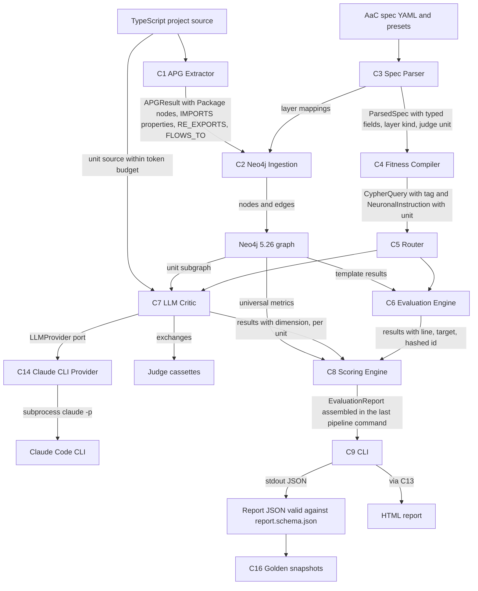
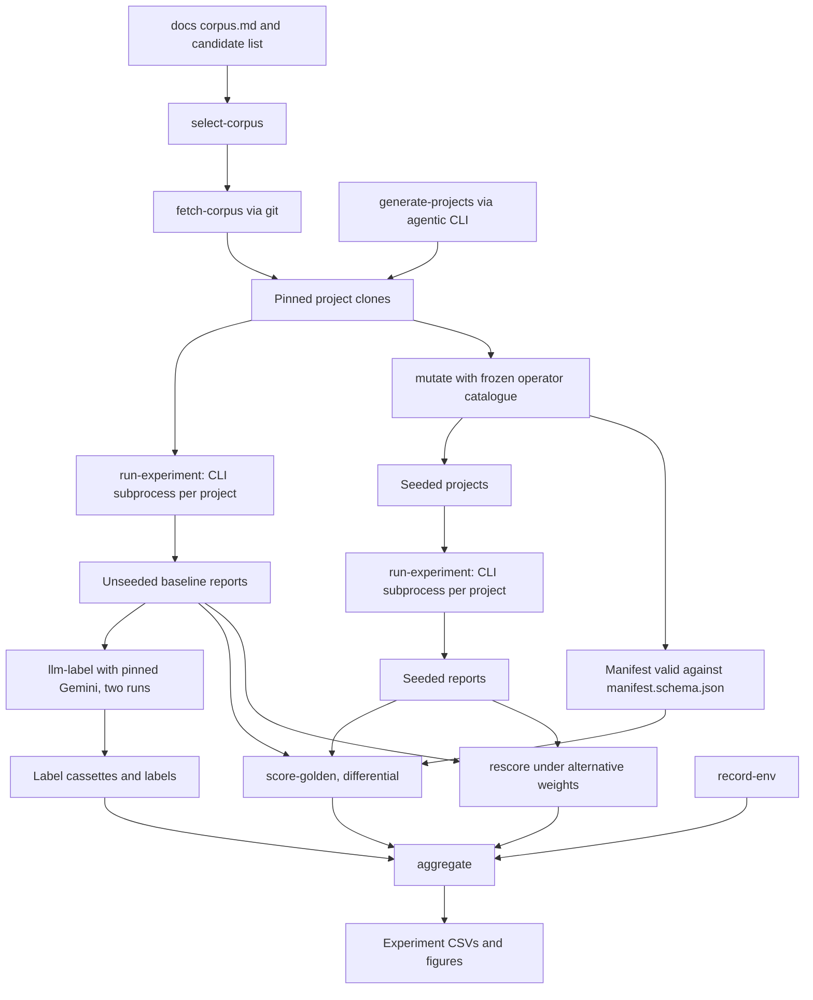

# v1.2E Component Dependencies — Evaluation-Readiness Cycle

> **Stage**: INCEPTION → Application Design (minimal depth) · **Date**: 2026-10-06 · **Baseline**: `7cd15b4`
> **Inputs**: `requirements/v1.2-evaluation-readiness-requirements.md` (36 FR, 8 NFR), `plans/v1.2E-execution-plan.md` (revision 2), `plans/v1.2E-execution-plan-adversarial-review.md` (F1–F14), `plans/v1.2E-application-design-plan.md` (Q1–Q10, all A).
> **Companions**: `v1.2E-components.md`, `v1.2E-component-methods.md` (single source for every NEW or CHANGED name, path and signature cited here), `v1.2E-services.md`.
> **Numbering**: this document uses the component numbers that already exist in `application-design.md` (C1–C11) and `v1.1-components.md` (C12–C13). The checklist in `v1.2E-application-design-plan.md` used a different order (for example "C2 spec parser"); that order is not used here. New components: **C14** Claude CLI provider, **C15** experiment toolkit, **C16** golden regression suite. No other new component is needed. **S1** is the existing PipelineExecutor service (`src/pipeline/`), shown because every wiring change goes through it.
> **Method**: every EXISTING edge below was checked against the `import` statements in `src/` at `7cd15b4` (cited as file:line). NEW edges are intended, so they cite the requirement instead of a line.

---

## 1. Components in scope

| Id | Component | Path | Status in v1.2E | Units |
|---|---|---|---|---|
| C1 | APG Extractor | `src/apg-extractor/` | CHANGED: Package nodes, alias-aware and per-name import resolution, IMPORTS merge rule, RE_EXPORTS, FLOWS_TO | U2 |
| C2 | Neo4j Ingestion | `src/neo4j-ingestion/` | CHANGED: node and edge arrays from the enums (`graph-ingester.ts:21`, `:64`), Package label and index | U0, U2 |
| C3 | Spec Parser | `src/spec-parser/` | CHANGED: typed fields in `parseLayerB` (`layer-parsers.ts:40`), layer `kind` resolution, `integrity` and `intent` alias, Layered library, judge unit per function | U1 |
| C4 | Fitness Compiler | `src/fitness-compiler/` | CHANGED: `buildParams` (`fitness-compiler.ts:257-315`) reads typed fields and `kind`, BR-SPEC-10, template tags, ORDER BY, two templates | U1, U3 |
| C5 | Neuro-Symbolic Router | `src/neuro-symbolic-router/` | CHANGED: passes `projectRoot` and `neuronalOptions` to C7 (`router.ts:46-50`, `:78`) and copies execution failures into `EvaluationResults.failures` (FR-13) | U4 |
| C6 | Evaluation Engine | `src/evaluation-engine/` | CHANGED: mappings with `line`/`lines`/`target`, hashed ids replacing the counter (`symbolic-evaluator.ts:50`, `:65`), cycle canonicalisation | U3 |
| C7 | LLM Critic | `src/llm-critic/` | CHANGED: revised port call site (`llm-critic.ts:61`), real source instead of the placeholder (`llm-critic.ts:43`), unit iteration, `dimension` on results, Claude provider in the factory | U0 (port only), U4 |
| C8 | Scoring Engine | `src/scoring-engine/` | CHANGED: renormalisation, per-dimension denominators, `ALL_DIMENSIONS` from the type (`score-computer.ts:7`), `computeScores` returns `ScoredReport`, NEW report builder and report-schema validator, orphan query typed `:File` (`universal-metrics.ts:25-28`) and bounded cycle query (`:13`) | U3 |
| C9 | CLI | `src/cli/` | CHANGED: the JSON path (`cli.ts:150-161`) prints the report assembled in the pipeline, unchanged code; `validate` runs BR-SPEC-10 (`cli.ts:256-293`, U1); provider config through `buildLLMProviderConfig` (`cli.ts:93-106`, `:394-406`, U4); batch LLM config removed (`batch-runner.ts:56-61`) | U3 (owner), U1, U4 |
| C10 | Shared Domain | `src/shared/` | CHANGED: every contract (enums incl. `RE_EXPORTS`, Violation, report, LLM port, layer `kind`, runtime type arrays), NEW process runner (`src/shared/interfaces/process-runner.ts`, `src/shared/process/node-process-runner.ts`) and scrubber (`src/shared/errors/scrub.ts`) | U0 |
| C11 | Firewall Context | `src/shared/context/` | CHANGED: one NEW set-once slot `setScoredReport` / `getScoredReport` beside `firewall-context.ts:44-84`, `:93-128`; existing getters gain readers | U0 |
| C12 | Baseline Manager | `src/baseline/` | EXISTING, unchanged. `generateKey` (`baseline-manager.ts:11-18`) does not use `Violation.id`, so FR-12 does not move baseline keys | — |
| C13 | Report Generator | `src/report/` | CHANGED (minor): groups function results by tag (FR-29), model from `report.judge`; its warning merge (`report-generator.ts:32-36`) must not duplicate the warnings `buildEvaluationReport` already merged | U3 |
| S1 | PipelineExecutor and commands | `src/pipeline/` | CHANGED: NEW last command `AssembleReportCommand`; provider wiring (`pipeline-factory.ts:77-85`); scoring inputs and `setScoredReport` (`pipeline-factory.ts:200-222`, `commands/score-command.ts:32-50`); compile input (`commands/compile-command.ts:14-19`); neuronal command inputs (`commands/neuronal-evaluate-command.ts:21-25`) | U3 (owner), U1, U4 |
| C14 | Claude CLI Provider | NEW `src/llm-critic/claude-cli-provider.ts` | NEW: `LLMProvider` over the `claude -p` subprocess | U4 |
| C15 | Experiment Toolkit | NEW `scripts/` (+ `scripts/lib/`, `scripts/lib/mutation/`, `scripts/lib/generators/`, `schemas/manifest.schema.json`) | NEW: mutate, score-golden, rescore, llm-label, generate-projects, run-experiment, select-corpus, fetch-corpus, aggregate, record-env | U5 |
| C16 | Golden Regression Suite | NEW `tests/golden/` | NEW: five fixtures × spec on a real Neo4j, snapshot of `functionResults`, violations, scores | U0 |

---

## 2. Existing import graph at `7cd15b4` (verified)

Only edges between components are listed. Every component also imports C10, and that is noted once per row.

| From | To | Evidence (file:line) |
|---|---|---|
| C1 | C10, C11 | `apg-extractor.ts:5-9` (types, DomainResult, PipelineStage, FirewallContext); `edge-extractor.ts:3-5`; `node-extractor.ts:2-4` |
| C2 | C10, C11 | `neo4j-ingestion.ts:1-7`; `graph-ingester.ts:1-5`; `layer-annotator.ts:2-4` |
| C3 | C10, C11 | `spec-parser.ts:4-8`; `layer-parsers.ts:5-8` |
| C3 | **C4** | `spec-validator.ts:5` (`CYPHER_TEMPLATES`), `spec-validator.ts:6` (`glob-to-regex`). Not shown in the v1.1 matrix |
| C4 | C10, C11 | `fitness-compiler.ts:1-8`; `types.ts:1-2` |
| C5 | C6, C7 | `router.ts:10` (`evaluateSymbolic`), `router.ts:11` (`evaluateNeuronal`) |
| C5 | C10, C11 | `router.ts:4-9`; `types.ts:1-5` |
| C6 | **C4** | `symbolic-evaluator.ts:5` (`fitness-compiler/types`), `symbolic-evaluator.ts:6` (`CYPHER_TEMPLATES`) |
| C6 | C10 | `symbolic-evaluator.ts:1-4`, `:8`; `types.ts:1-4` |
| C7 | C10 | `llm-critic.ts:1-5`; `types.ts:1-4`; `gemini-provider.ts:2-4`; `provider-factory.ts:1-2` |
| C8 | **C13** | `report-formatter.ts:3` (`report/actionable-formatter`). The v1.1 matrix shows no C8 to C13 edge |
| C8 | C10, C11 | `scoring-engine.ts:1-5`; `score-computer.ts:1-5`; `universal-metrics.ts:1-3` |
| C9 | S1 | `cli.ts:3-5`; `batch-runner.ts:3-4`; `drift-handler.ts:1`, `:6` |
| C9 | C2 | `drift-handler.ts:2-4` (snapshot store, delta computer, drift detector) |
| C9 | C3, C8, C12, C13 | `cli.ts:12`; `cli.ts:7`, `:9`; `cli.ts:13-14`; `cli.ts:8` |
| C10 | C11 | `shared/interfaces/pipeline-stage.ts:2` imports `context/firewall-context`; C11 imports C10 types (`firewall-context.ts:1-4`, `:10`). Mutual at component level, no file-level cycle |
| C12 | C10 | `baseline-manager.ts:3-5` |
| C13 | C10 | `actionable-formatter.ts:1-4`; `dashboard-data-builder.ts:1-5`; `graph-data-builder.ts:1-3`. C13 reads `APGResult` only as a C10 type (`types.ts:4`); it does not import C1 |
| S1 | C1, C2, C3, C4, C5, C6, C7, C8, C12, C13 | `commands/extract-command.ts:5`; `commands/ingest-command.ts:10`, `pipeline-factory.ts:13-14`; `commands/parse-command.ts:5`, `commands/validate-spec-command.ts:6`; `commands/compile-command.ts:5`; `commands/route-evaluate-command.ts:8`; `commands/symbolic-evaluate-command.ts:6`; `commands/neuronal-evaluate-command.ts:7`, `pipeline-factory.ts:15`; `commands/score-command.ts:8`; `commands/create-baseline-command.ts:5`, `commands/compare-baseline-command.ts:6`; `commands/generate-report-command.ts:6` |

External packages (from `src/`): `ts-morph` and `picomatch` in C1 (`apg-extractor.ts:3-4`); `picomatch` in C2 (`layer-annotator.ts:1`); `neo4j-driver` in C2 (`neo4j-repository.ts:1`); `ajv` and `yaml` in C3 (`spec-validator.ts:10`, `spec-parser.ts:3`); `@google/generative-ai` in C7 (`gemini-provider.ts:1`); `commander` and `dotenv` in C9 (`cli.ts:1-2`); `yaml` in S1 (`pipeline-factory.ts:2`). **`@anthropic-ai/sdk` is declared (`package.json:35`) but not imported anywhere in `src/`**, and **no file in `src/` uses `node:child_process`**, so the C10 `NodeProcessRunner` (used by C14) brings the first subprocess call into the engine.

---

## 3. Dependency matrix for v1.2E (rows depend on columns)

Legend: `E` existing edge, contract unchanged · `E*` existing edge that carries a changed contract · `N` new edge · `-` none. Column C10 includes the C11 context where the row imports it.

| Row depends on → | C1 | C2 | C3 | C4 | C5 | C6 | C7 | C8 | C9 | C10 | C12 | C13 | S1 | C14 | C15 | C16 |
|---|---|---|---|---|---|---|---|---|---|---|---|---|---|---|---|---|
| **C1** APG Extractor | self | - | - | - | - | - | - | - | - | E* | - | - | - | - | - | - |
| **C2** Neo4j Ingestion | - | self | - | - | - | - | - | - | - | E*/N | - | - | - | - | - | - |
| **C3** Spec Parser | - | - | self | E* | - | - | - | - | - | E* | - | - | - | - | - | - |
| **C4** Fitness Compiler | - | - | - | self | - | - | - | - | - | E* | - | - | - | - | - | - |
| **C5** Router | - | - | - | - | self | E | E* | - | - | E* | - | - | - | - | - | - |
| **C6** Evaluation Engine | - | - | - | E* | - | self | - | - | - | E* | - | - | - | - | - | - |
| **C7** LLM Critic | - | - | - | - | - | - | self | - | - | E* | - | - | - | N | - | - |
| **C8** Scoring Engine | - | - | - | - | - | - | - | self | - | E* | - | E | - | - | - | - |
| **C9** CLI | - | E | E | N | - | - | - | E* | self | E* | E | E | E* | - | - | - |
| **C12** Baseline | - | - | - | - | - | - | - | - | - | E | self | - | - | - | - | - |
| **C13** Report | - | - | - | - | - | - | - | - | - | E* | - | self | - | - | - | - |
| **S1** Pipeline | E | E | E | E | E* | E | E* | E* | - | E* | E | E | self | - | - | - |
| **C14** Claude CLI Provider | - | - | - | - | - | - | - | - | - | N | - | - | - | self | - | - |
| **C15** Experiment Toolkit | - | - | N | - | - | - | N | N | N (subprocess) | N | - | - | - | - | self | - |
| **C16** Golden Suite | - | - | - | - | - | - | - | N | - | N | - | - | N | - | - | self |

### 3.1 Changed and new edges, with reason

| Edge | Kind | What travels over it | Requirements | Unit |
|---|---|---|---|---|
| C1 → C10 | E* | `NodeType` gains `'Package'` (`enums.ts:1`), `EdgeType` gains `FLOWS_TO` and `RE_EXPORTS` (`enums.ts:3-10`); `ImportEdgeProperties` (`specifier(s)`, `line`, `lines`, `isTypeOnly`, `importedNames`) and `ReExportEdgeProperties` on `APGEdge` (`apg.ts:14`). Re-exports are decided in Application Design as the `RE_EXPORTS` edge type, so U2 never edits `enums.ts` and an import and a re-export on the same pair never merge | FR-09, FR-10, FR-21, FR-34 | U0 contract, U2 use |
| C2 → C10 | E* / N | Today `graph-ingester.ts:21` and `:64` hold literal lists and the import from `enums.ts` is type-only (`types.ts:4`). New: a runtime `NODE_TYPES` / `EDGE_TYPES` constant in C10 that C2 reads, so a value import replaces the literals | FR-09 | U0 |
| C3 → C4 | E | Unchanged: `CYPHER_TEMPLATES` (`spec-validator.ts:5`). BR-SPEC-10 is not placed in C3: `checkBoundParameters` lives in C4 and is called from `compileFunctions` (post-merge, pre-compile) and from the C9 `validate` action (edge C9 → C4 below). C4 does not import C3: layer kinds reach it as `LayerDefinition.kind` (C10), so no C3 <-> C4 cycle arises | FR-08, FR-19 | U1 |
| C3 → C10 | E* | `LayerDefinition` (`spec.ts:41-48`) gains `kind`; `FitnessFunction` (`spec.ts:4-17`) gains `forbiddenImports`, `maxPublicMethods`, `maxDependencies`, `maxInterfaceMethods`, `maxDepth`, `pattern`, `judgeUnit`; `Dimension` gains `integrity` and loses `intent` (`enums.ts:12-19`); `ScoringWeights` (`spec.ts:50-58`) becomes `Readonly<Record<Dimension, number>>` | FR-07, FR-19, FR-22, FR-33 | U0 contract, U1 use |
| C4 → C10 | E* | `buildParams` reads typed fields (removes the cast at `fitness-compiler.ts:297`) and binds layers through `bindLayerParams` from the resolved `LayerDefinition.kind` (replaces the name lookups at `fitness-compiler.ts:265-267`). `CypherQuery` (`evaluation.ts:34-44`) gains the template tag; `NeuronalInstruction` (`evaluation.ts:54-65`) gains `judgeUnit`, set in `compileNeuronal` (`fitness-compiler.ts:181`) | FR-07, FR-19, FR-29, FR-33 | U1 |
| C5 → C7 | E* | `NeuronalEvalInput` (`llm-critic/types.ts:8-18`) gains `projectRoot` and `options` (`NeuronalRunOptions`, which holds the unit cap); router passes them (`router.ts:46-50`, `:78`); `RouterInput` (`router/types.ts:7-12`) gains `projectRoot` and `neuronalOptions`; `NeuronalEvalOutput.failures` flows back into `EvaluationResults.failures` | FR-13, FR-23, FR-33 | U4 |
| C6 → C4 | E* | `ResultMapping` (`fitness-compiler/types.ts:33-37`) gains line, target and discriminator columns; C6 reads them to fill `Violation.line`/`lines`/`target` and to hash the id | FR-12, FR-35 | U0 contract shape, U3 use |
| C6 → C10 | E* | `Violation` (`violation-types.ts:35-48`) gains `line?`, `lines?`, `target?`, `isTypeOnly?`; `id` becomes a hash (FR-12). New in-module dependency on `node:crypto` (already used by C1, `id-generator.ts:1`) | FR-11, FR-12, FR-35; AD Q3 | U0 contract, U3 use |
| C7 → C10 | E* | Revised port: `LLMOptions` (`llm-provider.ts:3-7`) drops the `temperature: 0` literal type and gains a required `model`, `effort?: LLMEffort`, `maxTokens`, `temperature?`, `seed?`; `LLMResponse` gains `usedOptions` and `ignoredOptions`; `LLMProvider` gains `describe()`. `VCRMode` moves to C10. `NeuronalFunctionResult` (`evaluation.ts:98-110`) gains `dimension` and `unitResults` | FR-23, FR-31, FR-32, FR-33 | U0 contract, U4 use |
| C7 → C14 | N | `createLLMProvider` (`provider-factory.ts:13`) gains a `claude-cli` case that constructs C14. As with Gemini (`llm-critic/index.ts:8-9`), C14 is not re-exported from the barrel | FR-23; AD Q1 | U4 |
| C8 → C10 | E* | `ALL_DIMENSIONS` derived from a C10 runtime constant instead of the literal at `score-computer.ts:7`; `EvaluationReport` (`evaluation.ts:134-148`) gains `functionExecution`, `functionResults`, `graphStats`, `layerAnnotation`, `parseCoverage`, `importResolution`, `timings`, `droppedDimensions`, provider and model | FR-13, FR-14, FR-15, FR-23, FR-32 | U0 contract, U3 use |
| C8 → C13 | E | Unchanged (`report-formatter.ts:3`). Listed because the v1.1 matrix omits it | — | — |
| C9 → C4 | N | The `validate` action (`cli.ts:256-293`) calls `checkBoundParameters(compilerInputFromSpec(spec))` after `validateSpecAgainstProject` (`:271`) | FR-08 | U1 |
| C9 → C8 | E* | `formatJSON` (`cli.ts:153`) is unchanged; the report it prints is now the one assembled by `AssembleReportCommand`, so it carries merged pipeline warnings and stage timings, which today only reach the HTML path (`cli.ts:443`, `report-generator.ts:32-36`) and stderr (`cli.ts:164-171`) | FR-13, FR-14 | U3 |
| C9 → S1 | E* | `LLMConfig` (`pipeline/types.ts:4-11`) is REMOVED and `PipelineConfig.llmConfig` becomes `LLMProviderConfig` (C10); `buildLLMProviderConfig` (U4) fills it; batch drops its `claude`/`openai` block (`batch-runner.ts:56-61`) and rejects non-symbolic modes | FR-16 (reduced), FR-23; AD Q1, Q8 | U0 contract, U3 + U4 use |
| S1 → C7 | E* | Provider wiring at `pipeline-factory.ts:77-85` (today always Gemini with an API key) calls `createLLMProvider(config.llmConfig)`; `judgeProvenanceOf` gives the report's `judge` for every mode; neuronal and route commands pass the project root (`commands/neuronal-evaluate-command.ts:21-25`) | FR-23 | U4 (factory hunk as patch to U3) |
| S1 → C8 | E* | `LazyScoreCommand` (`pipeline-factory.ts:200-222`) and `ScoreCommand` (`commands/score-command.ts:31-41`) pass `fitnessFunctions` and `compiled` into `ScoringInput` (`scoring-engine/types.ts:7-17`) and store the `ScoredReport` with `setScoredReport`; the NEW `AssembleReportCommand` calls `buildEvaluationReport` with the run facts read from C11 and the executor timings | FR-13, FR-14 | U3 |
| S1 → C4 | E* | `CompileCommand` (`commands/compile-command.ts:14-19`) builds its input with `compilerInputFromSpec` (adds `style`) | FR-08, FR-20 | U1 |
| S1 → C5 | E* | Route command passes the project root into `RouterInput` | FR-23 | U4 |
| C14 → C10 | N | Implements `LLMProvider` (`shared/interfaces/llm-provider.ts:15-18`), returns `DomainResult`; runs `claude -p --model claude-opus-5-5 --output-format json` through the C10 `ProcessRunner` / `NodeProcessRunner` with the `buildChildEnv` allow-list; uses the C10 secret scrubber | FR-23, FR-31; NFR-08 | U4 |
| C15 → C8 | N | `rescore.ts` reuses `renormaliseWeights`, `computeAHS`, `determineVerdict` (exported from `scoring-engine/index.ts`, today `:2-3` export `computeAHS` and `determineVerdict`) on stored reports instead of re-implementing them; `scripts/lib/report-io.ts` uses `parseReport` / `validateReport` | FR-26, FR-36 | U5 |
| C15 → C7 | N | `llm-label.ts` reuses `GeminiProvider` (`gemini-provider.ts:12`, imported directly) with a pinned model id passed in its config, wrapped in `CassetteLLMProvider` | FR-27; AD Q5 | U5 |
| C15 → C3 | N | `mutate.ts` and `select-corpus.ts` read layer directories through `parseSpec` (`spec-parser/index.ts:1`) so seeded edits land in the right layer | FR-24, FR-36 | U5 |
| C15 → C9 | N (subprocess) | `run-experiment.ts` runs the built CLI (`node dist/cli/index.js evaluate --format json`, entry from `package.json:5-7`) per project and keeps the stdout report; no in-process pipeline, so each run gets a clean Neo4j state like a user run | FR-36 | U5 |
| C15 → C10 | N | Report and violation types; `ClaudeCliConfig`; `ProcessRunner`, `NodeProcessRunner` and `buildChildEnv` for the generator adapter; `scrubDeep` for generator records and labeller cassettes | FR-24..28, FR-36; NFR-08 | U5 |
| C16 → S1 | N | Calls `createPipeline` (`pipeline-factory.ts:57`, exported at `pipeline/index.ts:3`) per fixture against the CI Neo4j service | FR-30 | U0 |
| C16 → C8 | N | `formatJSON` (`report-formatter.ts:8`) to produce the snapshot text | FR-30 | U0 |

**Deliberately absent edges.** C15 does **not** depend on C14: the generator adapter (`scripts/lib/generators/claude-code.ts`) builds its own arguments (`buildGeneratorArgs`) and runs the CLI through the C10 `ProcessRunner`, `NodeProcessRunner` and `buildChildEnv`, all owned by U0; it needs no envelope parser because success is judged by `tsc --noEmit`. `v1.2E-components.md` and `v1.2E-component-methods.md` say the same. This keeps the review's F11 disposition (U5 does not depend on U4) and lets the generator start after U0 + U2. C4 does not depend on C3 (`LayerKindBinding` is a C4 type built from the C10 `LayerDefinition.kind`). C13 does not gain an edge to C1. No component in `src/` imports `scripts/` or `tests/`.

**Cycle check.** Adding the N edges creates no new cycle: C14 and C15 are leaves toward C10; C16 sits above S1; C7 → C14 → C10 is acyclic; C9 → C4 adds no back edge because C4 imports only C10. The only mutual pair stays the existing C10 <-> C11 one.

---

## 4. Communication patterns

| Pattern | Where | Notes |
|---|---|---|
| **Direct call** (in-process import) | C5 → C6, C7 (`router.ts:10-11`); C3 → C4 and C6 → C4 (template table lookup); C8 → C13 (actionable formatting); C9 → C3, C4 (`validate`), C8, C12, C13; C7 → C14 (factory); C15 → C3, C7, C8, C10; C16 → S1, C8 | Synchronous TypeScript calls returning `DomainResult`. No new event bus or queue |
| **Pipeline context** (C11 `FirewallContext` passed by S1 commands) | Extract → Parse → Ingest → Compile → Evaluate → Score → (snapshot, drift) → Assemble report (`pipeline-factory.ts:118-174`, plus the NEW last command) | One NEW slot: `ScoreCommand` writes `setScoredReport`; the NEW last command `AssembleReportCommand` reads it with `getApgResult`, `getIngestionResult`, `getCompiledFunctions`, `getEvaluationResults` and `warnings` (`firewall-context.ts:90-121`), adds the timings from `executor.getTimings()` (bound as a `TimingSource`; the method is safe during execution, `pipeline-executor.ts:122-129`) and writes the EXISTING `setReport`, which `execute()` returns (`pipeline-executor.ts:109`). C9 attaches nothing after `execute()`. `StageTimings` moves from S1 (`pipeline/types.ts:63-72`) to C10, because the report type in C10 cannot import S1 |
| **Shared graph store** (Neo4j through the `GraphRepository` port, `graph-repository.ts:8-13`) | C2 writes; C6 runs templates; C7 unit selector and subgraph excerpt read; C8 universal metrics read | Query timeout and bounded cycle length (NFR-07) go behind `executeQuery` in `neo4j-repository.ts:15` so every reader inherits them |
| **File artefacts** | Spec YAML and `presets/*.yaml` → C3; report JSON on stdout → C15 (C16 reads the same report in process from `createPipeline`); `schemas/report.schema.json` (U0 draft, U3 freeze); `schemas/manifest.schema.json` (U5); judge cassettes (C7 `cassette-manager.ts`); labeller and generator cassettes (C15); golden snapshots (C16); `results/pre-tag/`; experiment CSVs and figures | Files are the only interface between the engine and the toolkit apart from the reuse imports C15 → C3, C7, C8, C10 in 3.1 |
| **Subprocess** | All run through the C10 `ProcessRunner` (`NodeProcessRunner`, `buildChildEnv` allow-list). C14 → `claude -p --model claude-opus-5-5 --output-format json` (judge, no file tools); C15 generator → `claude -p` with file tools in the generated project's directory; C15 harness → `node dist/cli/index.js evaluate`; C15 mutate → `tsc --noEmit`; C15 fetch-corpus → `git` | No API key anywhere (AD Q1). Arguments passed as an argv array, never through a shell string; stdout/stderr pass through the scrubber before they reach warnings, cassettes or reports (NFR-05, NFR-08) |

---

## 5. Data flow

### 5.1 Evaluation path: spec and source to report



**Text alternative.** The spec YAML (or a preset) goes to C3, which produces a ParsedSpec with typed function fields, the resolved layer `kind` and each neuronal function's judge unit. The project source goes to C1, which produces an APGResult that now contains Package nodes, IMPORTS edges with `specifier`/`line`/`lines`/`isTypeOnly`/`importedNames`, RE_EXPORTS edges from `export ... from`, and FLOWS_TO edges. C2 annotates layers using C3's mappings and loads the graph into Neo4j. C4 compiles the spec into tagged Cypher queries and neuronal instructions that carry a unit. C5 sends queries to C6, which runs them on Neo4j, and instructions to C7, which reads the unit's subgraph from Neo4j and its source from disk, then calls C14 through the LLMProvider port. C14 runs the Claude Code CLI as a subprocess, and C7 records each exchange as a cassette. C6 results (with line, target and a hashed id) and C7 results (with dimension, per unit) go to C8, which also reads universal metrics from Neo4j and scores them; the last pipeline command, `AssembleReportCommand`, then has C8 build the complete report with execution facts, timings, dropped dimensions and judge provenance. C9 writes the report as JSON on stdout (valid against `schemas/report.schema.json`) or as HTML through C13. C16 snapshots the JSON.

### 5.2 Experiment path: reports to CSVs



**Text alternative.** `select-corpus` picks projects from `docs/corpus.md` and the candidate list; `fetch-corpus` clones them at pinned commits with git. `generate-projects` adds never-seen projects by driving the agentic CLI. `run-experiment` evaluates every tree through the CLI subprocess and stores the unseeded baseline reports, rejecting any run with a failed function. `mutate` applies operators from the frozen catalogue, producing seeded projects and manifest rows valid against `schemas/manifest.schema.json`; the seeded projects are evaluated again. `llm-label` labels unseeded violations and judge units with a pinned Gemini model run twice and stores cassettes. `score-golden` compares each seeded report with its own baseline report and the manifest (differential scoring, AD Q7). `rescore` recomputes AVR, AHS and verdict from stored reports under alternative weights and thresholds. `aggregate` combines scores, re-scores, labels and the environment record from `record-env` into the experiment CSVs and figures.

---

## 6. Shared-file ownership (execution plan table, extended)

Rows 1–4 are the execution plan's table (review F13), kept as written except where noted. Rows 5 onward are files found in the code that two or more units would edit.

| # | File | Owner | Others | Why it is shared (evidence) |
|---|---|---|---|---|
| 1 | `src/shared/types/*`, `src/shared/interfaces/*` (`llm-provider.ts`, `graph-repository.ts` with `QueryOptions`, NEW `process-runner.ts`), NEW `src/shared/process/*` (`node-process-runner.ts`), NEW `src/shared/errors/scrub.ts`, `src/shared/context/firewall-context.ts` (the `setScoredReport` slot) | U0 | read-only after U0 | Every contract lands here first. `graph-repository.ts` is implemented by C2 (U2) and called by C6, C7 and C8, so it must not change after U0 |
| 2 | `src/spec-parser/spec-schema.ts`, `presets/*.yaml` | U1 | U4 sends rubric text to U1 as a patch | `intent`/`integrity` enum at `spec-schema.ts:44`, `:90-98` |
| 3 | `src/fitness-compiler/cypher-templates.ts` | U1 (tags, ORDER BY) | **Corrected**: U3 rewrites `domain-purity` (`:83`) and adds `domain-state-purity`, after U1 merges; U2 sends the `:File` typing of `no-orphan-files` (`:191`) to U1 as a patch | The plan said "U3 adds two templates"; FR-11 is a rewrite of an existing one plus one new one |
| 4 | `schemas/report.schema.json` | U0 (draft), U3 (freeze) | U5 and C16 consume | — |
| 5 | `src/shared/taxonomy/violation-types.ts` | U0 | read-only after U0 | Not under `shared/types/`, so row 1 does not cover it; `Violation` lives at `:35-48` |
| 6 | `src/shared/types/enums.ts` runtime arrays | U0 | read-only | Settled in Application Design: `RE_EXPORTS` is the ninth `EdgeType` (FR-34), so U0 writes it and U2 never edits this file |
| 7 | `src/fitness-compiler/types.ts` (`ResultMapping`, `CypherTemplate`) | U0 (shape) | U1 fills tags, U3 fills mapping columns | Tags (FR-29, U1) and line/target/discriminator columns (FR-12, U3) both extend `:33-46`; this file is outside `shared/` |
| 8 | `src/fitness-compiler/fitness-compiler.ts` | U1 | U4 read-only | `buildParams` (`:257-315`) and BR-SPEC-10 are U1; the judge unit is set in `defaultContextAssembly` (`:317-325`), which U1 writes from the U0 contract so U4 does not edit the compiler |
| 9 | `src/neo4j-ingestion/graph-ingester.ts` | U0, then U2 | sequential, no overlap in time | U0 replaces the literals at `:21`, `:64`; U2 adds the Package label and index |
| 10 | `src/llm-critic/gemini-provider.ts`, `mock-provider.ts`, `null-provider.ts`, `llm-critic.ts` | U0 (port compile fixes only), then U4 | sequential | FR-31 requires the existing providers to compile against the new port; the call site with the literal `temperature: 0` is `llm-critic.ts:61` |
| 11 | `src/shared/types/spec.ts` `ScoringWeights` | U0 | U1 and U3 read | `ScoringWeights = Readonly<Record<Dimension, number>>` with every key **required from U0**. Removing `intent` and adding `integrity` breaks the object literals at `layer-parsers.ts:124-150`, `template-registry.ts:87`, `:97` and the sum at `spec-validator.ts:157-158`, all U1 files; U0 makes these as mechanical compile fixes (as row 10 allows for the LLM port), and U1 does the FR-22 work proper. Symbolic-only golden snapshots do not move |
| 12 | `src/pipeline/types.ts` (`LLMConfig`, `StageTimings`) | U0 | U3, U4 read | U0 removes `LLMConfig` (`:4-11`) and points `PipelineConfig.llmConfig` (`:24`) at `LLMProviderConfig`; `StageTimings` (`:63-72`) becomes a re-export of the C10 type. U3 then drops the `claude`/`openai` path used by batch (`batch-runner.ts:58`), U4 adds the CLI provider |
| 13 | `src/pipeline/pipeline-factory.ts`, `src/pipeline/commands/score-command.ts`, NEW `src/pipeline/commands/assemble-report-command.ts` | U3 | U4 sends a patch for `pipeline-factory.ts:77-85` | Disjoint hunks: provider wiring (U4); `LazyScoreCommand` inputs `:200-222` and the appended `AssembleReportCommand` (U3) |
| 14 | `src/cli/cli.ts` | U3 | U1 edits the `validate` action `:256-293` before U3 starts (U3 depends on U1); U4 sends a patch for `:93-106` and `:394-406` | U3 owns the file; the JSON path `:150-161` needs no code change because the pipeline assembles the report; U4 replaces the API-key fallback and warning that would wrongly fire under the CLI route |
| 14a | `src/pipeline/commands/compile-command.ts` | U1 | — | `compilerInputFromSpec` replaces the literal at `:14-19` (FR-08, FR-20) |
| 15 | `src/scoring-engine/report-formatter.ts` | U3 | — | `integrity` needs a CSV column (`:90`, `:145`); U3 adds it, not U1 |
| 16 | `src/scoring-engine/universal-metrics.ts` | U3 | — | Both v1.2E edits belong to U3 with the rest of C8: the `:File` typing of the orphan query (`:25-28`, FR-09) and the bounded cycle query (`:13`, NFR-07). U2 does not edit it. FR-17 is deferred; the metric-failure warning is only a proposal for U3 Functional Design |
| 17 | `src/spec-parser/template-registry.ts` | U1 | U4 rubric patch (as row 2) | Layered entry next to `:139-142`; FF-N01 (`:65`, today `solid`, hybrid) and FF-N02 (`:75-81`, today `intent`) dimensions and rubrics |
| 18 | `src/neuro-symbolic-router/*`, `src/pipeline/commands/neuronal-evaluate-command.ts`, `route-evaluate-command.ts` | U4 | — | Project root and run options reach C7 (`router.ts:46-50`, `neuronal-evaluate-command.ts:21-25`); the router's copy of execution failures into `EvaluationResults.failures` (FR-13) is also U4. U3 only produces `SymbolicEvalOutput.failures` in C6 |
| 19 | `tests/golden/**` snapshots | U0 (creates) | U1, U2, U3 each update | FR-30: each update is its own commit naming the FR. U1 and U2 run in parallel, so a snapshot is regenerated after rebase, never merged by hand |
| 20 | `package.json`, `package-lock.json` | U0 | U5 sends a patch (script entries) | U0: `engines`, lock tracking, audit script, and removal of the unused `@anthropic-ai/sdk` (`package.json:35`) under AD Q1 |
| 21 | `.github/workflows/ci.yml` | U0 | — | Golden-suite job against the existing Neo4j service (`ci.yml:14-21`), `npm audit` step, pins |
| 22 | `fixtures/` | none (frozen) | — | `batch --dir fixtures` and the golden suite enumerate it; new test fixtures (alias, barrel, FLOWS_TO) go under `tests/fixtures/` so the five-fixture set does not change |
| 23 | `tsconfig.scripts.json` (NEW) | U5 | — | `tsconfig.json:4` (`rootDir: ./src`) and `:54` (`include: src/**/*`) exclude `scripts/`; C15 needs its own config to be type-checked |

---

## 7. Unit build order

```
                    +---------------+
                    | U0 Foundation |
                    +---------------+
                            |
        +-------------------+
        |                   |
        v                   v
+---------------+   +---------------+
| U1 Spec and   |   | U2 Extractor  |
| compiler      |   | and graph     |
+---------------+   +---------------+
        |                   |
        +---------------+   +-------------------+
        |               |   |                   |
        v               v   v                   v
+---------------+   +---------------+   +---------------+
| U4 Neural     |   | U3 Evaluation |   | U5a Mutation  |
| path          |   | scoring and   |   | manifest and  |
|               |   | report        |   | generator     |
+---------------+   +---------------+   +---------------+
        |                   |                   |
        |                   v                   |
        |           +---------------+           |
        |           | U5 Experiment |<----------+
        |           | tooling       |
        |           +---------------+
        |                   |
        +-------------------+
                            |
                            v
                    +---------------+
                    | Build and     |
                    | Test          |
                    +---------------+
```

**Text alternative.** U0 Foundation comes first. U1 (spec and compiler) and U2 (extractor and graph) start after U0 and run in parallel. U4 (neural path) starts after U0 and U1. U3 (evaluation, scoring, report) starts after both U1 and U2. U5a (mutation tool, manifest schema, generator) may start after U0 and U2. The rest of U5 (scorer, re-scorer, labeller, run harness, corpus tools) starts after U3 and absorbs U5a. Build and Test runs after U4 and U5 are complete.

| Step | Unit | Hard prerequisites | Dependency that forces it |
|---|---|---|---|
| 1 | U0 Foundation | — | Owns C10 (including the process runner, scrubber and C11 slot), C16, the LLM port, the `LLMConfig` removal, `ResultMapping` and `LayerKindBinding` shapes (rows 1, 5–7, 10–12 of section 6). C16 must be green at `7cd15b4` before any engine change (FR-30) |
| 2a | U1 Spec and compiler | U0 | C3 → C10 and C4 → C10 contracts (layer `kind`, typed fields, `integrity`, tags, judge unit) |
| 2b | U2 Extractor and graph | U0 | C1 → C10 and C2 → C10 (`Package`, IMPORTS properties, FLOWS_TO, runtime type arrays) |
| 3a | U4 Neural path | U0, U1 | C7 → C10 port; C4 sets `NeuronalInstruction.judgeUnit` and C3 parses `integrity` (U1). Independent of U2/U3: C7 reads Neo4j only through the existing port |
| 3b | U3 Evaluation, scoring, report | U1, U2 | C6 → C4 needs U1's templates and mapping columns; `domain-purity` and `domain-state-purity` need U2's Package nodes and FLOWS_TO edges; C8 needs U1's `integrity` weight |
| 3c | U5a Mutation, manifest, generator | U0, U2 | The data-flow operator needs FLOWS_TO (U2) to be checkable; the generator uses only the U0 process runner, so there is no import of C14 and no dependency on U4 (section 3.1, F11) |
| 4 | U5 rest | U3 | C15 → C8 (rescore) and the report schema frozen by U3; run harness rejects runs using `functionExecution` (FR-13) |
| 5 | Build and Test | all units | FR-18 re-baseline, FR-20 Layered validation run, NFR-03/NFR-07 latency table |

U4 and U3 may run at the same time; their only shared files are rows 13 and 14 of section 6, handled by patch to the owner. U1's `validate` edit to `cli.ts` lands before U3 starts.
