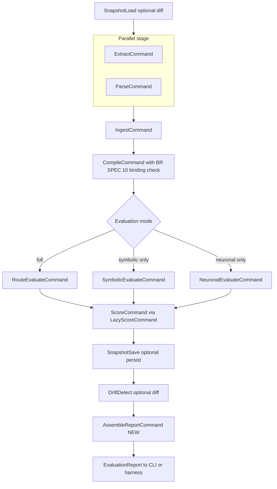
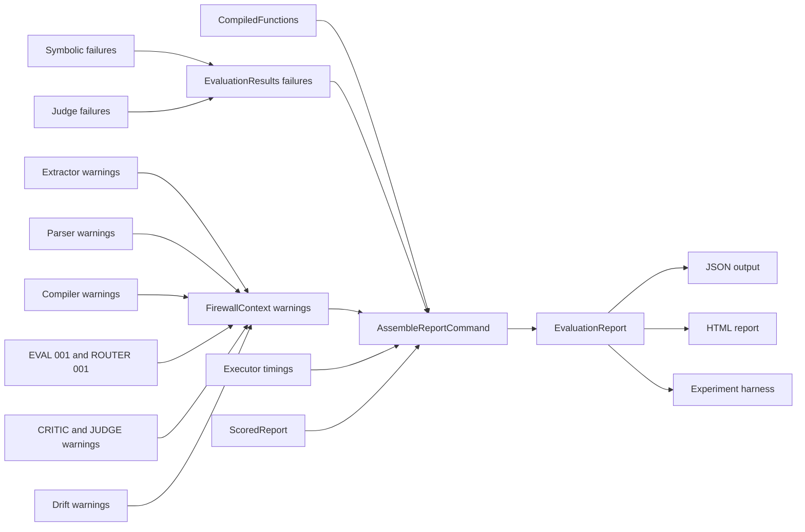
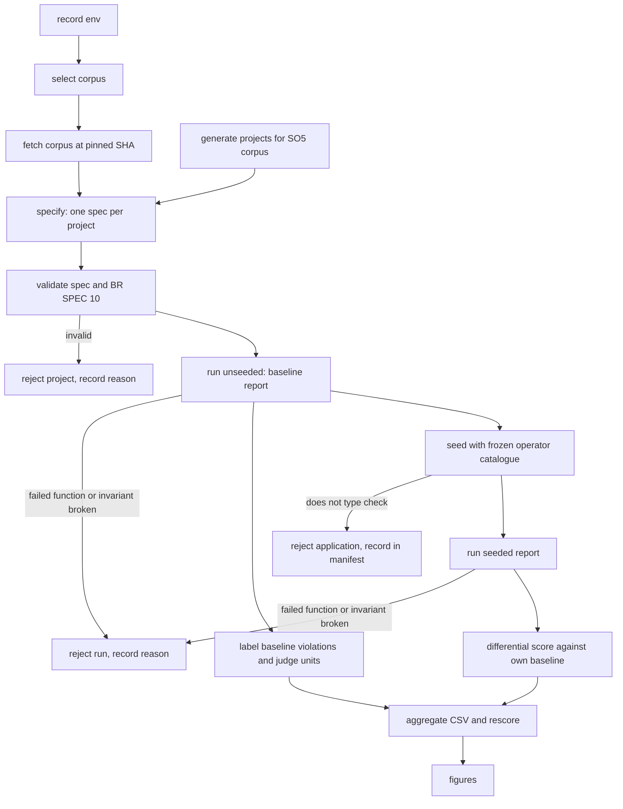

# v1.2E Service Definitions and Orchestration — Evaluation-Readiness Cycle

> **Stage**: INCEPTION → Application Design (minimal depth) · **Date**: 2026-10-06 · **Baseline**: `7cd15b4`
> **Inputs**: `requirements/v1.2-evaluation-readiness-requirements.md` (FR-v1.2E-01..36, NFR-v1.2E-01..08), `plans/v1.2E-execution-plan.md` (revision 2, units U0-U5), `plans/v1.2E-execution-plan-adversarial-review.md` (F1-F14 accepted), `plans/v1.2E-application-design-plan.md` (decisions 1-10, all A).
> **Scope of this file**: (S1) the evaluation pipeline after this cycle; (S2) the experiment pipeline; (S3) the judge sub-pipeline. Every name, path and signature used here is defined once in `v1.2E-component-methods.md` and only cited here. Business rules are deferred to Functional Design per unit.
> **Requirement IDs** are abbreviated `FR-nn` / `NFR-nn` for `FR-v1.2E-nn` / `NFR-v1.2E-nn`.

## 0. Conventions

**Status markers.** EXISTING (unchanged; file:line at `7cd15b4`), CHANGED (file:line plus what changes), NEW (intended path).

**Component numbers.** This file uses the numbering of `components.md` (v1.0) and `v1.1-components.md`, which is the numbering in the code-facing design of record:

| No. | Component | Path at HEAD |
|---|---|---|
| C1 | APG Extractor | `src/apg-extractor/` |
| C2 | Neo4j Ingestion | `src/neo4j-ingestion/` |
| C3 | Spec Parser | `src/spec-parser/` |
| C4 | Fitness Compiler | `src/fitness-compiler/` |
| C5 | Neuro-Symbolic Router | `src/neuro-symbolic-router/` |
| C6 | Evaluation Engine | `src/evaluation-engine/` |
| C7 | LLM Critic | `src/llm-critic/` |
| C8 | Scoring Engine | `src/scoring-engine/` |
| C9 | CLI | `src/cli/` |
| C10 | Shared Domain | `src/shared/` |
| C11 | FirewallContext | `src/shared/context/firewall-context.ts` (re-exported by `src/firewall-context/index.ts:1-3`); CHANGED in U0 by one set-once slot |
| C12 | Baseline Manager | `src/baseline/` |
| C13 | Report Generator (HTML) | `src/report/` |
| C14 | Claude CLI Provider | NEW `src/llm-critic/claude-cli-provider.ts` |
| C15 | Experiment Toolkit | NEW `scripts/` (outside `src/`) |
| C16 | Golden Regression Suite | NEW `tests/golden/` |

Note: `v1.2E-application-design-plan.md` line 11 lists the changed components with a different numbering (for example "C2 spec parser", "C10 LLM critic"). That list predates this file; the table above is the one to cite. No component beyond C16 is added: the pipeline orchestration stays in the existing `src/pipeline/` module (S1, S2 of the v1.0 services), which has never carried its own C-number.

**Orchestration pattern.** Unchanged: Command pattern, `PipelineExecutor` runs `PipelineCommand`s sequentially against one `FirewallContext`, fail-fast on the first `success: false` (EXISTING `src/pipeline/pipeline-executor.ts:20-138`, loop at `:34-105`, fail-fast at `:80-90`). Commands communicate only through typed set-once slots on C11 (EXISTING `src/shared/context/firewall-context.ts:44-84`).

---

## S1. Evaluation pipeline after v1.2E

### S1.1 Command sequence



**Text alternative.** The pipeline runs, in order: an optional snapshot load (only with `--diff`); extraction and spec parsing in parallel; ingestion into Neo4j; compilation, which now starts with the fatal BR-SPEC-10 binding check; one evaluation command chosen by mode (route-and-evaluate for full, symbolic-only, or neuronal-only); scoring; an optional snapshot save (with `--persist` and a commit SHA); an optional drift detection (with `--diff`); and finally a new report-assembly command that builds the complete `EvaluationReport` and hands it to the CLI or the experiment harness. The only new command is the last one; every other change is inside existing commands or the components they call.

The sequence is built by `createPipeline` — CHANGED `src/pipeline/pipeline-factory.ts:57-189` (what changes: provider wiring at `:78-85`, the new final command, the timing source; detail in S1.4).

### S1.2 Stage table: context reads, writes, warnings, report fields

| # | Command (status, file:line) | Calls | Reads from C11 | Writes to C11 | Warnings and failures produced | Feeds report field | FR / NFR |
|---|---|---|---|---|---|---|---|
| 0 | `SnapshotLoadCommand` EXISTING `src/pipeline/commands/snapshot-load-command.ts:17` | C2 snapshot store | none | audit only; snapshot into the factory's `SharedSnapshotState` (`pipeline-factory.ts:94`) | none new | none | — |
| 1 | `ParallelCommand` EXISTING `src/pipeline/commands/parallel-command.ts:8-60` | the two commands below via `Promise.all` (`:20`) | — | — | `PARALLEL_COMMAND_THREW` (`:24`), critical | none | — |
| 1a | `ExtractCommand` EXISTING class `src/pipeline/commands/extract-command.ts:8-43`; behaviour CHANGED in C1 | `extractAPG` CHANGED `src/apg-extractor/apg-extractor.ts:19`: Package nodes, alias-aware resolution, per-name barrel resolution and `RE_EXPORTS` edges, merged IMPORTS properties, `FLOWS_TO`, import-resolution counts | none | `setApgResult` (`:27`); `APGResult` CHANGED `src/shared/types/apg.ts:22-27` gains `importResolution: ImportResolutionStats` (including `unsupportedDynamic`) | `EXTRACTOR_001` no longer emitted for package imports (today `src/apg-extractor/edge-extractor.ts:253-256`); `EXTRACTOR_002` kept for unresolvable relative imports (`:258-262`); NEW warning code for `import()` / `require` with a count (FR-34) | `parseCoverage`, `importResolution`, warnings | FR-09, 10, 21, 34 |
| 1b | `ParseCommand` EXISTING class `src/pipeline/commands/parse-command.ts:8-38`; behaviour CHANGED in C3 | `parseSpec` CHANGED `src/spec-parser/spec-parser.ts:18-131`: typed function fields, layer `kind`, `integrity` dimension, `intent` alias, `style: layered`, template tags | none | `setParsedSpec` (`:22`) | NEW `SPEC_004` when `intent` is mapped to `semantic`; existing `SPEC_001` / `SPEC_002` unchanged | `specVersion`, tags used by `functionResults` | FR-07, 19, 20, 22, 29 |
| 2 | `IngestCommand` EXISTING class `src/pipeline/commands/ingest-command.ts:20-72`; behaviour CHANGED in C2 | `ingestAPG` EXISTING `src/neo4j-ingestion/neo4j-ingestion.ts:18` (clears graph at `:30`); `graph-ingester.ts` CHANGED: node and edge type arrays derived from the enums, `Package` label and index | `getApgResult`, `getParsedSpec` (`:30-31`) | `setIngestionResult` (`:50`); `GraphStats` CHANGED `src/shared/types/evaluation.ts:15-19` gains `nodeCountByType`, `edgeCountByType` | existing ingestion warnings | `graphStats`, `layerAnnotation` | FR-09, 14 |
| 3 | `CompileCommand` CHANGED `src/pipeline/commands/compile-command.ts:8-43`: input built by `compilerInputFromSpec` (adds `style`) instead of the literal at `:14-19`; behaviour CHANGED in C4 | `compileFunctions` CHANGED `src/fitness-compiler/fitness-compiler.ts:32-131`: first runs `checkBoundParameters` (BR-SPEC-10), then `bindLayerParams` replacing the name lookup at `:265-267` and the untyped cast at `:297`; `isTemplateApplicable` for the style; `ORDER BY` in templates | `getParsedSpec` (`:12`) | `setCompiledFunctions` (`:27`); `CompiledFunctions.disabledFunctions` (`evaluation.ts:78`) also carries kind-based disablements (`no application layer`) | **fatal** `BR-SPEC-10 <functionId>: <param>` error (critical, stops pipeline, independent of strict mode); existing `COMPILER_003/004` | `functionExecution.compiled`, `droppedDimensions` (reason `disabled_by_spec`) | FR-07, 08, 19, 20, 35; NFR-02 |
| 4a | `RouteEvaluateCommand` EXISTING class `src/pipeline/commands/route-evaluate-command.ts:11-52`; behaviour CHANGED in C5 | `routeAndEvaluate` CHANGED `src/neuro-symbolic-router/router.ts:17-90` (owner U4): copies `SymbolicEvalOutput.failures` and `NeuronalEvalOutput.failures` into `EvaluationResults.failures`; hybrid path keeps "symbolic failed to run, run neuronal" (`:77`) but records the symbolic failure | `getCompiledFunctions` (`:21`) | `setEvaluationResults` (`:36`) | `EVAL_001`, `ROUTER_001` (`router.ts:40,55`), `CRITIC_001`, NEW judge codes (S3.6) | `functionResults`, `functionExecution.failed` | FR-13, 32, 33 |
| 4b | `SymbolicEvaluateCommand` EXISTING class `src/pipeline/commands/symbolic-evaluate-command.ts:9-53`; behaviour CHANGED in C6 | `evaluateSymbolic` CHANGED `src/evaluation-engine/symbolic-evaluator.ts:18-48`: on query failure (`:26-29`, today a warning plus `continue`) it also returns a `FunctionFailure`; result mappings fill `line`, `lines`, `target`, `isTypeOnly`; ids from the hasher replace the module counter at `:50,65`; cycle rows canonicalised | `getCompiledFunctions` (`:15`) | `setEvaluationResults` (`:29-32`) | `EVAL_001` (message scrubbed of connection data) | `violations`, `functionResults`, `functionExecution` | FR-11, 12, 13, 21, 35; NFR-05, 07 |
| 4c | `NeuronalEvaluateCommand` EXISTING class `src/pipeline/commands/neuronal-evaluate-command.ts:10-58`; behaviour CHANGED in C7 | `evaluateNeuronal` CHANGED `src/llm-critic/llm-critic.ts:20-35`: runs the judge sub-pipeline of S3 | `getCompiledFunctions` (`:19`) | `setEvaluationResults` (`:34-37`) | `CRITIC_001` (`llm-critic.ts:30`), NEW judge codes (S3.6) | `functionResults` (per unit and per function) | FR-22, 23, 32, 33 |
| 5 | `LazyScoreCommand` EXISTING `src/pipeline/pipeline-factory.ts:200-223` wrapping `ScoreCommand` CHANGED `src/pipeline/commands/score-command.ts:21-74` | `computeScores` CHANGED `src/scoring-engine/scoring-engine.ts:14-68`: renormalisation over executed dimensions, `droppedDimensions`, per-dimension `functionCount`, neural results counted in their own dimension, `ALL_DIMENSIONS` derived from the type (today literal at `src/scoring-engine/score-computer.ts:7`), report `runId` taken from the context instead of a fresh one (`scoring-engine.ts:53`) | `getEvaluationResults` (`:30`), `getParsedSpec` (`pipeline-factory.ts:209`), `getCompiledFunctions` (NEW read, for declared counts) | CHANGED: `setScoredReport(scored)` (C11 slot, CHANGED in U0) instead of `setReport` (`:50`) | none required. **Proposal for U3 Functional Design**, not traced to any FR: surface failed universal-metric queries as warnings. The change point is `getNum` in `universal-metrics.ts:31-36`, which returns 0 on failure while the function always returns `ok` (`:47`); the fallback at `scoring-engine.ts:41-44` never sees a single failed query | `ahs*`, `verdict`, `perDimensionScores`, `droppedDimensions`, `universalMetrics` | FR-14, 15, 32; NFR-01 |
| 6 | `SnapshotSaveCommand` EXISTING `src/pipeline/commands/snapshot-save-command.ts:9` | C2 snapshot store | `getApgResult` (`:19`) | audit | none new | none | — |
| 7 | `DriftDetectCommand` EXISTING `src/pipeline/commands/drift-detect-command.ts:11` | C2 drift detector | `getApgResult` (`:32`) | warning (`:53`) | drift warnings | `warnings` | — |
| 8 | `AssembleReportCommand` NEW `src/pipeline/commands/assemble-report-command.ts` (U3) | `buildEvaluationReport` NEW in C8 `src/scoring-engine/report-builder.ts` | `getScoredReport`, `getCompiledFunctions`, `getEvaluationResults`, `getIngestionResult`, `getApgResult`, `warnings`, `runId`; timings through an injected `TimingSource` | `setReport` (EXISTING slot, still set-once) | critical failure if a referenced slot is missing (code set in Functional Design U3) | the complete JSON report, validated by `schemas/report.schema.json` in tests | FR-13, 14, 23, 29; NFR-05, 08 |

Commands that exist but are **not** wired by `createPipeline` and stay that way in this cycle: `ValidateSpecCommand` (`src/pipeline/commands/validate-spec-command.ts:8`), `GenerateReportCommand` (`generate-report-command.ts:19`), `CompareBaselineCommand` (`compare-baseline-command.ts:16`), `CreateBaselineCommand` (`create-baseline-command.ts:7`). The CLI calls the underlying functions directly (`src/cli/cli.ts:136-148` for baseline comparison, `:436-446` for HTML, `:264-271` for `validate`). EXISTING. The `validate` action is the one CLI path that changes: it calls `checkBoundParameters(compilerInputFromSpec(spec))` after `validateSpecAgainstProject` (FR-08, edited by U1).

### S1.3 New and changed stage boundaries

The signatures are defined in `v1.2E-component-methods.md`; this table names the boundary each one forms.

| Boundary | Name (methods-file section) | Status, path | Serves |
|---|---|---|---|
| Scoring to assembly | `FirewallContext.setScoredReport` / `getScoredReport` (C10, "Firewall context slot") | CHANGED `src/shared/context/firewall-context.ts`, beside `:44-84` and `:93-128`; owner U0 | FR-13, FR-14 |
| Scored core | `ScoredReport` = `EvaluationReport` without the run-level fields (C10, evaluation contract) | NEW type in `src/shared/types/evaluation.ts`; returned by `computeScores` | FR-13, FR-14 |
| Execution failure | `FunctionFailure`, `FunctionExecution`; `EvaluationResults.failures` (C10, C5) | NEW / CHANGED `evaluation.ts:112-115` | FR-13 |
| Final command | `AssembleReportCommand(timingSource: TimingSource, judge: JudgeProvenance, knownSecrets)` (C8, "Report assembly") | NEW `src/pipeline/commands/assemble-report-command.ts`; owner U3 | FR-13, FR-14, FR-23, FR-29 |
| Report builder | `buildEvaluationReport(scored: ScoredReport, facts: RunFacts): DomainResult<EvaluationReport>` (C8) | NEW `src/scoring-engine/report-builder.ts`; pure | FR-13, FR-14, FR-29; NFR-05 |
| Timings | `StageTimings` moved to C10, re-exported by `src/pipeline/types.ts:63-72`; read through `TimingSource = () => StageTimings` bound to `executor.getTimings()` (`pipeline-executor.ts:126-129`, documented as safe during execution) | EXISTING executor method | FR-14 |

`timings.stages` therefore covers every stage before assembly; the assembly stage itself is not included.

`EvaluationReport` CHANGED `src/shared/types/evaluation.ts:134-148` (contract in U0, frozen in U3): gains `functionExecution`, `functionResults` (`FunctionResultRow[]`), `graphStats`, `layerAnnotation`, `parseCoverage`, `importResolution`, `timings`, `droppedDimensions` and `judge`. `judge` (`JudgeProvenance`) is **always present**, as FR-23 says "written into every report": a symbolic-only run, which builds no provider, carries `provider: 'none'`, `model: 'none'`, `runsPerUnit: 0`. `Violation` gains `line?`, `lines?`, `target?`, `isTypeOnly?` (decision 3), `tag?`, `unitId?`, `discriminator?`. FR-17 `externalFanOut` is **deferred** (decision 8) and does not appear.

### S1.4 Composition changes in `createPipeline`

| Change | Where | What | FR / NFR |
|---|---|---|---|
| Provider selection | CHANGED `src/pipeline/pipeline-factory.ts:77-85` (U4 patch to U3) | Today hard-wires Gemini from `config.llmConfig.apiKey` with default `gemini-2.0-flash` (`:82`). After: `createLLMProvider(config.llmConfig)` (CHANGED `src/llm-critic/provider-factory.ts:13-41`) receives the `LLMProviderConfig`; `claude-cli` builds C14, no key; `gemini` requires a pinned, verified model id (no silent default); every real provider is wrapped in `CassetteLLMProvider`. | FR-23, 31; decision 1 |
| `LLMConfig` | REMOVED `src/pipeline/types.ts:4-11` (U0) | `PipelineConfig.llmConfig` (`:24`) becomes `LLMProviderConfig` (C10 `llm-config.ts`). The Gemini key sits only in `GeminiConfig.apiKey`, read from `GEMINI_API_KEY` by `buildLLMProviderConfig`, and is never written to the report, a cassette or a log. | FR-23, 31; NFR-08 |
| CLI key handling | CHANGED `src/cli/cli.ts:93-106` and `:394-406` (U4 patch to U3) | Remove the `ANTHROPIC_API_KEY` fallback into a Gemini key (`:96`, `:397`) and the key warning; build the config with `buildLLMProviderConfig` from `--llm-provider`, `--llm-model`, `--llm-effort`, `--cassette-mode`, `--cassette-dir` (names proposed, confirmed in Functional Design U4). | FR-23; decision 1 |
| Batch config | CHANGED `src/cli/batch-runner.ts:56-61` | `LLM_PROVIDER` / `ANTHROPIC_API_KEY` / `OPENAI_API_KEY` block removed; batch is symbolic-only; non-symbolic modes exit 2 with "not supported in batch yet". | FR-16 (reduced, decision 8) |
| Final command | NEW, appended after `:174` (U3) | `new AssembleReportCommand(() => executor.getTimings(), judgeProvenanceOf(llmProvider, run), knownSecrets)`; the closure is bound after the executor is created at `:179`. `judgeProvenanceOf` is called for every mode, so symbolic-only reports also carry `judge`. | FR-13, 14, 23 |
| Timeouts | CHANGED `src/neo4j-ingestion/neo4j-repository.ts:15-38` | `session.run` gets a transaction timeout from config; a timeout surfaces as `EVAL_001` with code detail and becomes a `FunctionFailure`. | NFR-07 |

### S1.5 Where warnings and execution facts flow



**Text alternative.** Every stage keeps adding warnings to `FirewallContext.warnings` as today (extractor, parser, compiler, `EVAL_001` and `ROUTER_001` from evaluation, critic and judge warnings, drift warnings). Failed functions are in addition recorded as structured entries in `EvaluationResults.failures`, from both the symbolic and the judge paths. The new `AssembleReportCommand` reads the compiled-function list, the evaluation results with their failures, the context warnings, the executor timings and the scored report, and produces the one `EvaluationReport`. JSON output, the HTML report and the experiment harness all consume that same object.

Today's gap, fixed by this flow (FR-13): `computeScores` sets `warnings: []` (`src/scoring-engine/scoring-engine.ts:64`); the JSON path prints that report as is (`src/cli/cli.ts:153` via `formatJSON`, `src/scoring-engine/report-formatter.ts:8`), while only the HTML path merges `context.warnings` (`src/cli/cli.ts:443` into `src/report/report-generator.ts:32-36`). After the change, the merge happens once in `buildEvaluationReport`; `report-generator.ts:32-36` must not duplicate already-merged warnings (C13, CHANGED). Timings, today printed only with `--verbose` (`src/cli/cli.ts:164-170`), are in the report.

`functionExecution` is derived from `CompiledFunctions` and `EvaluationResults` by `buildFunctionExecution`; how the counts are defined and which consistency checks the builder applies (FR-14 acceptance) is set in Functional Design U3.

### S1.6 Error handling (evaluation pipeline)

| Class | Example | Behaviour | Exit (CLI) |
|---|---|---|---|
| Critical, stage fails | spec missing, schema invalid, **BR-SPEC-10**, Neo4j unreachable at ingest, missing context slot in assembly | `DomainResult.fail`; executor stops (`pipeline-executor.ts:80-90`) | 2 (`src/cli/cli.ts:125-128`) |
| Thrown exception | bug in a command | caught, `STAGE_THREW` (`pipeline-executor.ts:58-75`) | 2 |
| Function-level failure | Cypher error or timeout, judge CLI non-zero exit, fewer than 2 valid judge runs | recorded as `FunctionFailure` and warning; pipeline continues; the effect on denominators and `droppedDimensions` (reason `execution_failure`) is set in Functional Design U3 | verdict-based; the **experiment harness rejects** the run (S2.3) |
| Non-fatal degradation | unresolved relative import, `import()`/`require` (metric query failures only if the S1.2 row 5 proposal is confirmed) | warning with count; report still produced | verdict-based |
| Shutdown | SIGINT / SIGTERM | stop before next command (`pipeline-executor.ts:36-44`, `:135-137`) | 2 |

Scrubbing (NFR-05, NFR-08): every `message` copied into `warnings`, `functionExecution.failed` or cassettes passes through the C10 scrubber in `src/shared/errors/scrub.ts` (`scrubSecrets`, `scrubWarning`, `scrubDeep`, each taking `knownSecrets: readonly string[]`), fed with the Neo4j URI, user and password from `PipelineConfig` (`src/pipeline/types.ts:16-18`) and the Gemini key when one is configured.

### S1.7 Determinism points (evaluation pipeline)

| Point | Today | After | FR / NFR |
|---|---|---|---|
| Violation ids | module counter `violationCounter` (`symbolic-evaluator.ts:50,65`), `nv-` counter (`llm-critic.ts:110-114`) | hash of `functionId + filePath + target + line + discriminator` | FR-12 |
| Cycle rows | unbounded `IMPORTS*2..` with `LIMIT 100` (`src/fitness-compiler/cypher-templates.ts:48-50`); unbounded universal cycle query (`src/scoring-engine/universal-metrics.ts:13`) | bounded length; rotated to lexicographically smallest file, deduplicated; `ORDER BY` before every `LIMIT` / `collect` | FR-35; NFR-07 |
| IMPORTS and RE_EXPORTS edge properties | first edge kept | one edge per `(type, source, target)` with merged properties as FR-10 states; the merge is specified in Functional Design U2 | FR-10, FR-34 |
| Compiled queries | — | identical spec gives byte-identical Cypher and parameter maps over ten compilations | NFR-02 |
| Report run id | regenerated in scoring (`scoring-engine.ts:53`) differs from context id (`pipeline-factory.ts:61`) | one id, from the context | FR-35 |
| Volatile fields | — | the byte-stability test masks a declared list: `runId`, timestamps, `durationMs`, `timings`, `executionTimeMs`. **Open for U3 Functional Design**: FR-35 names only run id and timestamps; durations are inherently volatile and must be added to the mask explicitly. | FR-35 |
| Regression baseline | none against Neo4j | C16 golden suite (NEW `tests/golden/`) runs this pipeline on the five fixtures with their specs at `7cd15b4`, snapshots `functionResults`, violations and scores; each later change is a reviewed snapshot update naming its FR | FR-30; NFR-01 |

---

## S2. Experiment pipeline (C15, `scripts/`)

C15 lives outside `src/`. It **evaluates** projects only through the built CLI as a subprocess, and reads the stored reports against the report JSON Schema (`schemas/report.schema.json`, drafted in U0, frozen in U3); this keeps the measured artefact identical to what a user gets. Besides that, it makes the in-process reuse imports listed in `v1.2E-component-methods.md` (C15 introduction) and `v1.2E-component-dependency.md` section 3.1: C10 types, process runner and scrubber; C3 `parseSpec`; C7 `GeminiProvider` and `CassetteLLMProvider`; C8 `renormaliseWeights`, `computeAHS`, `determineVerdict`, `parseReport`, `validateReport`. It never imports C14. All tools are NEW.

### S2.1 Flow



**Text alternative.** The run starts by recording the environment. Projects come either from corpus selection followed by a clone at a pinned commit, or from the project generator (SO5 corpus). Each project gets one specification, which is validated including the fatal BR-SPEC-10 check; an invalid specification rejects the project. The unseeded project is evaluated to produce its baseline report; a run with any failed function or a broken invariant is rejected. The baseline feeds two branches: labelling (baseline violations and judge units, by the Gemini labeller) and seeding (mutation operators from the frozen catalogue; an application that does not type-check is rejected and recorded in the manifest). The seeded project is evaluated under the same rejection rules, then scored differentially against its own baseline. Labels and differential scores are aggregated into CSV files, re-scored offline, and drawn as figures.

### S2.2 Step table

| Step | Tool (NEW path) | Inputs | Outputs | Rejection / failure rule | FR |
|---|---|---|---|---|---|
| 0 record env | `scripts/record-env.ts` (`recordEnvironment()`) | none | `results/<run>/env.json` (`EnvironmentRecord`): Node, TypeScript, ts-morph, neo4j-driver, Neo4j and APOC versions, CLI versions (`claude --version`, Gemini SDK), git SHA of this repo, hardware | required: none (FR-36 only asks that the environment is recorded). **Proposal for U5 Functional Design**: abort on a dirty working tree or a Neo4j version that differs from `docs/environment.md` | FR-03, 36 |
| 1 select | `scripts/select-corpus.ts` | candidate list, selection criteria, RNG seed | `corpus/selection.json` (ordered, with reason per inclusion and exclusion) | candidates failing criteria are listed with reason, not dropped silently | FR-36 |
| 2 fetch | `scripts/fetch-corpus.ts` | `selection.json` | clones at pinned SHA, `corpus/manifest.json` (origin URL, licence, SHA) | SHA not resolvable or licence missing: project excluded with reason | FR-05, 36 |
| 2' generate | `scripts/generate-projects.ts` with adapter `scripts/lib/generators/claude-code.ts` | prompt template, model, spec level (none / minimal prose / full AaC), run index | project tree plus `generation.json` (prompt hash, model id, spec level, run index, CLI envelope scrubbed) | project not passing `tsc --noEmit` is recorded as a failed generation, kept, never evaluated | FR-28; decision 1 |
| 3 specify | manual (author), stored as `corpus/<id>/spec.yaml`; generated projects at full level reuse their generation spec | project, style library (`presets/*.yaml`, `presets/layered.yaml`) | spec file plus its SHA-256 in the run manifest | — | FR-19, 20 |
| 4 validate | built CLI `validate` (`src/cli/cli.ts:256-293`, CHANGED by U1 to call `checkBoundParameters`) | project, spec | exit code, messages | non-zero exit rejects the project | FR-08 |
| 5 run unseeded | `scripts/run-experiment.ts` (`runExperiment`, `acceptReport`) | `ExperimentPlan` | `results/<run>/<id>/baseline.json` (schema-valid `EvaluationReport`) | **required** (FR-36): reject when `functionExecution.failed` is non-empty or the report is not schema-valid (which includes a CLI exit 2 with no report). **Proposals for U5 Functional Design**: also reject when the execution counts disagree or `judge.model` differs from the pinned id | FR-36; F9 |
| 6 label | `scripts/llm-label.ts` | baseline violations with source excerpts; judge units with source; pinned Gemini model id; labeller prompt | labels with root-cause code, two runs per item, `uncertain` on disagreement; cassettes; agreement statistics; 30-item stratified audit sheet | labeller never receives judge output; `uncertain` items excluded and counted | FR-27; decision 5 |
| 7 seed | `scripts/mutate.ts` | project copy, frozen operator catalogue, RNG seed, operator list | mutated tree, `ManifestRow`s validated by `schemas/manifest.schema.json` (`applyMutation`) | application failing `tsc --noEmit` rejected and recorded; manifest row and code edit written in one step | FR-24 |
| 8 run seeded | `scripts/run-experiment.ts` | mutated tree, same spec | `results/<run>/<id>/seeded-<k>.json` | same rejection rules as step 5 | FR-36 |
| 9 differential score | `scripts/score-golden.ts` (`scoreDifferential`, `newViolations`, `baselineMatchKey`) | baseline report, seeded report, manifest, matching-rule document (dated in git before the first run) | `GoldenScore`: per instance, function, dimension and tag TP, FP, FN, precision, recall, F1, executed-function counts | violations present in the baseline are neither TP nor FP (decision 7); baseline matching uses a line-independent key, not `Violation.id`, because the id hashes `line` and a mutation shifts lines; the counting details live in the matching-rule document (Functional Design U5) | FR-25; decision 7 |
| 10 aggregate | `scripts/aggregate.ts`; `scripts/rescore.ts` for sensitivity | all scored outputs, labels, reports | CSV files; re-scored AHS and verdict under alternative weights, thresholds and leave-one-dimension-out (`rescore`, `leaveOneDimensionOut`, `thresholdBandSweep`) | re-scoring under shipped weights reproduces the report AHS (FR-26 acceptance; the abort behaviour is set in Functional Design U5) | FR-26, 36; decision 9 |
| 11 figures | `scripts/aggregate.ts --figures` | CSV files | figure files | — | FR-36 |

### S2.3 Stage signatures (harness boundary)

Defined in `v1.2E-component-methods.md`, section C15; cited here by name.

| Boundary | Name | Path | Serves |
|---|---|---|---|
| Run a project list | `runExperiment(plan: ExperimentPlan): Promise<DomainResult<readonly RunRecord[]>>` | NEW `scripts/run-experiment.ts` | FR-36 |
| Accept or reject one report | `acceptReport(report: unknown): DomainResult<EvaluationReport>` | NEW `scripts/run-experiment.ts` | FR-36, FR-25 |
| Read and write stored reports | `loadReport`, `saveReport` | NEW `scripts/lib/report-io.ts` | FR-36 |
| Differential score | `scoreDifferential(baseline, seeded, manifest: Manifest, rule: MatchingRule): DomainResult<GoldenScore>` | NEW `scripts/score-golden.ts` | FR-25; decision 7 |
| Re-score | `rescore(report, scenario: RescoreScenario): DomainResult<RescoreResult>` | NEW `scripts/rescore.ts` | FR-26; decision 9 |
| Environment | `recordEnvironment(): Promise<DomainResult<EnvironmentRecord>>` | NEW `scripts/record-env.ts` | FR-03, FR-36 |

### S2.4 Error handling (experiment pipeline)

- **Fail closed per item, never per batch.** A rejected project, run, seed application or generation is written to `results/<run>/rejections.csv` with reason and detail and the harness continues with the next item. Silent drops are not allowed; every count in a figure is traceable to accepted plus rejected rows.
- **Abort the whole run** only on environment problems. Which problems abort (for example Neo4j unreachable at start, pinned model id not available, matching-rule document absent from git history, dirty tree) is a proposal for U5 Functional Design; no FR fixes the list.
- **Serial execution.** All runs share one Neo4j instance and ingestion clears the graph first (EXISTING `src/neo4j-ingestion/neo4j-ingestion.ts:30`), so the harness runs projects one at a time. Parallelism is out of scope.
- **Judge in experiments.** Phase 3-4 runs use cassette mode `record` once (the CLI default), then every re-analysis uses `replay`; a replay miss (`CASSETTE_MISS`) fails the function, so the run is rejected, never answered by a live call.

### S2.5 Determinism points (experiment pipeline)

Pinned corpus SHAs (step 2); spec SHA-256 recorded (step 3); seeded RNG in selection and mutation (steps 1, 7); frozen operator catalogue committed before Phase 4 (FR-24 amendment); matching rule dated in git before the first run (FR-25); labeller and judge cassettes allow exact replay (FR-23, 27); env record per run (step 0); outputs sorted by project id, function id and violation id before writing CSV.

---

## S3. Judge sub-pipeline (C7 + C14)

### S3.1 Flow

```
+---------------------------+
| NeuronalInstruction list  |
+---------------------------+
             |
             v
+---------------------------+
| 1 select units            |
+---------------------------+
             |
             v
+---------------------------+
| 2 assemble context        |
+---------------------------+
             |
             v
+---------------------------+      +---------------------------+
| 3 cassette lookup         |----->| replay hit  use stored    |
+---------------------------+      +---------------------------+
             |                                  |
             v                                  |
+---------------------------+                   |
| 4 CLI call run 0 1 2      |                   |
+---------------------------+                   |
             |                                  |
             v                                  |
+---------------------------+                   |
| 5 parse and record        |                   |
+---------------------------+                   |
             |                                  |
             v                                  v
+--------------------------------------------------------+
| 6 aggregate runs per unit then units per function      |
+--------------------------------------------------------+
             |
             v
+---------------------------+
| NeuronalFunctionResult    |
+---------------------------+
```

**Text alternative.** For each neuronal instruction: (1) select the units to judge; (2) for each unit, assemble its context; (3) look up a cassette for this unit and run index, and in replay mode use the stored verdict when present; (4) otherwise call the provider, three runs per unit; (5) parse each response into a verdict and, in record mode, write the cassette; (6) aggregate the runs into a unit verdict, then the unit verdicts into the function verdict, producing one `NeuronalFunctionResult` that carries its dimension and its per-unit results.

### S3.2 Step table

| Step | Component and status | Today at HEAD | After | FR / decision |
|---|---|---|---|---|
| 1 select units | NEW `src/llm-critic/judge-unit-selector.ts` (C7): `enumerateCandidateUnits`, `selectJudgeUnits` | none: one call per function with no unit (`src/llm-critic/llm-critic.ts:25-32`) | unit kind from `NeuronalInstruction.judgeUnit` (`file`, `class` or `module`; defaults Semantic → file, Integrity → module). Deterministic `UnitSelectionRule` over layer, size and an optional seeded list, with a per-run cap; candidates read from Neo4j through `GraphRepository` | FR-33; decision 2 |
| 2 assemble context | CHANGED `src/llm-critic/context-assembler.ts:9-27` (`assembleContext`) plus NEW `src/llm-critic/source-context.ts` (`assembleUnitSource`) | placeholder string passed as code (`llm-critic.ts:43`); budget 2000 tokens (`src/llm-critic/types.ts:64-69`) | file and class units: the source plus the subgraph excerpt; module unit: file signatures, incoming and outgoing dependencies, then source up to the budget (decision 2); budget raised (value set in U4 Functional Design); rubric per dimension | FR-22, 23, 33 |
| 3 cassette lookup | CHANGED `src/llm-critic/cassette-manager.ts:8-32` | key `functionId_runIndex` (`:30-31`); default path `fixtures/cassettes` (`types.ts:22`) | `cassetteKey(functionId, unitId, runIndex)`; `CassetteEntry` also stores provider, model, `usedOptions`, `ignoredOptions`, `promptSha256` and the scrubbed raw envelope; a stored entry whose prompt hash, provider or model differs is a miss. Mode `record` (default) or `replay`; today's `bypass` default (`types.ts:21`) is removed | FR-23, 27 (shared format); NFR-08 |
| 4 provider call x3 | C14 NEW `src/llm-critic/claude-cli-provider.ts` behind the CHANGED port `src/shared/interfaces/llm-provider.ts:3-18` | `evaluate(prompt, { temperature: 0, seed: 42, maxTokens: 1000 })` (`llm-critic.ts:61`) with a literal `temperature: 0` in the port (`llm-provider.ts:4`) | `evaluate(prompt, LLMOptions)` through `CassetteLLMProvider` wrapping `ClaudeCliProvider`; three runs (`types.ts:20`, unchanged) | FR-23, 31; decision 1 |
| 5 parse and record | EXISTING `src/llm-critic/verdict-parser.ts`; CHANGED record call `llm-critic.ts:71-80` | records on success only | records every exchange including parse failures (verdict `null`), so replay reproduces the failure count | FR-23 |
| 6 aggregate | CHANGED `llm-critic.ts:92-140` | majority vote over runs (`:105-106`); fewer than 2 valid runs fails the function (`:92-97`); violation type keyed on `intent` (`:115`) | `aggregateUnitVerdicts`; result carries `dimension` and `unitResults`. The per-unit vote, the unit-to-function rule and when a function becomes a `FunctionFailure` are set in Functional Design U4 | FR-32, 33 |

### S3.3 Signatures

Defined in `v1.2E-component-methods.md` (sections "LLM port", C7 and C14); cited here by name.

| Boundary | Name | Status, path | Serves |
|---|---|---|---|
| LLM port | `LLMOptions` (`model` required, `effort?: LLMEffort` with `'low' \| 'medium' \| 'high' \| 'xhigh' \| 'max'`, `maxTokens`, `temperature?`, `seed?`), `LLMResponse` (`usedOptions`, `ignoredOptions`), `LLMProvider` (`evaluate`, NEW `describe(): ProviderDescription`) | CHANGED `src/shared/interfaces/llm-provider.ts:3-18` (U0, frozen after U0) | FR-31, FR-23 |
| Process runner | `ProcessRunner`, `ProcessRunOptions` (`stdin?`, `cwd?`, `timeoutMs`, `env: Readonly<Record<string, string>>`), `ProcessResult`, `NodeProcessRunner`, `buildChildEnv` | NEW `src/shared/interfaces/process-runner.ts`, `src/shared/process/node-process-runner.ts` (C10, U0) | NFR-08; decision 1 |
| Claude provider | `ClaudeCliProvider(config: ClaudeCliConfig, runner?: ProcessRunner)`, `buildClaudeCliArgs(config, options)`, `parseClaudeCliEnvelope` | NEW `src/llm-critic/claude-cli-provider.ts` (C14, U4) | FR-23, FR-31; decision 1 |
| Unit selection | `JudgeUnit` (`kind: JudgeUnitKind` = `'file' \| 'class' \| 'module'`), `UnitSelectionRule`, `enumerateCandidateUnits(kind, graph)`, `selectJudgeUnits(candidates, rule)`, `iterateJudgeUnits` | NEW `src/llm-critic/judge-unit-selector.ts` (C7, U4) | FR-33; decision 2 |
| Source context | `UnitSourceContext`, `assembleUnitSource(unit, projectRoot, graph, budget, maxNodes?)`, CHANGED `assembleContext(instruction, unitContext, adrProse?, budget?)` | NEW `src/llm-critic/source-context.ts`; CHANGED `context-assembler.ts:9` | FR-23 |
| Cassettes | `cassetteKey(functionId, unitId, runIndex)`, `CassetteLLMProvider(inner, mode: VCRMode, dir, context)` | NEW `src/llm-critic/cassette-provider.ts` | FR-23, FR-27 |
| Critic entry | `evaluateNeuronal(input: NeuronalEvalInput)`; `NeuronalEvalInput` gains `projectRoot`, `options: Partial<NeuronalRunOptions>`; `NeuronalEvalOutput` gains `failures` | CHANGED `src/llm-critic/llm-critic.ts:20`, `types.ts:8-17` | FR-32, FR-33 |

`class` units are part of the contract (FR-33 lets a function declare `file`, `class` or `module`); decision 2 only sets the defaults per dimension. The YAML key is `judge_unit`, mapped to `FitnessFunction.judgeUnit` and then `NeuronalInstruction.judgeUnit`.

### S3.4 Claude CLI call (C14)

Invocation, built as an argument array and run with `execFile`-style spawning (no shell, so no prompt text is ever interpreted by a shell):

`claude -p --model claude-opus-5-5 --output-format json --tools "" --no-session-persistence --exclude-dynamic-system-prompt-sections [--effort <level>]`, prompt on stdin, as built by `buildClaudeCliArgs`.

- Flags checked against the installed CLI help (Claude Code 2.1.290): `--effort` accepts `low|medium|high|xhigh|max`; `--tools ""` disables all tools; `--no-session-persistence` works only with `-p`; `--exclude-dynamic-system-prompt-sections` moves per-machine sections out of the system prompt, which helps reproducibility.
- **Not** `--bare`: per the CLI help it skips keychain reads, which on macOS is where the subscription login lives.
- **Neutral working directory** (`neutralCwd`, an empty temp directory): the judge must not auto-discover this repository's `CLAUDE.md`, which carries workflow instructions unrelated to judging.
- **Environment**: an explicit **allow-list** built by `buildChildEnv` (C10); nothing else from the parent environment is forwarded, so `ANTHROPIC_API_KEY`, `NEO4J_PASSWORD`, `GEMINI_API_KEY` and any other secret stay behind and the CLI uses the subscription login (decision 1, NFR-08). The list itself (PATH, HOME and what the keychain login needs) is fixed in Functional Design U4.
- **Output**: the JSON envelope's result text is passed to `verdict-parser.ts`; model and usage fields from the envelope fill `LLMResponse`. The exact envelope field names are confirmed in U4 Functional Design against a recorded sample.
- **`temperature`, `seed` and `maxTokens`** are not CLI flags; C14 does not send them and lists them in `LLMResponse.ignoredOptions` (FR-31 "providers ignore what they do not support and report what they used").

The generator adapter of S2 (step 2', `ClaudeCodeGeneratorAdapter`, `buildGeneratorArgs`) uses the same binary with file tools enabled in a sandbox directory (`--tools "Read,Write,Edit,Bash"`, `--permission-mode acceptEdits`, cwd = the empty project directory). It does not go through the `LLMProvider` port and does not import C14: it uses the C10 process runner and allow-list directly (F11).

### S3.5 Provenance written into the report

`JudgeProvenance` (C10; fields `provider`, `model`, `effort?`, `cliVersion?`, `cassetteMode?`, `runsPerUnit`) is built once per run by `judgeProvenanceOf(provider, run)` (C7 `provider-factory.ts`) from `LLMProvider.describe()` and the run options, passed to `AssembleReportCommand` (S1.3) and written as `report.judge` in **every** report (FR-23); without a provider (symbolic-only) it is `provider: 'none'`, `model: 'none'`, `runsPerUnit: 0`. Per-call ignored options are stored in the cassettes, not in the provenance. Self-family overlap (Claude judge on Claude-generated projects) is not mitigated in the pipeline; it is a stated threat with a Phase 5 Gemini-judge cross-check, which the harness supports by switching the provider options it passes to the CLI (decision 6).

### S3.6 Error handling (judge)

| Failure | Detection | Effect | Code |
|---|---|---|---|
| CLI not installed | `ProcessRunner.run` fails to start the binary | function failure for every neuronal function in the run; the harness rejects the run | `LLM_CLI_NOT_FOUND` |
| CLI not logged in, or other non-zero exit | `exitCode != 0`; stderr pattern | as above | `LLM_CLI_EXIT` |
| Timeout | `timedOut` from `ProcessRunner` | that run is invalid; remaining runs continue | `LLM_CLI_TIMEOUT` |
| Malformed envelope | `parseClaudeCliEnvelope` fails | run invalid; recorded in the cassette | `LLM_CLI_BAD_ENVELOPE` |
| Usage limit reached (subscription) | non-zero exit with limit message | run invalid; cassettes already written are kept, so a later resume replays them | `LLM_CLI_EXIT` |
| Unparseable verdict | `parseVerdict` returns null | run invalid; recorded in the cassette | existing `CRITIC_002` path (`llm-critic.ts:67-69`) |
| Fewer than 2 valid runs in a unit | count after step 5 | unit failure, counted; function-level effect set in Functional Design U4 | `INSUFFICIENT_VALID_RUNS` (`llm-critic.ts:93-96`) |
| Replay miss | no cassette, or prompt hash, provider or model differs | in `record` mode the call goes live and is recorded; in `replay` mode it is a run failure, never a live call | `CASSETTE_MISS` |

All messages, cassettes and the stored envelope pass through `scrubSecrets` (S1.6) before they leave C14 (NFR-08).

### S3.7 Determinism points (judge)

Unit selection is a pure function of the graph, the instruction and the policy, so the unit list is identical across runs (FR-33 acceptance). Prompts are built from sorted inputs and their SHA-256 is stored, so a changed prompt cannot silently reuse an old cassette. Model sampling is not deterministic through the CLI (no temperature or seed); determinism for analysis comes from **record once, replay always**, and from the three-run majority. The per-unit result list is sorted by unit id before aggregation.

---

## 4. Requirement coverage of this file

| FR / NFR | Where |
|---|---|
| FR-07, 08, 19, 20 | S1.2 stages 1b and 3; S2 step 4 |
| FR-09, 10, 21, 34 | S1.2 stage 1a, stage 2 |
| FR-11, 12, 35 | S1.2 stage 4b; S1.7 |
| FR-13, 14, 15, 29, 32 | S1.2 stages 5 and 8; S1.3; S1.5 |
| FR-16 (reduced) | S1.4 |
| FR-17 | deferred (decision 8); not in the pipeline |
| FR-22, 23, 31, 33 | S3 |
| FR-24..28, 36 | S2 |
| FR-30 | S1.7 (C16) |
| FR-01..06, 18 | not pipeline services (environment, repository, re-baseline run); outside this file |
| NFR-01, 02 | S1.7 |
| NFR-05, 08 | S1.6, S3.6 |
| NFR-07 | S1.4 (timeouts), S1.7 (bounded cycles) |
| NFR-03, 04, 06 | not pipeline services; Build and Test and CI |
