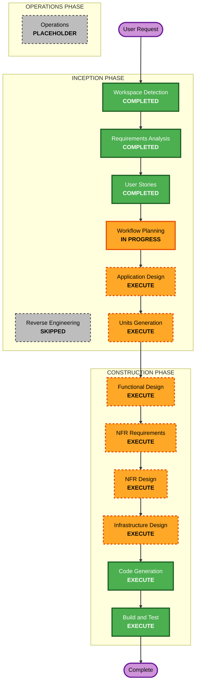

# Execution Plan — Architectural Firewall (DaedalusArch)

## Detailed Analysis Summary

### Change Impact Assessment
- **User-facing changes**: Yes — CLI tool, GitHub Action, PR comments (entirely new product)
- **Structural changes**: Yes — 8 core modules, shared domain types, CLI entry points
- **Data model changes**: Yes — APG schema (5 nodes, 7 edges), AoC YAML 3-layer, snapshot storage model, violation taxonomy
- **API changes**: Yes — CLI commands (evaluate, batch, drift), GitHub Action inputs/outputs, JSON report schema
- **NFR impact**: Yes — performance targets, determinism guarantees, reproducibility, resilience

### Risk Assessment
- **Risk Level**: Medium-High
- **Rationale**: Complex pipeline (8 modules), external dependencies (Neo4j, LLM API), neuro-symbolic dual-path adds non-trivial integration complexity
- **Mitigations**: BDD/TDD/DDD enforced, Docker Compose for Neo4j, validation set with manifests, symbolic-only mode for deterministic fallback
- **Rollback Complexity**: Low (greenfield — no existing system to break)
- **Testing Complexity**: Complex (Neo4j integration tests, LLM mocking, multi-run ICC validation, drift detection across snapshots)

---

## Workflow Visualization



### Text Alternative
```
INCEPTION PHASE:
  1. Workspace Detection        — COMPLETED
  2. Reverse Engineering         — SKIPPED (greenfield)
  3. Requirements Analysis       — COMPLETED (17 FR, 6 NFR, 3 METH)
  4. User Stories                — COMPLETED (81 stories, 3 personas)
  5. Workflow Planning           — IN PROGRESS
  6. Application Design          — EXECUTE
  7. Units Generation            — EXECUTE

CONSTRUCTION PHASE (per unit):
  8. Functional Design           — EXECUTE
  9. NFR Requirements            — EXECUTE
 10. NFR Design                  — EXECUTE
 11. Infrastructure Design       — EXECUTE
 12. Code Generation             — EXECUTE
 13. Build and Test              — EXECUTE

OPERATIONS PHASE:
 14. Operations                  — PLACEHOLDER
```

---

## Phases to Execute

### INCEPTION PHASE
- [x] Workspace Detection (COMPLETED)
- [x] Reverse Engineering — SKIPPED (greenfield)
- [x] Requirements Analysis — COMPLETED (17 FR, 6 NFR, 3 METH, partial security)
- [x] User Stories — COMPLETED (81 stories, 3 personas, 17 epics)
- [x] Workflow Planning — IN PROGRESS
- [ ] Application Design — **EXECUTE**
  - **Rationale**: 8 new bounded context modules need component-level design — methods, interfaces, domain objects, inter-module contracts. DDD (METH-03) demands explicit domain model design before code.
- [ ] Units Generation — **EXECUTE**
  - **Rationale**: 8 modules + CLI + shared types + infrastructure (Docker, GitHub Action) need decomposition into ordered units of work with dependency sequencing.

### CONSTRUCTION PHASE (per unit)
- [ ] Functional Design — **EXECUTE**
  - **Rationale**: Complex domain models (APG schema, AoC YAML, violation taxonomy, fitness functions, verdicts). DDD value objects and rich domain types need design before code.
- [ ] NFR Requirements — **EXECUTE**
  - **Rationale**: Performance targets (< 5s APG, < 2s delta, < 30s full pipeline), determinism guarantees, ICC reproducibility, resilience — all need concrete technical specifications per unit.
- [ ] NFR Design — **EXECUTE**
  - **Rationale**: NFR patterns (caching for delta APG, retry/circuit-breaker for LLM API, connection pooling for Neo4j, structured logging) need architectural integration design.
- [ ] Infrastructure Design — **EXECUTE**
  - **Rationale**: Docker Compose (Neo4j), GitHub Action workflow, APG_Store persistence layer, LLM provider adapters — infrastructure components need explicit design.
- [ ] Code Generation — **EXECUTE** (ALWAYS)
  - **Rationale**: Implementation of all modules, tests (BDD features + TDD unit + integration), configuration.
- [ ] Build and Test — **EXECUTE** (ALWAYS)
  - **Rationale**: Build verification, full test suite execution, validation set benchmarking.

### OPERATIONS PHASE
- [ ] Operations — PLACEHOLDER
  - **Rationale**: Future deployment and monitoring workflows. Not in v1.0 scope.

---

## Stage Skip Summary

**No stages skipped** — this is a complex greenfield product with:
- 8 bounded context modules requiring explicit design
- External dependencies (Neo4j, LLM APIs) requiring infrastructure design
- DDD methodology requiring domain model design before code
- Performance/determinism NFRs requiring technical specification
- Multiple deployment targets (CLI, GitHub Action) requiring infrastructure design

---

## Success Criteria

- **Primary Goal**: Deliver a working Architectural Firewall CLI + GitHub Action that evaluates TypeScript projects for architectural compliance via neuro-symbolic analysis
- **Key Deliverables**:
  - 8 core pipeline modules with full BDD/TDD coverage
  - CLI with evaluate, batch, and drift commands
  - GitHub Action for PR-triggered evaluation
  - Docker Compose for Neo4j
  - 5-10 sample/validation projects with manifests
  - AoC YAML clean-architecture template (17 symbolic + N semantic fitness functions)
- **Quality Gates**:
  - All 81 user story acceptance criteria pass
  - Unit test coverage >= 80%
  - BDD feature files pass for all modules
  - Precision >= 90%, recall >= 85% against validation set
  - Symbolic evaluation < 5 seconds per project
  - Full neuro-symbolic < 30 seconds per project
  - ICC >= 0.70 for neuronal path
  - Install-to-first-evaluation < 5 minutes
