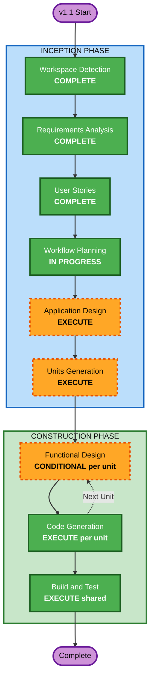

# Execution Plan — Architectonic Firewall v1.1

## Detailed Analysis Summary

### Transformation Scope (Brownfield — Extending v1.0)
- **Transformation Type**: Feature addition across two parallel tracks
- **Primary Changes**: New skill + preset system + baseline (Track A), new HTML report generator (Track B), new LLM provider (Shared)
- **Existing Codebase**: 84 source files, 12 modules, 312 tests, 76% coverage

### Change Impact Assessment
- **User-facing changes**: Yes — new Claude Code skill, new `firewall report` command, new `firewall validate` command, new `firewall baseline` command
- **Structural changes**: Yes — new modules (presets, report generator, spec validator, baseline manager), new LLM provider
- **Data model changes**: Moderate — extends existing spec schema (exclude_paths, enabled), new baseline schema, new actionable violation format
- **API changes**: Yes — new CLI commands (validate, report, baseline), extended spec YAML schema, extended report JSON schema
- **NFR impact**: Low — no new infrastructure (Neo4j stays), no new performance concerns beyond existing pipeline

### Component Relationships
```
v1.0 Existing Modules (unchanged):
  apg-extractor → neo4j-ingestion → fitness-compiler → evaluation-engine → scoring-engine
  spec-parser → fitness-compiler
  pipeline → cli (evaluate, batch, drift)

v1.1 New/Modified:
  [NEW] presets/ → spec-parser (preset templates feed spec generation)
  [NEW] baseline/ → evaluation-engine, scoring-engine (baseline comparison)
  [NEW] report/ → scoring-engine (consumes evaluation JSON, produces HTML)
  [NEW] GeminiProvider → llm-critic (replaces MockLLMProvider)
  [MOD] spec-parser (exclude_paths, enabled field)
  [MOD] fitness-compiler (WHERE NOT clause injection for excludes)
  [MOD] scoring-engine/report-formatter (actionable message format)
  [MOD] cli (new commands: validate, report, baseline)
  [NEW] .claude/commands/firewall-init.md (skill prompt)
```

### Risk Assessment
- **Risk Level**: Medium
- **Rationale**: Extends proven v1.0 pipeline with new entry/exit points. No architectural redesign. Main risk is the skill prompt reliability (mitigated by testing on real repo).
- **Rollback Complexity**: Low (additive changes, v1.0 specs remain backward compatible)
- **Testing Complexity**: Moderate (new commands need tests, HTML report needs visual verification, Gemini integration needs API key)

---

## Workflow Visualization



### Text Alternative
```
INCEPTION PHASE:
  - Workspace Detection     [COMPLETE]
  - Requirements Analysis   [COMPLETE]  
  - User Stories            [COMPLETE]
  - Workflow Planning       [IN PROGRESS]
  - Application Design      [EXECUTE]
  - Units Generation        [EXECUTE]

CONSTRUCTION PHASE:
  - Functional Design       [CONDITIONAL per unit]
  - NFR Requirements        [SKIP]
  - NFR Design              [SKIP]
  - Infrastructure Design   [SKIP]
  - Code Generation         [EXECUTE per unit — parallel worktrees]
  - Build and Test          [EXECUTE shared — post-merge]
```

---

## Phases to Execute

### INCEPTION PHASE
- [x] Workspace Detection — COMPLETE
- [x] Reverse Engineering — SKIPPED (brownfield but v1.0 codebase is known)
- [x] Requirements Analysis — COMPLETE (10 FRs scoped for demo)
- [x] User Stories — COMPLETE (18 stories, 3 epics)
- [x] Workflow Planning — IN PROGRESS
- [ ] Application Design — **EXECUTE**
  - **Rationale**: New components needed (preset loader, spec validator, baseline manager, report generator, GeminiProvider, mining query service). Component boundaries, interfaces, and responsibilities must be defined before units.
- [ ] Units Generation — **EXECUTE**
  - **Rationale**: Two parallel tracks (A + B) plus shared infrastructure needs decomposition into implementation units with dependency ordering and worktree assignment.

### CONSTRUCTION PHASE (per unit)
- [ ] Functional Design — **CONDITIONAL per unit**
  - **Rationale**: Execute for units with new business logic (preset selection, baseline comparison, mining queries, report data transformation). Skip for units that are pure wiring (CLI command registration, skill prompt).
- [ ] NFR Requirements — **SKIP**
  - **Rationale**: No new NFR concerns. Neo4j stays. Performance profile unchanged. v1.0 NFR patterns (DomainResult, error handling) carry forward.
- [ ] NFR Design — **SKIP**
  - **Rationale**: NFR Requirements skipped.
- [ ] Infrastructure Design — **SKIP**
  - **Rationale**: No new infrastructure. Neo4j, Docker Compose, GitHub Actions all established in v1.0.
- [ ] Code Generation — **EXECUTE** (per unit, parallel worktrees for Track A and Track B)
- [ ] Build and Test — **EXECUTE** (shared, after merging both tracks to main)

### OPERATIONS PHASE
- [ ] Operations — PLACEHOLDER

---

## Parallel Construction Strategy (Option C)

### Phase 1: Inception in main (current)
All inception stages run here. Single aidlc-state.md, single audit.md.

### Phase 2: Code Generation in worktrees
When Units Generation is complete and we enter Construction:

```
git worktree add -b track-a/spec-generation ../DaedalusArch-TrackA main
git worktree add -b track-b/demo-dashboard ../DaedalusArch-TrackB main
```

Each worktree gets a track-scoped CLAUDE.md defining:
- Which units belong to that track
- What code to touch / not touch
- Track-specific construction context

### Phase 3: Merge and Build & Test
```
git checkout main
git merge track-a/spec-generation
git merge track-b/demo-dashboard
# Resolve any conflicts (unlikely — different directories)
# Run shared Build & Test
```

---

## Module Update Strategy (Brownfield)

### Update Sequence
1. **Shared infrastructure first**: spec-parser extensions (exclude_paths, enabled), fitness-compiler (WHERE NOT injection) — both tracks depend on these
2. **Track A**: presets/, baseline/, spec validator, mining queries, skill prompt, CLI commands (validate, baseline)
3. **Track B**: report generator, actionable violation format, CLI command (report)
4. **Shared last**: GeminiProvider (can be integrated after both tracks work in symbolic-only mode)

### Dependency Constraints
- Track B (report) depends on Track A (actionable violation format in scoring-engine)
- Both tracks depend on shared spec-parser extensions
- GeminiProvider is independent — can be built last

### Testing Checkpoints
- After shared extensions: run existing 312 tests (backward compat)
- After Track A: run new init/validate/baseline tests + existing suite
- After Track B: run new report tests + visual verification in browser
- After merge: full suite + end-to-end demo flow on real repo

---

## Success Criteria
- **Primary Goal**: End-to-end demo — skill generates spec on real repo, evaluation runs, HTML dashboard opens with actionable results
- **Key Deliverables**: Claude Code skill, preset library (2), `firewall validate/report/baseline` commands, interactive HTML dashboard, GeminiProvider
- **Quality Gates**: All existing 312 tests pass (backward compat), new tests for v1.1 features, HTML report renders correctly in browser, skill produces valid spec on at least 1 real open-source repo
