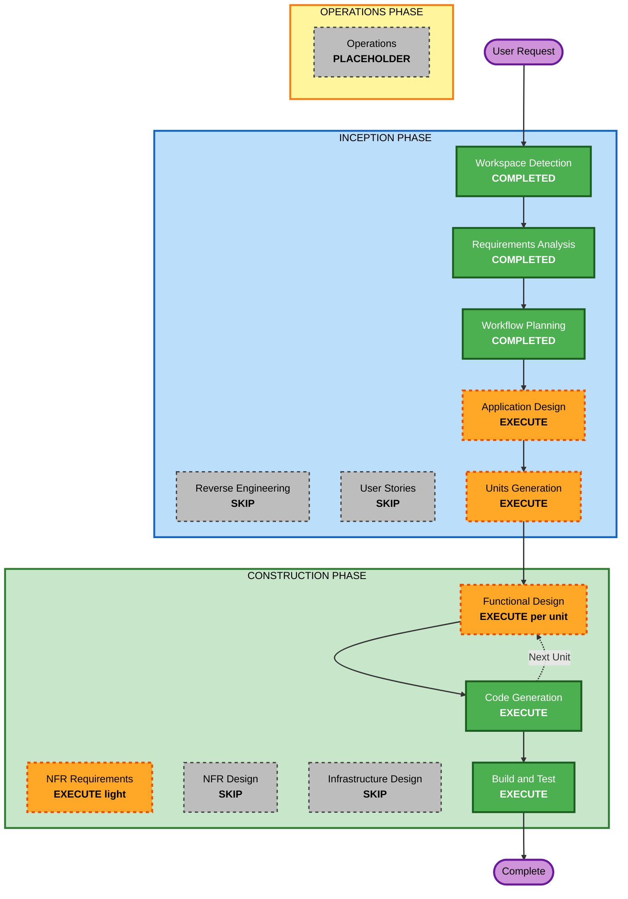

# Execution Plan — v1.2 Evaluation-Readiness Cycle

> **Stage**: INCEPTION → Workflow Planning · **Date**: 2026-10-06 · **Baseline**: `7cd15b4` · **Revision 2** after the adversarial review (`v1.2E-execution-plan-adversarial-review.md`), approved by the author to proceed
> **Inputs**: `inception/requirements/v1.2-evaluation-readiness-requirements.md` (29 FR, 6 NFR, approved), `v1.2-evaluation-readiness-questions.md` (answered), reverse-engineering artefacts, `plans/v1.2-pending-units-plan.md` (draft U0 foundation, folded per D-6). Results plan of record (Notion, 2026-10-06): this cycle delivers Phases 1 and 2 of that plan (engine fixes and experiment tooling); Phases 3–5 (instrument validation, experiments, freeze) run on the code this cycle produces and are not AI-DLC construction units.

## Detailed Analysis Summary

### Transformation Scope (brownfield)
- **Transformation type**: multi-component application change, no infrastructure or deployment change.
- **Primary changes**: graph contract (new `Package` node type, `FLOWS_TO` edge, IMPORTS edge properties), spec contract (typed function-specific fields, layer `kind`, `integrity` dimension, template tags), report contract (execution facts, function results, timings, dropped dimensions, JSON Schema), scoring rule (renormalisation), a new LLM provider, and six experiment tools under `scripts/`.
- **Related components**: `shared/types`, `apg-extractor`, `neo4j-ingestion`, `spec-parser`, `fitness-compiler`, `evaluation-engine`, `scoring-engine`, `report`, `llm-critic`, `neuro-symbolic-router`, `cli`, `presets/`, `scripts/` (new), CI.

### Change Impact Assessment
- **User-facing changes**: Yes, limited. CLI JSON output gains fields; `batch` output gains arrays; `style: layered` accepted; specs may declare `kind` and `integrity`. No command removed.
- **Structural changes**: Yes. Sixth node type and a data-flow edge in the APG; one new LLM provider behind the existing `LLMProvider` port.
- **Data model changes**: Yes. `NodeType`, `EdgeType`, `Dimension`, `FitnessFunction`, `Violation`, `EvaluationReport`, layer definition in the spec schema.
- **API changes**: Internal TypeScript contracts only; all additive except the deliberate scoring change (FR-15) and seven functions now executing (FR-07), both of which change expected scores.
- **NFR impact**: Yes. Determinism (NFR-02), latency with more edges (NFR-03), logging hygiene with a credentialed provider (NFR-05), supply chain (NFR-06). All already specified as acceptance criteria.

### Component Relationships
- **Primary components**: `spec-parser` + `fitness-compiler` (spec contract, binding), `apg-extractor` + `neo4j-ingestion` (graph contract).
- **Shared components**: `shared/types` (every contract change lands here first).
- **Dependent components**: `evaluation-engine`, `scoring-engine`, `report`, `cli` consume the new contracts.
- **Supporting components**: `llm-critic` (provider, context assembly), `scripts/` (experiment tooling reading the report schema), CI (audit step), `docker-compose.yml`.

| Component | Change type | Reason | Priority |
|---|---|---|---|
| shared/types | Major (additive) | All contract changes | Critical, first |
| spec-parser | Major | FR-07, 08, 19, 20, 22, 29 | Critical |
| fitness-compiler | Major | FR-07, 08, 19, 21 template, 29 | Critical |
| apg-extractor | Major | FR-09, 10, 21 | Critical |
| neo4j-ingestion | Minor | FR-09 enum-derived arrays, new label and index | Critical |
| evaluation-engine | Minor | FR-12 mappings, stable ids | Important |
| scoring-engine | Major | FR-13, 14, 15, 17 | Critical |
| report / cli | Minor | FR-13, 14, 16 | Important |
| llm-critic | Major | FR-22 rubrics, FR-23 provider and source context | Important |
| scripts (new) | New | FR-24..28 plus protocol tools | Important, last |
| repo / CI / compose | Configuration | FR-01..06, NFR-06 | First |

### Risk Assessment
- **Risk level**: Medium. Many components, but each change is additive or test-guarded; no production deployment exists.
- **Rollback complexity**: Easy. Every unit lands as its own commit series on a branch; `main` stays at a known commit until Build and Test passes.
- **Testing complexity**: Moderate. 421 existing tests; expected-value changes confined to FR-07 and FR-15 and annotated; new fixture and snapshot tests per unit.

## Workflow Visualization



### Text alternative
```
INCEPTION
- Workspace Detection ...... COMPLETED (resume, 2026-10-05)
- Reverse Engineering ...... SKIP (artefacts exist)
- Requirements Analysis .... COMPLETED (approved 2026-10-06)
- User Stories ............. SKIP
- Workflow Planning ........ COMPLETED (this document)
- Application Design ....... EXECUTE
- Units Generation ......... EXECUTE
CONSTRUCTION (per unit)
- Functional Design ........ EXECUTE for U1, U2, U3, U4, U5; SKIP for U0
- NFR Requirements ......... EXECUTE (light, in U0)
- NFR Design ............... SKIP
- Infrastructure Design .... SKIP
- Code Generation .......... EXECUTE
- Build and Test ........... EXECUTE
OPERATIONS
- Operations ............... PLACEHOLDER
```

## Phases to Execute

### INCEPTION PHASE
- [x] Workspace Detection (COMPLETED)
- [x] Reverse Engineering — SKIPPED (artefacts exist under `inception/reverse-engineering/`)
- [x] Requirements Analysis (COMPLETED, approved 2026-10-06)
- [x] User Stories — SKIPPED
  - **Rationale**: one persona (the author running experiments), no user workflow change beyond new report fields; acceptance criteria already in the requirements.
- [x] Execution Plan (this document)
- [ ] Application Design — EXECUTE (minimal depth)
  - **Rationale**: new graph elements (`Package`, `FLOWS_TO`), a new provider behind an existing port, and six new tools need their contracts and component boundaries fixed once before parallel units start.
- [ ] Units Generation — EXECUTE
  - **Rationale**: changes span eleven components; a foundation unit plus four parallel units plus a tooling unit avoids merge conflicts on the shared contract files, the pattern v1.1 used.

### CONSTRUCTION PHASE
- [ ] Functional Design — EXECUTE for U1–U5, SKIP for U0
  - **Rationale**: real business logic in layer binding by kind, BR-SPEC-10, FLOWS_TO derivation, renormalisation, stable violation ids, source context assembly, mutation operators and the matching rule. U0 is contracts only, fixed in Application Design.
- [ ] NFR Requirements — EXECUTE (one light pass, in U0)
  - **Rationale** (revised after review F12): a credentialed provider and a possible SDK change, unbounded cycle queries on larger graphs, and latency on public projects need explicit budgets (NFR-07, NFR-08).
- [ ] NFR Design — SKIP
  - **Rationale**: no NFR pattern to design; determinism, latency and logging are enforced by tests listed in the requirements.
- [ ] Infrastructure Design — SKIP
  - **Rationale**: local Docker Compose only; FR-06 is a one-line configuration change.
- [ ] Code Generation — EXECUTE (ALWAYS), per unit, Part 1 plan then Part 2 generation
- [ ] Build and Test — EXECUTE (ALWAYS), including FR-18 re-baseline and the probe for zero unbound parameters

### OPERATIONS PHASE
- [ ] Operations — PLACEHOLDER

## Proposed Units (revision 2; finalised in Units Generation)

| Unit | Scope | Requirements | Depends on |
|---|---|---|---|
| U0 Foundation | Repo hygiene; **golden regression suite on Neo4j first** (FR-30); all contract changes in `shared/types` incl. revised LLM port, `dimension` on neural results, `lines`/`target`/discriminator on violations, layer `kind`, `integrity`; spec and report JSON Schemas; enum-derived ingester arrays; NFR pass | FR-01..06, 30, 31, contract halves of 07, 09, 10, 12, 13, 14, 15, 19, 21, 22, 29, 32; NFR-06, 07, 08 | — |
| U1 Spec and compiler | Parser typed fields, BR-SPEC-10, layer binding precedence, Layered library with style-dependent template applicability, `integrity` and `intent` alias, template tags, deterministic ordering in templates | FR-07, 08, 19, 20 (library), 22 (spec side), 29, 35 (templates); NFR-02 | U0 |
| U2 Extractor and graph | Alias-aware resolution, Package nodes, per-name barrel resolution and re-export edges, IMPORTS merge rule, FLOWS_TO derivation, ingestion of new label | FR-09, 10, 21 (edge), 34 | U0 |
| U3 Evaluation, scoring, report | domain-purity and domain-state-purity templates, mappings with line/lines/target, stable ids, cycle canonicalisation, execution facts, report completeness, renormalisation incl. neural denominators, batch LLM-config removal | FR-11, 12, 13, 14, 15, 16 (reduced), 21 (template), 32 (scoring), 35 (results) | U1, U2 |
| U4 Neural path | Claude provider on the chosen credential route, source context assembly, unit selection and iteration, Semantic and Integrity rubrics, judge cassettes, pinned Gemini id | FR-22 (rubrics), 23, 33 | U0 (port), U1 (dimension in specs) |
| U5 Experiment tooling | Mutation tool (frozen catalogue), matching rule and differential scorer, re-scorer, agentic generator via CLI adapter, Gemini labeller, run harness and corpus tools | FR-24..28, 36 | U3 (report schema). Mutation, manifest schema and generator may start after U0 + U2 |

### Shared-file ownership (review F13)
| File | Owner unit | Others |
|---|---|---|
| `src/shared/types/*`, `src/shared/interfaces/llm-provider.ts` | U0 | read-only after U0 |
| `src/spec-parser/spec-schema.ts`, `presets/*.yaml` | U1 | U4 sends rubric text to U1 as a patch |
| `src/fitness-compiler/cypher-templates.ts` | U1 (tags, ORDER BY) | U3 adds two templates after U1 merges |
| `schemas/report.schema.json` | U0 (draft), U3 (freeze) | U5 consumes |

## Estimated Timeline
- **Stages remaining**: Application Design, Units Generation, five Functional Designs, six Code Generations, Build and Test.
- **Estimated duration**: 25–30 working days (revised after review; was 15–18). Results-plan Phases 3–5 follow.

## Success Criteria
- **Primary goal**: an instrument whose numbers can be trusted and the tools to produce the thesis results.
- **Key deliverables**: the 29 functional requirements met; report JSON Schema; Layered library; six experiment tools; `results/pre-tag/` re-baseline.
- **Quality gates**: all tests green; probe reports zero unbound parameters on every shipped spec; `functionExecution.executed == compiled` on all five fixtures; determinism test; fixtures under five seconds; security compliance summary with no blocking finding.
- **FR-20 library validation** and the latency measurement for NFR-07 run in Build and Test.
- **Integration testing**: `evaluate` end to end on the five fixtures and one NestJS project, symbolic-only and full mode (mock provider in CI, Anthropic provider locally).
