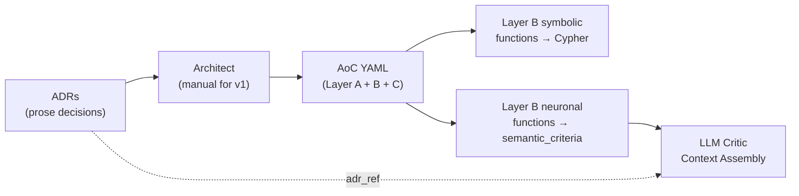

> This document consolidates the formal system requirements extracted from the methodological analysis. It maps each Specific Objective (SO1–SO4) to concrete functional and non-functional requirements for the neuro-symbolic architectural firewall. This is a living document — requirements will be refined as implementation progresses.
> 

> 
> 

> **Traceability**: Every requirement traces back to the [Metodological Analysis](https://www.notion.so/An-lisis-Metodol-gico-por-Objetivo-Firewall-Neuro-Simb-lico-6f9c196293144165bf1b37b57cd0deeb?pvs=21).
> 

---

## SO1 — Specification Ingestion Pipeline

*Transform ADRs and architectural specifications into executable rules for dual verification: (a) graph queries for structural rules and (b) semantic criteria for the LLM Critic.*

### FR-SPEC-01 — ADR Parsing and Format Support

The system must parse architectural decision records in multiple formats and extract actionable rules.

**Supported formats**: MADR, Nygard, Y-Statements, custom YAML-based ADRs.

**Output**: For each ADR, the parser produces two types of rules:

- **Graph-queryable rules** → compiled to parameterized Cypher queries (symbolic path)
- **Semantic criteria** → natural language rule + rubric for LLM Critic evaluation (neuronal path)

### FR-SPEC-02 — AoC YAML Spec Parser (3-Layer)

The system must parse the Architecture-as-Code YAML specification with three layers:

- **Layer A — Architectural Model**: Style declaration, layer definitions, allowed dependencies, mapping rules (directories → layers, naming → roles, decorators → annotations)
- **Layer B — Fitness Functions**: Function declarations with dimension tags, severity, thresholds, and **route** (symbolic / neuronal / hybrid)
- **Layer C — Scoring Configuration**: Dimension weights for AHS computation, pass/fail thresholds, separate confidence thresholds for neuronal assessments

### FR-SPEC-03 — Violation Taxonomy

The system must maintain a consolidated violation taxonomy derived from OX Security, Slater, Sobania, and the GIST Study. Each violation type must be mapped to:

- Its detecting fitness function(s)
- Its route (symbolic, neuronal, or hybrid)
- Its severity level (critical / major / minor / advisory)

### FR-SPEC-04 — Style Template Library

Pre-built templates for architectural styles that auto-load fitness functions:

- `style: clean-architecture` → 17 symbolic + N semantic fitness functions
- Future: `style: layered`, `style: hexagonal`

Each template defines default Layer B functions with their routing designation.

### FR-SPEC-05 — ADR-to-YAML Compilation Pipeline and LLM Critic Context Assembly

This requirement closes the gap between "specs exist" and "the LLM Critic knows what to evaluate against." It specifies how architectural decisions flow from prose ADRs into executable evaluation criteria for both paths.

**The transformation flow:**



**1. ADR → AoC YAML translation (v1: manual)**

For v1 (thesis), the architect manually writes the AoC YAML and embeds semantic criteria derived from ADRs. This is defensible for a thesis scope. Future versions may automate this via an LLM-assisted ADR parser.

**2. Layer B schema for neuronal fitness functions**

Neuronal and hybrid fitness functions in Layer B must include a `semantic_criteria` block:

```yaml
fitness_functions:
  # Symbolic — unchanged, route: symbolic
  - id: dependency-direction
    dimension: structural
    route: symbolic
    severity: critical

  # Neuronal — NEW: semantic_criteria block
  - id: domain-framework-agnosticism
    dimension: intent
    route: neuronal
    severity: major
    semantic_criteria:
      rule: "The domain layer must be completely framework-agnostic"
      adr_ref: "docs/adr/ADR-003-domain-purity.md"
      rubric:
        pass: "No framework-specific patterns, decorators, or idioms in domain layer files"
        fail: "Domain files contain framework imports, decorators, or coupling to infrastructure patterns"
        evidence_required: "List specific files and patterns that violate agnosticism"

  # Hybrid — symbolic threshold + semantic_criteria
  - id: srp-compliance
    dimension: solid
    route: hybrid
    severity: major
    threshold: 10  # symbolic check: max public methods
    semantic_criteria:
      rule: "Each class should have a single, well-defined responsibility"
      rubric:
        pass: "All public methods serve a single coherent responsibility"
        fail: "Methods serve multiple unrelated concerns (e.g., auth + billing)"
        evidence_required: "Identify the distinct responsibilities found"
```

**`semantic_criteria` fields:**

- `rule` (required): The architectural rule in natural language, distilled from the ADR
- `adr_ref` (optional): Path to the original ADR file. If provided, the LLM Critic loads the full ADR prose at evaluation time for additional context
- `rubric` (required): Structured pass/fail criteria with:
    - `pass`: What constitutes compliance
    - `fail`: What constitutes a violation
    - `evidence_required`: What evidence the LLM Critic must provide in its response

**3. LLM Critic context assembly at evaluation time**

For each neuronal or hybrid fitness function, the system assembles the following context packet and sends it to the LLM Critic:

| **Context element** | **Source** | **Required** |
| --- | --- | --- |
| Code snippet | The file or class being evaluated (from project source) | ✅ Always |
| APG subgraph | The node and its immediate neighborhood (from Neo4j) | ✅ Always |
| Rule | `semantic_criteria.rule` from AoC YAML Layer B | ✅ Always |
| Rubric | `semantic_criteria.rubric` from AoC YAML Layer B | ✅ Always |
| Full ADR prose | Loaded from `semantic_criteria.adr_ref` file path | ⚠️ Only if adr_ref is provided |

This design ensures the LLM Critic always has structured evaluation criteria (from the YAML) and optionally has the full architectural reasoning (from the ADR) for richer context.

**4. Validation rule**

At spec parse time (NF-SPEC-01), the system must validate:

- Every fitness function with `route: neuronal` or `route: hybrid` has a `semantic_criteria` block
- Every `semantic_criteria` block has both `rule` and `rubric`
- If `adr_ref` is provided, the referenced file must exist at evaluation time (warning, not error — allows spec portability)

### NF-SPEC-01 — Spec Validation

All AoC YAML specs must be validated against a JSON Schema at parse time. Malformed specs must produce clear error messages with line numbers.

---

## SO2 — Structural Code Representation via APG

*Build and maintain an Architectural Property Graph that represents AI-generated code as a queryable graph, enabling deterministic queries over dependencies, types, and structure.*

### FR-APG-01 — APG Construction Pipeline

The system must extract an APG from TypeScript projects using ts-morph:

- **Node types**: File, Class, Interface, Method, Function
- **Node properties**: name, filePath, layer, role, isExported, isAbstract, visibility, decorators[]
- **Relationship types**: IMPORTS, IMPLEMENTS, EXTENDS, CONSTRUCTOR_INJECTS, CALLS, DECLARES, CONTAINS

**Validated capabilities** (spike-confirmed):

- Barrel import resolution ✅
- Path alias resolution ✅
- Interface vs. concrete type resolution for DI ✅
- Decorator extraction ✅
- Lenient parsing for partially broken code ✅

### FR-APG-02 — Layer Annotation Engine

The system must annotate APG nodes with `layer` and `role` properties using deterministic mapping rules from the AoC YAML spec (Layer A), applied in priority order:

1. **Directory mapping**: `src/domain/**` → layer: domain
2. **Naming convention**: `*Repository` → role: repository
3. **Decorator mapping**: `@Controller()` → role: controller, layer: infrastructure

Files matching no rule receive `layer: null` and are excluded from layer-dependent fitness functions but included in universal metrics.

### FR-APG-03 — Neo4j Ingestion

The system must ingest the APG JSON into Neo4j, creating nodes with labels and properties, and relationships with types. The graph must be queryable via Cypher immediately after ingestion.

### NF-APG-01 — APG Persistence and Versioning

<aside>
🗄️

The system **must not** regenerate the full APG on every execution. Instead, it must persist the graph as a versioned snapshot tied to the commit SHA or release tag, and compute only the **delta APG** — nodes and edges affected by files modified in the current PR.

</aside>

**1. Operational efficiency (delta APG)**

- On each PR, only the nodes/edges affected by changed files are processed
- The base APG persists between executions and is updated incrementally
- Significantly reduces analysis time on large projects

**2. Architectural Drift Detection**

By maintaining historical APG snapshots per commit, the system can detect accumulated architectural degradation — not just point-in-time violations:

| **Drift Type** | **What is measured** | **Alert signal** |
| --- | --- | --- |
| **Structural drift** | New dependencies between previously decoupled modules | New IMPORTS edges between layers that had none |
| **Coupling drift** | Sustained increase in average graph fan-out | Average fan-out grows > 15% between consecutive releases |
| **Convention drift** | Gradual erosion of naming/layer conventions | % of nodes meeting conventions decreases between snapshots |
| **Violation trend** | Cumulative AVR across commit history | AVR increases steadily → accumulating technical debt signal |

**Proposed storage model:**

```
APG_Store
├── snapshot_{commit_sha}        ← full graph at that point
│   ├── nodes.json
│   ├── edges.json
│   └── metadata.json            ← timestamp, author, AVR at that commit
├── delta_{sha_old}_{sha_new}    ← diff between two snapshots
│   ├── added_nodes[]
│   ├── removed_nodes[]
│   ├── added_edges[]
│   └── removed_edges[]
└── drift_report_{sha_new}.json  ← computed drift metrics
```

**Implication for SO4**: This mechanism opens an additional validation dimension — beyond measuring Precision/Recall on a static snapshot, we can measure whether the firewall **detects architectural regressions** across a real commit history, without needing to inject artificial violations.

### NF-APG-02 — Construction Performance

Full APG construction must complete in < 5 seconds per project (spike-validated). Delta APG updates must complete in < 2 seconds for typical PR-sized changes.

---

## SO3 — Neuro-Symbolic Review Gate

*Build the firewall that combines symbolic verification (graph queries on APG) with an LLM Critic Agent (semantic compliance), producing pass/block verdicts and structured violation reports.*

**This is the main artifact of the thesis.**

### FR-GATE-01 — Symbolic Path (Cypher → APG)

The system must execute parameterized Cypher queries against the APG for all graph-observable violations. Each fitness function is a Cypher template instantiated with parameters from the AoC YAML spec.

**17 validated symbolic fitness functions across 5 dimensions:**

1. **Structural** (3): dependency-direction, no-circular-dependencies, database-bypass
2. **Coupling** (3): domain-stability, module-fan-out, component-instability
3. **Pattern** (3): domain-purity, dependency-inversion, repository-pattern
4. **SOLID** (4): use-case-isolation, SRP-proxy, ISP-proxy, inheritance-depth
5. **Convention** (4): naming-conventions, test-coverage-proxy, error-handling, orphan-detection

**Properties**: Deterministic, auditable, < 5 seconds for all 17 functions. Spike-validated.

### FR-GATE-02 — Neuronal Path (LLM Critic Agent)

The system must implement an LLM Critic Agent for violations that require judgment about intent or semantic meaning — where the graph provides structure but cannot evaluate the *spirit* of a rule.

**Input to the LLM Critic** (per evaluation, assembled per FR-SPEC-05):

- Code snippet (relevant file or class)
- APG subgraph context (the node and its immediate neighborhood)
- `semantic_criteria.rule` — the architectural rule in natural language (from AoC YAML Layer B)
- `semantic_criteria.rubric` — structured pass/fail criteria with evidence requirements
- Full ADR prose (optional, loaded from `adr_ref` if provided in the YAML)

**Semantic fitness functions (new, to be implemented):**

| **Type** | **Examples** | **Why the LLM is needed** |
| --- | --- | --- |
| **Semantic** | Abstraction quality, naming coherence with domain model | The graph knows an interface exists, not whether it makes semantic sense |
| **Intent** | ADR prose compliance ("the domain must be framework-agnostic") | Framework patterns without direct imports can only be detected by the LLM |
| **Responsibility (soft)** | SRP in spirit (not just by method count) | A service with 4 methods may violate SRP conceptually; counting alone cannot capture this |

**Output**: Structured JSON verdict with:

- `pass` / `fail` / `warning`
- `confidence` score (0.0–1.0)
- `reasoning` (natural language explanation)
- `evidence` (specific code locations referenced)

### FR-GATE-03 — Neuro-Symbolic Routing Logic

<aside>
🔀

**NF-ROUTING-01 — Deterministic routing by fitness function type**

The firewall must route each check to the symbolic or neuronal path based on the nature of the violation, without case-by-case evaluation. The routing criterion must be static and auditable.

</aside>

**Routing table:**

| **Condition** | **Fitness function types** | **Path** |
| --- | --- | --- |
| 🚫 Symbolic only (neuronal never activates) | `structural`, `coupling`, `pattern`, `convention` | Cypher → APG |
| ✅ Neuronal always activates | `semantic`, `intent` | LLM Critic |
| ⚠️ Conditional (neuronal only if symbolic passes) | `solid` (hybrid) | Cypher first → LLM if no hard violation |

### FR-GATE-04 — Hybrid Evaluation (Symbolic → Neuronal Cascade)

For hybrid fitness functions, the system must:

1. **Run symbolic check first** — if a hard violation is found (e.g., class with > 10 public methods), block immediately
2. **If symbolic passes**, invoke the LLM Critic for semantic evaluation
3. The LLM Critic can upgrade a symbolic pass to a fail (e.g., `UserService` with 4 methods mixing authentication + billing → symbolic approves, neuronal blocks)

**Example — SRP hybrid check:**

1. Symbolic: class with > 10 public methods → hard violation, immediate block
2. If passes: LLM Critic evaluates whether existing methods represent a single responsibility
3. A `UserService` with 4 methods mixing authentication + billing → symbolic approves it, neuronal blocks it

### FR-GATE-05 — Merge Logic and Verdict Generation

The system must merge results from both paths into a unified verdict:

| **Verdict** | **Condition** | **Action** |
| --- | --- | --- |
| **Hard block** | Any critical symbolic violation OR neuronal violation with confidence ≥ threshold | PR cannot merge |
| **Soft block** | Major symbolic violation OR neuronal violation with confidence in warning zone | PR requires reviewer override |
| **Warning** | Minor violations or neuronal assessment with low confidence | Informational only |
| **Pass** | No violations from either path | PR can merge |

### FR-GATE-06 — Scoring Engine (AVR / AHS)

Two-tier scoring model:

- **AVR** (per dimension): Ratio of violated fitness functions to total in that dimension. Range: 0.0 (all pass) to 1.0 (all fail).
- **AHS** (aggregate): Weighted complement across dimensions. AHS = Σ(wᵢ × (1 − AVRᵢ)). Range: 0.0 to 1.0.

**Scoring for neuronal assessments**: Neuronal results are scored separately with a confidence-weighted contribution. The report must clearly distinguish:

- **Deterministic score** (symbolic only — reproducible)
- **Combined score** (symbolic + neuronal — may vary across runs)

This allows users to rely on the deterministic score for governance while using the combined score for deeper insight.

### FR-GATE-07 — Structured Violation Report

Output format (JSON):

```json
{
  "project": "my-app",
  "commit": "abc123",
  "ahs_deterministic": 0.82,
  "ahs_combined": 0.71,
  "verdict": "soft_block",
  "dimensions": {
    "structural": { "avr": 0.0, "path": "symbolic", "functions": [...] },
    "pattern": { "avr": 0.33, "path": "symbolic", "functions": [...] },
    "semantic": { "avr": 0.50, "path": "neuronal", "confidence": 0.87, "functions": [...] }
  },
  "violations": [...],
  "universal_metrics": { "cycles": 0, "max_fan_out": 7, "abstraction_ratio": 0.35 }
}
```

### NF-GATE-01 — LLM Critic Reproducibility

To control non-determinism in the neuronal path:

- Fix temperature to 0 and seed when supported by the API
- Execute **3–5 runs** per evaluation and report mean ± standard deviation
- Compute **ICC (Intraclass Correlation Coefficient)** across runs — target ICC > 0.70
- If ICC < 0.70 for a specific fitness function, flag it as unstable and downweight in combined score

### NF-GATE-02 — Confidence Calibration

LLM Critic confidence thresholds must be calibrated empirically:

- **High confidence** (≥ 0.85): Verdict counts as hard evidence
- **Medium confidence** (0.60–0.85): Verdict counts as warning
- **Low confidence** (< 0.60): Verdict is informational only, excluded from AHS

Thresholds are tuned during SO4 Phase 1 validation.

### NF-GATE-03 — End-to-End Latency

Full pipeline (symbolic + neuronal) must complete in < 30 seconds per project. Symbolic-only path must complete in < 5 seconds (spike-validated). LLM Critic calls are the latency bottleneck — batch and parallelize where possible.

---

## SO4 — Empirical Validation

*Validate the evaluator in two phases: (a) instrument validation against human-labeled ground truth, and (b) comparative evaluation with quasi-experimental design.*

### FR-VAL-01 — Ground Truth Suite

20+ TypeScript projects with seeded violations + [MANIFEST.md](http://MANIFEST.md) files listing:

- Violation type and dimension
- File path and location
- Expected detecting fitness function
- Expected route (symbolic / neuronal / hybrid)
- Expected severity

Must include violations detectable only by the neuronal path (semantic/intent) to validate the LLM Critic's contribution.

### FR-VAL-02 — Phase 1: Instrument Validation

**Procedure**: Run the full neuro-symbolic firewall against ground truth suite.

**Metrics**:

| **Metric** | **Target** | **Scope** |
| --- | --- | --- |
| Precision | ≥ 0.90 | Overall (symbolic + neuronal) |
| Recall | ≥ 0.85 | Overall (symbolic + neuronal) |
| Cohen's κ (LLM Critic vs. human) | ≥ 0.60 | Neuronal path only |
| ICC (LLM Critic across runs) | ≥ 0.70 | Neuronal path reproducibility |
| AHS discrimination | Monotonic ordering across violation variants | Combined score |

### FR-VAL-03 — Ablation Study

**The key experiment that justifies the neuro-symbolic approach.**

Run the ground truth suite under three conditions:

1. **Symbolic only** — 17 Cypher fitness functions, no LLM
2. **Neuronal only** — LLM Critic evaluates all rules, no graph queries
3. **Combined** — full neuro-symbolic pipeline with routing

**Measure for each**: Precision, Recall, F1, AHS discrimination, latency, cost.

**Expected outcome**: Combined > Symbolic-only > Neuronal-only for Recall (neuronal catches what symbolic misses), and Combined ≈ Symbolic-only for Precision (neuronal doesn't introduce many false positives). This proves the marginal value of the LLM Critic.

### FR-VAL-04 — Phase 2: Comparative Benchmark

**Design**: Quasi-experimental factorial design.

- **Factor 1 — Spec Quality** (3 levels): Formal (full AoC YAML), Semi-structured (NL guidelines), Informal (no guidance)
- **Factor 2 — LLM** (3 levels): Claude, GPT-4o, Gemini (or equivalents)
- **Sample**: 5 tasks × 3 LLMs × 3 conditions × 3 repetitions = **135 projects**

**Analysis**:

- H2: Cluster per-dimension AVR patterns → failure taxonomy
- H3: Two-way ANOVA (Spec Quality × LLM → AVR), report F-statistics, η², Tukey HSD
- H4: 20-project subset comparison APG vs. CodeQL

**Additional question enabled by neuro-symbolic design**: *Does the LLM Critic compensate for low-quality specs?* (Interaction effect: neuronal path may recover violations that weak specs cause symbolic path to miss.)

### FR-VAL-05 — Human Evaluator Protocol

- Minimum **2–3 independent human evaluators** for ground truth labeling
- Compute **inter-rater reliability (κ)** between humans before comparing LLM Critic to humans
- Evaluators must label: violation type, severity, location, and whether it requires semantic judgment

### NF-VAL-01 — Reproducibility

All experimental conditions must be fully reproducible:

- Fixed LLM API versions, temperatures, and seeds
- Published prompts for all LLM Critic evaluations
- Ground truth suite publicly available
- Statistical analysis scripts included in repository

---

## Traceability Matrix

| **SO** | **Requirements** | **Spike Status** |
| --- | --- | --- |
| SO1 — Spec Ingestion | FR-SPEC-01 through 05, NF-SPEC-01 | Partially validated (AoC YAML parser works; ADR multi-format parsing not started) |
| SO2 — APG Construction | FR-APG-01 through 03, NF-APG-01 through 02 | ✅ Core pipeline validated (Spike 1). Persistence/drift not started. |
| SO3 — Review Gate | FR-GATE-01 through 07, NF-GATE-01 through 03 | ✅ Symbolic path validated (Spike 2-3). Neuronal path not started. |
| SO4 — Validation | FR-VAL-01 through 05, NF-VAL-01 | Seeded violation strategy validated (Spike 3). Ablation and Phase 2 not started. |

---

## References

- Methodological analysis: [Análisis Metodológico por Objetivo — Firewall Neuro-Simbólico](https://www.notion.so/An-lisis-Metodol-gico-por-Objetivo-Firewall-Neuro-Simb-lico-6f9c196293144165bf1b37b57cd0deeb?pvs=21)
- Thesis research: [thesis-research](https://www.notion.so/thesis-research-32c50d30822780b1a2f9d10505d62516?pvs=21)
- Spike results: [Spike Strategy](https://www.notion.so/Spike-Strategy-Validating-the-Firewall-with-Claude-Code-177fc8a8efa8464baa82efedc9bc0dcd?pvs=21)